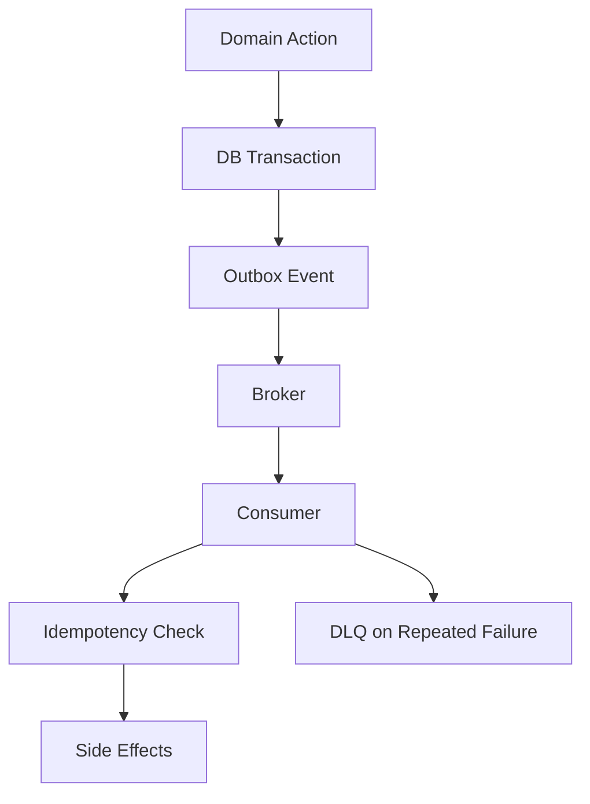

# Day 092 [Expert]: Event Driven Architecture in Python

## Index

- [Goal](#goal)
- [Prerequisites](#prerequisites)
- [Explanation](#explanation)
- [Topic by Topic](#topic-by-topic)
- [Key Concepts](#key-concepts)
- [Visual Concept Map](#visual-concept-map)
- [End-to-End Practical](#end-to-end-practical)
- [Hands-on Coding](#hands-on-coding)
- [Mini Exercise](#mini-exercise)
- [Assessment Quiz](#assessment-quiz)
- [Task](#task)
- [Self Check](#self-check)
- [Interview Questions and Answers](#interview-questions-and-answers)
- [Day 092 Outcome](#day-092-outcome)

## Goal

Design, implement, and operate event-driven Python systems with clear contracts, reliable delivery, and replay-safe consumers.

## Prerequisites

- Day 091 completed
- Understanding of queues, pub/sub, and service boundaries

## Explanation

Event-driven architecture enables loose coupling and independent scaling. The hard part is correctness under retries, ordering issues, and schema evolution.

## Topic by Topic

### Topic 1: Events, Commands, and Domain Boundaries

Theory:
Commands ask for action; events describe facts that already happened.

Practical:
Model event names as domain outcomes, not technical operations.

Code Example:

```text
good: invoice_issued, bad: process_invoice_job
```

**Explanation:**
This topic explains Events, Commands, and Domain Boundaries in a practical Python context so you can write clear, reliable, and maintainable programs for real-world tasks.

**Key Points:**
- Understand the core idea behind Events, Commands, and Domain Boundaries.
- Apply the practical pattern with good readability and validation habits.
- Keep the solution maintainable, testable, and safe for production use where relevant.

### Topic 2: Event Contract Design and Versioning

Theory:
Event consumers depend on payload shape and semantics.

Practical:
Define schema versioning and compatibility rules.

Code Example:

```json
{ "event": "user_registered", "version": 2, "payload": { "user_id": 123 } }
```

**Explanation:**
This topic explains Event Contract Design and Versioning in a practical Python context so you can write clear, reliable, and maintainable programs for real-world tasks.

**Key Points:**
- Understand the core idea behind Event Contract Design and Versioning.
- Apply the practical pattern with good readability and validation habits.
- Keep the solution maintainable, testable, and safe for production use where relevant.

### Topic 3: Delivery Guarantees and Idempotent Consumers

Theory:
At-least-once delivery causes duplicates; exactly-once is costly and context-specific.

Practical:
Persist processed event IDs to make handlers idempotent.

Code Example:

```python
if processed_repo.contains(event.id):
  return
processed_repo.save(event.id)
```

**Explanation:**
This topic explains Delivery Guarantees and Idempotent Consumers in a practical Python context so you can write clear, reliable, and maintainable programs for real-world tasks.

**Key Points:**
- Understand the core idea behind Delivery Guarantees and Idempotent Consumers.
- Apply the practical pattern with good readability and validation habits.
- Keep the solution maintainable, testable, and safe for production use where relevant.

### Topic 4: Ordering, Partitioning, and Throughput

Theory:
Global ordering hurts scale; partition-local ordering is more practical.

Practical:
Use stable partition keys aligned with business entities.

Code Example:

```text
partition by account_id to preserve per-account event sequence
```

**Explanation:**
This topic explains Ordering, Partitioning, and Throughput in a practical Python context so you can write clear, reliable, and maintainable programs for real-world tasks.

**Key Points:**
- Understand the core idea behind Ordering, Partitioning, and Throughput.
- Apply the practical pattern with good readability and validation habits.
- Keep the solution maintainable, testable, and safe for production use where relevant.

### Topic 5: Outbox, Retry, and Dead-letter Queues

Theory:
Publishing and DB writes must be coordinated safely.

Practical:
Use outbox pattern and DLQ policy for poison messages.

Code Example:

```text
transaction: update order + insert outbox row, then relay publishes
```

**Explanation:**
This topic explains Outbox, Retry, and Dead-letter Queues in a practical Python context so you can write clear, reliable, and maintainable programs for real-world tasks.

**Key Points:**
- Understand the core idea behind Outbox, Retry, and Dead-letter Queues.
- Apply the practical pattern with good readability and validation habits.
- Keep the solution maintainable, testable, and safe for production use where relevant.

### Topic 6: Observability and Replay Operations

Theory:
Event systems need replay-safe operations and lineage tracking.

Practical:
Store event metadata for traceability and controlled reprocessing.

Code Example:

```text
track event_id, producer, version, timestamp, processing_result
```

**Explanation:**
This topic explains Observability and Replay Operations in a practical Python context so you can write clear, reliable, and maintainable programs for real-world tasks.

**Key Points:**
- Understand the core idea behind Observability and Replay Operations.
- Apply the practical pattern with good readability and validation habits.
- Keep the solution maintainable, testable, and safe for production use where relevant.

## Key Concepts

- Events represent immutable business facts
- Contract versioning is mandatory for multi-team systems
- Idempotent consumers are required for reliability
- Ordering guarantees must match partition strategy
- Outbox + DLQ patterns increase delivery robustness
- Replay tooling is essential for incident recovery

## Visual Concept Map



## End-to-End Practical

1. Define two domain events and contracts.
2. Implement producer with outbox relay.
3. Build idempotent consumer with retry rules.
4. Add DLQ handling and replay script.
5. Expose event health metrics and alerts.

## Hands-on Coding

### Example 1: Case - User Signup Event Pipeline

Scenario:
Publish user_registered event and trigger welcome workflow asynchronously.

```python
event = {"id": eid, "type": "user_registered", "version": 1, "payload": payload}
```

### Example 2: Case - Payment Event Retry and DLQ

Scenario:
Retry transient payment processor failures and move poison events to DLQ.

```text
max_retries = 5, then route to payments_dlq
```

### Example 3: Case - Replay for Data Repair

Scenario:
Replay order events for one tenant after bug fix.

```text
replay window: tenant_id + timestamp range + dry-run mode
```

## Mini Exercise

Scenario:
Implement a mini EDA flow with producer, broker topic, consumer, idempotency store, and DLQ.

Expected output:

- Versioned event contract
- Idempotent consumer behavior proof
- Replay and DLQ operational notes

## Assessment Quiz

### Quiz Questions

1. Why should events be immutable?
2. What problem does the outbox pattern solve?
3. True or False: Exactly-once delivery is always required.
4. Why is idempotency more practical than strict dedup at broker only?
5. What is the purpose of a DLQ?

### Quiz Answers

1. Immutability keeps event history reliable and auditable
2. Prevents lost events between transaction commit and publish
3. False
4. It protects correctness at consumer boundary where side effects happen
5. Isolate repeatedly failing messages for investigation/replay

## Task

- Build one event-driven flow in Python with outbox and idempotent consumer
- Add schema versioning and compatibility policy
- Add monitoring for lag, retries, and DLQ volume

## Self Check

- You can model domain events clearly and safely
- You can implement resilient consumer logic for real-world failures
- You can operate replay and DLQ workflows in production

## Interview Questions and Answers

### Beginner

**Question:** What is event-driven architecture in one line?

**Answer:** Services communicate through published events instead of direct synchronous calls.

**Question:** Why are duplicates common in event systems?

**Answer:** Most brokers and retry policies provide at-least-once delivery semantics.

### Middle

**Question:** How do you evolve event schemas without breaking consumers?

**Answer:** Use versioning rules, backward-compatible fields, and consumer contract tests.

**Question:** What metric indicates consumer health?

**Answer:** Consumer lag, retry rate, and DLQ count are key leading signals.

### Advanced

**Question:** What anti-pattern causes hidden coupling in EDA?

**Answer:** Reusing one generic event type with ambiguous payload semantics.

**Question:** How do senior teams handle replay risk?

**Answer:** They use idempotency guarantees, scoped replay controls, and dry-run validation.

## Day 092 Outcome

- You can implement robust event-driven systems in Python
- You can manage delivery guarantees, schema evolution, and recovery flows
- You are ready for large-scale refactoring strategy on Day 093
