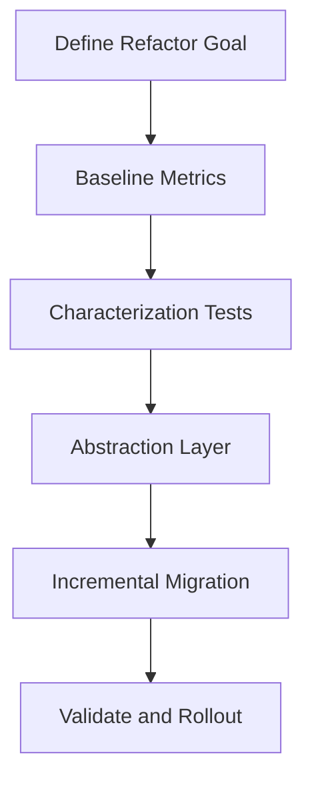

# Day 093 [Expert]: Large Scale Codebase Refactoring

## Index

- [Goal](#goal)
- [Prerequisites](#prerequisites)
- [Explanation](#explanation)
- [Topic by Topic](#topic-by-topic)
- [Key Concepts](#key-concepts)
- [Visual Concept Map](#visual-concept-map)
- [End-to-End Practical](#end-to-end-practical)
- [Hands-on Coding](#hands-on-coding)
- [Mini Exercise](#mini-exercise)
- [Assessment Quiz](#assessment-quiz)
- [Task](#task)
- [Self Check](#self-check)
- [Interview Questions and Answers](#interview-questions-and-answers)
- [Day 093 Outcome](#day-093-outcome)

## Goal

Plan and execute large Python codebase refactors safely with incremental delivery, risk controls, and measurable outcomes.

## Prerequisites

- Day 092 completed
- Working knowledge of tests, CI, and repository workflows

## Explanation

Large refactoring is a change-management discipline as much as a coding activity. Success comes from slicing work, preserving behavior, and continuously proving safety through tests and telemetry.

## Topic by Topic

### Topic 1: Refactor Drivers and Scope Definition

Theory:
Refactors must be justified by maintainability, reliability, or delivery speed outcomes.

Practical:
Define explicit success metrics before touching architecture.

Code Example:

```text
target metrics: build time -20%, duplicate code -30%, critical bug rate down
```

**Explanation:**
This topic explains Refactor Drivers and Scope Definition in a practical Python context so you can write clear, reliable, and maintainable programs for real-world tasks.

**Key Points:**
- Understand the core idea behind Refactor Drivers and Scope Definition.
- Apply the practical pattern with good readability and validation habits.
- Keep the solution maintainable, testable, and safe for production use where relevant.

### Topic 2: Baseline, Characterization Tests, and Safety Nets

Theory:
Characterization tests capture current behavior before structural changes.

Practical:
Add high-value regression tests around fragile and business-critical paths.

Code Example:

```python
def test_existing_invoice_rounding_behavior():
  assert calculate_total(...) == expected_legacy_value
```

**Explanation:**
This topic explains Baseline, Characterization Tests, and Safety Nets in a practical Python context so you can write clear, reliable, and maintainable programs for real-world tasks.

**Key Points:**
- Understand the core idea behind Baseline, Characterization Tests, and Safety Nets.
- Apply the practical pattern with good readability and validation habits.
- Keep the solution maintainable, testable, and safe for production use where relevant.

### Topic 3: Strangler and Branch-by-Abstraction Patterns

Theory:
Incremental migration patterns reduce risk versus big-bang rewrites.

Practical:
Introduce abstraction layer and route traffic gradually.

Code Example:

```text
InvoiceService -> interface -> LegacyAdapter/NewAdapter
```

**Explanation:**
This topic explains Strangler and Branch-by-Abstraction Patterns in a practical Python context so you can write clear, reliable, and maintainable programs for real-world tasks.

**Key Points:**
- Understand the core idea behind Strangler and Branch-by-Abstraction Patterns.
- Apply the practical pattern with good readability and validation habits.
- Keep the solution maintainable, testable, and safe for production use where relevant.

### Topic 4: Dependency Decoupling and Module Boundaries

Theory:
Tangled dependencies block safe refactor velocity.

Practical:
Extract bounded modules and enforce dependency direction rules.

Code Example:

```text
domain -> application -> infrastructure (one-way dependency flow)
```

**Explanation:**
This topic explains Dependency Decoupling and Module Boundaries in a practical Python context so you can write clear, reliable, and maintainable programs for real-world tasks.

**Key Points:**
- Understand the core idea behind Dependency Decoupling and Module Boundaries.
- Apply the practical pattern with good readability and validation habits.
- Keep the solution maintainable, testable, and safe for production use where relevant.

### Topic 5: Automated Refactor Tooling

Theory:
Static analysis and codemods reduce manual errors.

Practical:
Use type checks, linters, and scripted renames for repetitive changes.

Code Example:

```bash
ruff check .
mypy .
```

**Explanation:**
This topic explains Automated Refactor Tooling in a practical Python context so you can write clear, reliable, and maintainable programs for real-world tasks.

**Key Points:**
- Understand the core idea behind Automated Refactor Tooling.
- Apply the practical pattern with good readability and validation habits.
- Keep the solution maintainable, testable, and safe for production use where relevant.

### Topic 6: Rollout Governance and Team Coordination

Theory:
Large refactors fail when communication and ownership are weak.

Practical:
Use RFCs, migration dashboards, and release checkpoints.

Code Example:

```text
weekly migration scorecard: % traffic moved, defect rate, rollback incidents
```

**Explanation:**
This topic explains Rollout Governance and Team Coordination in a practical Python context so you can write clear, reliable, and maintainable programs for real-world tasks.

**Key Points:**
- Understand the core idea behind Rollout Governance and Team Coordination.
- Apply the practical pattern with good readability and validation habits.
- Keep the solution maintainable, testable, and safe for production use where relevant.

## Key Concepts

- Refactor goals must be measurable
- Characterization tests protect legacy behavior
- Incremental migration patterns reduce blast radius
- Clear module boundaries unlock long-term velocity
- Tooling and automation improve consistency
- Governance keeps multi-team refactors aligned

## Visual Concept Map



## End-to-End Practical

1. Select one legacy subsystem with high change pain.
2. Add characterization and regression tests.
3. Introduce abstraction boundary and new implementation.
4. Migrate traffic gradually with feature flags.
5. Track quality and performance metrics during rollout.

## Hands-on Coding

### Example 1: Case - Payments Module Split

Scenario:
Extract payment gateway logic from monolithic service into dedicated module.

```python
class PaymentProcessor(Protocol):
  def charge(self, request): ...
```

### Example 2: Case - Safe API Rename via Adapter

Scenario:
Keep old method signatures while introducing new API contract internally.

```text
old_client_call -> adapter -> new_domain_service
```

### Example 3: Case - Gradual Endpoint Migration

Scenario:
Shift 10% traffic to new path, monitor, then ramp up.

```text
flag rollout: 10% -> 25% -> 50% -> 100%
```

## Mini Exercise

Scenario:
Create a 2-week refactor plan for one legacy component using strangler strategy, explicit tests, and release checkpoints.

Expected output:

- Refactor objective + metrics
- Migration sequence with fallback plan
- Risk register and communication plan

## Assessment Quiz

### Quiz Questions

1. Why write characterization tests before refactoring?
2. What is the benefit of branch-by-abstraction?
3. True or False: Big-bang rewrites are usually lower risk.
4. Why define dependency direction rules?
5. What should be monitored during migration rollout?

### Quiz Answers

1. To lock current behavior and detect accidental regressions
2. It allows old and new implementations to coexist safely
3. False
4. To prevent architectural erosion and cyclic coupling
5. Error rate, latency, business KPIs, and rollback triggers

## Task

- Choose one real code area and draft a safe refactor strategy
- Implement one abstraction boundary and one migration step
- Add rollout metrics and rollback criteria

## Self Check

- You can break large refactors into low-risk milestones
- You can maintain behavior while changing architecture
- You can coordinate technical and organizational execution

## Interview Questions and Answers

### Beginner

**Question:** What is refactoring?

**Answer:** Improving code structure without changing external behavior.

**Question:** Why is testing central to refactoring?

**Answer:** Tests prove behavior remains correct during structural changes.

### Middle

**Question:** How do you decide refactor scope?

**Answer:** Start with high-pain areas, clear value, and manageable risk boundaries.

**Question:** When should you use a strangler pattern?

**Answer:** When replacing legacy components gradually is safer than full rewrite.

### Advanced

**Question:** What anti-pattern breaks large refactors?

**Answer:** Architectural changes without observable metrics, ownership, or migration controls.

**Question:** How do senior engineers keep momentum in long refactors?

**Answer:** Deliver incremental wins, publish progress metrics, and automate repetitive migration tasks.

## Day 093 Outcome

- You can execute large-scale Python refactors with controlled risk
- You can align architecture improvements with measurable outcomes
- You are ready for microservice communication patterns on Day 094
