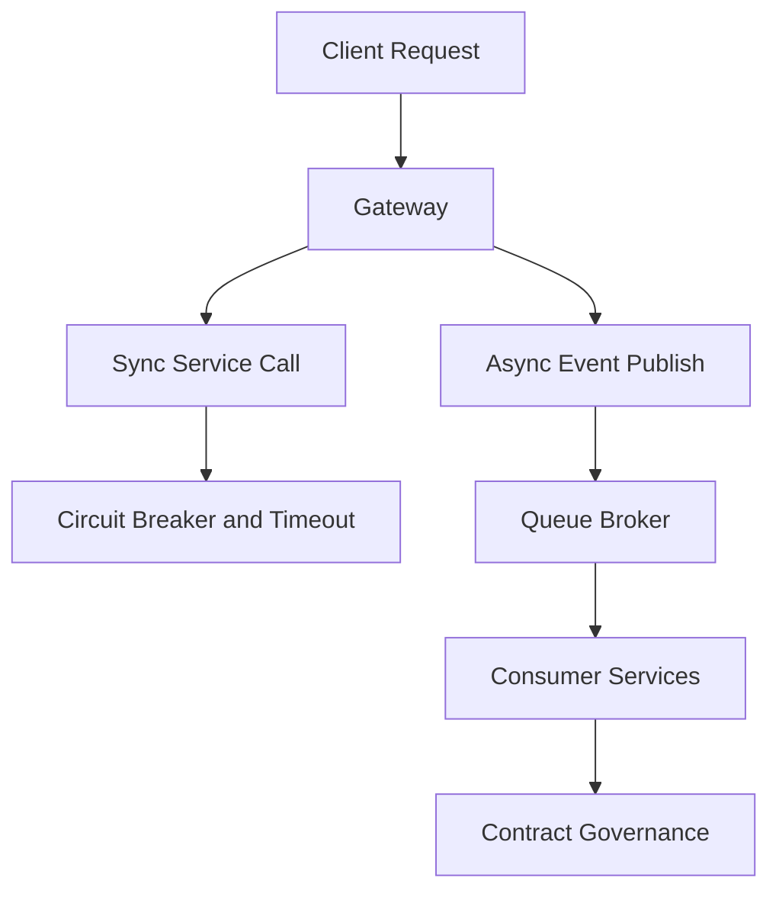

# Day 094 [Expert]: Microservice Communication Patterns

## Index

- [Goal](#goal)
- [Prerequisites](#prerequisites)
- [Explanation](#explanation)
- [Topic by Topic](#topic-by-topic)
- [Key Concepts](#key-concepts)
- [Visual Concept Map](#visual-concept-map)
- [End-to-End Practical](#end-to-end-practical)
- [Hands-on Coding](#hands-on-coding)
- [Mini Exercise](#mini-exercise)
- [Assessment Quiz](#assessment-quiz)
- [Task](#task)
- [Self Check](#self-check)
- [Interview Questions and Answers](#interview-questions-and-answers)
- [Day 094 Outcome](#day-094-outcome)

## Goal

Master communication choices between Python microservices, balancing latency, reliability, consistency, and team autonomy.

## Prerequisites

- Day 093 completed
- Experience with REST APIs, queues, and distributed service basics

## Explanation

Communication pattern selection is one of the highest-impact microservice decisions. Wrong defaults create cascading outages, coupling, and operational drag.

## Topic by Topic

### Topic 1: Synchronous Communication (HTTP/gRPC)

Theory:
Sync calls are simple but tightly couple availability and latency across services.

Practical:
Use explicit timeouts and retry policies for every call path.

Code Example:

```text
service A -> service B (timeout 300ms, max retries 2)
```

**Explanation:**
This topic explains Synchronous Communication (HTTP/gRPC) in a practical Python context so you can write clear, reliable, and maintainable programs for real-world tasks.

**Key Points:**
- Understand the core idea behind Synchronous Communication (HTTP/gRPC).
- Apply the practical pattern with good readability and validation habits.
- Keep the solution maintainable, testable, and safe for production use where relevant.

### Topic 2: Asynchronous Messaging Patterns

Theory:
Events and queues decouple services and absorb traffic spikes.

Practical:
Route non-blocking tasks through broker-backed workflows.

Code Example:

```text
order_created event consumed by billing, shipping, analytics independently
```

**Explanation:**
This topic explains Asynchronous Messaging Patterns in a practical Python context so you can write clear, reliable, and maintainable programs for real-world tasks.

**Key Points:**
- Understand the core idea behind Asynchronous Messaging Patterns.
- Apply the practical pattern with good readability and validation habits.
- Keep the solution maintainable, testable, and safe for production use where relevant.

### Topic 3: Request-Reply over Async Channels

Theory:
Some workflows need response semantics without direct sync dependency.

Practical:
Use correlation IDs and response topics with SLA-aware fallbacks.

Code Example:

```python
request_id = str(uuid4())
```

**Explanation:**
This topic explains Request-Reply over Async Channels in a practical Python context so you can write clear, reliable, and maintainable programs for real-world tasks.

**Key Points:**
- Understand the core idea behind Request-Reply over Async Channels.
- Apply the practical pattern with good readability and validation habits.
- Keep the solution maintainable, testable, and safe for production use where relevant.

### Topic 4: Data Sharing and Integration Boundaries

Theory:
Database sharing across services increases hidden coupling.

Practical:
Prefer API/event contracts and replicated read models.

Code Example:

```text
service-owned DB + published events for downstream projections
```

**Explanation:**
This topic explains Data Sharing and Integration Boundaries in a practical Python context so you can write clear, reliable, and maintainable programs for real-world tasks.

**Key Points:**
- Understand the core idea behind Data Sharing and Integration Boundaries.
- Apply the practical pattern with good readability and validation habits.
- Keep the solution maintainable, testable, and safe for production use where relevant.

### Topic 5: Reliability Patterns in Communication

Theory:
Bulkhead, circuit breaker, fallback, and rate limits prevent overload collapse.

Practical:
Apply defensive controls at network and application boundaries.

Code Example:

```text
reject requests quickly when dependency health degrades
```

**Explanation:**
This topic explains Reliability Patterns in Communication in a practical Python context so you can write clear, reliable, and maintainable programs for real-world tasks.

**Key Points:**
- Understand the core idea behind Reliability Patterns in Communication.
- Apply the practical pattern with good readability and validation habits.
- Keep the solution maintainable, testable, and safe for production use where relevant.

### Topic 6: Governance, Discoverability, and Contract Evolution

Theory:
Cross-team communication breaks when contracts evolve without policy.

Practical:
Use schema registries, API versioning, and compatibility checks.

Code Example:

```text
consumer contract tests block incompatible producer changes
```

**Explanation:**
This topic explains Governance, Discoverability, and Contract Evolution in a practical Python context so you can write clear, reliable, and maintainable programs for real-world tasks.

**Key Points:**
- Understand the core idea behind Governance, Discoverability, and Contract Evolution.
- Apply the practical pattern with good readability and validation habits.
- Keep the solution maintainable, testable, and safe for production use where relevant.

## Key Concepts

- Sync is simple but availability-coupled
- Async improves resilience and elasticity
- Correlation IDs are essential for tracing async workflows
- Service-owned data boundaries reduce coupling
- Reliability controls must be standard, not optional
- Contract governance prevents integration drift

## Visual Concept Map



## End-to-End Practical

1. Split one workflow into synchronous and asynchronous segments.
2. Add resiliency policies for all synchronous dependencies.
3. Publish one domain event for side effects.
4. Add correlation ID propagation across both paths.
5. Validate contracts with CI checks.

## Hands-on Coding

### Example 1: Case - Checkout Orchestration

Scenario:
Keep payment sync, move notification and analytics async.

```text
sync: payment auth; async: email receipt and BI update
```

### Example 2: Case - Async Request-Reply for Report Generation

Scenario:
Submit report job and receive completion callback later.

```python
status = "PENDING"
```

### Example 3: Case - Communication Failure Simulation

Scenario:
Inject timeout in inventory service and validate fallback behavior.

```text
expected: degrade gracefully without total checkout failure
```

## Mini Exercise

Scenario:
Design communication map for three microservices with at least one sync and one async pathway, including failure policy per edge.

Expected output:

- Service interaction diagram
- Timeout/retry/fallback policy table
- Contract versioning notes

## Assessment Quiz

### Quiz Questions

1. When is synchronous communication a risky default?
2. Why use correlation IDs in async systems?
3. True or False: Shared databases improve microservice autonomy.
4. What does a circuit breaker prevent?
5. Why enforce contract tests between services?

### Quiz Answers

1. Under high dependency latency or low downstream availability
2. To trace one request across distributed message paths
3. False
4. Cascading failures from repeated calls to unhealthy dependencies
5. To catch breaking changes before deployment

## Task

- Map and improve communication architecture for one existing service cluster
- Add resilience controls to all critical sync calls
- Implement one async flow with proper contract governance

## Self Check

- You can justify sync vs async pattern choices clearly
- You can design communication that survives partial failures
- You can maintain cross-service compatibility over time

## Interview Questions and Answers

### Beginner

**Question:** What is the core difference between sync and async communication?

**Answer:** Sync waits for immediate response; async continues and processes later via messages/events.

**Question:** Why avoid direct database sharing between services?

**Answer:** It creates tight coupling and blocks independent evolution.

### Middle

**Question:** How do you pick timeout values for service calls?

**Answer:** Use observed latency distributions, SLO targets, and downstream behavior under load.

**Question:** What communication pattern fits long-running jobs?

**Answer:** Async request submission with status polling or callback/event completion.

### Advanced

**Question:** What anti-pattern causes hidden distributed monoliths?

**Answer:** Highly chatty synchronous calls with shared data models and no contract governance.

**Question:** How do senior teams prevent communication architecture decay?

**Answer:** They standardize resilience libraries, contract review, and cross-team observability practices.

## Day 094 Outcome

- You can choose robust microservice communication patterns intentionally
- You can apply reliability controls and contract governance effectively
- You are ready for backend state strategy design on Day 095
