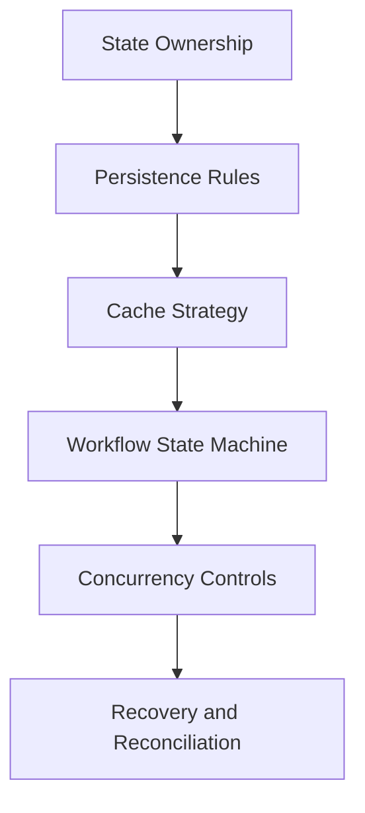

# Day 095 [Expert]: State Strategy for Backend Systems

## Index

- [Goal](#goal)
- [Prerequisites](#prerequisites)
- [Explanation](#explanation)
- [Topic by Topic](#topic-by-topic)
- [Key Concepts](#key-concepts)
- [Visual Concept Map](#visual-concept-map)
- [End-to-End Practical](#end-to-end-practical)
- [Hands-on Coding](#hands-on-coding)
- [Mini Exercise](#mini-exercise)
- [Assessment Quiz](#assessment-quiz)
- [Task](#task)
- [Self Check](#self-check)
- [Interview Questions and Answers](#interview-questions-and-answers)
- [Day 095 Outcome](#day-095-outcome)

## Goal

Build a clear backend state strategy for Python services covering persistence, caching, workflow state, and consistency tradeoffs.

## Prerequisites

- Day 094 completed
- Knowledge of relational DBs, caching, and distributed workflows

## Explanation

State strategy determines system reliability under concurrency, failure, and scale. Treat state as an explicit design concern, not an implementation detail hidden in code paths.

## Topic by Topic

### Topic 1: State Taxonomy and Ownership

Theory:
Not all state is equal: source-of-truth, derived, transient, and session state need different controls.

Practical:
Assign clear ownership for each state category.

Code Example:

```text
order_db: source-of-truth, cache_layer: derived, job_queue: transient
```

**Explanation:**
This topic explains State Taxonomy and Ownership in a practical Python context so you can write clear, reliable, and maintainable programs for real-world tasks.

**Key Points:**
- Understand the core idea behind State Taxonomy and Ownership.
- Apply the practical pattern with good readability and validation habits.
- Keep the solution maintainable, testable, and safe for production use where relevant.

### Topic 2: Persistence Models and Transaction Boundaries

Theory:
State correctness depends on transaction scoping and invariant enforcement.

Practical:
Define aggregate boundaries and commit rules explicitly.

Code Example:

```python
with db.transaction():
  save_order()
  save_outbox_event()
```

**Explanation:**
This topic explains Persistence Models and Transaction Boundaries in a practical Python context so you can write clear, reliable, and maintainable programs for real-world tasks.

**Key Points:**
- Understand the core idea behind Persistence Models and Transaction Boundaries.
- Apply the practical pattern with good readability and validation habits.
- Keep the solution maintainable, testable, and safe for production use where relevant.

### Topic 3: Caching Strategy and Invalidation

Theory:
Caching improves latency but risks stale reads.

Practical:
Use TTL + explicit invalidation + fallback behavior.

Code Example:

```text
write-through for profile updates, TTL cache for catalog reads
```

**Explanation:**
This topic explains Caching Strategy and Invalidation in a practical Python context so you can write clear, reliable, and maintainable programs for real-world tasks.

**Key Points:**
- Understand the core idea behind Caching Strategy and Invalidation.
- Apply the practical pattern with good readability and validation habits.
- Keep the solution maintainable, testable, and safe for production use where relevant.

### Topic 4: Workflow State Machines

Theory:
Complex backend flows benefit from explicit state transitions.

Practical:
Represent legal transitions and guard clauses in code.

Code Example:

```text
PENDING -> APPROVED -> FULFILLED, cancellation forbidden after FULFILLED
```

**Explanation:**
This topic explains Workflow State Machines in a practical Python context so you can write clear, reliable, and maintainable programs for real-world tasks.

**Key Points:**
- Understand the core idea behind Workflow State Machines.
- Apply the practical pattern with good readability and validation habits.
- Keep the solution maintainable, testable, and safe for production use where relevant.

### Topic 5: Concurrency, Locking, and Idempotency

Theory:
Concurrent updates can violate invariants without coordination controls.

Practical:
Use optimistic locking, unique constraints, and idempotency keys.

Code Example:

```python
UPDATE account SET version = version + 1 WHERE id = :id AND version = :old
```

**Explanation:**
This topic explains Concurrency, Locking, and Idempotency in a practical Python context so you can write clear, reliable, and maintainable programs for real-world tasks.

**Key Points:**
- Understand the core idea behind Concurrency, Locking, and Idempotency.
- Apply the practical pattern with good readability and validation habits.
- Keep the solution maintainable, testable, and safe for production use where relevant.

### Topic 6: State Recovery and Operational Playbooks

Theory:
State corruption incidents require predefined repair paths.

Practical:
Prepare replay, reconciliation, and manual correction runbooks.

Code Example:

```text
nightly reconciliation: source-of-truth vs read models mismatch report
```

**Explanation:**
This topic explains State Recovery and Operational Playbooks in a practical Python context so you can write clear, reliable, and maintainable programs for real-world tasks.

**Key Points:**
- Understand the core idea behind State Recovery and Operational Playbooks.
- Apply the practical pattern with good readability and validation habits.
- Keep the solution maintainable, testable, and safe for production use where relevant.

## Key Concepts

- State categories need distinct handling policies
- Transaction boundaries enforce business invariants
- Cache invalidation strategy is a design-time decision
- State machines reduce hidden branching bugs
- Concurrency controls preserve correctness at scale
- Recovery playbooks are part of production readiness

## Visual Concept Map



## End-to-End Practical

1. Inventory all state in one backend domain.
2. Mark source-of-truth and derived state explicitly.
3. Define transition rules as a state machine.
4. Add optimistic locking and idempotency handling.
5. Implement reconciliation and incident recovery checklist.

## Hands-on Coding

### Example 1: Case - Order Lifecycle State Machine

Scenario:
Implement strict order status transitions with audit logging.

```python
ALLOWED = {"PENDING": {"APPROVED", "CANCELLED"}, "APPROVED": {"FULFILLED"}}
```

### Example 2: Case - Cache Invalidation on Profile Update

Scenario:
Update DB then invalidate per-user cache atomically in workflow.

```text
update user -> publish profile_updated -> invalidate cache subscriber
```

### Example 3: Case - Idempotent Refund Requests

Scenario:
Prevent duplicate refunds with idempotency key and unique constraint.

```python
idempotency_key = headers["Idempotency-Key"]
```

## Mini Exercise

Scenario:
Design state strategy for an order service covering persistence, caching, status transitions, and failure recovery.

Expected output:

- State inventory with ownership
- Transition graph and invariant list
- Recovery checklist for inconsistent states

## Assessment Quiz

### Quiz Questions

1. Why separate source-of-truth from derived state?
2. What does optimistic locking protect against?
3. True or False: Cache invalidation can be skipped if TTL exists.
4. Why model workflows as explicit state machines?
5. What is reconciliation used for?

### Quiz Answers

1. It clarifies correctness authority and recovery strategy
2. Lost updates from concurrent writes
3. False
4. To enforce legal transitions and reduce implicit bugs
5. Detect and repair state drift across system components

## Task

- Draft and implement a backend state strategy for one domain
- Add concurrency and idempotency controls to critical flows
- Define reconciliation and rollback procedures

## Self Check

- You can classify and govern backend state intentionally
- You can protect state correctness under concurrency and failures
- You can run operational recovery when state drift appears

## Interview Questions and Answers

### Beginner

**Question:** What is source-of-truth state?

**Answer:** The authoritative persistent data used to derive all other representations.

**Question:** Why can cache create bugs?

**Answer:** Stale or invalid data can diverge from source-of-truth behavior.

### Middle

**Question:** How do you choose optimistic vs pessimistic locking?

**Answer:** Use optimistic locking for low-conflict high-throughput paths; pessimistic only for high-conflict critical sections.

**Question:** Why include idempotency in write APIs?

**Answer:** To keep outcomes consistent under retries and duplicate submissions.

### Advanced

**Question:** What anti-pattern causes chronic state incidents?

**Answer:** Implicit workflow logic spread across services without explicit transition ownership.

**Question:** How do senior teams evolve state strategy safely?

**Answer:** They combine explicit invariants, migration plans, telemetry, and regular reconciliation jobs.

## Day 095 Outcome

- You can design robust state strategy for Python backend systems
- You can balance consistency, latency, and operational complexity
- You are ready for senior system design simulation on Day 096
