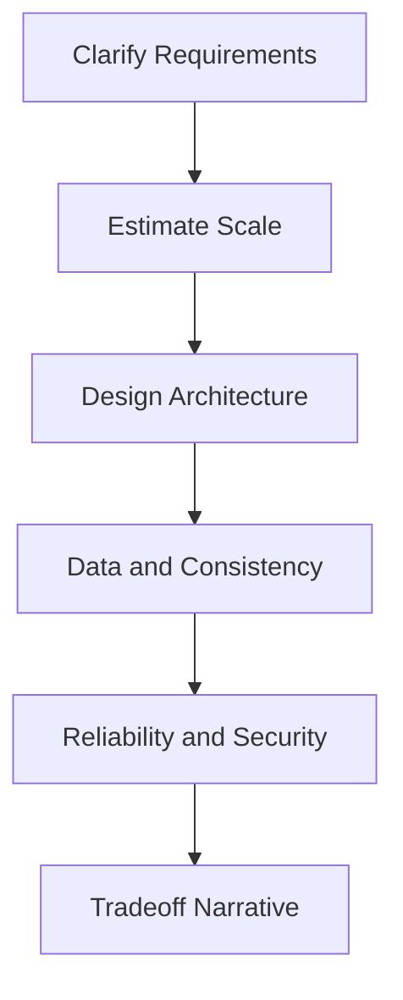

# Day 096 [Expert]: Senior System Design Simulation

## Index

- [Goal](#goal)
- [Prerequisites](#prerequisites)
- [Explanation](#explanation)
- [Topic by Topic](#topic-by-topic)
- [Key Concepts](#key-concepts)
- [Visual Concept Map](#visual-concept-map)
- [End-to-End Practical](#end-to-end-practical)
- [Hands-on Coding](#hands-on-coding)
- [Mini Exercise](#mini-exercise)
- [Assessment Quiz](#assessment-quiz)
- [Task](#task)
- [Self Check](#self-check)
- [Interview Questions and Answers](#interview-questions-and-answers)
- [Day 096 Outcome](#day-096-outcome)

## Goal

Practice senior-level system design interviews using a repeatable approach for requirement clarity, architecture, tradeoffs, and scaling decisions.

## Prerequisites

- Day 095 completed
- Strong understanding of distributed systems and backend architecture

## Explanation

Senior system design is judged on decision quality, communication, and risk awareness, not only diagram complexity. This lesson focuses on structured design under time pressure.

## Topic by Topic

### Topic 1: Problem Framing and Requirement Discovery

Theory:
Unclear requirements produce over-engineered or under-powered designs.

Practical:
Ask clarifying questions on users, scale, latency, consistency, and compliance.

Code Example:

```text
scope card: users, QPS, p95 latency, durability, data retention, SLA
```

**Explanation:**
This topic explains Problem Framing and Requirement Discovery in a practical Python context so you can write clear, reliable, and maintainable programs for real-world tasks.

**Key Points:**
- Understand the core idea behind Problem Framing and Requirement Discovery.
- Apply the practical pattern with good readability and validation habits.
- Keep the solution maintainable, testable, and safe for production use where relevant.

### Topic 2: Capacity Estimation and Bottleneck Forecasting

Theory:
Back-of-envelope estimation guides architecture selection.

Practical:
Estimate storage, throughput, partition counts, and cache impact.

Code Example:

```text
10M req/day, avg payload 2KB => ~20GB ingress/day before replication
```

**Explanation:**
This topic explains Capacity Estimation and Bottleneck Forecasting in a practical Python context so you can write clear, reliable, and maintainable programs for real-world tasks.

**Key Points:**
- Understand the core idea behind Capacity Estimation and Bottleneck Forecasting.
- Apply the practical pattern with good readability and validation habits.
- Keep the solution maintainable, testable, and safe for production use where relevant.

### Topic 3: High-level Architecture and Component Boundaries

Theory:
Good architecture isolates responsibilities and failure domains.

Practical:
Split edge, compute, state, async processing, and observability concerns.

Code Example:

```text
API gateway -> core service -> DB + cache -> event bus -> workers
```

**Explanation:**
This topic explains High-level Architecture and Component Boundaries in a practical Python context so you can write clear, reliable, and maintainable programs for real-world tasks.

**Key Points:**
- Understand the core idea behind High-level Architecture and Component Boundaries.
- Apply the practical pattern with good readability and validation habits.
- Keep the solution maintainable, testable, and safe for production use where relevant.

### Topic 4: Deep Dive on Data and Consistency

Theory:
State model dictates correctness guarantees and tradeoffs.

Practical:
Pick consistency model, schema design, and reconciliation strategy.

Code Example:

```text
write path strong consistency, read path eventual consistency with repair
```

**Explanation:**
This topic explains Deep Dive on Data and Consistency in a practical Python context so you can write clear, reliable, and maintainable programs for real-world tasks.

**Key Points:**
- Understand the core idea behind Deep Dive on Data and Consistency.
- Apply the practical pattern with good readability and validation habits.
- Keep the solution maintainable, testable, and safe for production use where relevant.

### Topic 5: Reliability, Security, and Operations

Theory:
Design is incomplete without failure and abuse scenarios.

Practical:
Add rate limiting, retries, circuit breakers, backups, and incident playbooks.

Code Example:

```text
failure plan: dependency outage -> degrade mode -> recovery steps
```

**Explanation:**
This topic explains Reliability, Security, and Operations in a practical Python context so you can write clear, reliable, and maintainable programs for real-world tasks.

**Key Points:**
- Understand the core idea behind Reliability, Security, and Operations.
- Apply the practical pattern with good readability and validation habits.
- Keep the solution maintainable, testable, and safe for production use where relevant.

### Topic 6: Interview Narrative and Tradeoff Communication

Theory:
Senior candidates explain decisions and alternatives clearly.

Practical:
Present baseline design, alternatives, and rationale with measurable impact.

Code Example:

```text
chosen: eventual consistency for feed freshness vs global transaction cost
```

**Explanation:**
This topic explains Interview Narrative and Tradeoff Communication in a practical Python context so you can write clear, reliable, and maintainable programs for real-world tasks.

**Key Points:**
- Understand the core idea behind Interview Narrative and Tradeoff Communication.
- Apply the practical pattern with good readability and validation habits.
- Keep the solution maintainable, testable, and safe for production use where relevant.

## Key Concepts

- Requirement framing is the first architecture decision
- Estimation anchors realistic design choices
- Clear boundaries improve resilience and team ownership
- Consistency decisions must map to product behavior
- Operational concerns are architecture concerns
- Tradeoff communication is a senior-level signal

## Visual Concept Map



## End-to-End Practical

1. Run a 45-minute mock design for URL shortener or activity feed.
2. Produce requirement sheet and capacity estimates.
3. Draw high-level and detailed component flow.
4. Document reliability and security controls.
5. Summarize alternatives and final recommendation.

## Hands-on Coding

### Example 1: Case - Traffic Estimation Worksheet

Scenario:
Estimate QPS and storage growth for social timeline system.

```text
peak multiplier and replication factor included in totals
```

### Example 2: Case - API and Data Model Skeleton

Scenario:
Define endpoints and table structures for core entities.

```python
class Post(BaseModel):
  post_id: str
  author_id: str
```

### Example 3: Case - Failure Mode Review

Scenario:
Analyze one dependency outage and one data corruption incident.

```text
include detection signal, mitigation, and recovery timeline
```

## Mini Exercise

Scenario:
Pick any product feature and conduct a full senior design simulation within 60 minutes, including non-functional requirements and tradeoff notes.

Expected output:

- Requirement and assumptions sheet
- Scalable architecture diagram
- Risk and mitigation matrix

## Assessment Quiz

### Quiz Questions

1. Why are assumptions important in system design interviews?
2. What does a capacity estimate influence directly?
3. True or False: Security can be added after architecture is finalized.
4. Why discuss alternatives even after choosing one design?
5. What distinguishes senior-level design answers?

### Quiz Answers

1. They define scope and avoid designing the wrong system
2. Component sizing, partitioning, and cost-performance decisions
3. False
4. It shows tradeoff awareness and decision maturity
5. Structured reasoning, risk management, and clear communication

## Task

- Conduct one complete mock system design
- Document tradeoffs with measurable impacts
- Present final design and improvement roadmap

## Self Check

- You can run design discussions with a clear structure
- You can convert requirements into scalable architecture choices
- You can defend tradeoffs with technical and business reasoning

## Interview Questions and Answers

### Beginner

**Question:** What is the first step in a system design interview?

**Answer:** Clarify requirements, constraints, and success criteria.

**Question:** Why estimate scale early?

**Answer:** It prevents under-designed or over-engineered architecture decisions.

### Middle

**Question:** How do you handle ambiguous requirements during interview?

**Answer:** Make explicit assumptions, validate priorities, and proceed transparently.

**Question:** What non-functional requirement is commonly ignored?

**Answer:** Operational recovery and observability expectations.

### Advanced

**Question:** What anti-pattern weakens senior system design responses?

**Answer:** Jumping into components without quantifying scale and risks.

**Question:** How do experienced engineers adapt design under changing constraints?

**Answer:** They revisit assumptions, reprioritize tradeoffs, and evolve architecture incrementally.

## Day 096 Outcome

- You can execute senior-level system design simulations confidently
- You can communicate architecture tradeoffs with depth and clarity
- You are ready for large-scale module architecture on Day 097
