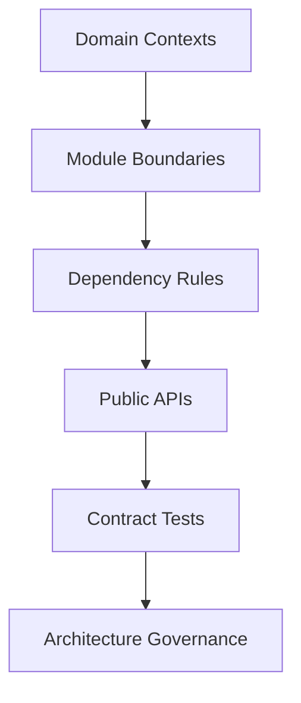

# Day 097 [Expert]: Large Scale Module Architecture

## Index

- [Goal](#goal)
- [Prerequisites](#prerequisites)
- [Explanation](#explanation)
- [Topic by Topic](#topic-by-topic)
- [Key Concepts](#key-concepts)
- [Visual Concept Map](#visual-concept-map)
- [End-to-End Practical](#end-to-end-practical)
- [Hands-on Coding](#hands-on-coding)
- [Mini Exercise](#mini-exercise)
- [Assessment Quiz](#assessment-quiz)
- [Task](#task)
- [Self Check](#self-check)
- [Interview Questions and Answers](#interview-questions-and-answers)
- [Day 097 Outcome](#day-097-outcome)

## Goal

Design scalable Python module architecture that supports long-term maintainability, team ownership, and change velocity in large systems.

## Prerequisites

- Day 096 completed
- Familiarity with layered architecture and clean code principles

## Explanation

At scale, poor module boundaries become delivery bottlenecks. Architecture must optimize for comprehension, testability, and low-coupling collaboration between teams.

## Topic by Topic

### Topic 1: Architectural Slicing and Bounded Contexts

Theory:
Module boundaries should reflect business domains, not folder convenience.

Practical:
Define bounded contexts and clear ownership per domain module.

Code Example:

```text
billing/, identity/, catalog/, order/ each with explicit API surface
```

**Explanation:**
This topic explains Architectural Slicing and Bounded Contexts in a practical Python context so you can write clear, reliable, and maintainable programs for real-world tasks.

**Key Points:**
- Understand the core idea behind Architectural Slicing and Bounded Contexts.
- Apply the practical pattern with good readability and validation habits.
- Keep the solution maintainable, testable, and safe for production use where relevant.

### Topic 2: Dependency Direction and Layered Rules

Theory:
Dependency inversion protects domain logic from infrastructure churn.

Practical:
Enforce one-way dependencies with lint and review policies.

Code Example:

```text
domain <- application <- interfaces <- infrastructure
```

**Explanation:**
This topic explains Dependency Direction and Layered Rules in a practical Python context so you can write clear, reliable, and maintainable programs for real-world tasks.

**Key Points:**
- Understand the core idea behind Dependency Direction and Layered Rules.
- Apply the practical pattern with good readability and validation habits.
- Keep the solution maintainable, testable, and safe for production use where relevant.

### Topic 3: Public Contracts and Internal Encapsulation

Theory:
Stable public interfaces reduce ripple effects during internal changes.

Practical:
Expose minimal API per module and hide implementation details.

Code Example:

```python
__all__ = ["create_order", "cancel_order"]
```

**Explanation:**
This topic explains Public Contracts and Internal Encapsulation in a practical Python context so you can write clear, reliable, and maintainable programs for real-world tasks.

**Key Points:**
- Understand the core idea behind Public Contracts and Internal Encapsulation.
- Apply the practical pattern with good readability and validation habits.
- Keep the solution maintainable, testable, and safe for production use where relevant.

### Topic 4: Cross-module Communication Patterns

Theory:
Direct deep imports create hidden coupling.

Practical:
Use service interfaces, events, or facades for module interactions.

Code Example:

```text
module A calls module B facade, never internal helpers
```

**Explanation:**
This topic explains Cross-module Communication Patterns in a practical Python context so you can write clear, reliable, and maintainable programs for real-world tasks.

**Key Points:**
- Understand the core idea behind Cross-module Communication Patterns.
- Apply the practical pattern with good readability and validation habits.
- Keep the solution maintainable, testable, and safe for production use where relevant.

### Topic 5: Testing Strategy by Module Boundary

Theory:
Architecture quality is enforced by test pyramid aligned to boundaries.

Practical:
Use contract tests between modules and unit tests within modules.

Code Example:

```text
unit tests: domain rules; contract tests: module API behavior
```

**Explanation:**
This topic explains Testing Strategy by Module Boundary in a practical Python context so you can write clear, reliable, and maintainable programs for real-world tasks.

**Key Points:**
- Understand the core idea behind Testing Strategy by Module Boundary.
- Apply the practical pattern with good readability and validation habits.
- Keep the solution maintainable, testable, and safe for production use where relevant.

### Topic 6: Evolution, Migration, and Governance

Theory:
Large module architecture must evolve without destabilizing delivery.

Practical:
Adopt ADRs, deprecation policy, and architecture fitness checks.

Code Example:

```text
quarterly architecture review with coupling and ownership metrics
```

**Explanation:**
This topic explains Evolution, Migration, and Governance in a practical Python context so you can write clear, reliable, and maintainable programs for real-world tasks.

**Key Points:**
- Understand the core idea behind Evolution, Migration, and Governance.
- Apply the practical pattern with good readability and validation habits.
- Keep the solution maintainable, testable, and safe for production use where relevant.

## Key Concepts

- Module design should follow domain boundaries
- Dependency rules are architecture guardrails
- Public interfaces must be explicit and small
- Cross-module communication needs stable contracts
- Boundary-focused testing prevents regressions
- Governance keeps architecture healthy over time

## Visual Concept Map



## End-to-End Practical

1. Map current modules and dependency graph.
2. Identify high-coupling hotspots and ownership ambiguity.
3. Define target boundaries and migration phases.
4. Add public interface contracts and tests.
5. Enforce dependency rules in CI.

## Hands-on Coding

### Example 1: Case - Extracting Domain Module

Scenario:
Move pricing rules from API layer into dedicated domain package.

```python
def calculate_discount(order, policy):
  ...
```

### Example 2: Case - Anti-corruption Facade

Scenario:
Create adapter around legacy utility module to prevent leakage.

```text
new modules depend on adapter only, not legacy internals
```

### Example 3: Case - Dependency Rule Enforcement

Scenario:
Block forbidden imports in CI.

```text
fail build if infrastructure imports domain tests helpers
```

## Mini Exercise

Scenario:
Propose a module architecture redesign for one existing Python backend and include migration checkpoints.

Expected output:

- Current vs target boundary map
- Dependency policy list
- Migration and risk plan

## Assessment Quiz

### Quiz Questions

1. Why should module boundaries follow business domains?
2. What is the purpose of dependency direction rules?
3. True or False: Exposing many internal utilities as public API is beneficial.
4. Why add contract tests between modules?
5. What is an architecture fitness check?

### Quiz Answers

1. It aligns ownership and reduces accidental coupling
2. To prevent architecture erosion and fragile interdependencies
3. False
4. To guarantee interface stability across team changes
5. Automated validation that architecture constraints remain intact

## Task

- Redesign one subsystem with explicit module boundaries
- Enforce dependency rules and contract testing
- Track architecture health with measurable indicators

## Self Check

- You can design module architecture for team-scale systems
- You can prevent coupling drift through guardrails
- You can evolve architecture incrementally with low disruption

## Interview Questions and Answers

### Beginner

**Question:** Why separate code into modules?

**Answer:** To improve clarity, reuse, and independent change management.

**Question:** What makes a good module API?

**Answer:** Small, stable, and focused on business capabilities.

### Middle

**Question:** How do you detect architecture coupling problems?

**Answer:** Dependency graph analysis, change-frequency heatmaps, and review pain signals.

**Question:** Why use facades for legacy modules?

**Answer:** To isolate old complexity while migrating safely.

### Advanced

**Question:** What anti-pattern leads to a modular codebase that still behaves like a monolith?

**Answer:** Deep cross-module imports and shared utility sprawl without ownership.

**Question:** How do experienced teams keep module architecture sustainable?

**Answer:** They enforce boundaries via automation, contracts, and regular architecture reviews.

## Day 097 Outcome

- You can build large-scale module architecture with clear ownership
- You can enforce dependency and contract discipline in Python systems
- You are ready for tech lead decision frameworks on Day 098
