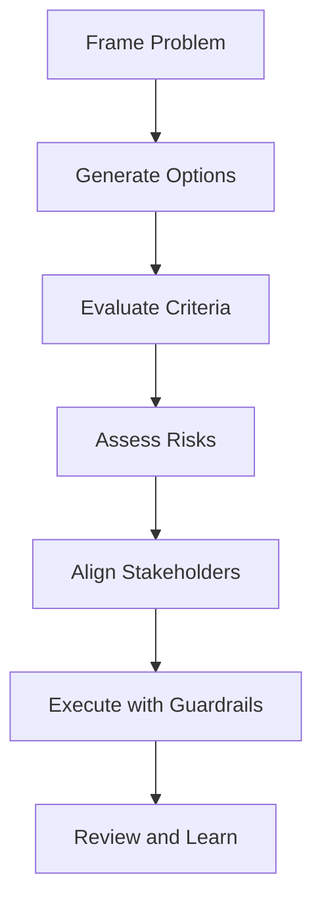

# Day 098 [Expert]: Tech Lead Decision Framework

## Index

- [Goal](#goal)
- [Prerequisites](#prerequisites)
- [Explanation](#explanation)
- [Topic by Topic](#topic-by-topic)
- [Key Concepts](#key-concepts)
- [Visual Concept Map](#visual-concept-map)
- [End-to-End Practical](#end-to-end-practical)
- [Hands-on Coding](#hands-on-coding)
- [Mini Exercise](#mini-exercise)
- [Assessment Quiz](#assessment-quiz)
- [Task](#task)
- [Self Check](#self-check)
- [Interview Questions and Answers](#interview-questions-and-answers)
- [Day 098 Outcome](#day-098-outcome)

## Goal

Use a structured framework to make high-impact tech lead decisions that balance product goals, engineering risk, and team execution capacity.

## Prerequisites

- Day 097 completed
- Experience delivering backend features in team settings

## Explanation

Tech leadership decisions fail when made on intuition alone. A repeatable framework improves alignment, decision speed, and accountability.

## Topic by Topic

### Topic 1: Decision Framing and Problem Statement

Theory:
Precise framing prevents solving the wrong problem.

Practical:
Define objective, constraints, stakeholders, and decision deadline.

Code Example:

```text
decision brief: objective, options, constraints, risks, owner, date
```

**Explanation:**
This topic explains Decision Framing and Problem Statement in a practical Python context so you can write clear, reliable, and maintainable programs for real-world tasks.

**Key Points:**
- Understand the core idea behind Decision Framing and Problem Statement.
- Apply the practical pattern with good readability and validation habits.
- Keep the solution maintainable, testable, and safe for production use where relevant.

### Topic 2: Option Generation and Evaluation Criteria

Theory:
Good decisions compare alternatives against explicit criteria.

Practical:
Score options on impact, effort, risk, reversibility, and time-to-value.

Code Example:

```text
weighted score = 0.35 impact + 0.25 risk + 0.20 effort + 0.20 reversibility
```

**Explanation:**
This topic explains Option Generation and Evaluation Criteria in a practical Python context so you can write clear, reliable, and maintainable programs for real-world tasks.

**Key Points:**
- Understand the core idea behind Option Generation and Evaluation Criteria.
- Apply the practical pattern with good readability and validation habits.
- Keep the solution maintainable, testable, and safe for production use where relevant.

### Topic 3: Risk Analysis and Mitigation Planning

Theory:
Every option carries technical, operational, and organizational risks.

Practical:
Build a risk matrix and attach mitigation actions per risk.

Code Example:

```text
risk: migration outage -> mitigation: canary + rollback automation
```

**Explanation:**
This topic explains Risk Analysis and Mitigation Planning in a practical Python context so you can write clear, reliable, and maintainable programs for real-world tasks.

**Key Points:**
- Understand the core idea behind Risk Analysis and Mitigation Planning.
- Apply the practical pattern with good readability and validation habits.
- Keep the solution maintainable, testable, and safe for production use where relevant.

### Topic 4: Stakeholder Alignment and Communication

Theory:
Even correct decisions fail without cross-functional alignment.

Practical:
Tailor communication for engineering, product, and business stakeholders.

Code Example:

```text
engineering memo + product tradeoff summary + exec status update
```

**Explanation:**
This topic explains Stakeholder Alignment and Communication in a practical Python context so you can write clear, reliable, and maintainable programs for real-world tasks.

**Key Points:**
- Understand the core idea behind Stakeholder Alignment and Communication.
- Apply the practical pattern with good readability and validation habits.
- Keep the solution maintainable, testable, and safe for production use where relevant.

### Topic 5: Execution Guardrails and Feedback Loops

Theory:
Decisions must include measurable checkpoints.

Practical:
Define success KPIs, stage gates, and rollback triggers.

Code Example:

```text
stage gate: proceed only if p95 latency improves >= 15% with no error increase
```

**Explanation:**
This topic explains Execution Guardrails and Feedback Loops in a practical Python context so you can write clear, reliable, and maintainable programs for real-world tasks.

**Key Points:**
- Understand the core idea behind Execution Guardrails and Feedback Loops.
- Apply the practical pattern with good readability and validation habits.
- Keep the solution maintainable, testable, and safe for production use where relevant.

### Topic 6: Post-decision Review and Learning

Theory:
Retrospectives refine future decision quality.

Practical:
Run decision postmortems with outcome vs expectation analysis.

Code Example:

```text
expected vs actual: cost, delivery time, reliability impact
```

**Explanation:**
This topic explains Post-decision Review and Learning in a practical Python context so you can write clear, reliable, and maintainable programs for real-world tasks.

**Key Points:**
- Understand the core idea behind Post-decision Review and Learning.
- Apply the practical pattern with good readability and validation habits.
- Keep the solution maintainable, testable, and safe for production use where relevant.

## Key Concepts

- Clear framing is the foundation of good decisions
- Criteria-based comparison reduces bias
- Risk handling should be explicit and testable
- Communication quality determines adoption speed
- Guardrails turn strategy into reliable execution
- Review loops create continuous leadership improvement

## Visual Concept Map



## End-to-End Practical

1. Select a real architecture or process decision.
2. Build option matrix with weighted criteria.
3. Document risks and mitigations.
4. Present recommendation with staged rollout plan.
5. Define review timeline and success metrics.

## Hands-on Coding

### Example 1: Case - Build vs Buy Decision

Scenario:
Evaluate internal feature build against third-party managed service.

```text
compare: delivery speed, lock-in risk, long-term total cost
```

### Example 2: Case - Monolith Optimization vs Service Split

Scenario:
Decide whether to optimize existing monolith or extract a new service.

```text
criteria includes reliability gain and team cognitive load
```

### Example 3: Case - Migration Rollout Decision

Scenario:
Choose phased migration plan with measurable gates.

```text
gate 1 20%, gate 2 50%, gate 3 100% traffic
```

## Mini Exercise

Scenario:
Prepare a decision brief for one major technical choice in your project using this framework and present a final recommendation.

Expected output:

- Decision brief with alternatives
- Weighted matrix and risk register
- Execution and review plan

## Assessment Quiz

### Quiz Questions

1. Why define evaluation criteria before selecting an option?
2. What is one example of a reversible decision?
3. True or False: Stakeholder alignment can wait until after implementation starts.
4. Why include rollback triggers in decision plans?
5. What does a post-decision review improve?

### Quiz Answers

1. It prevents subjective and inconsistent choice-making
2. Feature flag rollout that can be toggled back quickly
3. False
4. To contain blast radius if outcomes degrade
5. Future decision quality and organizational learning

## Task

- Apply the framework to one upcoming technical decision
- Document criteria, risks, and rollout guardrails
- Run post-decision review after first milestone

## Self Check

- You can make decisions with transparent logic and evidence
- You can align teams around tradeoffs and risks
- You can improve leadership outcomes through feedback loops

## Interview Questions and Answers

### Beginner

**Question:** Why use a decision framework as a tech lead?

**Answer:** It improves consistency, clarity, and stakeholder trust in technical choices.

**Question:** What should every decision brief include?

**Answer:** Objective, options, constraints, risks, and recommendation.

### Middle

**Question:** How do you prevent bias when evaluating architecture options?

**Answer:** Use pre-defined criteria, weighted scoring, and cross-functional review.

**Question:** What if teams disagree on the best option?

**Answer:** Revisit criteria and assumptions, then choose based on highest expected outcome and controllable risk.

### Advanced

**Question:** What anti-pattern hurts tech lead credibility most?

**Answer:** Unstructured decisions with shifting rationale and no measurable checkpoints.

**Question:** How do experienced leads improve decision velocity without lowering quality?

**Answer:** They standardize decision templates, classify reversible decisions, and automate validation gates.

## Day 098 Outcome

- You can make and defend senior technical decisions with structure
- You can align execution with risk-aware governance
- You are ready for senior machine coding simulation on Day 099
