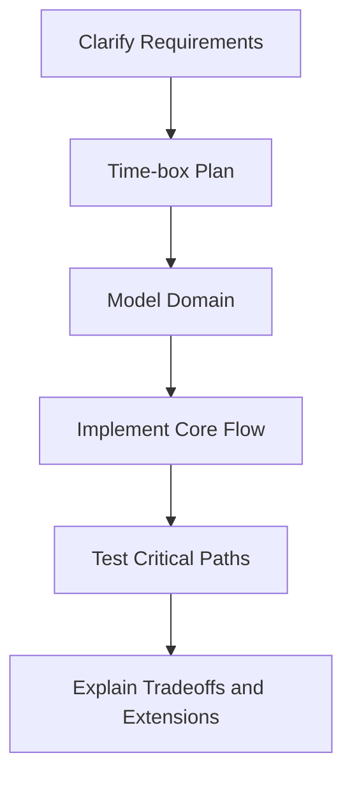

# Day 099 [Expert]: Senior Machine Coding Simulation

## Index

- [Goal](#goal)
- [Prerequisites](#prerequisites)
- [Explanation](#explanation)
- [Topic by Topic](#topic-by-topic)
- [Key Concepts](#key-concepts)
- [Visual Concept Map](#visual-concept-map)
- [End-to-End Practical](#end-to-end-practical)
- [Hands-on Coding](#hands-on-coding)
- [Mini Exercise](#mini-exercise)
- [Assessment Quiz](#assessment-quiz)
- [Task](#task)
- [Self Check](#self-check)
- [Interview Questions and Answers](#interview-questions-and-answers)
- [Day 099 Outcome](#day-099-outcome)

## Goal

Build interview-ready machine coding execution skills for senior Python roles: requirement extraction, clean architecture, testability, and delivery under strict time limits.

## Prerequisites

- Day 098 completed
- Comfortable with Python OOP, testing, and API design

## Explanation

Senior machine coding evaluates both code quality and engineering judgment. You must deliver a working slice fast while preserving extensibility, correctness, and observability.

## Topic by Topic

### Topic 1: Problem Decomposition Under Time Constraints

Theory:
Time-boxed coding rewards prioritization over perfection.

Practical:
Break requirements into must-have core, optional enhancements, and out-of-scope items.

Code Example:

```text
45 min plan: 10 design, 25 implementation, 10 testing and polish
```

**Explanation:**
This topic explains Problem Decomposition Under Time Constraints in a practical Python context so you can write clear, reliable, and maintainable programs for real-world tasks.

**Key Points:**
- Understand the core idea behind Problem Decomposition Under Time Constraints.
- Apply the practical pattern with good readability and validation habits.
- Keep the solution maintainable, testable, and safe for production use where relevant.

### Topic 2: Domain Modeling and Interface-first Design

Theory:
Clear entities and interfaces reduce rewrites mid-solution.

Practical:
Define contracts before implementation for critical components.

Code Example:

```python
class PaymentGateway(Protocol):
  def charge(self, amount: int, user_id: str) -> str: ...
```

**Explanation:**
This topic explains Domain Modeling and Interface-first Design in a practical Python context so you can write clear, reliable, and maintainable programs for real-world tasks.

**Key Points:**
- Understand the core idea behind Domain Modeling and Interface-first Design.
- Apply the practical pattern with good readability and validation habits.
- Keep the solution maintainable, testable, and safe for production use where relevant.

### Topic 3: Clean Architecture in Coding Round Scope

Theory:
Even small solutions benefit from separation of concerns.

Practical:
Split domain logic, orchestration, and IO adapters.

Code Example:

```text
controllers -> services -> repositories -> adapters
```

**Explanation:**
This topic explains Clean Architecture in Coding Round Scope in a practical Python context so you can write clear, reliable, and maintainable programs for real-world tasks.

**Key Points:**
- Understand the core idea behind Clean Architecture in Coding Round Scope.
- Apply the practical pattern with good readability and validation habits.
- Keep the solution maintainable, testable, and safe for production use where relevant.

### Topic 4: Testability and Error Handling

Theory:
Demonstrable correctness is a strong senior signal.

Practical:
Write focused unit tests for business rules and edge cases.

Code Example:

```python
def test_duplicate_order_request_returns_existing_result():
  ...
```

**Explanation:**
This topic explains Testability and Error Handling in a practical Python context so you can write clear, reliable, and maintainable programs for real-world tasks.

**Key Points:**
- Understand the core idea behind Testability and Error Handling.
- Apply the practical pattern with good readability and validation habits.
- Keep the solution maintainable, testable, and safe for production use where relevant.

### Topic 5: Extensibility and Tradeoff Explanation

Theory:
Interviewers look for future-proof thinking within practical limits.

Practical:
Show extension points and explain what was intentionally deferred.

Code Example:

```text
strategy registry allows adding discount rules without core change
```

**Explanation:**
This topic explains Extensibility and Tradeoff Explanation in a practical Python context so you can write clear, reliable, and maintainable programs for real-world tasks.

**Key Points:**
- Understand the core idea behind Extensibility and Tradeoff Explanation.
- Apply the practical pattern with good readability and validation habits.
- Keep the solution maintainable, testable, and safe for production use where relevant.

### Topic 6: Live Communication and Review Flow

Theory:
Narrating choices increases reviewer confidence.

Practical:
Explain assumptions, complexity, and risk points while coding.

Code Example:

```text
state tradeoffs aloud: speed now vs abstraction for next features
```

**Explanation:**
This topic explains Live Communication and Review Flow in a practical Python context so you can write clear, reliable, and maintainable programs for real-world tasks.

**Key Points:**
- Understand the core idea behind Live Communication and Review Flow.
- Apply the practical pattern with good readability and validation habits.
- Keep the solution maintainable, testable, and safe for production use where relevant.

## Key Concepts

- Prioritization wins machine coding rounds
- Interface-first design reduces late churn
- Structured layering improves readability and testability
- Fast feedback via tests prevents silent logic bugs
- Extensibility should be deliberate, not over-engineered
- Communication quality is part of technical evaluation

## Visual Concept Map



## End-to-End Practical

1. Pick one machine coding problem statement.
2. Build architecture skeleton with interfaces and core classes.
3. Implement must-have flows end-to-end.
4. Add tests for major edge cases.
5. Present design tradeoffs and improvement backlog.

## Hands-on Coding

### Example 1: Case - Parking Lot System

Scenario:
Implement parking allocation with vehicle types and slot strategies.

```python
class SlotAllocator(Protocol):
  def allocate(self, vehicle_type: str) -> str | None: ...
```

### Example 2: Case - Rate Limiter Service

Scenario:
Design token-bucket or sliding-window limiter with in-memory store.

```text
support allow_request(client_id) with deterministic behavior
```

### Example 3: Case - Order Workflow with Idempotency

Scenario:
Implement order create operation safe for duplicate requests.

```python
if key_store.exists(idempotency_key):
  return key_store.get_result(idempotency_key)
```

## Mini Exercise

Scenario:
Simulate a 60-minute senior machine coding round: implement one design-heavy problem with tests and a short architecture walkthrough.

Expected output:

- Running core implementation
- Passing tests for critical paths
- Documented tradeoffs and extension strategy

## Assessment Quiz

### Quiz Questions

1. Why time-box planning before coding?
2. What is one sign of over-engineering in coding rounds?
3. True or False: Tests are optional in senior machine coding rounds.
4. Why define interfaces early?
5. What should you communicate during implementation?

### Quiz Answers

1. It protects delivery of essential features within fixed time
2. Building abstractions with no immediate problem relevance
3. False
4. They stabilize design and simplify extension/testing
5. Assumptions, tradeoffs, and rationale for key decisions

## Task

- Complete one senior machine coding simulation in Python
- Add tests and explain architectural decisions
- Perform self-review on readability, correctness, and extensibility

## Self Check

- You can deliver a clean solution under interview constraints
- You can prove correctness through focused tests
- You can articulate design reasoning like a senior engineer

## Interview Questions and Answers

### Beginner

**Question:** What is the first thing to do in a machine coding round?

**Answer:** Clarify requirements and prioritize must-have functionality.

**Question:** Why avoid coding immediately without structure?

**Answer:** It often leads to rework and incomplete delivery.

### Middle

**Question:** How much architecture is enough in a timed round?

**Answer:** Just enough structure to support core use cases, tests, and one extension path.

**Question:** What testing approach is best under tight time?

**Answer:** Target business-critical and failure-prone paths first.

### Advanced

**Question:** What anti-pattern signals weak seniority in machine coding?

**Answer:** Solving only the happy path with no error handling, tests, or tradeoff discussion.

**Question:** How do senior candidates stand out in coding simulations?

**Answer:** They combine delivery speed, clean architecture, correctness checks, and clear communication.

## Day 099 Outcome

- You can execute senior machine coding rounds with structure and confidence
- You can balance speed, quality, and extensibility effectively
- You are ready for Day 100 capstone and long-term growth planning
