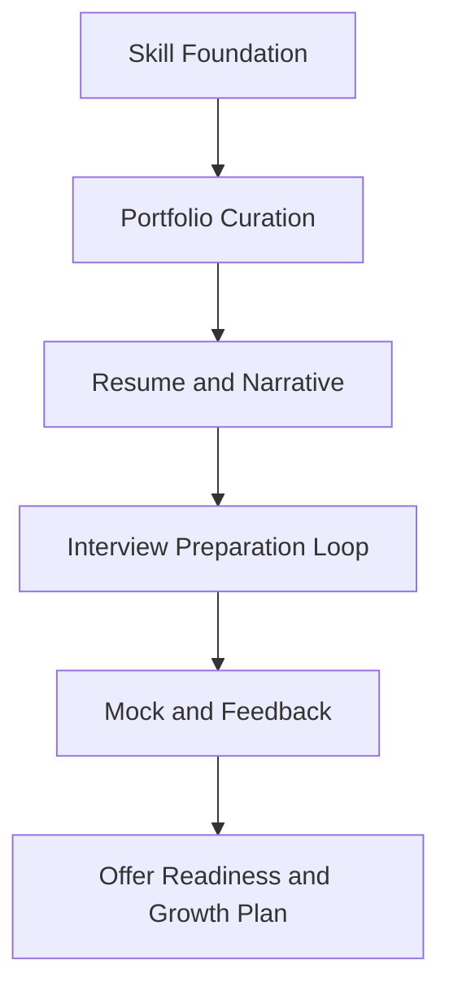

# Day 100 [Expert]: Python Portfolio and Interview Readiness

## Index

- [Goal](#goal)
- [Prerequisites](#prerequisites)
- [Explanation](#explanation)
- [Topic by Topic](#topic-by-topic)
- [Key Concepts](#key-concepts)
- [Visual Concept Map](#visual-concept-map)
- [End-to-End Practical](#end-to-end-practical)
- [Hands-on Coding](#hands-on-coding)
- [Mini Exercise](#mini-exercise)
- [Assessment Quiz](#assessment-quiz)
- [Task](#task)
- [Self Check](#self-check)
- [Interview Questions and Answers](#interview-questions-and-answers)
- [Day 100 Outcome](#day-100-outcome)

## Goal

Consolidate your 100-day Python journey into a strong portfolio, interview strategy, and next-12-month growth roadmap.

## Prerequisites

- Day 001 through Day 099 completed
- Working GitHub profile and resume draft

## Explanation

Technical skill alone is not enough for career outcomes. Packaging your work, communicating impact, and preparing a deliberate interview strategy converts learning into opportunities.

## Topic by Topic

### Topic 1: Portfolio Positioning and Storytelling

Theory:
A portfolio should show capability breadth and depth with real problem solving.

Practical:
Select 3 to 5 flagship projects that demonstrate backend, data, and architecture strengths.

Code Example:

```text
project card: problem, solution, stack, architecture, metrics, lessons learned
```

**Explanation:**
This topic explains Portfolio Positioning and Storytelling in a practical Python context so you can write clear, reliable, and maintainable programs for real-world tasks.

**Key Points:**
- Understand the core idea behind Portfolio Positioning and Storytelling.
- Apply the practical pattern with good readability and validation habits.
- Keep the solution maintainable, testable, and safe for production use where relevant.

### Topic 2: Repository Quality and Engineering Signals

Theory:
Reviewers infer professionalism from structure and maintainability.

Practical:
Standardize README, setup scripts, tests, and architecture docs.

Code Example:

```text
README sections: overview, quickstart, architecture, testing, roadmap
```

**Explanation:**
This topic explains Repository Quality and Engineering Signals in a practical Python context so you can write clear, reliable, and maintainable programs for real-world tasks.

**Key Points:**
- Understand the core idea behind Repository Quality and Engineering Signals.
- Apply the practical pattern with good readability and validation habits.
- Keep the solution maintainable, testable, and safe for production use where relevant.

### Topic 3: Interview Preparation Strategy

Theory:
Preparation should balance coding, system design, and behavioral depth.

Practical:
Create weekly loops for DSA, machine coding, design drills, and mock interviews.

Code Example:

```text
weekly split: 3 coding sessions, 2 design sessions, 1 mock, 1 review
```

**Explanation:**
This topic explains Interview Preparation Strategy in a practical Python context so you can write clear, reliable, and maintainable programs for real-world tasks.

**Key Points:**
- Understand the core idea behind Interview Preparation Strategy.
- Apply the practical pattern with good readability and validation habits.
- Keep the solution maintainable, testable, and safe for production use where relevant.

### Topic 4: Resume and Impact Quantification

Theory:
Hiring decisions favor clear, measurable impact over task descriptions.

Practical:
Rewrite bullets using action + scope + metric format.

Code Example:

```text
Built async ingestion pipeline reducing processing latency by 42% at 5M events/day
```

**Explanation:**
This topic explains Resume and Impact Quantification in a practical Python context so you can write clear, reliable, and maintainable programs for real-world tasks.

**Key Points:**
- Understand the core idea behind Resume and Impact Quantification.
- Apply the practical pattern with good readability and validation habits.
- Keep the solution maintainable, testable, and safe for production use where relevant.

### Topic 5: Senior Communication and Leadership Signals

Theory:
Senior roles assess ownership, tradeoff thinking, and collaboration ability.

Practical:
Prepare architecture narratives, incident stories, and decision frameworks.

Code Example:

```text
STAR + tradeoff extension: Situation, Task, Action, Result, Why this design
```

**Explanation:**
This topic explains Senior Communication and Leadership Signals in a practical Python context so you can write clear, reliable, and maintainable programs for real-world tasks.

**Key Points:**
- Understand the core idea behind Senior Communication and Leadership Signals.
- Apply the practical pattern with good readability and validation habits.
- Keep the solution maintainable, testable, and safe for production use where relevant.

### Topic 6: Long-term Growth Plan and Specialization

Theory:
Career acceleration comes from focused compounding, not random topic hopping.

Practical:
Choose one primary track and one secondary track with quarterly milestones.

Code Example:

```text
primary: backend platform engineering, secondary: applied data systems
```

**Explanation:**
This topic explains Long-term Growth Plan and Specialization in a practical Python context so you can write clear, reliable, and maintainable programs for real-world tasks.

**Key Points:**
- Understand the core idea behind Long-term Growth Plan and Specialization.
- Apply the practical pattern with good readability and validation habits.
- Keep the solution maintainable, testable, and safe for production use where relevant.

## Key Concepts

- Portfolio quality communicates engineering maturity
- Quantified impact strengthens resume credibility
- Interview prep must be structured and iterative
- Leadership signals matter for senior roles
- Personal branding should match target role archetype
- Growth compounding needs focused specialization

## Visual Concept Map



## End-to-End Practical

1. Select top projects from your 100-day curriculum.
2. Upgrade each repo with docs, tests, and architecture notes.
3. Rewrite resume bullets with measurable outcomes.
4. Build a 6-week interview preparation plan.
5. Conduct mock interviews and refine weak areas.

## Hands-on Coding

### Example 1: Case - Portfolio Project Refactor Sprint

Scenario:
Improve one project for hiring visibility by adding tests, CI, and architecture documentation.

```text
goal: portfolio project reaches production-grade presentation quality
```

### Example 2: Case - Interview-ready Problem Walkthrough

Scenario:
Record a timed coding solution and design explanation for one backend problem.

```text
deliverables: code, tests, architecture diagram, tradeoff summary
```

### Example 3: Case - Metrics-driven Resume Rewrite

Scenario:
Convert 5 resume bullets into impact-focused statements with concrete numbers.

```text
before: built API; after: built API serving 1.2M requests/day with 99.95% uptime
```

## Mini Exercise

Scenario:
Create a final capstone packet: portfolio links, resume, interview plan, and one flagship architecture case study.

Expected output:

- Curated portfolio with 3 to 5 strong projects
- Resume with quantified achievements
- Interview prep tracker for 6 weeks

## Assessment Quiz

### Quiz Questions

1. Why is project storytelling important for hiring outcomes?
2. What is one strong resume bullet format for engineers?
3. True or False: Number of projects matters more than project quality.
4. Why run mock interviews repeatedly?
5. What is one benefit of selecting a specialization track?

### Quiz Answers

1. It helps reviewers understand problem context, decision quality, and impact
2. Action + scope + measurable result
3. False
4. They expose communication gaps and timing issues before real interviews
5. It creates focused skill compounding and stronger market positioning

## Task

- Build your final Python portfolio presentation package
- Finalize interview plan with weekly milestones
- Schedule at least two mock interviews with feedback tracking

## Self Check

- You can present your technical work with clarity and impact
- You can execute a structured interview preparation plan
- You have a realistic roadmap for senior-level growth

## Interview Questions and Answers

### Beginner

**Question:** What should a Python portfolio include at minimum?

**Answer:** A few well-documented projects with clean code, tests, and clear setup instructions.

**Question:** Why quantify achievements on a resume?

**Answer:** Metrics make impact concrete and credible.

### Middle

**Question:** How do you choose which projects to showcase?

**Answer:** Pick projects that demonstrate relevant role skills, complexity, and measurable outcomes.

**Question:** How should you prepare for system design interviews?

**Answer:** Practice requirement framing, estimations, tradeoff analysis, and clear architecture storytelling.

### Advanced

**Question:** What anti-pattern weakens senior candidate positioning most?

**Answer:** Presenting many unfinished projects with no depth, metrics, or decision rationale.

**Question:** How do high-performing candidates sustain growth after placement?

**Answer:** They keep a learning roadmap, seek feedback loops, and expand ownership scope deliberately.

## Day 100 Outcome

- You completed a full 100-day Python curriculum
- You can package your work for strong interview and hiring outcomes
- You have a focused roadmap for continued senior engineering growth
