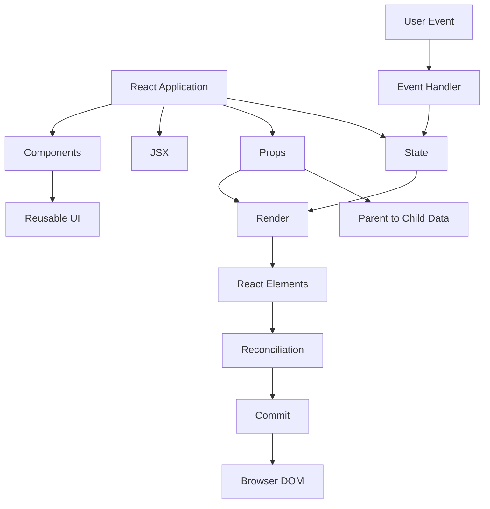

# Day 1 [Beginner]: Introduction to React

## Index

- [Goal](#goal)
- [Prerequisites](#prerequisites)
- [Why React](#why-react)
- [When React Is a Good Fit](#when-react-is-a-good-fit)
- [When React May Be Unnecessary](#when-react-may-be-unnecessary)
- [React Mental Model](#react-mental-model)
- [Topic by Topic](#topic-by-topic)
- [Key Concepts](#key-concepts)
- [Visual Concept Map](#visual-concept-map)
- [End-to-End Practical](#end-to-end-practical)
- [Hands-on Coding](#hands-on-coding)
- [Debugging Challenge](#debugging-challenge)
- [Common Mistakes](#common-mistakes)
- [Mini Exercise](#mini-exercise)
- [Assessment Quiz](#assessment-quiz)
- [Task](#task)
- [Self Check](#self-check)
- [Interview Questions and Answers](#interview-questions-and-answers)
- [Day 1 Outcome](#day-1-outcome)

## Goal

By the end of this lesson, you should be able to explain what React is, why it is used, how components and JSX work, how props and state differ, what a Hook is, how events update state, what declarative UI and one-way data flow mean, and how a React render can lead to a browser update.

## Prerequisites

- Basic JavaScript: variables, functions, arrays, objects, arrow functions, and `.map()`
- Basic HTML and CSS
- Basic computer usage: files, folders, terminal
- Node.js LTS installed
- VS Code or another code editor

Verify your environment:

```bash
node -v
npm -v
```

> React itself does not require VS Code or a particular editor. These tools are recommended for the course workflow.

## Why React

Modern applications contain many independent pieces of UI: navigation, forms, tables, cards, dialogs, notifications, and data-driven views. React provides a component model that lets developers describe these pieces as reusable JavaScript functions and compose them into screens.

React is a **JavaScript library for building user interfaces**. It is not the complete application platform by itself. Applications commonly add other tools for routing, data fetching, testing, forms, and other concerns.

React was originally created at Facebook and open-sourced in 2013. It became popular because its component model and declarative approach made complex, frequently changing interfaces easier to reason about and maintain.

### The problem React helps solve

Without a component-based UI approach, a growing application can become a collection of tightly coupled DOM operations and duplicated markup. A change in one part of the screen can require manual updates in several places.

React lets you describe UI as a function of data:

```text
UI = f(current data)
```

You describe the UI you want for the current state. React manages the process of updating the rendered result when that data changes.

## When React Is a Good Fit

React is especially useful when an application has:

- interactive UI state
- reusable components
- data-driven lists and views
- conditional UI
- many areas that update independently
- complex parent-child relationships
- a need for a large ecosystem of React libraries and tools

Common examples include dashboards, ecommerce applications, administration portals, social interfaces, content applications, and collaborative tools.

## When React May Be Unnecessary

React is not automatically the best choice for every page.

For a very small static page containing mostly:

- headings
- paragraphs
- images
- simple CSS
- little or no interaction

plain HTML, CSS, and a small amount of JavaScript may be simpler.

Use the simplest technology that satisfies the product requirements. React becomes more valuable as UI state, reuse, and interaction complexity increase.

## React Mental Model

Keep this mental model throughout the course:

```text
User interaction / data change
          ↓
State update is requested
          ↓
React renders relevant components again
          ↓
Components produce React elements
          ↓
React reconciles the new result with the previous result
          ↓
React commits necessary host updates
          ↓
Browser displays the updated UI
```

The important idea is **not** that React blindly rewrites the entire page. A render is React evaluating component logic to determine what the UI should be for the current data. Reconciliation determines what needs to change, and the commit phase applies the required changes to the host environment such as the browser DOM.

### Component → element → DOM mental model

These terms are related but not interchangeable:

```text
Function component
      ↓
returns React elements
      ↓
React processes/reconciles them
      ↓
host environment such as the browser
      ↓
DOM nodes
```

For example:

```jsx
function Welcome() {
  return <h1>Hello</h1>;
}
```

- `Welcome` is a **component**.
- `<h1>Hello</h1>` is JSX describing a **React element**.
- The actual heading displayed by the browser is represented by a **DOM node**.

This distinction becomes important later when learning rendering, reconciliation, refs, and performance.

## Topic by Topic

### Topic 1: What is React?

**Theory**

React is a JavaScript library for building user interfaces. A React application is composed of components that describe what should appear on the screen.

**Example**

```jsx
function App() {
  return <h1>Hello React</h1>;
}

export default App;
```

**Explanation**

`App` is a function component. During rendering, React evaluates the component and obtains the element description represented by the JSX. `export default` allows another module to import `App`.

**Key points**

- React is primarily focused on the UI layer.
- Components are the main building blocks.
- JSX is a syntax used to describe UI.
- A component does not have to contain state; many components are purely presentational.

---

### Topic 2: Who developed React and why?

React was created at Facebook and open-sourced in 2013. It was designed to make complex, interactive user interfaces easier to build and maintain.

Imagine a social feed containing posts, reactions, comments, notifications, and profile controls. Each part can change independently. A component-based model allows those pieces to be developed and composed separately.

**Key points**

- React originated at Facebook, now Meta.
- React was open-sourced in 2013.
- Its component and declarative model are central to its design.

---

### Topic 3: React vs Angular at a high level

React and Angular solve overlapping UI problems but provide different levels of built-in structure.

| Area | React | Angular |
|---|---|---|
| Core positioning | UI library | Full application framework | 
| UI syntax | JSX | Angular templates |
| Components | Function components are common | Components with Angular decorators/metadata |
| Routing | Commonly added through the ecosystem | Angular Router |
| Dependency injection | Not a core React pattern | Built into Angular |
| State/data patterns | Many ecosystem choices | Signals, RxJS, services, and other Angular patterns |
| Flexibility | High | More opinionated |
| Learning model | JavaScript + React concepts + ecosystem | Angular framework + TypeScript + Angular APIs |

Neither is universally better. The appropriate choice depends on the product, team, ecosystem, and architectural requirements.

---

### Topic 4: DOM and React's reconciliation model

The **DOM (Document Object Model)** is the browser's object representation of an HTML document. JavaScript can interact with it to read and change the page.

React does not require you to manually update each DOM node for ordinary UI changes. Instead, React renders a description of the UI, reconciles the new result with the previous result, and commits the necessary changes.

You may hear this described as React's **Virtual DOM** approach. Treat the Virtual DOM as an implementation concept rather than a claim that React is automatically faster than every other UI technology.

**Example**

```jsx
import { useState } from "react";

function App() {
  const [count, setCount] = useState(0);

  return (
    <div>
      <p>Count: {count}</p>
      <button onClick={() => setCount((current) => current + 1)}>
        Increase
      </button>
    </div>
  );
}

export default App;
```

**What happens when the button is clicked?**

1. The click event runs the state setter.
2. React schedules an update.
3. `App` renders again with the new state value.
4. React reconciles the new element tree with the previous one.
5. React commits the necessary DOM update.
6. The browser displays the new count.

> Important: a component re-render does not mean that every DOM node is recreated. Rendering and DOM mutation are different steps.

---

### Topic 5: Why React is used

React is commonly used for dashboards, ecommerce applications, administration portals, social interfaces, content applications, and many other interactive UIs.

**Example: rendering data**

```jsx
const appBenefits = [
  "Reusable components",
  "Declarative UI",
  "Large ecosystem",
];

function App() {
  return (
    <ul>
      {appBenefits.map((item) => (
        <li key={item}>{item}</li>
      ))}
    </ul>
  );
}

export default App;
```

`.map()` transforms each array item into a JSX element. The `key` gives React a stable identity for each list item.

A key should be **unique among siblings and stable across renders**. Using an array index can be acceptable for a static list, but it can cause incorrect identity behavior when items are inserted, removed, or reordered.

---

### Topic 6: Component-based structure

Components allow a large UI to be divided into smaller units with clear responsibilities.

```jsx
function Header() {
  return <header>My App Header</header>;
}

function Footer() {
  return <footer>My App Footer</footer>;
}

function App() {
  return (
    <div>
      <Header />
      <main>Application content</main>
      <Footer />
    </div>
  );
}

export default App;
```

This is **composition**: smaller components are combined to create a larger UI.

**Key points**

- Components should have clear responsibilities.
- Components can be reused in different parts of an application.
- Component names conventionally start with an uppercase letter.
- Not every component needs its own state.

---

### Topic 7: JSX

JSX is a JavaScript syntax extension that lets you write markup-like expressions inside JavaScript. Build tooling transforms JSX into JavaScript that React can use.

```jsx
function App() {
  const title = "Day 1 JSX Practice";

  return (
    <div>
      <h1>{title}</h1>
      <p>JSX lets us describe UI close to the JavaScript logic.</p>
    </div>
  );
}

export default App;
```

**Important JSX rules**

- Return one root element, or use a Fragment (`<>...</>`).
- Use `{}` for JavaScript expressions.
- Use `className` instead of HTML's `class` attribute.
- Close JSX elements properly.
- JSX is not HTML; it follows JavaScript and React's syntax rules.

---

### Topic 8: Events

React lets you respond to user interactions with event props such as `onClick`, `onChange`, and `onSubmit`.

```jsx
function App() {
  function handleClick() {
    console.log("Clicked");
  }

  return <button onClick={handleClick}>Click me</button>;
}
```

The important distinction is:

```jsx
onClick={handleClick}
```

passes the function to React, while:

```jsx
onClick={handleClick()}
```

calls the function while rendering. The second form is usually a bug when the intention is to run the function after a click.

For an argument, use a function wrapper:

```jsx
<button onClick={() => handleSelect("React")}>
  Select React
</button>
```

**Event mental model**

```text
User interaction
      ↓
React event handler runs
      ↓
Handler may request a state update
      ↓
React renders with the new state
```

---

### Topic 9: Props

Props are read-only inputs supplied to a component by its parent.

```jsx
function Welcome({ name }) {
  return <h3>Welcome, {name}</h3>;
}

function App() {
  return (
    <div>
      <Welcome name="Asha" />
      <Welcome name="Ravi" />
    </div>
  );
}

export default App;
```

**Mental model**

```text
Parent
  │
  │ props
  ▼
Child
```

The child can read its props but should not mutate them to change the parent's data. If a child needs to request a change, the parent can pass a callback function as a prop.

**Parent-child communication**

```jsx
function Child({ onSelect }) {
  return <button onClick={() => onSelect("React")}>Select React</button>;
}

function App() {
  function handleSelect(value) {
    console.log(value);
  }

  return <Child onSelect={handleSelect} />;
}
```

The callback is still controlled by the parent. The child is notifying the parent rather than directly modifying the parent's state.

---

### Topic 10: State and Hooks

State represents data that belongs to a component's current UI state and can change over time.

A **Hook** is a special React function that lets a function component use React features. `useState` is the Hook used to add state to a function component.

```jsx
import { useState } from "react";

function App() {
  const [count, setCount] = useState(0);

  return (
    <div>
      <p>Count: {count}</p>
      <button onClick={() => setCount((current) => current + 1)}>
        Increase
      </button>
    </div>
  );
}

export default App;
```

**What `useState` gives you**

```text
[count, setCount]
   │       │
   │       └── function used to request a state update
   └────────── current state value
```

The setter does not simply mutate the current variable. It requests a state update. React can then render the component again with the new state value.

**Functional state update**

When the next state depends on the previous state, prefer the updater form:

```jsx
setCount((current) => current + 1);
```

This makes the dependency on the previous state explicit and becomes especially important in more advanced state-update scenarios.

**Important**

Do not directly mutate state objects or arrays. Use the state setter with an appropriate new value instead. Detailed immutable update patterns will be covered later.

---

### Topic 11: Declarative UI and conditional rendering

In an imperative approach, you tell the browser **how** to change the DOM step by step. In a declarative approach, you describe **what the UI should look like for the current state**, and React manages the update process.

```jsx
import { useState } from "react";

function App() {
  const [isLoggedIn, setIsLoggedIn] = useState(false);

  return (
    <div>
      <p>Status: {isLoggedIn ? "Logged In" : "Logged Out"}</p>
      <button onClick={() => setIsLoggedIn((current) => !current)}>
        {isLoggedIn ? "Logout" : "Login"}
      </button>
    </div>
  );
}

export default App;
```

The ternary operator provides **conditional rendering**. Conditional rendering is one practical example of React's declarative programming model.

---

### Topic 12: Render cycle and one-way data flow

React commonly follows a one-way data flow model: data is owned by a component and passed down to children through props.

```jsx
import { useState } from "react";

function Message({ text }) {
  return <p>{text}</p>;
}

function App() {
  const [text, setText] = useState("Hello");

  return (
    <div>
      <Message text={text} />
      <Message text={text} />
      <button onClick={() => setText("Updated")}>Update</button>
    </div>
  );
}

export default App;
```

**Flow**

```text
App owns state
    ↓
App passes text as props
    ↓
Message receives text
    ↓
User clicks Update
    ↓
setText requests a state update
    ↓
App renders again
    ↓
Children receive the new prop
```

A re-render means React runs the relevant component rendering logic again. It does **not** automatically mean that every DOM node changes.

## Key Concepts

- **React:** JavaScript library for building user interfaces.
- **Component:** Reusable unit that describes part of a UI.
- **React element:** A value describing what React should render; JSX commonly creates these values.
- **DOM node:** An actual node in the browser's Document Object Model.
- **JSX:** JavaScript syntax extension used to describe UI.
- **Hook:** Special React function that lets function components use React features.
- **Props:** Read-only inputs passed to a component.
- **State:** Component data that can change over time.
- **Event handler:** Function React invokes in response to a supported user interaction.
- **Render:** React evaluates component logic to produce the current UI description.
- **Reconciliation:** React determines how the new element tree relates to the previous one.
- **Commit:** React applies the required changes to the host environment, such as the browser DOM.
- **Declarative UI:** Describe the desired UI for the current state instead of manually performing DOM operations.
- **One-way data flow:** Data commonly moves from parent to child through props.

## Visual Concept Map



## End-to-End Practical

Build a small React application that demonstrates the Day 1 mental model.

### Step 1: Create the application

```bash
npm create vite@latest day-1-react -- --template react
cd day-1-react
npm install
npm run dev
```

### Step 2: Create a reusable component

Create `src/InfoCard.jsx`:

```jsx
function InfoCard({ title, description }) {
  return (
    <article>
      <h2>{title}</h2>
      <p>{description}</p>
    </article>
  );
}

export default InfoCard;
```

### Step 3: Use props and state

Replace `src/App.jsx` with:

```jsx
import { useState } from "react";
import InfoCard from "./InfoCard";

function App() {
  const [count, setCount] = useState(0);

  return (
    <main>
      <h1>React Day 1</h1>
      <p>Learning components, JSX, props, state, and events.</p>

      <InfoCard
        title="Components"
        description="Reusable building blocks for UI."
      />
      <InfoCard
        title="Props"
        description="Read-only inputs passed from parent to child."
      />
      <InfoCard
        title="State"
        description="Changing data that can cause a new render."
      />

      <section>
        <p>Count: {count}</p>
        <button onClick={() => setCount((current) => current + 1)}>
          Increase
        </button>
      </section>
    </main>
  );
}

export default App;
```

### Step 4: Verify the behavior

- The page displays three reusable cards.
- Each card receives different props.
- Clicking **Increase** changes the state.
- The displayed count updates.
- The component code does not manually query or modify DOM nodes for this behavior.

### Step 5: Extend the application

Add a `learnerName` state and pass it to a new `Welcome` component. Then add a button that changes the learner name.

## Hands-on Coding

### Challenge 1: Profile Card — Easy

Create a reusable `ProfileCard` component that accepts:

- `name`
- `role`
- `experience`

Render at least three profiles from the parent.

### Challenge 2: Counter — Easy to Medium

Add:

- Increase
- Decrease
- Reset

Use functional state updates such as:

```jsx
setCount((current) => current + 1);
```

### Challenge 3: Login status — Medium

Create a boolean state called `isLoggedIn` and conditionally display Login or Logout.

### Challenge 4: Parent-child communication — Medium

Pass an `onSelect` callback from the parent to a child button. When the child is clicked, the parent should update a message.

### Challenge 5: Data-driven UI — Medium

Create an array of five technologies. Render them using `.map()` and stable keys. Add a selected technology state and allow the user to select one item.

### Challenge 6: Mini dashboard — Hard

Build a small dashboard containing:

- Header component
- Three reusable statistic cards
- Technology list
- Login/logout status
- Counter
- Reset button
- Selected-item message
- At least one parent-to-child prop
- At least one child-to-parent callback

Explain which values are props and which values are state.

## Debugging Challenge

### Bug 1 — Event handler called during render

This code is incorrect:

```jsx
import { useState } from "react";

function Counter() {
  const [count, setCount] = useState(0);

  return (
    <button onClick={setCount(count + 1)}>
      Count: {count}
    </button>
  );
}
```

**Tasks**

1. Identify the problem.
2. Explain when `setCount(count + 1)` is being evaluated.
3. Fix the code.
4. Explain why the fixed version works.

Correct version:

```jsx
<button onClick={() => setCount((current) => current + 1)}>
  Count: {count}
</button>
```

### Bug 2 — Mutating state

```jsx
function TodoList() {
  const [items, setItems] = useState(["Learn React"]);

  function addItem() {
    items.push("Practice JSX");
    setItems(items);
  }

  return <div>{items.join(", ")}</div>;
}
```

**Tasks**

1. Identify the mutation.
2. Explain why reusing the same array reference is a problem.
3. Rewrite the update immutably.

Expected approach:

```jsx
setItems((current) => [...current, "Practice JSX"]);
```

### Bug 3 — Parent-child communication

```jsx
function Child({ name }) {
  return <button onClick={() => (name = "Ravi")}>Change</button>;
}
```

**Task:** Explain why this does not update the parent's data. Redesign it using a callback prop and parent-owned state.

## Common Mistakes

### Mistake 1: Mutating state directly

Avoid:

```jsx
count = count + 1;
```

Use the setter:

```jsx
setCount((current) => current + 1);
```

For objects and arrays, create an appropriate new value rather than mutating the existing state.

### Mistake 2: Calling a handler while rendering

Avoid:

```jsx
<button onClick={setCount(count + 1)}>Increase</button>
```

This evaluates the setter while rendering.

Use:

```jsx
<button onClick={() => setCount((current) => current + 1)}>
  Increase
</button>
```

### Mistake 3: Unstable list keys

Avoid generating random keys during every render. Prefer a stable identifier from the data.

### Mistake 4: Thinking every re-render changes the entire DOM

A component can render again while React determines that only a small part of the host UI needs to change.

### Mistake 5: Treating props as writable component state

Props are inputs from the parent. If the component needs independent changing data, use state or another appropriate state pattern.

### Mistake 6: Confusing a component with a DOM node

A function component is not itself a DOM element. It produces React elements that React can eventually use to update the host environment.

### Mistake 7: Calling Hooks conditionally

Hooks such as `useState` must be called at the top level of a function component or custom Hook, not inside an `if`, loop, or nested callback.

Correct:

```jsx
function App() {
  const [count, setCount] = useState(0);

  if (count > 5) {
    // conditional logic can use the state
  }

  return <p>{count}</p>;
}
```

The rule and more Hooks will be covered in detail later.

## Mini Exercise

1. Create a `Greeting` component that receives `name` as a prop.
2. Render it three times with different names.
3. Add a counter using `useState`.
4. Add a Reset button.
5. Render a list of three technologies with stable keys.
6. Add a boolean state and conditionally render a message.
7. Add a button whose event handler updates state.
8. Explain the difference between the component, the React element returned by it, and the DOM node shown in the browser.

**Expected learning:** You should be able to combine JSX, components, props, state, events, lists, and conditional rendering without copying the same UI structure repeatedly.

## Assessment Quiz

### Q1. What is React?

A. A database
B. A JavaScript library for building user interfaces
C. A CSS preprocessor
D. A backend runtime

**Answer:** B

### Q2. What is a component?

A. A reusable unit of UI logic and presentation
B. A database table
C. A CSS selector
D. A browser extension

**Answer:** A

### Q3. What are props?

A. Read-only inputs passed to a component
B. Global variables automatically shared everywhere
C. CSS properties
D. Database records

**Answer:** A

### Q4. What normally happens after a state update?

A. React schedules a new render
B. The browser is restarted
C. The entire HTML file is downloaded again
D. The component is permanently destroyed

**Answer:** A

### Q5. Why are keys used when rendering lists?

A. To style elements
B. To give list items stable identity among siblings
C. To create CSS classes
D. To store component state

**Answer:** B

### Q6. What is declarative UI?

A. Manually changing every DOM node
B. Describing what the UI should look like for the current state
C. Avoiding JavaScript
D. Writing only CSS

**Answer:** B

### Q7. Where does data commonly flow in React?

A. Child to every component automatically
B. Parent to child through props
C. Database directly to DOM
D. Browser to parent without events

**Answer:** B

### Q8. What is `useState`?

A. A CSS utility
B. A React Hook used to add state to a function component
C. A browser API
D. A React component

**Answer:** B

### Q9. Which is normally the correct event handler form?

A. `onClick={handleClick()}`
B. `onClick={handleClick}`
C. `onClick="handleClick"`
D. `onClick={return handleClick}`

**Answer:** B

### Q10. Does a React re-render mean the entire DOM is replaced?

A. Yes, always
B. No; rendering and DOM updates are separate concepts
C. Only when props exist
D. Only when state is a number

**Answer:** B

## Task

Build a **React Profile Dashboard** containing:

- Header component
- Profile card component
- Technology list
- Login/logout status
- Counter
- Reset button
- At least one parent-to-child prop
- At least one child-to-parent callback
- At least one conditional rendering example
- Stable list keys

### Acceptance criteria

- [ ] Application runs with Vite.
- [ ] UI is split into reusable components.
- [ ] Props are used for reusable data.
- [ ] State is updated through setters.
- [ ] List items use stable keys.
- [ ] Conditional rendering is used.
- [ ] Child-to-parent communication is demonstrated through a callback prop.
- [ ] Event handlers are passed rather than accidentally executed during render.
- [ ] No manual DOM manipulation is required for the UI behavior.
- [ ] You can explain the component → element → DOM relationship.

## Self Check

Before moving to Day 2, you should be able to answer these without looking at the lesson:

- What problem does React solve?
- When might plain HTML/CSS/JavaScript be simpler than React?
- What is a component?
- What is a React element?
- What is a DOM node?
- What is JSX?
- What is a Hook?
- What does `useState` provide?
- What is the difference between props and state?
- Why should state be updated through a setter?
- What does a key do in a list?
- What does declarative UI mean?
- What does one-way data flow mean?
- What happens at a high level after a state update?
- Why does a re-render not necessarily mean the entire DOM is replaced?
- Why is `onClick={handleClick}` different from `onClick={handleClick()}`?
- How can a child request a change to data owned by its parent?

If any answer is unclear, repeat the relevant section and rebuild the hands-on example.

## Interview Questions and Answers

### Beginner

**1. Is React a framework or a library?**

React is generally described as a JavaScript library focused on building user interfaces. A production application commonly combines React with additional libraries or framework tooling for routing, data fetching, testing, and other concerns.

**2. What is JSX?**

JSX is a JavaScript syntax extension that allows developers to write markup-like expressions alongside JavaScript logic. Build tooling transforms JSX into JavaScript that React can use.

**3. What is the difference between props and state?**

Props are inputs supplied by a parent and should be treated as read-only by the receiving component. State is data managed by a component or another state mechanism and can change over time.

**4. What is a Hook?**

A Hook is a special React function that lets function components use React features. `useState` is one example; later lessons cover other Hooks.

### Intermediate

**5. What happens when state changes?**

The state setter requests an update. React can render the relevant component tree again, reconcile the resulting element tree with the previous one, and commit the necessary host changes.

**6. What is reconciliation?**

Reconciliation is the process React uses to determine how a newly rendered element tree relates to the previous one so that the necessary updates can be committed efficiently.

**7. Why are keys important in React lists?**

Keys provide stable identity for sibling elements across renders. They help React correctly understand which items were added, removed, or moved.

**8. What does one-way data flow mean?**

Data commonly flows from parent components to child components through props. A child can request a parent update by invoking a callback supplied by the parent.

### Advanced / Conceptual

**9. Does every component need state?**

No. Many components are pure or presentational components that receive props and return UI without owning changing state. Keeping state only where it is needed can make an application easier to reason about.

**10. Does a React re-render mean the whole DOM is recreated?**

No. Rendering means React evaluates component logic to produce the current element description. Reconciliation and commit are separate steps, and React can update only the necessary host nodes.

**11. What is the difference between a component, a React element, and a DOM node?**

A component is a reusable unit of React logic that produces UI. A React element is a value describing UI. A DOM node is an actual browser document node. A component can produce React elements that eventually lead to DOM updates.

**12. Why shouldn't state be mutated directly?**

State should be updated through the state setter or the appropriate state-management API. Direct mutation can reuse an existing object or array reference and makes state transitions harder for React and developers to reason about.

### Scenario-based

**13. A child needs to update a value owned by its parent. What pattern should you use?**

Keep the state in the parent, pass the current value down as a prop, and pass a callback down as another prop. The child invokes the callback when the user interacts with it. The parent then updates its own state.

```text
Parent owns state
      ↓
value + callback
      ↓
Child
      ↓
callback()
      ↓
Parent updates state
```

**14. A developer writes `<button onClick={save()}>Save</button>`. What is wrong?**

`save()` calls the function while React is rendering instead of passing the function as the event handler. Use `onClick={save}` or, when arguments are needed, `onClick={() => save(id)}`.

**15. A parent state changes and the developer claims React recreated the entire DOM. Is that correct?**

No. The parent may render again, producing a new element description. React then reconciles the result and commits the necessary host changes. A render is not the same thing as replacing the entire DOM.

**16. A developer asks whether React is always faster because it uses a Virtual DOM. How would you answer?**

That is too broad. React's rendering and reconciliation model can make UI updates easier to express and manage, but performance depends on the application, rendering work, component structure, browser behavior, and optimization strategy. Virtual DOM should not be treated as a universal performance guarantee.

## Day 1 Outcome

After completing this lesson, you should have a working mental model of React and be able to build a small interactive application using:

```text
React
 ├── Components
 ├── JSX
 ├── React Elements
 ├── Props
 ├── State
 ├── Hooks
 ├── Events
 ├── Conditional Rendering
 ├── Lists + Keys
 ├── Declarative UI
 ├── One-way Data Flow
 ├── Render
 ├── Reconciliation
 └── Commit
```

You should also understand the basic engineering judgment behind React: use it when interactive, reusable UI complexity justifies it, and avoid adding it merely because a page is simple.

The next lessons will go deeper into project structure, JSX, components, props, state, and the other concepts introduced here.