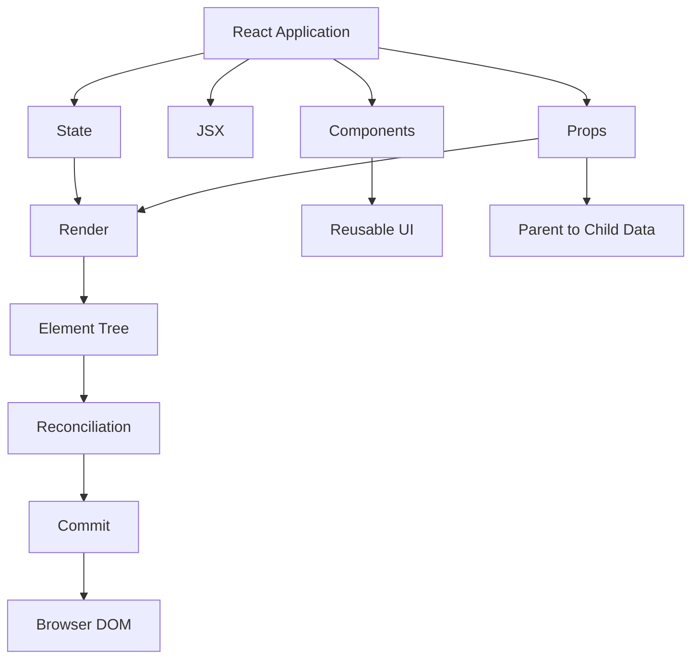

# Day 1 [Beginner]: Introduction to React

## Index

- [Goal](#goal)
- [Prerequisites](#prerequisites)
- [Why React](#why-react)
- [React Mental Model](#react-mental-model)
- [Topic by Topic](#topic-by-topic)
- [Key Concepts](#key-concepts)
- [Visual Concept Map](#visual-concept-map)
- [End-to-End Practical](#end-to-end-practical)
- [Hands-on Coding](#hands-on-coding)
- [Common Mistakes](#common-mistakes)
- [Mini Exercise](#mini-exercise)
- [Assessment Quiz](#assessment-quiz)
- [Task](#task)
- [Self Check](#self-check)
- [Interview Questions and Answers](#interview-questions-and-answers)
- [Day 1 Outcome](#day-1-outcome)

## Goal

By the end of this lesson, you should be able to explain what React is, why it is used, how components and JSX work, how props and state differ, what declarative UI and one-way data flow mean, and how a React render leads to a browser update.

## Prerequisites

- Basic JavaScript: variables, functions, arrays, objects, arrow functions, and `.map()`
- Basic HTML and CSS
- Basic computer usage: files, folders, terminal
- Node.js LTS installed
- VS Code or another code editor

Verify your environment:

```bash
node -v
npm -v
```

> React itself does not require VS Code or a particular editor. These tools are recommended for the course workflow.

## Why React

Modern applications contain many independent pieces of UI: navigation, forms, tables, cards, dialogs, notifications, and data-driven views. React provides a component model that lets developers describe these pieces as reusable JavaScript functions and compose them into screens.

React is a **JavaScript library for building user interfaces**. It is not the complete application platform by itself. Applications commonly add other tools for routing, data fetching, testing, forms, and other concerns.

React was originally created at Facebook and open-sourced in 2013. It became popular because its component model and declarative approach made complex, frequently changing interfaces easier to reason about and maintain.

## React Mental Model

Keep this mental model throughout the course:

```text
Data changes
    ↓
React renders the component again
    ↓
React creates a new element tree
    ↓
React reconciles the new tree with the previous tree
    ↓
React commits the necessary DOM changes
    ↓
Browser displays the updated UI
```

The important idea is **not** that React blindly rewrites the entire page. React determines what work is required and commits the resulting DOM changes. The reconciliation process is an implementation detail that helps React manage UI updates efficiently.

## Topic by Topic

### Topic 1: What is React?

**Theory**

React is a JavaScript library for building user interfaces. A React application is composed of components that describe what should appear on the screen.

**Example**

```jsx
function App() {
  return <h1>Hello React</h1>;
}

export default App;
```

**Explanation**

`App` is a function component. Calling the component as part of React's rendering process produces a React element tree. JSX provides a readable syntax for describing that UI. `export default` allows another module to import `App`.

**Key points**

- React is primarily focused on the UI layer.
- Components are the main building blocks.
- JSX is a syntax used to describe UI.
- A component does not have to contain state; many components are purely presentational.

---

### Topic 2: Who developed React and why?

**Theory**

React was created at Facebook and open-sourced in 2013. It was designed to make complex, interactive user interfaces easier to build and maintain.

**Practical thinking**

Imagine a social feed containing posts, reactions, comments, notifications, and profile controls. Each part can change independently. A component-based model allows those pieces to be developed and composed separately.

**Key points**

- React originated at Facebook, now Meta.
- React was open-sourced in 2013.
- Its component and declarative model are central to its design.

---

### Topic 3: React vs Angular at a high level

React and Angular solve overlapping UI problems but provide different levels of built-in structure.

| Area | React | Angular |
|---|---|---|
| Core positioning | UI library | Full application framework |
| UI syntax | JSX | Angular templates |
| Components | Function components are common | Components with Angular decorators/metadata |
| Routing | Commonly added through the ecosystem | Built-in Angular Router |
| Dependency injection | Not a core React pattern | Built into Angular |
| State/data patterns | Many ecosystem choices | Signals, RxJS, services, and other Angular patterns |
| Flexibility | High | More opinionated |
| Learning model | JavaScript + React concepts + ecosystem | Angular framework + TypeScript + Angular APIs |

Neither is universally better. The appropriate choice depends on the product, team, ecosystem, and architectural requirements.

---

### Topic 4: DOM and React's reconciliation model

**Theory**

The **DOM (Document Object Model)** is the browser's object representation of an HTML document. JavaScript can interact with it to read and change the page.

React does not simply manipulate the DOM manually for every UI operation. Instead, React renders a description of the UI, compares the new result with the previous result during reconciliation, and commits the required DOM changes.

You may hear this described as React's **Virtual DOM** approach. Treat the Virtual DOM as an implementation concept rather than a claim that React is automatically faster than every other UI technology.

**Example**

```jsx
import { useState } from "react";

function App() {
  const [count, setCount] = useState(0);

  return (
    <div>
      <p>Count: {count}</p>
      <button onClick={() => setCount((current) => current + 1)}>
        Increase
      </button>
    </div>
  );
}

export default App;
```

**What happens when the button is clicked?**

1. The click event runs the state setter.
2. React schedules an update.
3. `App` renders again with the new state value.
4. React reconciles the new element tree with the previous one.
5. React commits the necessary DOM update.
6. The browser displays the new count.

> Important: a component re-render does not mean that every DOM node is recreated. Rendering and DOM mutation are different steps.

---

### Topic 5: Why React is used

React is commonly used for dashboards, ecommerce applications, administration portals, social interfaces, content applications, and many other interactive UIs.

**Example: rendering data**

```jsx
const appBenefits = [
  "Reusable components",
  "Declarative UI",
  "Large ecosystem",
];

function App() {
  return (
    <ul>
      {appBenefits.map((item) => (
        <li key={item}>{item}</li>
      ))}
    </ul>
  );
}

export default App;
```

**Explanation**

`.map()` transforms each array item into a JSX element. The `key` gives React a stable identity for each list item.

A key should be **unique among siblings and stable across renders**. Using an array index can be acceptable for a static list, but it can cause incorrect identity behavior when items are inserted, removed, or reordered.

---

### Topic 6: Component-based structure

Components allow a large UI to be divided into smaller units with clear responsibilities.

```jsx
function Header() {
  return <header>My App Header</header>;
}

function Footer() {
  return <footer>My App Footer</footer>;
}

function App() {
  return (
    <div>
      <Header />
      <main>Application content</main>
      <Footer />
    </div>
  );
}

export default App;
```

This is **composition**: smaller components are combined to create a larger UI.

**Key points**

- Components should have clear responsibilities.
- Components can be reused in different parts of an application.
- Component names conventionally start with an uppercase letter.
- Not every component needs its own state.

---

### Topic 7: JSX

JSX is a JavaScript syntax extension that lets you write markup-like expressions inside JavaScript. It is transformed by the build tool into JavaScript calls that React can use.

```jsx
function App() {
  const title = "Day 1 JSX Practice";

  return (
    <div>
      <h1>{title}</h1>
      <p>JSX lets us describe UI close to the JavaScript logic.</p>
    </div>
  );
}

export default App;
```

**Important JSX rules**

- Return one root element, or use a Fragment (`<>...</>`).
- Use `{}` for JavaScript expressions.
- Use `className` instead of HTML's `class` attribute.
- Close JSX elements properly.
- JSX is not HTML; it follows JavaScript and React's syntax rules.

---

### Topic 8: Props

Props are read-only inputs supplied to a component by its parent.

```jsx
function Welcome({ name }) {
  return <h3>Welcome, {name}</h3>;
}

function App() {
  return (
    <div>
      <Welcome name="Asha" />
      <Welcome name="Ravi" />
    </div>
  );
}

export default App;
```

**Mental model**

```text
Parent
  │
  │ props
  ▼
Child
```

The child can read its props but should not mutate the props object to change the parent's data. If a child needs to request a change, the parent can pass a callback function as a prop.

**Example**

```jsx
function Child({ onSelect }) {
  return <button onClick={() => onSelect("React")}>Select React</button>;
}

function App() {
  function handleSelect(value) {
    console.log(value);
  }

  return <Child onSelect={handleSelect} />;
}
```

This pattern becomes important later when learning state lifting and parent-child communication.

---

### Topic 9: State

State represents data that belongs to a component's current UI state and can change over time.

```jsx
import { useState } from "react";

function App() {
  const [count, setCount] = useState(0);

  return (
    <div>
      <p>Count: {count}</p>
      <button onClick={() => setCount((current) => current + 1)}>
        Increase
      </button>
    </div>
  );
}

export default App;
```

**What `useState` gives you**

```text
[count, setCount]
   │       │
   │       └── function used to request a state update
   └────────── current state value
```

When state changes, React schedules a new render so the UI can reflect the new state.

**Important**

Do not directly mutate state objects or arrays. Use the state setter with a new value instead. Detailed immutable update patterns will be covered later.

---

### Topic 10: Declarative UI and conditional rendering

In an imperative approach, you tell the browser **how** to change the DOM step by step. In a declarative approach, you describe **what the UI should look like for the current state**, and React manages the update process.

```jsx
import { useState } from "react";

function App() {
  const [isLoggedIn, setIsLoggedIn] = useState(false);

  return (
    <div>
      <p>Status: {isLoggedIn ? "Logged In" : "Logged Out"}</p>
      <button onClick={() => setIsLoggedIn((current) => !current)}>
        {isLoggedIn ? "Logout" : "Login"}
      </button>
    </div>
  );
}

export default App;
```

The ternary operator provides **conditional rendering**. Conditional rendering is one practical example of React's declarative programming model.

---

### Topic 11: Render cycle and one-way data flow

React commonly follows a one-way data flow model: data is owned by a component and passed down to children through props.

```jsx
import { useState } from "react";

function Message({ text }) {
  return <p>{text}</p>;
}

function App() {
  const [text, setText] = useState("Hello");

  return (
    <div>
      <Message text={text} />
      <Message text={text} />
      <button onClick={() => setText("Updated")}>Update</button>
    </div>
  );
}

export default App;
```

**Flow**

```text
App owns state
    ↓
App passes text as props
    ↓
Message receives text
    ↓
User clicks Update
    ↓
setText requests a state update
    ↓
App renders again
    ↓
Children receive the new prop
```

A re-render means React runs the relevant component rendering logic again. It does **not** automatically mean that every DOM node changes.

## Key Concepts

- **React:** JavaScript library for building user interfaces.
- **Component:** Reusable unit that describes part of a UI.
- **JSX:** JavaScript syntax extension used to describe UI.
- **Props:** Read-only inputs passed to a component.
- **State:** Component data that can change over time.
- **Render:** React evaluates component logic to produce the current UI description.
- **Reconciliation:** React determines how the new element tree differs from the previous one.
- **Commit:** React applies the required changes to the host environment, such as the browser DOM.
- **Declarative UI:** Describe the desired UI for the current state instead of manually performing DOM operations.
- **One-way data flow:** Data commonly moves from parent to child through props.

## Visual Concept Map



## End-to-End Practical

Build a small React application that demonstrates the Day 1 mental model.

### Step 1: Create the application

```bash
npm create vite@latest day-1-react -- --template react
cd day-1-react
npm install
npm run dev
```

### Step 2: Create a reusable component

Create `src/InfoCard.jsx`:

```jsx
function InfoCard({ title, description }) {
  return (
    <article>
      <h2>{title}</h2>
      <p>{description}</p>
    </article>
  );
}

export default InfoCard;
```

### Step 3: Use props and state

Replace `src/App.jsx` with:

```jsx
import { useState } from "react";
import InfoCard from "./InfoCard";

function App() {
  const [count, setCount] = useState(0);

  return (
    <main>
      <h1>React Day 1</h1>
      <p>Learning components, JSX, props, and state.</p>

      <InfoCard
        title="Components"
        description="Reusable building blocks for UI."
      />
      <InfoCard
        title="Props"
        description="Read-only inputs passed from parent to child."
      />
      <InfoCard
        title="State"
        description="Changing data that can cause a new render."
      />

      <section>
        <p>Count: {count}</p>
        <button onClick={() => setCount((current) => current + 1)}>
          Increase
        </button>
      </section>
    </main>
  );
}

export default App;
```

### Step 4: Verify the behavior

- The page displays three reusable cards.
- Each card receives different props.
- Clicking **Increase** changes the state.
- The displayed count updates.
- The browser does not require manual DOM manipulation from your component code.

### Step 5: Extend the application

Add a `learnerName` state and pass it to a new `Welcome` component. Then add a button that changes the learner name.

## Hands-on Coding

### Challenge 1: Profile Card

Create a reusable `ProfileCard` component that accepts:

- `name`
- `role`
- `experience`

Render at least three profiles from the parent.

### Challenge 2: Counter

Add:

- Increase
- Decrease
- Reset

Use functional state updates such as:

```jsx
setCount((current) => current + 1);
```

### Challenge 3: Login status

Create a boolean state called `isLoggedIn` and conditionally display Login or Logout.

### Challenge 4: Parent-child communication

Pass an `onSelect` callback from the parent to a child button. When the child is clicked, the parent should update a message.

## Common Mistakes

### Mistake 1: Mutating state directly

Avoid:

```jsx
count = count + 1;
```

Use the setter:

```jsx
setCount((current) => current + 1);
```

### Mistake 2: Calling a handler while rendering

Avoid:

```jsx
<button onClick={setCount(count + 1)}>Increase</button>
```

This calls the setter during rendering.

Use:

```jsx
<button onClick={() => setCount((current) => current + 1)}>
  Increase
</button>
```

### Mistake 3: Unstable list keys

Avoid generating random keys during every render. Prefer a stable identifier from the data.

### Mistake 4: Thinking every re-render changes the entire DOM

A component can render again while React determines that only a small part of the DOM needs to change.

### Mistake 5: Treating props as writable component state

Props are inputs from the parent. If the component needs independent changing data, use state or another appropriate state pattern.

## Mini Exercise

1. Create a `Greeting` component that receives `name` as a prop.
2. Render it three times with different names.
3. Add a counter using `useState`.
4. Add a Reset button.
5. Render a list of three technologies with stable keys.
6. Add a boolean state and conditionally render a message.

**Expected learning:** You should be able to combine JSX, components, props, state, events, lists, and conditional rendering without copying the same UI structure repeatedly.

## Assessment Quiz

### Q1. What is React?

A. A database
B. A JavaScript library for building user interfaces
C. A CSS preprocessor
D. A backend runtime

**Answer:** B

### Q2. What is a component?

A. A reusable unit of UI logic and presentation
B. A database table
C. A CSS selector
D. A browser extension

**Answer:** A

### Q3. What are props?

A. Read-only inputs passed to a component
B. Global variables automatically shared everywhere
C. CSS properties
D. Database records

**Answer:** A

### Q4. What normally happens after a state update?

A. React schedules a new render
B. The browser is restarted
C. The entire HTML file is downloaded again
D. The component is permanently destroyed

**Answer:** A

### Q5. Why are keys used when rendering lists?

A. To style elements
B. To give list items stable identity among siblings
C. To create CSS classes
D. To store component state

**Answer:** B

### Q6. What is declarative UI?

A. Manually changing every DOM node
B. Describing what the UI should look like for the current state
C. Avoiding JavaScript
D. Writing only CSS

**Answer:** B

### Q7. Where does data commonly flow in React?

A. Child to every component automatically
B. Parent to child through props
C. Database directly to DOM
D. Browser to parent without events

**Answer:** B

## Task

Build a **React Profile Dashboard** containing:

- Header component
- Profile card component
- Technology list
- Login/logout status
- Counter
- Reset button
- At least one parent-to-child prop
- At least one child-to-parent callback

### Acceptance criteria

- [ ] Application runs with Vite.
- [ ] UI is split into reusable components.
- [ ] Props are used for reusable data.
- [ ] State is updated only through setters.
- [ ] List items use stable keys.
- [ ] Conditional rendering is used.
- [ ] Child-to-parent communication is demonstrated through a callback prop.
- [ ] No manual DOM manipulation is required for the UI behavior.

## Self Check

Before moving to Day 2, you should be able to answer these without looking at the lesson:

- What problem does React solve?
- What is a component?
- What is JSX?
- What is the difference between props and state?
- Why should state be updated through a setter?
- What does a key do in a list?
- What does declarative UI mean?
- What does one-way data flow mean?
- What happens at a high level after a state update?
- Why does a re-render not necessarily mean the entire DOM is replaced?

If any answer is unclear, repeat the relevant section and rebuild the hands-on example.

## Interview Questions and Answers

### 1. Is React a framework or a library?

React is generally described as a JavaScript library focused on building user interfaces. A production application commonly combines React with additional libraries or framework tooling for routing, data fetching, testing, and other concerns.

### 2. What is JSX?

JSX is a JavaScript syntax extension that allows developers to write markup-like expressions alongside JavaScript logic. Build tooling transforms JSX into JavaScript that React can use.

### 3. What is the difference between props and state?

Props are inputs supplied by a parent and should be treated as read-only by the receiving component. State is data managed by a component or another state mechanism and can change over time.

### 4. What happens when state changes?

The state setter schedules an update. React renders the relevant component tree again, reconciles the resulting element tree, and commits the necessary UI changes.

### 5. What is reconciliation?

Reconciliation is the process React uses to compare the newly rendered element tree with the previous one and determine what changes are needed before committing updates.

### 6. Why are keys important in React lists?

Keys provide stable identity for sibling elements across renders. They help React correctly understand which items were added, removed, or moved.

### 7. What does one-way data flow mean?

Data commonly flows from parent components to child components through props. A child can request a parent update by invoking a callback supplied by the parent.

### 8. Does every component need state?

No. Many components are pure or presentational components that receive props and return UI without owning changing state.

### 9. Does a React re-render mean the whole DOM is recreated?

No. Rendering and DOM updates are separate concepts. React can render component logic again and then determine which host environment changes are actually necessary.

### 10. Why shouldn't state be mutated directly?

React state should be updated through the state setter or the appropriate state-management API. Direct mutation can make updates unpredictable and prevents React from reliably tracking the intended state transition.

## Day 1 Outcome

After completing this lesson, you should have a working mental model of React and be able to build a small interactive application using:

```text
React
 ├── Components
 ├── JSX
 ├── Props
 ├── State
 ├── Events
 ├── Conditional Rendering
 ├── Lists + Keys
 ├── Declarative UI
 └── One-way Data Flow
```

The next lessons will go deeper into project structure, JSX, components, props, state, and the other concepts introduced here.
