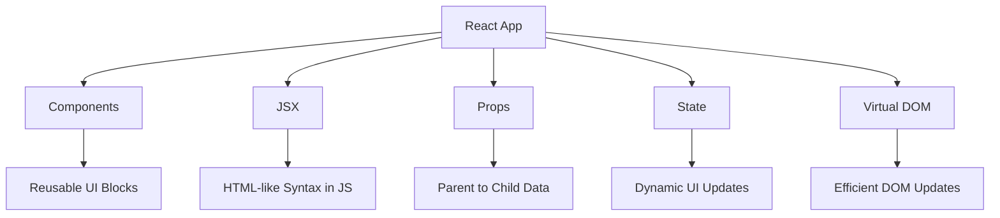

# Day 1 [Beginner]: Introduction to React

## Index

- [Goal](#goal)
- [Prerequisites](#prerequisites)
- [Explanation](#explanation)
- [Topic by Topic](#topic-by-topic)
- [Key Concepts](#key-concepts)
- [Visual Concept Map](#visual-concept-map)
- [End-to-End Practical](#end-to-end-practical)
- [Hands-on Coding](#hands-on-coding)
- [Mini Exercise](#mini-exercise)
- [Assessment Quiz](#assessment-quiz)
- [Task](#task)
- [Self Check](#self-check)
- [Interview Questions and Answers](#interview-questions-and-answers)
- [Day 1 Outcome](#day-1-outcome)

## Goal

Understand what React is, why developers use it, and how it helps build modern user interfaces in a practical way.

## Prerequisites

- Basic computer usage (files, folders, terminal)
- Basic JavaScript understanding (variables, functions)
- Node.js installed (recommended: LTS version)
- VS Code installed

Verification commands:

```bash
node -v
npm -v
```

## Explanation

React is a JavaScript library used to build user interfaces. It helps you split a UI into small reusable pieces called components. Instead of writing one large page at once, you build small parts and combine them.

React was created at Facebook, now called Meta, to solve the problem of building fast, interactive screens that change often. One reason React became popular is that it updates the browser efficiently by comparing UI changes before touching the real DOM.

React is useful because it:

- Keeps UI code organized
- Makes reusing code easier
- Updates the screen efficiently when data changes
- Works well for apps that grow over time
- Gives teams flexibility because React is a UI library, not a full opinionated framework

## Topic by Topic

### Topic 1: What is React?

Theory:
React is a JavaScript library focused on building user interfaces. It helps developers create screen elements as reusable building blocks.

Practical:
Open any React project and identify UI blocks like header, sidebar, card, and button. Think of each block as a component.

Code Example:

```jsx
function App() {
  return <h1>Hello React</h1>;
}

export default App;
```

**Explanation:** This is the simplest React component. `function App()` is a JavaScript function that returns JSX (HTML-like syntax). React will render this `<h1>` in the browser. The `export default` statement makes the component importable in other files.

**Key Points:**

- React components are functions that return JSX
- JSX looks like HTML but runs inside JavaScript
- `export default` makes components available to other files

### Topic 2: Who developed React and why

Theory:
React was first developed by Facebook, now Meta. It was created to make complex, changing user interfaces easier to build and maintain.

Practical:
Think about apps like social feeds, dashboards, chat screens, and ecommerce pages. These screens update often, so manually changing the DOM becomes hard to manage.

Code Example:

```jsx
function App() {
  const creator = "Meta";
  const reason = "Build fast, interactive UI with reusable components";

  return (
    <section>
      <h2>React was developed by {creator}</h2>
      <p>{reason}</p>
    </section>
  );
}
```

**Explanation:** React became popular because teams needed a simpler way to manage screens with many small changing parts. Instead of manually updating the page again and again, developers describe the UI and let React handle updates.

**Key Points:**

- React was developed at Facebook, now Meta
- It was created to handle dynamic, frequently changing interfaces
- Reusable components reduce repeated UI code

### Topic 3: React vs Angular at a high level

Theory:
React is mainly a UI library. Angular is a full framework with more built-in rules and tools.

Practical:
Compare how much setup and decision-making each option gives a team.

Code Example:

```text
React:
- Mainly solves UI rendering
- More flexible tooling choices
- Smaller starting surface for beginners

Angular:
- Full framework
- More built-in features out of the box
- Stronger conventions and structure
```

**Explanation:** React gives more freedom in how you choose routing, state management, and data fetching tools. Angular gives more built-in structure from the beginning. Neither is universally better. React is often chosen when teams want flexibility and a component-driven UI approach.

**Key Points:**

- React is a library focused on UI
- Angular is a full framework with more built-in features
- React usually gives more flexibility in tooling choices

### Topic 4: DOM and Virtual DOM basics

Theory:
The DOM is the browser's page structure. React works with a virtual representation first, then updates the real DOM efficiently.

Practical:
Open browser DevTools and inspect how changing state updates only the needed part of the page.

Code Example:

```jsx
import { useState } from "react";

function App() {
  const [count, setCount] = useState(0);

  return (
    <div>
      <p>Count: {count}</p>
      <button onClick={() => setCount(count + 1)}>Increase</button>
    </div>
  );
}
```

**Explanation:** When `count` changes, React creates a new virtual UI description, compares it with the previous one, and updates only the changed part in the real DOM. This is one reason React apps feel efficient.

**Key Points:**

- DOM means the real page structure inside the browser
- React compares UI changes before touching the real DOM
- Virtual DOM helps React update only what changed

### Topic 5: Why React is used

Theory:
React is widely used because it is component-based, scalable, and efficient for dynamic UIs.

Practical:
List three common applications where UI changes often, such as dashboards, ecommerce pages, and form-heavy portals.

Code Example:

```jsx
const appBenefits = ["Reusable", "Maintainable", "Fast updates"];

function App() {
  return (
    <ul>
      {appBenefits.map((item) => (
        <li key={item}>{item}</li>
      ))}
    </ul>
  );
}
```

**Explanation:** This example shows how to render a list from an array. The `.map()` function loops through each `appBenefits` item and returns a `<li>` element. The `key={item}` helps React track which list items changed. The curly braces `{}` allow JavaScript expressions inside JSX.

**Key Points:**

- Use `.map()` to convert arrays into JSX elements
- Always provide unique `key` prop for list items
- Curly braces `{}` embed JavaScript inside JSX

### Topic 6: Component-based structure

Theory:
Components break large UIs into smaller, manageable units. Each component should do one clear job.

Practical:
Split a simple page into components: Header, Hero, Features, Footer.

Code Example:

```jsx
function Header() {
  return <h2>My App Header</h2>;
}

function Footer() {
  return <p>My App Footer</p>;
}

function App() {
  return (
    <div>
      <Header />
      <Footer />
    </div>
  );
}
```

**Explanation:** This shows **composition** - combining smaller components into a larger UI. `Header` and `Footer` are reusable building blocks. `App` imports and uses them like custom HTML tags (`<Header />`, `<Footer />`). This pattern makes code easier to maintain because each component has one clear job.

**Key Points:**

- Break UI into small, single-purpose components
- Reuse components by combining them together
- Component names must start with capital letters

### Topic 7: JSX

Theory:
JSX lets you write HTML-like syntax inside JavaScript. It improves readability when creating UI.

Practical:
Create a title and paragraph with one dynamic value from a variable.

Code Example:

```jsx
function App() {
  const title = "Day 1 JSX Practice";

  return (
    <div>
      <h1>{title}</h1>
      <p>JSX makes component UI easier to read.</p>
    </div>
  );
}
```

**Explanation:** JSX mixes HTML and JavaScript seamlessly. Variables are inserted using curly braces `{}`. Here, `{title}` displays the value stored in the `title` variable. This makes templates dynamic without leaving JavaScript.

**Key Points:**

- Use curly braces `{}` to embed JavaScript expressions in JSX
- Variables display their values inside curly braces
- JSX syntax is cleaner than string concatenation

### Topic 8: Props

Theory:
Props are inputs passed from parent component to child component. Props make components reusable.

Practical:
Create a child component and pass different names from parent.

Code Example:

```jsx
function Welcome({ name }) {
  return <h3>Welcome, {name}</h3>;
}

function App() {
  return (
    <div>
      <Welcome name="Asha" />
      <Welcome name="Ravi" />
    </div>
  );
}
```

**Explanation:** **Props** are how you pass data into components. `Welcome` receives a `name` prop and displays it. By passing different `name` values (`"Asha"` and `"Ravi"`), the same component produces different outputs. This makes components reusable.

**Key Points:**

- Props are function parameters for components
- Pass different props to show different content
- Props make components flexible and reusable

### Topic 9: State

Theory:
State stores changing data inside a component. When state updates, UI re-renders.

Practical:
Build a small counter with Increase button.

Code Example:

```jsx
import { useState } from "react";

function App() {
  const [count, setCount] = useState(0);

  return (
    <div>
      <p>Count: {count}</p>
      <button onClick={() => setCount(count + 1)}>Increase</button>
    </div>
  );
}
```

**Explanation:** **State** stores data that can change inside a component. `useState(0)` creates a state variable `count` starting at 0, and `setCount` is the function to change it. When the button is clicked, `setCount(count + 1)` adds 1 to count, which triggers a re-render and updates the displayed value.

**Key Points:**

- `useState` creates state variable and setter function
- State changes trigger component re-renders
- Use setter function to update state, never mutate directly

### Topic 10: Declarative UI

Theory:
In React, you describe UI for each state, and React handles DOM updates.

Practical:
Show Login button when user is logged out, and Logout when logged in.

Code Example:

```jsx
import { useState } from "react";

function App() {
  const [isLoggedIn, setIsLoggedIn] = useState(false);

  return (
    <div>
      <p>Status: {isLoggedIn ? "Logged In" : "Logged Out"}</p>
      <button onClick={() => setIsLoggedIn(!isLoggedIn)}>
        {isLoggedIn ? "Logout" : "Login"}
      </button>
    </div>
  );
}
```

**Explanation:** This shows **conditional rendering** - UI changes based on state. The ternary operator `?` checks if `isLoggedIn` is true. If yes, show one thing; if no, show another. The `!` operator toggles the boolean (true ↔ false). This pattern is fundamental for interactive UIs.

**Key Points:**

- Use ternary operator `condition ? trueValue : falseValue` for conditional rendering
- Boolean state (`true`/`false`) works well for toggles
- UI text and display can change based on state

### Topic 11: Render Cycle and One-way Data Flow

Theory:
React re-renders UI when props or state change. Data usually flows from parent to child in one direction, which keeps behavior easier to reason about.

Practical:
Think of a parent component that stores a value and passes it into two children. Both children update when parent state changes.

Code Example:

```jsx
function Message({ text }) {
  return <p>{text}</p>;
}

function App() {
  const [text, setText] = useState("Hello");

  return (
    <div>
      <Message text={text} />
      <Message text={text} />
      <button onClick={() => setText("Updated")}>Update</button>
    </div>
  );
}
```

**Explanation:** This demonstrates **one-way data flow**. The parent (`App`) owns the state and passes it as props to children (`Message`). Both `Message` components show the same value. When the button clicks and updates state, both children re-render with the new value. This makes data flow predictable and easier to debug.

**Key Points:**

- Parent stores state, child receives it as props
- Data flows down from parent to child (one-way)
- Multiple children can receive the same prop
- Changes in parent state automatically update all children

## Key Concepts

- Component: A small reusable piece of UI
- DOM: The real browser page structure
- Virtual DOM: React's in-memory UI representation used to plan efficient updates
- JSX: A syntax that lets you write HTML-like code in JavaScript
- Props: Data passed from one component to another
- State: Data that can change inside a component
- Declarative UI: You describe what the UI should look like, and React updates it for you
- One-way data flow: Parent components pass data down to children
- Re-render: React runs component logic again when state or props change

## Visual Concept Map



## End-to-End Practical

1. Install Node.js so you can run JavaScript tools locally.
2. Install VS Code as your code editor.
3. Create a React project using Vite.
4. Start the development server.
5. Open the app in the browser and edit a file to see live reload.
6. Replace the default App component with the Day 1 Hands-on Coding example.
7. Add one child component that receives a prop from parent state.
8. Verify that title, props-based cards, and state button all work.

### Example Commands

```bash
npm create vite@latest my-react-app
cd my-react-app
npm install
npm run dev
```

## Hands-on Coding

Use this full Day 1 sample to combine component, JSX, props, and state in one screen.

```jsx
import { useState } from "react";

function InfoCard({ title, description }) {
  return (
    <div
      style={{
        border: "1px solid #ddd",
        borderRadius: "8px",
        padding: "12px",
        marginTop: "10px",
      }}
    >
      <h3>{title}</h3>
      <p>{description}</p>
    </div>
  );
}

function App() {
  const topic = "React Day 1";
  const learner = "Frontend Developer";
  const [count, setCount] = useState(0);

  return (
    <div
      style={{ padding: "24px", fontFamily: "sans-serif", maxWidth: "720px" }}
    >
      <h1>Welcome to {topic}</h1>
      <p>Today you are learning as a {learner}.</p>

      <InfoCard
        title="Component"
        description="A component is a reusable part of the UI."
      />
      <InfoCard
        title="JSX"
        description="JSX lets you write readable UI inside JavaScript."
      />

      <div style={{ marginTop: "16px" }}>
        <p>State Demo Count: {count}</p>
        <button onClick={() => setCount(count + 1)}>Increase Count</button>
      </div>
    </div>
  );
}

export default App;
```

## Mini Exercise

Create a small learner profile page using Day 1 concepts.

Scenario:
Build a React screen that shows learner details and a practice counter.

Steps:

1. Create a component named LearnerCard with props: name and role.
2. Render LearnerCard two times with different values.
3. Add one local state value count and an Increase button.
4. Show login status text using a boolean state and toggle button.

Expected output:

- Two learner cards rendered from reusable component.
- One counter that updates on button click.
- One Login/Logout toggle using conditional UI.

## Assessment Quiz

### Quiz Questions

1. What is the main purpose of JSX in React?
2. Which concept is used to pass data from parent to child?
3. Why does the UI update when state changes?
4. True or False: Components should be reused whenever possible.
5. Which is better React style: manual DOM updates or declarative UI?

### Quiz Answers

1. JSX makes UI code readable by allowing HTML-like syntax in JavaScript.
2. Props
3. React re-renders the component after state updates.
4. True
5. Declarative UI

## Task

- Install Node.js and verify it with node -v
- Install VS Code
- Create a new React app with Vite
- Run the app in the browser
- Replace App with the Hands-on Coding example
- Change the heading text and verify live reload
- Add one more InfoCard with your own description
- Complete the Mini Exercise with LearnerCard, counter, and login toggle
- Attempt the Assessment Quiz before checking the answers

## Self Check

- The project starts without errors
- The browser shows the React app
- A file edit updates the UI automatically
- The counter button updates state on click
- You can explain where component, JSX, props, and state are used
- You can build one small screen using all Day 1 concepts
- You can answer at least 4 out of 5 quiz questions correctly

## Interview Questions and Answers

### Beginner

**Question:** What is React?

**Answer:** React is a JavaScript library for building user interfaces. It helps developers create reusable UI components and update the screen efficiently.

**Question:** What is a component in React?

**Answer:** A component is a reusable function that returns UI. You can combine many components to build a complete page.

### Middle

**Question:** Why do developers prefer React for building frontend apps?

**Answer:** Developers prefer React because it encourages reusable components, makes UI code easier to maintain, and handles updates to the screen efficiently when data changes.

**Question:** What is the role of props in reusable components?

**Answer:** Props let parent components pass values to child components, which makes one component reusable with different content.

### Advanced

**Question:** What does React mean by a component-based and declarative approach?

**Answer:** Component-based means the UI is split into small independent pieces that can be reused. Declarative means you describe the desired UI state, and React takes care of updating the DOM to match that state instead of manually changing elements step by step.

**Question:** How does state change trigger UI updates in React?

**Answer:** When you update state with its setter function, React schedules a re-render and computes the next UI output. React then updates only the parts of the DOM that changed.

## Day 1 Outcome

- You know what React is and why it is used
- You understand the basic terms you will see again in later lessons
- You can create and run a React project locally
- You are ready to move to Day 2
