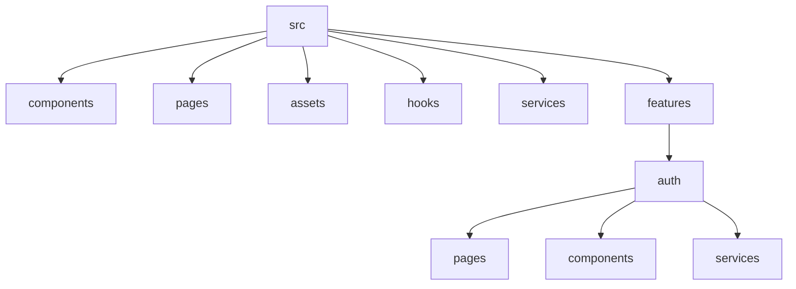

# Day 2 [Beginner]: Environment and Project Structure

## Index

- [Goal](#goal)
- [Prerequisites](#prerequisites)
- [Explanation](#explanation)
- [Topic by Topic](#topic-by-topic)
- [Key Concepts](#key-concepts)
- [Visual Concept Map](#visual-concept-map)
- [End-to-End Practical](#end-to-end-practical)
- [Hands-on Coding](#hands-on-coding)
- [Mini Exercise](#mini-exercise)
- [Assessment Quiz](#assessment-quiz)
- [Task](#task)
- [Self Check](#self-check)
- [Interview Questions and Answers](#interview-questions-and-answers)
- [Day 2 Outcome](#day-2-outcome)

## Goal

Learn how to set up a clean React project structure and understand the purpose of the main folders and files.

## Prerequisites

- Day 1 concepts completed
- React app already created using Vite
- VS Code and terminal access

Verification commands:

```bash
node -v
npm -v
```

## Explanation

A good project structure makes a React app easier to read, update, and maintain. When files are organized from the beginning, it becomes easier to find components, pages, styles, services, and shared logic later.

## Topic by Topic

### Topic 1: Why Structure Matters

Theory:
A clean structure avoids confusion when the codebase grows. It also improves team collaboration because everyone follows the same folder rules.

Practical:
Open your current project and list which files feel mixed or unclear. Mark folders that should be created for better separation.

Code Example:

```text
Bad:
src/
	App.jsx
	Header.jsx
	Login.jsx
	dashboard.jsx
	api.js
	useAuth.js

Better:
src/
	components/
	pages/
	services/
	hooks/
```

**Explanation:** Structure matters because code becomes harder to navigate as the app grows. Clear folders reduce confusion and help teams work consistently.

**Key Points:**

- Good structure saves time later.
- Folder clarity improves collaboration.
- Messy structure creates maintenance pain.

### Topic 2: Main Folders and Their Purpose

Theory:
Each folder should have one responsibility. This keeps navigation simple and reduces accidental coupling.

Practical:
Create folders and move files to the correct place based on responsibility.

Code Example:

```text
src/
	components/   -> Reusable UI (Button, Card, Navbar)
	pages/        -> Screen-level views (Home, Login, Profile)
	assets/       -> Images, icons, fonts
	hooks/        -> Custom hooks (useAuth, useTheme)
	services/     -> API calls and business logic
```

**Explanation:** Each folder should have a clear purpose so developers know where new code belongs.

**Key Points:**

- One folder should have one main responsibility.
- Clear separation reduces accidental mixing of concerns.
- Consistent structure helps onboarding.

### Topic 3: Core Project Files

Theory:
Some files are entry files and should stay minimal. Entry files should bootstrap the app, not contain large logic.

Practical:
Keep App.jsx focused on layout and import components from dedicated folders.

Code Example:

Code Example:

```jsx
import React from "react";
import ReactDOM from "react-dom/client";
import App from "./App";

ReactDOM.createRoot(document.getElementById("root")).render(
  <React.StrictMode>
    <App />
  </React.StrictMode>,
);
```

**Explanation:** `main.jsx` is the entry point that starts your React app. It imports `App` component and renders it into the HTML element with `id="root"`. This file typically doesn't change much after setup. `React.StrictMode` is a development tool that warns about potential problems.

**Key Points:**

- `main.jsx` is the entry point that bootstraps your React app
- `ReactDOM.createRoot()` connects React to the HTML DOM
- Keep entry files minimal - import main App and render it
- `React.StrictMode` helps catch development errors

### Topic 4: Remove Boilerplate Safely

Theory:
Starter templates include demo code that may not match your project. Removing unused code helps keep a clean foundation.

Practical:
Delete unused css/demo files and replace starter component with your own minimal layout.

Code Example:

Code Example:

```jsx
function App() {
  return (
    <main>
      <h1>React Learning Project</h1>
      <p>Day 2: Clean structure setup complete.</p>
    </main>
  );
}

export default App;
```

**Explanation:** After setup, `App.jsx` should be minimal and clean. It's the top-level component that orchestrates the entire app. Rather than putting all code here, import smaller components from organized folders. This keeps the main component readable and maintainable.

**Key Points:**

- Keep `App.jsx` as the top-level component that imports other components
- Don't put all logic and UI in App - organize into smaller pieces
- `App.jsx` should be readable at a glance
- Always `export default` so it can be imported in `main.jsx`

### Topic 5: Organizing by Feature

Theory:
Feature-based structure groups related files together, which scales better for medium and large apps.

Practical:
Create one sample feature folder, such as auth, and place its page, components, and service in that feature.

Code Example:

```text
src/
	features/
		auth/
			pages/LoginPage.jsx
			components/LoginForm.jsx
			services/authService.js
```

**Explanation:** Feature-based organization keeps related UI, logic, and services close together, which helps medium and large projects scale better.

**Key Points:**

- Group related files by feature when app grows.
- Keep feature internals close to each other.
- Improves maintainability for larger modules.

### Topic 6: Shared vs Feature-specific Code

Theory:
Not every file belongs in a feature folder. Shared UI and shared hooks should stay in a common place, while feature logic should stay close to the feature that owns it.

Practical:
Decide whether a Button belongs in `shared/components` or inside one feature based on reuse.

Code Example:

```text
src/
	features/
		profile/
	shared/
		components/
			Button.jsx
		hooks/
			useDebounce.js
```

**Explanation:** Shared code should stay in a common place, while feature-specific code should live near the feature that owns it.

**Key Points:**

- Put reusable code in shared folders.
- Keep feature-only logic inside the feature.
- Decide placement based on reuse, not guesswork.

## Key Concepts

- Folder structure: How files and folders are arranged in a project
- Boilerplate: Default code or files created automatically by a starter tool
- Components folder: Stores reusable UI parts
- Pages folder: Stores screen-level components
- Services folder: Stores API or logic-related code
- Feature folder: Groups files by business feature
- Shared code: Reusable code used by more than one feature
- Feature ownership: Keeping related files close to the feature that maintains them

## Visual Concept Map



## End-to-End Practical

1. Open the React project created with Vite.
2. Review the generated files and identify what each one does.
3. Remove files you do not need for the lesson.
4. Create folders for components, pages, assets, hooks, and services.
5. Move files into the right folders.
6. Replace App with a clean starter layout.
7. Run the project and ensure everything still works.

## Hands-on Coding

### Example 1: Basic Folder Setup Commands

Use these commands to create the structure quickly.

```bash
mkdir -p src/components src/pages src/assets src/hooks src/services
```

If your terminal does not support mkdir -p, create folders one by one:

```bash
mkdir src\components
mkdir src\pages
mkdir src\assets
mkdir src\hooks
mkdir src\services
```

### Example 2: Feature-Based Structure Example

Use this pattern when your app starts growing:

```text
src/
	features/
		products/
			components/ProductCard.jsx
			pages/ProductListPage.jsx
			services/productService.js
	shared/
		components/Button.jsx
		hooks/useDebounce.js
	App.jsx
	main.jsx
```

### Example 3: Clean App Starter Code

```jsx
import "./App.css";

function App() {
  return (
    <div style={{ padding: "24px", fontFamily: "sans-serif" }}>
      <h1>Project Structure Ready</h1>
      <p>Components, pages, hooks, and services are organized.</p>
    </div>
  );
}

export default App;
```

Sample clean structure:

```text
src/
	components/
	pages/
	assets/
	hooks/
	services/
	App.jsx
	main.jsx
```

## Mini Exercise

Use your current learning app and perform this real structure exercise.

Scenario:
You need to add a new feature called profile.

Steps:

1. Create a feature folder: src/features/profile
2. Inside it, create:
   - pages/ProfilePage.jsx
   - components/ProfileCard.jsx
   - services/profileService.js
3. Add a shared button in src/shared/components/Button.jsx
4. Import and render ProfilePage in App.jsx

Expected final structure:

```text
src/
	features/
		profile/
			pages/ProfilePage.jsx
			components/ProfileCard.jsx
			services/profileService.js
	shared/
		components/Button.jsx
	App.jsx
	main.jsx
```

## Assessment Quiz

### Quiz Questions

1. Which folder is best for reusable UI pieces like buttons and cards?
2. What is the key advantage of feature-based folders?
3. Why should App.jsx remain minimal in larger projects?
4. Where should API requests for the profile feature go?
5. True or False: Keeping all files in src root is good for scale.

### Quiz Answers

1. components folder
2. It groups related files together, improving scalability and ownership.
3. Minimal App.jsx improves readability and keeps responsibilities separated.
4. src/features/profile/services or src/services based on project style
5. False

6. When should code go to a shared folder instead of a feature folder?

### Quiz Answers

6. When it is truly reused across multiple features and is not owned by only one domain.

## Task

- Remove unnecessary boilerplate files
- Create folders named components, pages, assets, hooks, and services
- Move shared assets into the assets folder
- Keep feature-specific code in the right folder
- Add one sample feature folder (for example: auth or products)
- Update App.jsx to show that setup is complete
- Complete the Mini Exercise profile feature structure
- Attempt the Assessment Quiz without checking answers first

## Self Check

- The folder structure is clean and understandable
- You can explain what each folder is used for
- The project still runs after cleanup
- You can explain basic structure vs feature-based structure
- You can add a new screen without cluttering root src
- You can create a feature folder with page, component, and service
- You can answer at least 4 out of 5 quiz questions correctly

## Interview Questions and Answers

### Beginner

**Question:** Why do we need a project structure in React?

**Answer:** A project structure helps keep files organized, makes the project easier to maintain, and helps developers find code quickly.

**Question:** What should go inside a pages folder?

**Answer:** The pages folder stores screen-level components such as HomePage, LoginPage, and ProfilePage.

### Middle

**Question:** What is the purpose of a components folder?

**Answer:** The components folder stores reusable UI parts such as buttons, cards, headers, and form fields so they can be shared across the app.

**Question:** When should we create a services folder?

**Answer:** Create a services folder when API calls or business logic should be separated from UI components.

### Advanced

**Question:** Why is organizing by feature or responsibility better than keeping all files in one folder?

**Answer:** Organizing by feature or responsibility reduces clutter, improves scalability, and makes it easier for teams to understand ownership of code as the project grows.

**Question:** How does feature-based structure help large teams?

**Answer:** It improves ownership boundaries, reduces merge conflicts, and makes code navigation faster because each feature is contained in one place.

## Day 2 Outcome

- You understand why project structure matters
- You can explain the purpose of common React folders
- You can clean up boilerplate and organize the project properly
- You are ready for JSX in Day 3
