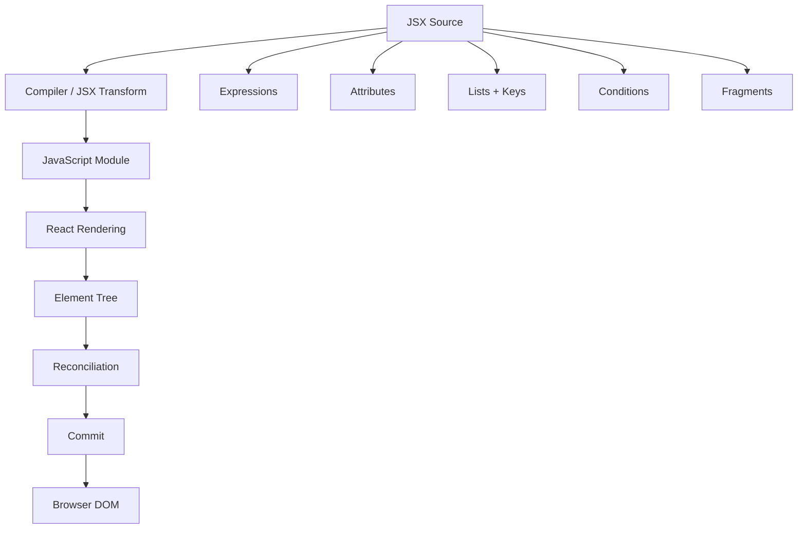

# Day 3 [Beginner]: JSX Fundamentals

## Index

- [Goal](#goal)
- [Prerequisites](#prerequisites)
- [What JSX Is](#what-jsx-is)
- [Topic by Topic](#topic-by-topic)
- [Key Concepts](#key-concepts)
- [Visual Concept Map](#visual-concept-map)
- [End-to-End Practical](#end-to-end-practical)
- [Hands-on Coding](#hands-on-coding)
- [Common Mistakes](#common-mistakes)
- [Mini Exercise](#mini-exercise)
- [Assessment Quiz](#assessment-quiz)
- [Task](#task)
- [Self Check](#self-check)
- [Interview Questions and Answers](#interview-questions-and-answers)
- [Day 3 Outcome](#day-3-outcome)

## Goal

By the end of this lesson, you should be able to write JSX confidently, embed JavaScript expressions, render arrays, use conditional rendering, choose between elements and fragments, understand JSX attributes, and explain at a high level how JSX is transformed before React renders the UI.

## Prerequisites

- Day 1 and Day 2 completed
- Basic JavaScript variables, objects, arrays, functions, and `.map()`
- A React application running with Vite

## What JSX Is

JSX is a JavaScript syntax extension commonly used to describe React UI. It looks similar to HTML, but it is not HTML and it is not a string.

For example:

```jsx
function App() {
  const name = "Karan";

  return <h1>Hello, {name}</h1>;
}
```

The JSX is transformed by the project's compiler/build tooling into JavaScript that React can use. Modern React projects commonly use the **automatic JSX runtime**, so you should not assume every JSX file directly becomes an explicit `React.createElement(...)` call.

## Topic by Topic

### Topic 1: JSX Basics

JSX lets you describe nested UI in a readable way:

```jsx
function App() {
  return (
    <main>
      <h1>JSX Basics</h1>
      <p>This UI is described with JSX.</p>
    </main>
  );
}

export default App;
```

A component must return one JSX tree. That tree can contain many children. If there is no semantic wrapper you want in the DOM, use a Fragment.

### Topic 2: JavaScript Expressions with `{}`

Curly braces switch from JSX markup into a JavaScript **expression**:

```jsx
function App() {
  const learner = "Karan";
  const score = 95;

  return (
    <section>
      <h2>{learner}</h2>
      <p>Score: {score}</p>
      <p>{score >= 90 ? "Excellent" : "Keep practicing"}</p>
    </section>
  );
}
```

Expressions can include variables, property access, function calls, arithmetic, logical operators, and ternaries.

A JavaScript statement such as a standalone `if` cannot be placed directly inside JSX braces. Move that logic outside JSX or use an expression appropriate for rendering.

### Topic 3: JSX Attributes

JSX attributes use JavaScript-style names in many cases:

```jsx
function App() {
  const imageUrl = "/logo.png";

  return (
    
  );
}
```

Common examples:

| HTML | JSX |
|---|---|
| `class` | `className` |
| `for` | `htmlFor` |
| `onclick` | `onClick` |
| `tabindex` | `tabIndex` |

Some attributes remain lowercase or use their standard React/DOM naming. Check React documentation for less-common attributes instead of guessing.

### Topic 4: Rendering Lists

Use `.map()` when converting an array into JSX:

```jsx
const skills = [
  { id: 1, name: "JSX" },
  { id: 2, name: "Props" },
  { id: 3, name: "State" },
];

function App() {
  return (
    <ul>
      {skills.map((skill) => (
        <li key={skill.id}>{skill.name}</li>
      ))}
    </ul>
  );
}
```

### Why `key` matters

A key gives React stable identity for an item among its siblings. Prefer a stable identifier from the data:

```jsx
<li key={skill.id}>{skill.name}</li>
```

Using an array index is **not always forbidden**. It can be acceptable when the list is static and items never change order or identity. It becomes risky when items can be inserted, removed, or reordered.

### Topic 5: Conditional Rendering

Use expressions to describe different UI for different conditions:

```jsx
function App() {
  const isLoggedIn = true;

  return (
    <section>
      {isLoggedIn ? (
        <p>Welcome back</p>
      ) : (
        <p>Please log in</p>
      )}
    </section>
  );
}
```

For showing something only when a condition is truthy:

```jsx
{isLoggedIn && <button>Open Dashboard</button>}
```

Be careful with `&&` when the left side can be `0`, because `0` can be rendered as text. Use an explicit boolean condition when necessary.

### Topic 6: Fragments

Fragments group multiple elements without adding an extra DOM element:

```jsx
function App() {
  return (
    <>
      <h1>Profile</h1>
      <p>No unnecessary wrapper is added.</p>
    </>
  );
}
```

The long form is useful when a Fragment needs a key:

```jsx
import { Fragment } from "react";

function App({ items }) {
  return items.map((item) => (
    <Fragment key={item.id}>
      <h2>{item.title}</h2>
      <p>{item.description}</p>
    </Fragment>
  ));
}
```

### Topic 7: JSX and the Browser

The browser does not receive raw JSX as executable JavaScript. The project's build/compiler pipeline transforms JSX into JavaScript.

Conceptually:

```text
JSX source
   ↓
JS/JSX compiler transformation
   ↓
JavaScript module
   ↓
React rendering
   ↓
React reconciliation/commit
   ↓
Browser DOM
```

Do not equate "JSX compilation" with "DOM update". Compilation happens before the application runs; rendering and DOM updates happen at runtime.

### Topic 8: JSX Runtime and `createElement`

Historically, JSX was commonly explained using an example like:

```jsx
const element = <h1>Hello</h1>;
```

being conceptually represented as:

```js
React.createElement("h1", null, "Hello");
```

That mental model is still useful for understanding the relationship between JSX and React elements. However, modern React tooling often uses the automatic JSX runtime, which can emit calls to JSX runtime functions rather than requiring `React.createElement` directly.

Therefore, the safe interview answer is:

> JSX is transformed by the compiler into JavaScript representation that React can render; the exact generated code depends on the JSX transform/runtime configuration.

### Topic 9: Values React Can Render

Common renderable values include:

```jsx
function App() {
  const name = "Asha";
  const count = 5;
  const active = true;

  return (
    <div>
      <p>{name}</p>
      <p>{count}</p>
      <p>{active ? "Active" : "Inactive"}</p>
    </div>
  );
}
```

A boolean, `null`, or `undefined` does not normally produce visible text. Objects cannot be rendered directly as children:

```jsx
// ❌ Do not do this
// <p>{user}</p>
```

Instead render a property:

```jsx
<p>{user.name}</p>
```

### Topic 10: Safe Text Rendering

React escapes ordinary text values inserted into JSX, which helps prevent accidental HTML interpretation:

```jsx
function App() {
  const message = "<script>not executed</script>";
  return <p>{message}</p>;
}
```

This does not mean every React application is automatically secure. APIs such as `dangerouslySetInnerHTML` require special care and are outside today's fundamentals.

## Key Concepts

- JSX is a syntax extension, not HTML or a string.
- `{}` accepts JavaScript expressions inside JSX.
- JSX attributes commonly use React/JavaScript naming conventions.
- Lists are commonly rendered with `.map()`.
- Keys provide stable identity among siblings.
- Index keys are context-dependent, not universally forbidden.
- Conditional rendering uses JavaScript expressions.
- Fragments group elements without extra DOM nodes.
- JSX is transformed before runtime.
- The JSX runtime may use different generated functions depending on configuration.
- Rendering/reconciliation happens at runtime and is distinct from JSX compilation.

## Visual Concept Map



## End-to-End Practical

Build a small learner profile dashboard.

### Step 1: Static JSX

```jsx
function App() {
  return (
    <main>
      <h1>Learner Dashboard</h1>
      <p>Track your React learning progress.</p>
    </main>
  );
}
```

### Step 2: Add dynamic data

```jsx
const learner = {
  name: "Karan",
  course: "React",
  progress: 65,
};
```

Render it:

```jsx
<h2>{learner.name}</h2>
<p>{learner.course} — {learner.progress}% complete</p>
```

### Step 3: Add a list

```jsx
const topics = [
  { id: 1, name: "JSX" },
  { id: 2, name: "Components" },
  { id: 3, name: "Props" },
];
```

```jsx
<ul>
  {topics.map((topic) => (
    <li key={topic.id}>{topic.name}</li>
  ))}
</ul>
```

### Step 4: Add conditional UI

```jsx
{learner.progress === 100 ? (
  <p>Course completed!</p>
) : (
  <p>Keep learning.</p>
)}
```

## Hands-on Coding

### Challenge 1: Profile Card

Create a profile card using:

- `name`
- `role`
- `experience`
- `skills`

Do not hard-code each skill as a separate `<li>`; use an array and `.map()`.

### Challenge 2: Product List

Render five products. Each product must contain a stable `id`, name, and price.

### Challenge 3: Conditional Status

Show:

- `Active` when status is active.
- `Inactive` otherwise.

### Challenge 4: Fragment Practice

Render two sibling sections without adding an unnecessary wrapper element.

### Challenge 5: Debugging

Fix this JSX:

```jsx
function App() {
  return (
    <div class="card">
      <label for="name">Name</label>
      <input id="name" />
    </div>
  );
}
```

Correct version:

```jsx
function App() {
  return (
    <div className="card">
      <label htmlFor="name">Name</label>
      <input id="name" />
    </div>
  );
}
```

## Common Mistakes

### Mistake 1: Treating JSX as HTML

JSX resembles HTML but follows JavaScript/React rules.

### Mistake 2: Using `class`

Use `className` in JSX.

### Mistake 3: Returning sibling roots without a wrapper

Use a semantic element or Fragment:

```jsx
return (
  <>
    <h1>Title</h1>
    <p>Description</p>
  </>
);
```

### Mistake 4: Rendering objects directly

Render a property instead of the whole object.

### Mistake 5: Using unstable keys

Prefer stable identifiers from your data.

### Mistake 6: Assuming JSX compilation happens at runtime

The JSX transform is part of the build/compiler pipeline; runtime rendering is a separate process.

### Mistake 7: Overusing `&&`

If a numeric value may be `0`, explicit conditional logic can avoid accidentally displaying `0`.

## Mini Exercise

Create a student dashboard with:

```js
const student = {
  name: "Asha",
  course: "React",
  progress: 82,
};

const topics = [
  { id: 1, title: "JSX" },
  { id: 2, title: "Components" },
  { id: 3, title: "Props" },
];
```

Requirements:

- Display student name.
- Display course and progress.
- Render all topics with stable keys.
- Show `Almost there!` when progress is at least 80.
- Use a Fragment if an extra DOM wrapper is unnecessary.

## Assessment Quiz

### Q1. Is JSX HTML?

**Answer:** No. JSX is a JavaScript syntax extension that resembles HTML.

### Q2. What can be placed inside `{}` in JSX?

**Answer:** JavaScript expressions.

### Q3. Why are keys used in lists?

**Answer:** To provide stable identity for sibling items across renders.

### Q4. Is using an array index as a key always wrong?

**Answer:** No. It can be acceptable for a static list whose order and identity never change, but it is risky for dynamic/reordered lists.

### Q5. Why use a Fragment?

**Answer:** To group multiple JSX elements without adding an extra DOM element.

### Q6. What happens to JSX before the browser executes the application?

**Answer:** The JSX is transformed by the project's compiler/build pipeline into JavaScript.

### Q7. Can an object be rendered directly as a React child?

**Answer:** No. Render its properties or transform it into renderable elements/data first.

### Q8. What is the difference between JSX compilation and React reconciliation?

**Answer:** Compilation transforms source JSX into JavaScript before runtime. Reconciliation occurs at runtime as React determines how the rendered element tree differs from the previous one.

## Task

Build a **Student Progress Dashboard** containing:

- Student profile section
- Progress percentage
- Course status
- Topics list
- At least one conditional message
- At least one Fragment
- Stable keys for list rendering
- At least one dynamic attribute such as `className`, `src`, or `href`

### Acceptance criteria

- [ ] JSX contains no invalid HTML-style attributes.
- [ ] Lists have appropriate stable keys.
- [ ] No object is rendered directly.
- [ ] Conditional rendering works.
- [ ] Fragment is used where it improves the DOM structure.
- [ ] `npm run build` succeeds.

## Self Check

You should be able to explain without notes:

- What JSX is
- Why JSX is not HTML
- What `{}` means in JSX
- Why `className` is used
- Why `key` exists
- When an index key can be acceptable
- What a Fragment does
- How conditional rendering works
- How JSX is transformed
- Why JSX compilation and reconciliation are different

## Interview Questions and Answers

### 1. What is JSX?

JSX is a JavaScript syntax extension that allows developers to describe React UI using markup-like syntax. A compiler transforms it into JavaScript that React can use.

### 2. Can JSX contain JavaScript?

Yes. JavaScript expressions can be embedded inside JSX using curly braces.

### 3. Why do we use `className` instead of `class`?

`className` is the React/JSX property used for assigning a CSS class to an element.

### 4. Why does React need keys for lists?

Keys provide stable identity for sibling items so React can correctly reason about insertions, removals, and reordering.

### 5. Is an array index always a bad key?

No. It can be reasonable for an immutable, static list. It is problematic when list items can change position or identity.

### 6. What is a Fragment?

A Fragment groups multiple elements without adding an extra DOM node.

### 7. Is JSX directly understood by browsers?

No. The project's tooling transforms JSX into JavaScript before it is executed by the browser.

### 8. Does every JSX expression become `React.createElement`?

Not necessarily. That was a common mental model for the classic transform. Modern projects can use the automatic JSX runtime, so generated code depends on configuration.

### 9. What is conditional rendering?

Conditional rendering means returning different JSX depending on current values or state, commonly using ternaries, `&&`, or logic outside the JSX expression.

### 10. Why shouldn't an object be rendered directly?

React children must be renderable values such as strings, numbers, elements, arrays of renderable values, or other supported values. A plain object is not a valid direct child; render its properties instead.

## Day 3 Outcome

You can now:

- Write valid JSX confidently.
- Embed JavaScript expressions.
- Use JSX attributes correctly.
- Render arrays with appropriate keys.
- Use conditional rendering.
- Use Fragments intentionally.
- Explain the difference between JSX transformation and runtime reconciliation.
- Debug common JSX errors.

Day 4 builds on this foundation with **React Components and component design**.
