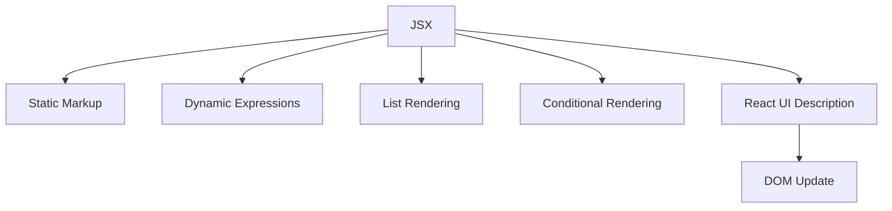

# Day 3 [Beginner]: JSX Fundamentals

## Index

- [Goal](#goal)
- [Prerequisites](#prerequisites)
- [Explanation](#explanation)
- [Topic by Topic](#topic-by-topic)
- [Key Concepts](#key-concepts)
- [Visual Concept Map](#visual-concept-map)
- [End-to-End Practical](#end-to-end-practical)
- [Hands-on Coding](#hands-on-coding)
- [Mini Exercise](#mini-exercise)
- [Assessment Quiz](#assessment-quiz)
- [Task](#task)
- [Self Check](#self-check)
- [Interview Questions and Answers](#interview-questions-and-answers)
- [Day 3 Outcome](#day-3-outcome)

## Goal

Understand JSX deeply and use it to build clean, dynamic UI structures in React.

## Prerequisites

- Day 1 and Day 2 completed
- React app running locally
- Basic JavaScript objects and arrays

## Explanation

JSX is the most common way to write UI in React. It looks like HTML, but it is JavaScript syntax that gets converted into function calls by your build tool. React uses that JSX description to figure out what should appear on screen, then updates the real DOM only where needed.

## Topic by Topic

### Topic 1: JSX Basics

Theory:
JSX allows HTML-like structure in component code for better readability.

Practical:
Replace plain text in App with heading and paragraph.

Code Example:

```jsx
function App() {
  return (
    <div>
      <h1>JSX Basics</h1>
      <p>This is written using JSX.</p>
    </div>
  );
}
```

**Explanation:** JSX looks like HTML but lives inside JavaScript. It's **not** a string - it's a special syntax that gets converted into function calls by the build tool. The outer `<div>` is required because a component must return only one parent element.

**Key Points:**

- JSX is not a string - it's converted to function calls
- Components must return ONE parent element (wrapper required)
- JSX syntax is more readable than JavaScript alone

### Topic 2: Dynamic Values with Curly Braces

Theory:
Curly braces allow JavaScript expressions inside JSX.

Practical:
Render values from variables and objects.

Code Example:

```jsx
function App() {
  const learner = "Karan";
  const score = 95;

  return (
    <h2>
      {learner} scored {score}
    </h2>
  );
}
```

**Explanation:** Curly braces `{}` inside JSX allow any JavaScript expression. Here we use them to insert variable values into the HTML-like markup. Without the braces, `{learner}` would print as literal text.

**Key Points:**

- Curly braces `{}` embed JavaScript expressions in JSX
- Variable values display their content inside braces
- Numbers, strings, booleans all work inside `{}`

### Topic 3: Rendering Lists in JSX

Theory:
Use map to convert arrays into UI elements.

Practical:
Show a skills list from an array.

Code Example:

```jsx
const skills = [
  { id: 1, name: "JSX" },
  { id: 2, name: "Props" },
  { id: 3, name: "State" },
];

function App() {
  return (
    <ul>
      {skills.map((skill) => (
        <li key={skill.id}>{skill.name}</li>
      ))}
    </ul>
  );
}
```

**Explanation:** This shows list rendering with `.map()`. For each skill object, we create an `<li>` element. The `key` prop is crucial - it tells React which item is which when the list changes. Always use a stable unique value for `key` (like `id`), not array index.

**Key Points:**

- Use `.map()` to convert arrays into JSX elements
- Always provide a unique, stable `key` prop for list items
- Never use array index as a key - use unique IDs instead
- Each item in the list must have a `key` prop

### Topic 4: JSX Rules You Must Follow

Theory:
JSX requires a single parent element and camelCase attributes like className.

Practical:
Wrap sibling elements in one container (or React Fragment) and use className.

Code Example:

```jsx
function App() {
  return (
    <section className="container">
      <h1>Title</h1>
      <p>Single parent element used.</p>
    </section>
  );
}
```

**Explanation:** JSX has two strict rules: (1) Use `className` instead of `class` (because `class` is a reserved JavaScript keyword), and (2) Return only one parent element. All siblings must be wrapped.

**Key Points:**

- Use `className` instead of `class` - `class` is reserved in JavaScript
- All JSX must have ONE parent element wrapping siblings
- `htmlFor` is used instead of `for` in labels
- Camel case attributes: `onClick`, `onChange`, etc.

### Topic 5: Conditional UI in JSX

Theory:
JSX supports conditional rendering using ternary and logical operators.

Practical:
Show message based on login status.

Code Example:

```jsx
function App() {
  const isLoggedIn = true;

  return <p>{isLoggedIn ? "Welcome back" : "Please login"}</p>;
}
```

**Explanation:** Conditional rendering uses the ternary operator (`?:`). If `isLoggedIn` is true, render "Welcome back"; if false, render "Please login". This pattern is common for showing/hiding UI based on app state.

**Key Points:**

- Ternary operator: `condition ? trueValue : falseValue`
- Use for simple if/else rendering
- Works for both text and JSX elements
- Often combined with boolean state

### Topic 6: Fragments and Safe Rendering Rules

Theory:
JSX can render only one parent at the top level, but React Fragments solve that without adding extra DOM. JSX also escapes normal text output by default, which helps prevent unsafe HTML rendering mistakes.

Practical:
Use a Fragment instead of an unnecessary wrapper `div` when structure should stay clean.

Code Example:

```jsx
function App() {
  const title = "React Basics";

  return (
    <>
      <h1>{title}</h1>
      <p>No extra wrapper div needed.</p>
    </>
  );
}
```

**Explanation:** A **Fragment** (written as `<>` and `</>`) groups elements without adding extra DOM nodes. When you don't need a wrapper `<div>`, use a Fragment to keep the HTML structure clean.

**Key Points:**

- Fragments (`<>...</>`) group elements without extra DOM
- Use fragments when you don't need a wrapper element
- Fragments don't affect styling or layout
- Helps keep semantic HTML clean

### Topic 7: How JSX reaches the DOM

Theory:
JSX is not inserted into the browser directly. First it becomes JavaScript, then React uses that result to decide how to update the DOM.

Practical:
Change one variable value in JSX and observe that only the related text updates in the browser.

Code Example:

```jsx
function App() {
  const name = "React Learner";

  return <h1>Hello, {name}</h1>;
}
```

**Explanation:** JSX becomes JavaScript function calls during build time. React uses the returned UI description to compare the old output and the new output. After that comparison, React updates the real DOM only where something changed.

**Key Points:**

- JSX is a UI description, not direct HTML pasted into the DOM
- React compares previous and next UI output before DOM updates
- The browser DOM is updated only where needed

### Topic 8: Babel and React.createElement at a high level

Theory:
JSX is convenient to write, but browsers do not understand JSX directly. A build tool transforms it into normal JavaScript.

Practical:
Compare one JSX line with the idea of what it becomes after compilation.

Code Example:

```jsx
const element = <h1>Hello</h1>;

// Conceptually becomes something like:
const compiledElement = React.createElement("h1", null, "Hello");
```

**Explanation:** Tools such as Babel transform JSX into standard JavaScript. You usually do not write `React.createElement()` yourself in day-to-day React, but understanding this helps explain why JSX is JavaScript syntax, not HTML.

**Key Points:**

- Browsers do not run JSX directly
- Build tools transform JSX into JavaScript
- `React.createElement()` is the lower-level idea behind JSX

## Key Concepts

- JSX syntax
- JSX to JavaScript conversion
- Babel compilation step
- React.createElement mental model
- DOM: The actual browser page structure
- Virtual DOM: React's internal UI comparison model
- Expressions inside curly braces
- List rendering with keys
- Single parent element
- Conditional rendering
- Fragment: A wrapper that does not add extra DOM nodes
- Safe text rendering: JSX escapes plain text values by default

## Visual Concept Map



## End-to-End Practical

1. Open App component.
2. Add static JSX structure.
3. Add dynamic user data.
4. Render list from array.
5. Add one conditional message.
6. Verify all output in browser.

## Hands-on Coding

### Example 1: Profile Card with JSX

```jsx
function App() {
  const user = { name: "Karan", role: "React Learner" };
  return (
    <div>
      <h1>{user.name}</h1>
      <p>{user.role}</p>
    </div>
  );
}
```

### Example 2: Dynamic Skills List

```jsx
function App() {
  const skills = [
    { id: 1, name: "HTML" },
    { id: 2, name: "CSS" },
    { id: 3, name: "React" },
  ];
  return (
    <div>
      <h2>Skills</h2>
      <ul>
        {skills.map((item) => (
          <li key={item.id}>{item.name}</li>
        ))}
      </ul>
    </div>
  );
}
```

### Example 3: Fragment and Logical Rendering

```jsx
function App() {
  const showTips = true;

  return (
    <>
      <h2>JSX Fragment Example</h2>
      <p>Fragment avoids extra wrapper div in DOM.</p>
      {showTips && <p>Tip: Use className, not class.</p>}
    </>
  );
}
```

## Mini Exercise

Scenario:
You are building a student progress widget for an LMS dashboard.

Create a student dashboard section showing name, course, progress percentage, and three learning topics from array data.

Expected output:

- One heading with student name
- One line showing course and progress
- One list rendered from topic array

## Assessment Quiz

### Quiz Questions

1. Why is JSX preferred in React?
2. What is the purpose of key in list rendering?
3. Can you use JavaScript expressions inside JSX?
4. True or False: JSX can return multiple root elements without a wrapper.
5. Which attribute is used instead of class in JSX?
6. Why are Fragments useful?

### Quiz Answers

1. Readability and maintainability
2. To uniquely identify list items during updates
3. Yes
4. False
5. className
6. They group elements without adding unnecessary DOM wrappers.

## Task

- Build one JSX profile card
- Render one array as list
- Add one conditional message
- Complete mini exercise

## Self Check

- You can write clean JSX
- You can render variables and arrays
- You can explain key and className usage
- You can answer at least 4 out of 5 quiz questions correctly

## Interview Questions and Answers

### Beginner

**Question:** What is JSX?

**Answer:** JSX is HTML-like syntax used in React components.

**Question:** Can JSX include JavaScript values?

**Answer:** Yes, by using curly braces.

### Middle

**Question:** Why do lists in JSX need key values?

**Answer:** Keys help React track each element efficiently during re-renders.

**Question:** What are common JSX syntax mistakes?

**Answer:** Missing parent element, using class instead of className, and missing key in mapped lists.

### Advanced

**Question:** How does JSX become browser-readable code?

**Answer:** Build tools transform JSX into JavaScript function calls.

**Question:** Why does proper key selection improve performance?

**Answer:** Stable keys help React minimize unnecessary DOM updates.

## Day 3 Outcome

- You can write static and dynamic JSX
- You can render lists and conditions correctly
- You can avoid common JSX errors
- You are ready for component design in Day 4
