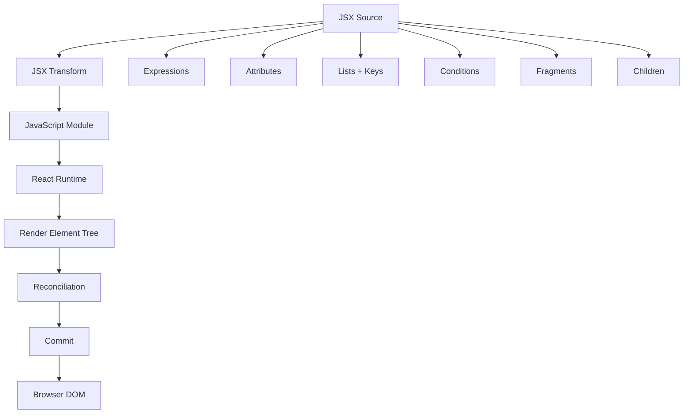

# Day 3 [Beginner]: JSX Fundamentals

## Index

- [Goal](#goal)
- [Prerequisites](#prerequisites)
- [What JSX Is](#what-jsx-is)
- [Topic by Topic](#topic-by-topic)
- [Key Concepts](#key-concepts)
- [Visual Concept Map](#visual-concept-map)
- [End-to-End Practical](#end-to-end-practical)
- [Hands-on Coding](#hands-on-coding)
- [Common Mistakes](#common-mistakes)
- [Mini Exercise](#mini-exercise)
- [Assessment Quiz](#assessment-quiz)
- [Task](#task)
- [Self Check](#self-check)
- [Interview Questions and Answers](#interview-questions-and-answers)
- [Day 3 Outcome](#day-3-outcome)

## Goal

By the end of this lesson, you should be able to write JSX confidently, embed JavaScript expressions, use JSX attributes, render lists with appropriate keys, conditionally render UI, use Fragments, understand common JSX syntax rules, and explain at a high level how JSX is transformed before React renders the UI.

## Prerequisites

- Day 1 and Day 2 completed
- Basic JavaScript variables, objects, arrays, functions, and `.map()`
- A React application running with Vite

## What JSX Is

JSX is a JavaScript syntax extension commonly used to describe React UI. It looks similar to HTML, but it is **not HTML** and it is **not a string**.

For example:

```jsx
function App() {
  const name = "Karan";

  return <h1>Hello, {name}</h1>;
}
```

The JSX is transformed by the project's compiler/build tooling into JavaScript that React can use. Modern React projects commonly use the **automatic JSX runtime**, so you should not assume every JSX file directly becomes an explicit `React.createElement(...)` call.

JSX is useful because it lets markup and JavaScript logic that describes the UI stay close together while remaining part of the JavaScript module.

## Topic by Topic

### Topic 1: JSX Basics

JSX lets you describe nested UI in a readable way:

```jsx
function App() {
  return (
    <main>
      <h1>JSX Basics</h1>
      <p>This UI is described with JSX.</p>
    </main>
  );
}

export default App;
```

A JSX element can have children, attributes, expressions, and other JSX elements.

A component's return value is not required to be one DOM element. A component can return a JSX element, a Fragment, an array of renderable nodes, text, `null`, or another supported React node. When multiple sibling elements need to be returned together, use a semantic wrapper or a Fragment.

### Topic 2: JavaScript Expressions with `{}`

Curly braces switch from JSX markup into a JavaScript **expression**:

```jsx
function App() {
  const learner = "Karan";
  const score = 95;

  return (
    <section>
      <h2>{learner}</h2>
      <p>Score: {score}</p>
      <p>{score >= 90 ? "Excellent" : "Keep practicing"}</p>
    </section>
  );
}
```

Expressions can include:

- Variables
- Property access
- Function calls
- Arithmetic
- Comparisons
- Logical operators
- Ternary expressions
- Array methods such as `.map()`

A JavaScript **statement** such as a standalone `if` cannot be placed directly inside JSX braces:

```jsx
// ❌ Invalid JSX
// <div>{if (isLoggedIn) { ... }}</div>
```

Move the statement outside the JSX or use an expression:

```jsx
function App() {
  const isLoggedIn = true;
  const message = isLoggedIn ? "Welcome" : "Please log in";

  return <p>{message}</p>;
}
```

### Topic 3: JSX Attributes

JSX attributes use React/DOM property naming conventions in many cases:

```jsx
function App() {
  const imageUrl = "/logo.png";

  return (
    
  );
}
```

Common examples:

| HTML | JSX |
|---|---|
| `class` | `className` |
| `for` | `htmlFor` |
| `onclick` | `onClick` |
| `tabindex` | `tabIndex` |

Attribute values can be strings:

```jsx
<input placeholder="Enter your name" />
```

or JavaScript expressions:

```jsx
<input value={name} />
```

Boolean attributes can use a shorthand:

```jsx
<button disabled>Save</button>
```

### Dynamic `style`

The `style` prop accepts a JavaScript object, not a CSS string:

```jsx
const cardStyle = {
  padding: "16px",
  borderRadius: "8px",
};

function Card() {
  return <section style={cardStyle}>Profile</section>;
}
```

CSS property names in the JavaScript object generally use camelCase:

```jsx
const style = {
  backgroundColor: "white",
  fontSize: "16px",
};
```

### Topic 4: JSX Naming and Self-Closing Tags

HTML elements use lowercase names:

```jsx
<div />
<button />
```

React components use an uppercase first letter:

```jsx
<ProfileCard />
```

A JSX element without children should be self-closed:

```jsx

<input type="text" />
```

This is invalid JSX:

```jsx
// ❌

```

### Topic 5: Rendering Lists

Use `.map()` when converting an array into JSX:

```jsx
const skills = [
  { id: 1, name: "JSX" },
  { id: 2, name: "Props" },
  { id: 3, name: "State" },
];

function App() {
  return (
    <ul>
      {skills.map((skill) => (
        <li key={skill.id}>{skill.name}</li>
      ))}
    </ul>
  );
}
```

### Why `key` matters

A key gives React stable identity for an item among its siblings. Prefer a stable identifier from the data:

```jsx
<li key={skill.id}>{skill.name}</li>
```

Keys are used by React for reconciliation and are **not automatically passed to the component as a normal prop**.

Using an array index is **not always forbidden**. It can be acceptable when the list is static and items never change order or identity. It becomes risky when items can be inserted, removed, or reordered.

### Topic 6: Conditional Rendering

Use expressions to describe different UI for different conditions:

```jsx
function App() {
  const isLoggedIn = true;

  return (
    <section>
      {isLoggedIn ? (
        <p>Welcome back</p>
      ) : (
        <p>Please log in</p>
      )}
    </section>
  );
}
```

For showing something only when a condition is truthy:

```jsx
{isLoggedIn && <button>Open Dashboard</button>}
```

Be careful with `&&` when the left side can be `0`, because `0` can be rendered as text:

```jsx
// May display 0
{items.length && <p>Items found</p>}
```

Prefer an explicit boolean condition when necessary:

```jsx
{items.length > 0 && <p>Items found</p>}
```

### Topic 7: Fragments

Fragments group multiple elements without adding an extra DOM element:

```jsx
function App() {
  return (
    <>
      <h1>Profile</h1>
      <p>No unnecessary wrapper is added.</p>
    </>
  );
}
```

The long form is useful when a Fragment needs a key:

```jsx
import { Fragment } from "react";

function App({ items }) {
  return items.map((item) => (
    <Fragment key={item.id}>
      <h2>{item.title}</h2>
      <p>{item.description}</p>
    </Fragment>
  ));
}
```

The shorthand `<>...</>` cannot receive a `key`, so use the long form when rendering keyed Fragment groups.

### Topic 8: JSX Comments

JavaScript comments cannot be placed directly between JSX elements as ordinary JSX text. Use the JSX comment syntax:

```jsx
function App() {
  return (
    <main>
      {/* This heading is shown on the dashboard. */}
      <h1>Dashboard</h1>
    </main>
  );
}
```

This is useful when a comment needs to explain the JSX structure or a temporary decision.

### Topic 9: JSX and the Browser

The browser does not receive raw JSX as executable JavaScript. The project's build/compiler pipeline transforms JSX into JavaScript.

Conceptually:

```text
JSX source
   ↓
JS/JSX compiler transformation
   ↓
JavaScript module
   ↓
React rendering
   ↓
Reconciliation
   ↓
Commit
   ↓
Browser DOM
```

Do not equate **JSX compilation** with a **DOM update**. Compilation happens before the application runs; rendering and DOM updates happen at runtime.

### Topic 10: JSX Runtime and `createElement`

Historically, JSX was commonly explained using an example like:

```jsx
const element = <h1>Hello</h1>;
```

being conceptually represented as:

```js
React.createElement("h1", null, "Hello");
```

That mental model is still useful for understanding the relationship between JSX and React elements. However, modern React tooling often uses the automatic JSX runtime, which can emit calls to JSX runtime functions rather than requiring `React.createElement` directly.

Therefore, the safe interview answer is:

> JSX is transformed by the compiler into JavaScript representation that React can render; the exact generated code depends on the JSX transform/runtime configuration.

### Topic 11: Values React Can Render

Common renderable values include strings, numbers, React elements, arrays of renderable nodes, and conditional results such as `null`.

```jsx
function App() {
  const name = "Asha";
  const count = 5;
  const active = true;

  return (
    <div>
      <p>{name}</p>
      <p>{count}</p>
      <p>{active ? "Active" : "Inactive"}</p>
    </div>
  );
}
```

A boolean, `null`, or `undefined` does not normally produce visible text. Objects cannot be rendered directly as children:

```jsx
// ❌ Do not do this
// <p>{user}</p>
```

Instead render a property:

```jsx
<p>{user.name}</p>
```

Arrays are commonly used when their items are renderable nodes:

```jsx
const names = ["Asha", "Ravi"];

function App() {
  return <p>{names.join(", ")}</p>;
}
```

### Topic 12: Safe Text Rendering

React escapes ordinary text values inserted into JSX, which helps prevent accidental HTML interpretation:

```jsx
function App() {
  const message = "<script>not executed</script>";
  return <p>{message}</p>;
}
```

The browser displays the text rather than executing the string as HTML.

This does not mean every React application is automatically secure. APIs such as `dangerouslySetInnerHTML` require special care and are outside today's fundamentals.

### Topic 13: JSX Children

Content placed between an opening and closing JSX tag becomes the element's children:

```jsx
function Card() {
  return (
    <section>
      <h2>React</h2>
      <p>Learn JSX step by step.</p>
    </section>
  );
}
```

The nested elements are part of the parent element's children. Passing children into custom components will be covered in more detail in the components/props lessons.

## Key Concepts

- JSX is a JavaScript syntax extension, not HTML or a string.
- `{}` accepts JavaScript expressions inside JSX.
- Statements such as standalone `if` blocks cannot be placed directly inside JSX braces.
- JSX attributes use React/DOM naming conventions.
- `className`, `htmlFor`, and `onClick` are common JSX forms.
- Dynamic `style` values use a JavaScript object.
- Lowercase tags represent DOM elements; uppercase tags represent components.
- Self-closing syntax is required for JSX elements without children.
- Lists are commonly rendered with `.map()`.
- Keys provide stable identity among siblings and are not normal component props.
- Index keys are context-dependent, not universally forbidden.
- Conditional rendering uses JavaScript expressions.
- Fragments group elements without extra DOM nodes.
- JSX comments use `{/* ... */}`.
- JSX is transformed before runtime.
- The JSX runtime may use different generated functions depending on configuration.
- Rendering/reconciliation happens at runtime and is distinct from JSX compilation.
- Plain objects cannot be rendered directly as React children.
- React escapes ordinary text inserted through JSX.

## Visual Concept Map



## End-to-End Practical

Build a small learner profile dashboard and use the JSX rules from this lesson together.

### Step 1: Static JSX

```jsx
function App() {
  return (
    <main>
      <h1>Learner Dashboard</h1>
      <p>Track your React learning progress.</p>
    </main>
  );
}
```

### Step 2: Add dynamic data

```jsx
const learner = {
  name: "Karan",
  course: "React",
  progress: 65,
};
```

Render it:

```jsx
<h2>{learner.name}</h2>
<p>
  {learner.course} — {learner.progress}% complete
</p>
```

### Step 3: Add a list

```jsx
const topics = [
  { id: 1, name: "JSX" },
  { id: 2, name: "Components" },
  { id: 3, name: "Props" },
];
```

```jsx
<ul>
  {topics.map((topic) => (
    <li key={topic.id}>{topic.name}</li>
  ))}
</ul>
```

### Step 4: Add conditional UI

```jsx
{learner.progress === 100 ? (
  <p>Course completed!</p>
) : (
  <p>Keep learning.</p>
)}
```

### Step 5: Add a dynamic attribute

```jsx
<p className={learner.progress >= 80 ? "success" : "progress"}>
  Progress: {learner.progress}%
</p>
```

### Step 6: Keep the DOM clean with a Fragment

```jsx
function Summary() {
  return (
    <>
      <h2>Summary</h2>
      <p>React learning is in progress.</p>
    </>
  );
}
```

### Step 7: Verify

Run:

```bash
npm run build
```

Then run:

```bash
npm run dev
```

The project should compile without JSX syntax errors and render the dashboard correctly.

## Hands-on Coding

### Challenge 1: Profile Card

Create a profile card using:

- `name`
- `role`
- `experience`
- `skills`

Do not hard-code each skill as a separate `<li>`; use an array and `.map()` with a stable key.

### Challenge 2: Product List

Render five products. Each product must contain a stable `id`, name, and price.

Requirements:

- Render products with `.map()`.
- Use `product.id` as the key.
- Display price as a number.
- Do not render the entire product object.

### Challenge 3: Conditional Status

Show:

- `Active` when status is active.
- `Inactive` otherwise.

Use a ternary expression.

### Challenge 4: Fragment Practice

Render two sibling sections without adding an unnecessary wrapper element.

### Challenge 5: Dynamic Style

Create a progress indicator whose text color or background changes depending on progress.

Use the `style={{ ... }}` pattern and do not write a CSS string into the `style` prop.

### Challenge 6: Debugging

Fix this JSX:

```jsx
function App() {
  return (
    <div class="card">
      <label for="name">Name</label>
      <input id="name">
    </div>
  );
}
```

Correct version:

```jsx
function App() {
  return (
    <div className="card">
      <label htmlFor="name">Name</label>
      <input id="name" />
    </div>
  );
}
```

## Common Mistakes

### Mistake 1: Treating JSX as HTML

JSX resembles HTML but follows JavaScript and React rules.

### Mistake 2: Using `class`

Use `className` in JSX.

### Mistake 3: Using `for` on a label

Use `htmlFor` in JSX:

```jsx
<label htmlFor="email">Email</label>
```

### Mistake 4: Forgetting self-closing syntax

Use:

```jsx

```

### Mistake 5: Returning multiple siblings without grouping

Use a semantic element or Fragment:

```jsx
return (
  <>
    <h1>Title</h1>
    <p>Description</p>
  </>
);
```

### Mistake 6: Rendering objects directly

Render a property instead of the whole object.

### Mistake 7: Using unstable keys

Prefer stable identifiers from your data. Do not use random values such as `Math.random()` as keys.

### Mistake 8: Assuming keys are normal props

`key` is a special React value used for reconciliation. If a component needs the same identifier as data, pass it explicitly as another prop.

### Mistake 9: Assuming JSX compilation happens at runtime

The JSX transform is part of the build/compiler pipeline; runtime rendering and reconciliation are separate processes.

### Mistake 10: Overusing `&&`

If a numeric value may be `0`, explicit conditional logic can avoid accidentally displaying `0`.

### Mistake 11: Putting statements directly inside JSX

Use expressions in JSX and move complex statements outside the returned markup.

## Mini Exercise

Create a student dashboard with:

```js
const student = {
  name: "Asha",
  course: "React",
  progress: 82,
};

const topics = [
  { id: 1, title: "JSX" },
  { id: 2, title: "Components" },
  { id: 3, title: "Props" },
];
```

Requirements:

- Display student name.
- Display course and progress.
- Render all topics with stable keys.
- Show `Almost there!` when progress is at least 80.
- Use a Fragment if an extra DOM wrapper is unnecessary.
- Add a dynamic `className` based on progress.
- Do not render the `student` object directly.

## Assessment Quiz

### Q1. Is JSX HTML?

**Answer:** No. JSX is a JavaScript syntax extension that resembles HTML.

### Q2. What can be placed inside `{}` in JSX?

**Answer:** JavaScript expressions.

### Q3. Can a standalone `if` statement be placed directly inside JSX braces?

**Answer:** No. Use an expression such as a ternary or `&&`, or calculate the value before returning JSX.

### Q4. Why are keys used in lists?

**Answer:** To provide stable identity for sibling items across renders and help React reconcile changes correctly.

### Q5. Is using an array index as a key always wrong?

**Answer:** No. It can be acceptable for a static list whose order and identity never change, but it is risky for dynamic or reordered lists.

### Q6. Why use a Fragment?

**Answer:** To group multiple JSX elements without adding an extra DOM element.

### Q7. What is the correct JSX form of HTML `class`?

**Answer:** `className`.

### Q8. What happens to JSX before the browser executes the application?

**Answer:** The JSX is transformed by the project's compiler/build pipeline into JavaScript.

### Q9. Can an object be rendered directly as a React child?

**Answer:** No. Render its properties or transform it into renderable elements/data first.

### Q10. Does every JSX expression become `React.createElement`?

**Answer:** No. Modern projects can use the automatic JSX runtime, so the generated JavaScript depends on the configured JSX transform.

### Q11. What is the difference between JSX compilation and React reconciliation?

**Answer:** Compilation transforms source JSX into JavaScript before runtime. Reconciliation occurs at runtime as React determines how the rendered element tree differs from the previous one.

### Q12. Does React automatically pass `key` to the child component as a prop?

**Answer:** No. `key` is a special React value. Pass an identifier explicitly if the child needs it.

## Task

Build a **Student Progress Dashboard** containing:

- Student profile section
- Progress percentage
- Course status
- Topics list
- At least one conditional message
- At least one Fragment
- Stable keys for list rendering
- At least one dynamic attribute such as `className`, `src`, or `href`
- At least one JSX comment
- At least one dynamic style

### Acceptance criteria

- [ ] JSX contains no invalid HTML-style attributes such as `class` or `for`.
- [ ] Self-closing JSX elements are written correctly.
- [ ] Lists have appropriate stable keys.
- [ ] No object is rendered directly.
- [ ] Conditional rendering works.
- [ ] Fragment is used where it improves the DOM structure.
- [ ] Dynamic attributes work.
- [ ] Dynamic style uses an object.
- [ ] `npm run build` succeeds.

## Self Check

You should be able to explain without notes:

- What JSX is
- Why JSX is not HTML
- What `{}` means in JSX
- Expression vs statement in JSX
- Why `className` is used
- Why `htmlFor` is used
- How dynamic attributes work
- How dynamic styles work
- Why self-closing syntax matters
- Why `key` exists
- When an index key can be acceptable
- Why `key` is not a normal prop
- What a Fragment does
- How conditional rendering works
- How lists are rendered with `.map()`
- How JSX is transformed
- Why JSX compilation and reconciliation are different
- Which values React can render directly
- Why plain objects cannot be rendered directly

## Interview Questions and Answers

### 1. What is JSX?

JSX is a JavaScript syntax extension that allows developers to describe React UI using markup-like syntax. A compiler transforms it into JavaScript that React can use.

### 2. Can JSX contain JavaScript?

Yes. JavaScript expressions can be embedded inside JSX using curly braces.

### 3. What is the difference between a JavaScript expression and statement in JSX?

An expression produces a value and can be used inside JSX braces. A standalone statement such as `if` or `for` cannot be placed directly inside JSX braces.

### 4. Why do we use `className` instead of `class`?

`className` is the React/JSX property used for assigning a CSS class to a DOM element.

### 5. Why do we use `htmlFor` instead of `for`?

`htmlFor` is the JSX/React property used to associate a `<label>` with a form control.

### 6. Why does React need keys for lists?

Keys provide stable identity for sibling items so React can correctly reason about insertions, removals, and reordering during reconciliation.

### 7. Is an array index always a bad key?

No. It can be reasonable for a static list whose items never change order or identity. It becomes problematic when list items are inserted, removed, or reordered.

### 8. Why shouldn't `Math.random()` be used as a key?

A random value changes between renders, so React cannot reliably associate the same item with its previous rendered element. This can cause unnecessary remounting and lost local state.

### 9. What is a Fragment?

A Fragment groups multiple React nodes without adding an extra DOM element. The shorthand is `<>...</>`, while the long form is useful when a key is required.

### 10. Is JSX directly understood by browsers?

No. The project's tooling transforms JSX into JavaScript before the browser executes the application.

### 11. Does every JSX expression become `React.createElement`?

Not necessarily. The classic JSX transform commonly used `React.createElement`, while modern projects can use the automatic JSX runtime.

### 12. What is conditional rendering?

Conditional rendering means producing different React nodes depending on values or state, commonly using ternaries, `&&`, or logic calculated before the JSX is returned.

### 13. Why shouldn't an object be rendered directly?

A plain JavaScript object is not a valid direct React child. Render specific properties or transform the object's data into renderable nodes.

### 14. What is the difference between JSX compilation and reconciliation?

JSX compilation transforms source syntax before runtime. Reconciliation happens at runtime when React compares the current element tree with the previous one to determine the necessary updates.

### 15. Is `key` available as a normal prop inside a child component?

No. `key` is a special React value. If the component needs the identifier, pass it explicitly, for example `<Item key={item.id} id={item.id} />`.

### 16. How does React handle ordinary text inserted through JSX?

React escapes ordinary text values before placing them in the DOM, so a string containing HTML markup is treated as text rather than executable HTML. APIs such as `dangerouslySetInnerHTML` are a separate security-sensitive case.

## Day 3 Outcome

You can now:

- Write valid JSX confidently.
- Distinguish JSX from HTML.
- Embed JavaScript expressions correctly.
- Distinguish expressions from statements.
- Use JSX attributes such as `className`, `htmlFor`, and `onClick`.
- Use dynamic values and styles.
- Render arrays with appropriate keys.
- Understand when index keys can be acceptable.
- Understand that `key` is not a normal prop.
- Use conditional rendering.
- Use Fragments intentionally.
- Write JSX comments.
- Understand self-closing JSX syntax.
- Explain the difference between JSX transformation and runtime reconciliation.
- Avoid common JSX rendering and security mistakes.
- Debug common JSX errors.

Day 4 builds on this foundation with **React Components and component design**.
