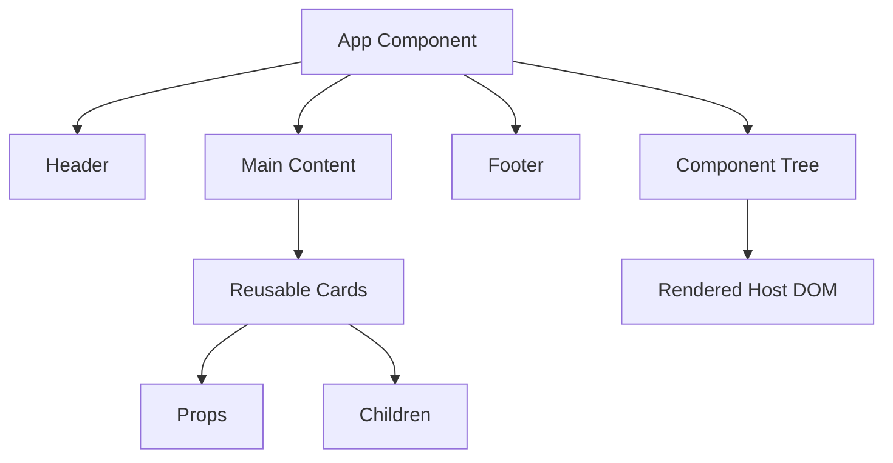

# Day 4 [Beginner]: React Components Basics

## Index

- [Goal](#goal)
- [Prerequisites](#prerequisites)
- [Explanation](#explanation)
- [Topic by Topic](#topic-by-topic)
- [Key Concepts](#key-concepts)
- [Visual Concept Map](#visual-concept-map)
- [End-to-End Practical](#end-to-end-practical)
- [Hands-on Coding](#hands-on-coding)
- [Common Mistakes](#common-mistakes)
- [Mini Exercise](#mini-exercise)
- [Assessment Quiz](#assessment-quiz)
- [Task](#task)
- [Self Check](#self-check)
- [Interview Questions and Answers](#interview-questions-and-answers)
- [Day 4 Outcome](#day-4-outcome)

## Goal

Build, name, compose, reuse, and organize React function components correctly. By the end, you should understand component boundaries, component usages, props at a high level, children, and why composition is the foundation of React UI architecture.

## Prerequisites

- Day 1–3 completed
- JavaScript functions and modules
- JSX fundamentals

## Explanation

A React component is a reusable unit of UI. In modern React, most new components are functions that return React elements. Components help us divide a large screen into understandable pieces while keeping data and behavior close to the UI that owns them.

A useful mental model is:

```text
Component definition
        ↓
JSX usage such as <ProfileCard />
        ↓
React creates an element describing that usage
        ↓
React renders the component and reconciles its returned UI
```

A component is **not simply an HTML wrapper**. It can contain markup, calculations, event handlers, props, state, and effects. At this stage we focus on component structure; state and effects will be introduced later.

### Important distinction

- **Component:** reusable function definition such as `ProfileCard`.
- **React element:** an immutable description such as `<ProfileCard name="Asha" />`.
- **DOM node:** a browser object eventually produced for host elements such as `<div>` or `<button>`.

These are related, but they are not the same thing. A component can be used many times, and each JSX usage creates its own React element describing that usage.

## Topic by Topic

### Topic 1: What Is a Component?

A component is a reusable UI definition.

```jsx
function Header() {
  return (
    <header>
      <h1>My App Header</h1>
    </header>
  );
}
```

`Header` is a function component. Its returned JSX describes the UI React should render.

**Key points**

- Components are commonly functions that return React elements.
- Components can be reused.
- A component can contain more than one host DOM element.
- A component should have a meaningful responsibility.

### Topic 2: Function Components vs Class Components

Function components are the standard approach for new React code. Older applications may still contain class components.

```jsx
function WelcomeFunction() {
  return <h2>Welcome from function component</h2>;
}
```

Legacy class example:

```jsx
import { Component } from "react";

class WelcomeClass extends Component {
  render() {
    return <h2>Welcome from class component</h2>;
  }
}
```

Function components are preferred for new code because modern React APIs, including Hooks, are designed around function components. Understanding classes remains useful when maintaining legacy code and reading older interview material.

### Topic 3: Component Naming Rules

Custom component names conventionally begin with an uppercase letter.

```jsx
function ProfileCard() {
  return <p>Profile</p>;
}

function App() {
  return <ProfileCard />;
}
```

Lowercase JSX names such as `div`, `button`, and `section` refer to intrinsic DOM elements. `<profileCard />` is therefore not the same as `<ProfileCard />`.

### Topic 4: Reusing the Same Component

```jsx
function Card() {
  return <div>Reusable Card</div>;
}

function App() {
  return (
    <main>
      <Card />
      <Card />
      <Card />
    </main>
  );
}
```

Each JSX usage describes a separate use of the component. If `Card` later owns state, each rendered usage can have its own state because React tracks state by the component's position and identity in the rendered tree.

### Topic 5: Composing Components

Composition means combining smaller components into a larger UI.

```jsx
function Header() {
  return <header>Header</header>;
}

function Card() {
  return <div>Card</div>;
}

function Footer() {
  return <footer>Footer</footer>;
}

function App() {
  return (
    <>
      <Header />
      <Card />
      <Card />
      <Footer />
    </>
  );
}
```

The hierarchy is:

```text
App
├── Header
├── Card
├── Card
└── Footer
```

Composition is preferable to putting every screen concern into one giant `App` component.

### Topic 6: Keeping Components Focused

A useful component boundary can represent:

- a meaningful UI section
- reusable presentation
- reusable behavior
- a clear data contract
- something that changes independently
- a unit worth testing separately

Do not interpret “single responsibility” as “one HTML tag.” A `UserProfile` component can reasonably contain an avatar, heading, metadata, and actions if those parts form one cohesive feature.

### Topic 7: Props-Driven Reuse and Children

Reusable components become more useful when data comes from props instead of hardcoded text.

```jsx
function InfoCard({ title, description }) {
  return (
    <div>
      <h3>{title}</h3>
      <p>{description}</p>
    </div>
  );
}
```

```jsx
<InfoCard title="React" description="Build reusable UI" />
<InfoCard title="JSX" description="Describe UI with JavaScript syntax" />
```

Components can also receive nested JSX through the special `children` prop:

```jsx
function Panel({ children }) {
  return <section>{children}</section>;
}
```

```jsx
<Panel>
  <h2>Profile</h2>
  <p>Account details</p>
</Panel>
```

At this level, think of a page component as coordinating a screen and smaller components as presenting focused pieces. This is a design model, not a mandatory architecture.

### Topic 8: Imports and Exports

A component can live in its own file:

```jsx
// Header.jsx
export default function Header() {
  return <header>Header</header>;
}
```

```jsx
// App.jsx
import Header from "./Header";

export default function App() {
  return <Header />;
}
```

Named exports are another option:

```jsx
export function Header() {
  return <header>Header</header>;
}
```

```jsx
import { Header } from "./Header";
```

Use one style consistently within a project where practical.

### Topic 9: Component Tree vs DOM Tree

A component tree represents React component structure. The browser DOM represents host elements after React renders and commits the UI.

```text
Component tree
App
├── Header
│   └── Navigation
└── Content

Rendered host tree
main
├── header
│   └── nav
└── section
```

A component does not map one-to-one to a DOM element. A component can return a Fragment, several host elements, or other components.

## Key Concepts

- Component function
- Function component
- Class component
- React element
- Component usage and identity
- Reusability
- Composition
- Naming conventions
- Single responsibility
- Props-driven reuse
- `children`
- Component tree vs DOM tree
- Imports and exports

## Visual Concept Map



## End-to-End Practical

Build a small dashboard shell.

### Step 1: Create files

```text
src/
├── App.jsx
└── components/
    ├── Header.jsx
    ├── Sidebar.jsx
    ├── DashboardContent.jsx
    └── Footer.jsx
```

### Step 2: Create components

```jsx
// Header.jsx
export default function Header() {
  return <header><h1>Learning Dashboard</h1></header>;
}
```

```jsx
// Sidebar.jsx
export default function Sidebar() {
  return (
    <aside>
      <nav>
        <a href="#courses">Courses</a>
      </nav>
    </aside>
  );
}
```

```jsx
// DashboardContent.jsx
export default function DashboardContent() {
  return (
    <main>
      <h2>My Courses</h2>
      <p>Continue learning.</p>
    </main>
  );
}
```

```jsx
// Footer.jsx
export default function Footer() {
  return <footer>© 2026 CodingTerminals</footer>;
}
```

### Step 3: Compose them

```jsx
import Header from "./components/Header";
import Sidebar from "./components/Sidebar";
import DashboardContent from "./components/DashboardContent";
import Footer from "./components/Footer";

export default function App() {
  return (
    <>
      <Header />
      <Sidebar />
      <DashboardContent />
      <Footer />
    </>
  );
}
```

### Step 4: Make a component reusable

```jsx
function EmployeeCard({ name, role }) {
  return (
    <article>
      <h3>{name}</h3>
      <p>{role}</p>
    </article>
  );
}
```

Render it multiple times with different props.

## Hands-on Coding

### Example 1: Ecommerce Home Banner

```jsx
function PromoHeader() {
  return <h1>Big Sale Weekend</h1>;
}

function PromoFooter() {
  return <p>Free shipping above $50</p>;
}

function App() {
  return (
    <div>
      <PromoHeader />
      <PromoFooter />
    </div>
  );
}
```

### Example 2: HR Team Directory

```jsx
function EmployeeCard({ name, role }) {
  return (
    <div style={{ border: "1px solid #ddd", padding: "10px" }}>
      <strong>{name}</strong>
      <p>{role}</p>
    </div>
  );
}

function App() {
  return (
    <div>
      <EmployeeCard name="Asha" role="Recruiter" />
      <EmployeeCard name="Ravi" role="Developer" />
    </div>
  );
}
```

### Example 3: Learning Portal Feature Blocks

```jsx
function FeatureBlock({ title, description }) {
  return (
    <div>
      <h3>{title}</h3>
      <p>{description}</p>
    </div>
  );
}
```

### Example 4: Hospital Appointment Page Composition

```jsx
function ClinicHeader() {
  return <h2>City Clinic Appointments</h2>;
}

function AppointmentList() {
  return (
    <ul>
      <li>09:00 AM - Dr. Rao</li>
      <li>10:30 AM - Dr. Mehta</li>
    </ul>
  );
}

function ClinicFooter() {
  return <p>Emergency desk</p>;
}

function App() {
  return (
    <main>
      <ClinicHeader />
      <AppointmentList />
      <ClinicFooter />
    </main>
  );
}
```

## Common Mistakes

### Mistake 1: Lowercase custom component

```jsx
function card() {
  return <div>Card</div>;
}
```

Use `Card` and `<Card />` instead.

### Mistake 2: Manually calling components

Avoid:

```jsx
{Card()}
```

Prefer:

```jsx
<Card />
```

Calling a component function manually bypasses React's normal component invocation model. It can also become invalid when the component uses Hooks because Hooks must be called from React components or custom Hooks in their proper execution context.

### Mistake 3: Over-fragmenting

Do not create a component for every tiny element. Extract when the unit has meaningful responsibility, reuse, independent change, or testing value.

### Mistake 4: Confusing re-render with DOM replacement

A component can render again without every DOM node being recreated. React compares the new result with the previous rendered tree and commits the necessary DOM changes.

### Mistake 5: Treating class components as current default

Class components are important for legacy code, but function components are the standard approach for new React code.

### Mistake 6: Treating every repeated UI block as a component automatically

Repeated markup can be a sign that a reusable component is useful, but extraction should still provide a meaningful responsibility or API. Do not create abstractions that make simple UI harder to understand.

## Mini Exercise

Scenario: Build a training portal landing page with four components:

- `Header`
- `Hero`
- `FeatureList`
- `Footer`

Render them in `App` in the correct order.

Expected output:

- Four meaningful components created
- `App` composes them
- At least one component is reused or receives props
- Changing one component does not require rewriting the whole page

## Assessment Quiz

1. What is a React component?
2. Why does a custom component start with uppercase?
3. What is composition?
4. Why are function components preferred for new React code?
5. Can one component be used multiple times?
6. Does one component always equal one DOM element?
7. When should you split a component?
8. Why are imports/exports important?
9. What is the difference between a component and a React element?
10. Why should you avoid manually calling a component as `Card()`?
11. What is the `children` prop used for?

### Answers

1. A reusable function definition that describes part of a UI.
2. JSX uses casing to distinguish custom components from intrinsic DOM elements.
3. Building larger UI by combining smaller components.
4. They are the standard approach for new React code and work naturally with modern React APIs such as Hooks.
5. Yes. Each JSX usage describes a separate use of the component.
6. No. A component can return multiple host elements, a Fragment, or other components.
7. When it has a meaningful responsibility, reuse value, independent change, or testing value.
8. They allow components to be organized into modules and reused across files.
9. A component is a reusable definition; a React element is a lightweight description of what React should render.
10. React should manage component rendering through JSX rather than manual function invocation.
11. `children` receives JSX nested between a component's opening and closing tags and enables composition.

## Task

- Create 3–4 components.
- Reuse at least one component twice.
- Use props for at least one variation.
- Use `children` in at least one simple wrapper component.
- Put at least one component in a separate file.
- Complete the mini exercise.
- Run `npm run build` and fix any import or JSX errors.

## Self Check

- [ ] I can create function components.
- [ ] I can compose components into a page.
- [ ] I understand component naming.
- [ ] I can explain component vs element vs DOM node.
- [ ] I can choose a sensible component boundary.
- [ ] I can pass basic props.
- [ ] I understand the `children` prop.
- [ ] I can split components across files.
- [ ] I can explain why function components are preferred for new code.
- [ ] I know why manually calling a component is discouraged.

## Interview Questions and Answers

### Beginner

**What is a component in React?**  
A reusable function definition that describes a piece of UI.

**Why use components?**  
To divide UI into focused, reusable, maintainable pieces.

### Intermediate

**What is component composition?**  
Building larger UI by combining smaller components.

**Can one component be used multiple times?**  
Yes. Each JSX usage creates an element describing a separate use of that component.

**What is `children` in React?**  
It is a special prop containing the JSX nested between a component's opening and closing tags.

**Why avoid a giant component?**  
Large components become harder to understand, test, reuse, and change safely.

### Advanced

**How do you choose component boundaries?**  
Use cohesive responsibility, clear contracts, independent change, reuse, and testing value rather than arbitrary line counts.

**Component vs element?**  
A component is a reusable definition; a React element is a lightweight description of what React should render.

**Why is manually calling `Component()` discouraged?**  
It bypasses React's normal component rendering model and can cause incorrect component/Hooks behavior. Components should be rendered through JSX.

**Does a component always create a DOM element?**  
No. A component can return another component, a Fragment, or one or more host elements. Only host elements such as `div` and `button` correspond to DOM elements.

## Day 4 Outcome

You can build and compose React components, choose meaningful boundaries, reuse components with props and `children`, organize them across files, and distinguish components, React elements, and DOM nodes. You are ready for deeper reusable-component APIs in Day 5.
