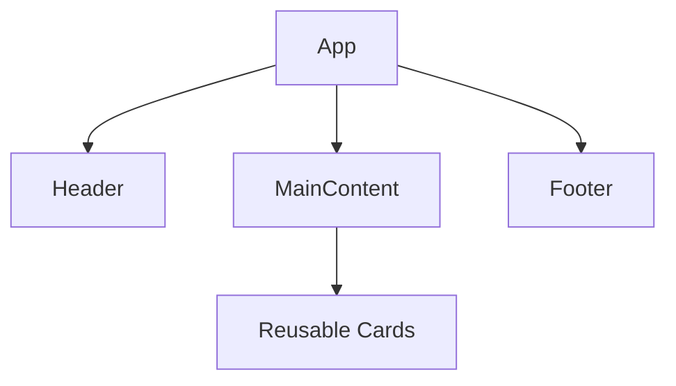

# Day 4 [Beginner]: Components Basics

## Index

- [Goal](#goal)
- [Prerequisites](#prerequisites)
- [Explanation](#explanation)
- [Topic by Topic](#topic-by-topic)
- [Key Concepts](#key-concepts)
- [Visual Concept Map](#visual-concept-map)
- [End-to-End Practical](#end-to-end-practical)
- [Hands-on Coding](#hands-on-coding)
- [Mini Exercise](#mini-exercise)
- [Assessment Quiz](#assessment-quiz)
- [Task](#task)
- [Self Check](#self-check)
- [Interview Questions and Answers](#interview-questions-and-answers)
- [Day 4 Outcome](#day-4-outcome)

## Goal

Build and compose basic React components to create maintainable UI.

## Prerequisites

- Day 3 completed
- JSX fundamentals clear

## Explanation

Components are reusable UI building blocks. In modern React, most components are written as functions, but older React codebases may still use class components. React apps are built by combining many small components.

## Topic by Topic

### Topic 1: What Is a Component?

Theory:
Component is an isolated UI unit.

Practical:
Create a simple Header component.

Code Example:

```jsx
function Header() {
  return <h1>My App Header</h1>;
}
```

**Explanation:** This is a **component** - a reusable piece of UI. It's simply a function that returns JSX. Component names must start with uppercase (e.g., `Header`, not `header`). This naming convention helps React recognize it as a component.

**Key Points:**

- Components are functions that return JSX
- Component names must start with UPPERCASE letters
- Lowercase names are treated as HTML tags
- Components encapsulate UI logic

### Topic 2: Function Components vs Class Components

Theory:
React supports two main component styles: function components and class components. Modern React mainly uses function components.

Practical:
Compare the same UI written once as a function component and once as a class component.

Code Example:

```jsx
function WelcomeFunction() {
  return <h2>Welcome from function component</h2>;
}

class WelcomeClass extends React.Component {
  render() {
    return <h2>Welcome from class component</h2>;
  }
}
```

**Explanation:** A **function component** is a normal JavaScript function that returns JSX. A **class component** is an ES6 class that extends `React.Component` and returns JSX from a `render()` method. Today, function components are preferred because they are simpler to read and work directly with Hooks like `useState` and `useEffect`.

**Key Points:**

- Function components are the modern standard in React
- Class components are common in older React codebases
- Class components use `render()` while function components return JSX directly
- Hooks work in function components, not class components

### Topic 3: Component Naming Rules

Theory:
Component names start with uppercase letters.

Practical:
Rename incorrect component names.

Code Example:

```jsx
function ProfileCard() {
  return <p>Profile</p>;
}
```

**Explanation:** React requires component names to start with uppercase. This tells React "this is a component, not a regular HTML tag". Lowercase names are treated as regular HTML tags.

**Key Points:**

- UPPERCASE first letter = React component
- lowercase first letter = HTML tag or built-in element
- Naming convention is critical for React to recognize components

### Topic 4: Reusing the Same Component

Theory:
Reusable components reduce duplication.

Practical:
Render Card component multiple times.

Code Example:

```jsx
function Card() {
  return <div>Reusable Card</div>;
}

function App() {
  return (
    <div>
      <Card />
      <Card />
      <Card />
    </div>
  );
}
```

**Explanation:** Components can be used multiple times. Here `<Card />` appears three times, reducing code duplication. Each usage is independent, but they all have the same UI. This is the power of React - write once, use many times.

**Key Points:**

- Reuse components multiple times by repeating them
- Each instance is independent
- Reduces code duplication significantly
- Self-closing tag: `<Card />` not `<Card></Card>`

### Topic 5: Composing Components

Theory:
Composition means combining smaller components into larger UI.

Practical:
Build page using Header and Card components in one screen.

Code Example:

```jsx
function Header() {
  return <h1>Header</h1>;
}

function Card() {
  return <div>Card</div>;
}

function App() {
  return (
    <div>
      <Header />
      <Card />
      <Card />
    </div>
  );
}
```

**Explanation:** **Composition** means building larger components from smaller ones. `App` uses `Header` and `Card` components. This pattern keeps code modular - each component is small and focused.

**Key Points:**

- Composition = building large components from small ones
- Each component has one clear responsibility
- Easier to test, reuse, and maintain
- Natural hierarchy mimics app structure

### Topic 6: Keeping Components Focused

Theory:
Each component should handle one responsibility.

Practical:
Split long App UI into smaller pieces.

Code Example:

```jsx
function Footer() {
  return <footer>Footer section</footer>;
}
```

**Explanation:** Focused components are easier to test, reuse, and understand because each one solves only one small UI problem.

**Key Points:**

- Keep components small and purpose-driven.
- Split large UI into simpler pieces.
- One responsibility improves maintainability.

### Topic 7: Props-driven Reuse and Container Thinking

Theory:
Reusable components become more useful when data comes from props instead of hardcoded text. Also, page-level components often coordinate data, while smaller UI components focus on display.

Practical:
Convert one hardcoded component into a reusable component using props.

Code Example:

```jsx
function InfoCard({ title, description }) {
  return (
    <div>
      <h3>{title}</h3>
      <p>{description}</p>
    </div>
  );
}
```

**Explanation:** This is the **Single Responsibility Principle** - each component should have one clear job. `InfoCard` only displays information; it doesn't fetch data or manage complex logic. This makes components easier to test and reuse.

**Key Points:**

- Single Responsibility: each component does one job
- Display components just show data, don't fetch it
- Easier to test and maintain
- Promotes reusability across different pages

## Key Concepts

- Component function
- Function component
- Class component
- Reusability
- Composition
- Naming conventions
- Single responsibility
- Props-driven reuse
- Page component vs presentational component role

## Visual Concept Map



## End-to-End Practical

1. Create Header, Card, Footer components.
2. Import and render them in App.
3. Render Card two times.
4. Change one component and verify impact.

## Hands-on Coding

### Example 1: Case - Ecommerce Home Banner

Scenario:
An ecommerce homepage needs a reusable top banner and footer for marketing campaigns.

```jsx
function PromoHeader() {
  return <h1>Big Sale Weekend</h1>;
}

function PromoFooter() {
  return <p>Free shipping above $50</p>;
}

function App() {
  return (
    <div>
      <PromoHeader />
      <PromoFooter />
    </div>
  );
}
```

### Example 2: Case - HR Team Directory

Scenario:
An HR page should display the same employee card component for multiple team members.

```jsx
function EmployeeCard() {
  return (
    <div style={{ border: "1px solid #ddd", padding: "10px" }}>
      Name: Asha | Role: Recruiter
    </div>
  );
}

function App() {
  return (
    <div>
      <EmployeeCard />
      <EmployeeCard />
    </div>
  );
}
```

### Example 3: Case - Learning Portal Feature Blocks

Scenario:
A learning portal dashboard needs reusable feature blocks with different titles and descriptions.

```jsx
function FeatureBlock({ title, description }) {
  return (
    <div
      style={{ border: "1px solid #ddd", padding: "10px", marginTop: "10px" }}
    >
      <h3>{title}</h3>
      <p>{description}</p>
    </div>
  );
}

function App() {
  return (
    <div>
      <FeatureBlock
        title="Daily Lessons"
        description="Step-by-step concept learning with practice tasks."
      />
      <FeatureBlock
        title="Interview Prep"
        description="Beginner, middle, and advanced Q&A per day."
      />
    </div>
  );
}
```

### Example 4: Case - Hospital Appointment Page Composition

Scenario:
A clinic app needs separate sections for header, appointment list, and footer to keep code maintainable.

```jsx
function ClinicHeader() {
  return <h2>City Clinic Appointments</h2>;
}

function AppointmentList() {
  return (
    <ul>
      <li>09:00 AM - Dr. Rao</li>
      <li>10:30 AM - Dr. Mehta</li>
    </ul>
  );
}

function ClinicFooter() {
  return <p>Emergency: 1800-111-222</p>;
}

function App() {
  return (
    <main>
      <ClinicHeader />
      <AppointmentList />
      <ClinicFooter />
    </main>
  );
}
```

## Mini Exercise

Scenario:
You are creating a simple landing page for a training portal.

Build a page with four components: Header, Hero, FeatureList, Footer. Render them in App in proper order.

Expected output:

- Four separate components created
- App composes all components in order
- Changing one component updates only that section

## Assessment Quiz

### Quiz Questions

1. Why should component names start with uppercase?
2. What is composition?
3. True or False: Components can be reused many times.
4. What is a benefit of small components?
5. Which component should contain page-level layout?

### Quiz Answers

1. React identifies custom components this way
2. Combining smaller components to build larger UI
3. True
4. Better maintainability
5. App or page component

6. Why are props important for reusable components?

### Quiz Answers

6. They let the same component render different data without duplicating code.

## Task

- Create 3 to 4 components
- Reuse one component at least twice
- Complete mini exercise

## Self Check

- You can create function components
- You can compose components into one page
- You can answer at least 4 out of 5 quiz questions correctly

## Interview Questions and Answers

### Beginner

**Question:** What is a component in React?

**Answer:** A reusable function returning UI.

**Question:** Why use components?

**Answer:** To split UI into manageable reusable parts.

### Middle

**Question:** What is component composition?

**Answer:** Building larger UI by combining smaller components.

**Question:** How does reusability reduce bugs?

**Answer:** Shared logic and UI reduce duplicate code paths.

### Advanced

**Question:** What is single responsibility in components?

**Answer:** One component should focus on one concern.

**Question:** Why is component granularity important?

**Answer:** Proper granularity improves testing, readability, and refactoring.

## Day 4 Outcome

- You can build and compose components confidently
- You can design reusable UI blocks
- You are ready for advanced reusable patterns in Day 5
