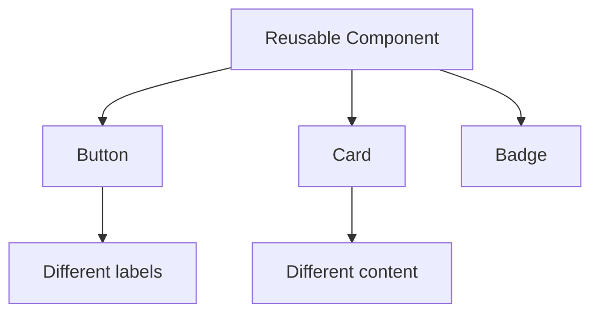

# Day 5 [Beginner to Intermediate]: Reusable Components

## Index

- [Goal](#goal)
- [Prerequisites](#prerequisites)
- [Explanation](#explanation)
- [Topic by Topic](#topic-by-topic)
- [Key Concepts](#key-concepts)
- [Visual Concept Map](#visual-concept-map)
- [End-to-End Practical](#end-to-end-practical)
- [Hands-on Coding](#hands-on-coding)
- [Mini Exercise](#mini-exercise)
- [Assessment Quiz](#assessment-quiz)
- [Task](#task)
- [Self Check](#self-check)
- [Interview Questions and Answers](#interview-questions-and-answers)
- [Day 5 Outcome](#day-5-outcome)

## Goal

Design reusable components that accept different content while keeping consistent UI behavior.

## Prerequisites

- Day 4 completed
- Components and JSX clear

## Explanation

Reusable components are a key React strength. They reduce repeated code and speed up development.

## Topic by Topic

### Topic 1: Reusability Mindset

Theory:
One generic component is better than many similar copies.

Practical:
Identify repeated UI and convert to one component.

Code Example:

Code Example:

```jsx
function Badge({ text }) {
  return <span>{text}</span>;
}
```

**Explanation:** A reusable component accepts **props** (inputs) rather than hardcoding values. By passing different `text` values, `Badge` renders different content each time. This single component replaces the need for `ActiveBadge`, `InactiveBadge`, etc.

**Key Points:**

- Props make components flexible and reusable
- Different data = different output from same component
- Eliminates need for multiple similar components
- Props are the component's "API"

### Topic 2: Flexible Inputs

Theory:
Flexible components accept props such as label, variant, icon, and children.

Practical:
Create Button component with label and variant.

Code Example:

Code Example:

```jsx
function Button({ label, variant = "primary" }) {
  return <button className={`btn ${variant}`}>{label}</button>;
}
```

**Explanation:** This shows a reusable `Button` with props `label` (required) and `variant` (optional with default). The component adapts based on inputs, avoiding the need to create separate `PrimaryButton` and `DangerButton` components.

**Key Points:**

- Use default values for optional props
- Props control component appearance and behavior
- One generic component replaces many specialized ones
- More flexible than hardcoded variations

### Topic 3: Reusable Card Pattern

Theory:
Card is a common reusable pattern across apps.

Practical:
Render same card with different props.

Code Example:

Code Example:

```jsx
function Card({ title, description }) {
  return (
    <div>
      <h3>{title}</h3>
      <p>{description}</p>
    </div>
  );
}
```

**Explanation:** Rather than creating `ReactCard` and `JavaScriptCard`, one generic `Card` component is reused with different props. This reduces code duplication and makes maintenance easier.

**Key Points:**

- Generic components are more maintainable than specialized ones
- Change one component = update all usages automatically
- Props drive the differences, not separate component files
- Follows DRY principle (Don't Repeat Yourself)

### Topic 4: Maintainability Through Reuse

Theory:
Changing one component updates all usages.

Practical:
Update Card style once and inspect all cards.

Code Example:

```jsx
<Card title="React" description="Build UI with reusable components" />
```

**Explanation:** Maintainability improves when one shared component controls common layout and style for many similar UI cases.

**Key Points:**

- Update one reusable component instead of many copies.
- Shared components keep UI consistent.
- Reuse reduces long-term maintenance cost.

### Topic 5: Reusability Boundaries

Theory:
Avoid over-generalizing too early.

Practical:
Keep props simple for beginner-level apps.

Code Example:

Code Example:

```jsx
function Alert({ message }) {
  return <p>{message}</p>;
}
```

**Explanation:** Keep components simple for beginner-level apps. As your app grows, you can add more props gradually instead of over-generalizing from the start.

**Key Points:**

- Start simple, add complexity gradually
- Avoid over-designing components too early
- Props should match real use cases
- Refactor when patterns emerge

### Topic 6: Children and Composition Slots

Theory:
Reusable components become more flexible when they accept nested content through `children`, instead of a large number of special-purpose props.

Practical:
Create a wrapper component that can render different inner content while keeping one shared layout.

Code Example:

Code Example:

```jsx
function Panel({ title, children }) {
  return (
    <section>
      <h3>{title}</h3>
      <div>{children}</div>
    </section>
  );
}
```

**Explanation:** The **`children` prop** is special - it represents content nested inside a component. This allows a single `Panel` component to wrap different types of content (paragraphs, lists, etc.) while keeping the outer layout consistent. This is more flexible than adding many special-purpose props.

**Key Points:**

- `children` prop receives content between opening and closing tags
- Allows composition without adding many specialized props
- Perfect for wrapper components like Panel, Modal, Card
- Makes layouts consistent while content varies

## Key Concepts

- Reusability
- Generic component API
- Props-driven rendering
- Consistency
- Maintainability
- children-based composition
- Reuse without over-generalization

## Visual Concept Map



## End-to-End Practical

1. Create reusable Button and Card components.
2. Pass different props for each use case.
3. Render multiple instances.
4. Change one shared style and verify all updates.

## Hands-on Coding

### Example 1: Case - E-commerce Action Buttons

Scenario:
An online store needs the same styled buttons for Add to Cart, Buy Now, and Wishlist actions.

```jsx
function Button({ label }) {
  return (
    <button style={{ marginRight: "8px", padding: "8px 12px" }}>{label}</button>
  );
}

function App() {
  return (
    <div>
      <Button label="Add to Cart" />
      <Button label="Buy Now" />
      <Button label="Wishlist" />
    </div>
  );
}
```

### Example 2: Case - Support Dashboard Ticket Cards

Scenario:
A support team dashboard shows repeated ticket summaries in the same visual card layout.

```jsx
function Card({ title, description }) {
  return (
    <div
      style={{ border: "1px solid #ddd", padding: "12px", marginTop: "10px" }}
    >
      <h3>{title}</h3>
      <p>{description}</p>
    </div>
  );
}

function App() {
  return (
    <div>
      <Card title="Login Issue" description="User cannot access account" />
      <Card title="Payment Failed" description="Checkout is blocked" />
    </div>
  );
}
```

### Example 3: Case - Learning Portal Info Panels

Scenario:
A learning platform uses shared panels for notices, tips, and announcements.

```jsx
function Panel({ title, children }) {
  return (
    <section
      style={{ border: "1px solid #ccc", padding: "12px", marginTop: "12px" }}
    >
      <h3>{title}</h3>
      <div>{children}</div>
    </section>
  );
}

function App() {
  return (
    <div>
      <Panel title="Notice">
        <p>Server maintenance at 10 PM.</p>
      </Panel>
      <Panel title="Tips">
        <ul>
          <li>Reuse components</li>
          <li>Keep props simple</li>
        </ul>
      </Panel>
    </div>
  );
}
```

## Mini Exercise

Scenario:
You are building an admin dashboard KPI section with repeatable tiles.

Build a reusable InfoTile component and use it for 4 dashboard metrics: Users, Sales, Orders, Revenue.

Expected output:

- One InfoTile component reused 4 times
- Each tile shows different title and value
- Common style stays same for all tiles

## Assessment Quiz

### Quiz Questions

1. Why are reusable components important?
2. What should a reusable component receive as input?
3. True or False: Duplicate UI should always become a reusable component.
4. What is the benefit of changing one reusable component?
5. What is a risk of too many unnecessary props?
6. When is `children` useful in reusable components?

### Quiz Answers

1. Less duplication and easier maintenance
2. Props
3. Usually true, but context matters
4. All usages update consistently
5. Component becomes hard to understand
6. When the outer layout stays same but the inner content may vary.

## Task

- Build at least two reusable components
- Use each component multiple times
- Complete mini exercise

## Self Check

- You can design flexible component APIs
- You can reuse components without duplicate code
- You can answer at least 4 out of 5 quiz questions correctly

## Interview Questions and Answers

### Beginner

**Question:** What is a reusable component?

**Answer:** A component that can be used multiple times with different props.

**Question:** Give one reusable UI example.

**Answer:** Button component.

### Middle

**Question:** How do props improve reusability?

**Answer:** Props make one component render different content without rewriting logic.

**Question:** Why avoid code duplication in UI?

**Answer:** Duplication increases bugs and maintenance cost.

### Advanced

**Question:** How do you decide component boundaries?

**Answer:** Group highly related UI and behavior, keep public API simple.

**Question:** What is over-abstraction in reusable components?

**Answer:** Making components too generic too early, hurting readability.

## Day 5 Outcome

- You can design and use reusable components effectively
- You understand prop-driven flexibility
- You are ready for deep props usage in Day 6
