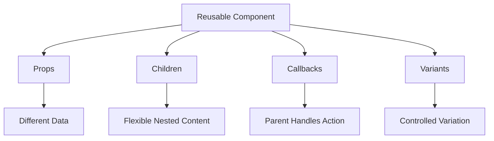

# Day 5 [Beginner to Intermediate]: Reusable Components

## Index

- [Goal](#goal)
- [Prerequisites](#prerequisites)
- [Explanation](#explanation)
- [Topic by Topic](#topic-by-topic)
- [Key Concepts](#key-concepts)
- [Visual Concept Map](#visual-concept-map)
- [End-to-End Practical](#end-to-end-practical)
- [Hands-on Coding](#hands-on-coding)
- [Common Mistakes](#common-mistakes)
- [Mini Exercise](#mini-exercise)
- [Assessment Quiz](#assessment-quiz)
- [Task](#task)
- [Self Check](#self-check)
- [Interview Questions and Answers](#interview-questions-and-answers)
- [Day 5 Outcome](#day-5-outcome)

## Goal

Design reusable components that accept different content while keeping consistent UI behavior. You will learn props-driven APIs, defaults, `children`, variants, callbacks, composition, and how to decide whether an abstraction is actually useful.

## Prerequisites

- Day 4 completed
- Components and JSX clear
- Basic JavaScript objects and functions

## Explanation

Reusable components are one of React's core strengths. A reusable component is not simply a component used twice; it has a clear contract that allows different data or content to be supplied without duplicating implementation.

Think of a reusable component as a small API:

```text
Parent / Consumer
      ↓ props
Reusable Component
      ↓
Consistent UI + behavior
```

Good reuse balances two risks:

- **Duplication:** the same UI is copied into many places.
- **Over-abstraction:** one generic component becomes so configurable that nobody can understand its API.

The goal is not maximum reuse. The goal is **useful reuse with a simple contract**.

## Topic by Topic

### Topic 1: Reusability Mindset

One generic component can replace several copies of nearly identical UI.

```jsx
function Badge({ text }) {
  return <span className="badge">{text}</span>;
}
```

```jsx
<Badge text="Active" />
<Badge text="Pending" />
<Badge text="Completed" />
```

The props form the component's public API. A good API exposes meaningful variation without leaking implementation details.

**Key points**

- Props make components flexible.
- Different data can produce different output from the same component.
- Reuse reduces duplicate UI implementations.
- A component API should remain understandable.

### Topic 2: Flexible Inputs and Defaults

```jsx
function Button({ label, variant = "primary", disabled = false }) {
  return (
    <button className={`btn btn-${variant}`} disabled={disabled}>
      {label}
    </button>
  );
}
```

A default parameter is used when the prop is `undefined`. An explicitly supplied `null` does not trigger the default.

```jsx
<Button label="Save" />
<Button label="Delete" variant="danger" />
<Button label="Saving" disabled />
```

Use defaults for sensible optional behavior, but avoid turning every possible visual difference into a prop.

### Topic 3: Reusable Card Pattern

```jsx
function Card({ title, description }) {
  return (
    <article>
      <h3>{title}</h3>
      <p>{description}</p>
    </article>
  );
}
```

```jsx
<Card title="React" description="Build UI with components" />
<Card title="JavaScript" description="Understand the language underneath React" />
```

One component can represent the shared structure while props provide the changing data.

### Topic 4: Maintainability Through Reuse

Changing one shared component can update every usage consistently.

```jsx
<Card title="React" description="Build reusable UI" />
```

This is valuable when the repeated UI has the same behavior and semantics. Reuse is not automatically better if two pieces only look similar but have different responsibilities or are likely to evolve differently.

### Topic 5: Reusability Boundaries

Start with a small API and add flexibility when real use cases appear.

```jsx
function Alert({ message }) {
  return <p>{message}</p>;
}
```

A warning sign is an API with many interacting boolean props:

```jsx
<Button primary danger large rounded outlined iconOnly loading />
```

Many booleans can represent combinations that are difficult to reason about. Prefer semantic variants, composition, or smaller components where appropriate.

### Topic 6: `children` and Composition Slots

Use `children` when the wrapper controls layout while the caller controls nested content.

```jsx
function Panel({ title, children }) {
  return (
    <section className="panel">
      <h3>{title}</h3>
      <div className="panel-body">{children}</div>
    </section>
  );
}
```

```jsx
<Panel title="Notice">
  <p>Server maintenance at 10 PM.</p>
</Panel>
```

This is often better than creating props such as `paragraph`, `listItems`, `image`, and `buttonText` for every possible nested layout.

### Topic 7: Data Props vs `children`

Use named props when a value has a semantic meaning:

```jsx
<ProductCard title="Keyboard" price={1200} />
```

Use `children` when the consumer controls nested content:

```jsx
<Card>
  <ProductSummary />
  <BuyButton />
</Card>
```

This distinction makes component APIs easier to understand.

### Topic 8: Callback Props

Reusable components can report user actions without owning the application's business state.

```jsx
function DeleteButton({ onDelete }) {
  return (
    <button type="button" onClick={onDelete}>
      Delete
    </button>
  );
}

function App() {
  function handleDelete() {
    console.log("Delete requested");
  }

  return <DeleteButton onDelete={handleDelete} />;
}
```

Flow:

```text
Parent owns state/decision
        ↓ callback prop
Child reports user action
        ↓
Parent handles action
```

This preserves explicit one-way data flow.

### Topic 9: Passing Data Through Reusable Components

A reusable list should not need to know whether its data came from local state, a file, or an API.

```jsx
function UserList({ users }) {
  return (
    <ul>
      {users.map((user) => (
        <li key={user.id}>{user.name}</li>
      ))}
    </ul>
  );
}
```

The component's contract is `users`, not the implementation that produced those users.

### Topic 10: Container and Presentational Thinking

This is a useful design model, not a mandatory React architecture.

```jsx
function ProductList({ products }) {
  return products.map((product) => (
    <ProductCard key={product.id} product={product} />
  ));
}

function ProductCard({ product }) {
  return <article>{product.name}</article>;
}
```

The collection component coordinates rendering while the card focuses on one product. In larger applications, data fetching can live in a route/page layer, custom hook, or server-state library.

### Topic 11: Component API Design Checklist

Before publishing a reusable component, ask:

1. What is the minimum useful API?
2. Which props are required?
3. Which props are optional?
4. Should nested content use `children`?
5. Should user actions be callback props?
6. Are defaults sensible?
7. Can consumers understand the API without reading implementation?
8. Are there too many booleans or special cases?
9. Is the abstraction actually reused?
10. Does the component preserve semantic HTML and accessibility?
11. Does the API depend on unnecessary implementation details?
12. Can the component handle its documented inputs without hidden assumptions?

## Key Concepts

- Reusability
- Generic component API
- Props-driven rendering
- Default props/parameter values
- Variants
- `children`-based composition
- Callback props
- Consistency
- Maintainability
- Container/presentation separation as a design option
- Reuse without over-generalization

## Visual Concept Map



## End-to-End Practical

Build a reusable dashboard UI:

```text
Dashboard
├── Button
├── StatCard
├── Panel
└── UserList
```

### `StatCard`

```jsx
function StatCard({ label, value, trend }) {
  return (
    <article className="stat-card">
      <p>{label}</p>
      <strong>{value}</strong>
      <span>{trend}</span>
    </article>
  );
}
```

### `UserList`

```jsx
function UserList({ users }) {
  return (
    <ul>
      {users.map((user) => (
        <li key={user.id}>{user.name}</li>
      ))}
    </ul>
  );
}
```

### `Panel`

```jsx
function Panel({ title, children }) {
  return (
    <section className="panel">
      <h2>{title}</h2>
      {children}
    </section>
  );
}
```

### Use the components

```jsx
function Dashboard() {
  const users = [
    { id: 1, name: "Asha" },
    { id: 2, name: "Ravi" },
  ];

  return (
    <main>
      <StatCard label="Users" value="1,240" trend="+8%" />
      <StatCard label="Orders" value="320" trend="+4%" />

      <Panel title="Users">
        <UserList users={users} />
      </Panel>
    </main>
  );
}
```

## Hands-on Coding

### Example 1: Ecommerce Action Buttons

```jsx
function Button({ label, variant = "primary", onClick }) {
  return (
    <button type="button" className={`button button--${variant}`} onClick={onClick}>
      {label}
    </button>
  );
}

function App() {
  return (
    <div>
      <Button label="Add to Cart" />
      <Button label="Buy Now" variant="primary" />
      <Button label="Wishlist" variant="secondary" />
    </div>
  );
}
```

### Example 2: Support Dashboard Ticket Cards

```jsx
function Card({ title, description }) {
  return (
    <article>
      <h3>{title}</h3>
      <p>{description}</p>
    </article>
  );
}

function App() {
  return (
    <div>
      <Card title="Login Issue" description="User cannot access account" />
      <Card title="Payment Failed" description="Checkout is blocked" />
    </div>
  );
}
```

### Example 3: Learning Portal Info Panels

```jsx
function Panel({ title, children }) {
  return (
    <section>
      <h3>{title}</h3>
      <div>{children}</div>
    </section>
  );
}

function App() {
  return (
    <div>
      <Panel title="Notice">
        <p>Server maintenance at 10 PM.</p>
      </Panel>
      <Panel title="Tips">
        <ul>
          <li>Reuse components</li>
          <li>Keep APIs simple</li>
        </ul>
      </Panel>
    </div>
  );
}
```

## Common Mistakes

- Creating a separate component for every tiny variation.
- Passing dozens of unrelated props.
- Using `children` when a semantic named prop is clearer.
- Using named props for every possible nested layout instead of composition.
- Making reusable components depend directly on a specific API response shape when a simpler contract is possible.
- Forgetting accessibility semantics while focusing only on visual reuse.
- Using `onClick={() => ...}` everywhere when a direct callback prop would be clearer.
- Creating an abstraction before you have a real repeated pattern.
- Assuming that a component is reusable merely because it is technically possible to render it twice.

## Mini Exercise

Scenario: You are building an admin dashboard KPI section.

Build a reusable `InfoTile` component and use it for four metrics:

- Users
- Sales
- Orders
- Revenue

Expected output:

- One `InfoTile` component reused four times.
- Each tile shows different title and value.
- Common structure remains in one component.
- No unnecessary prop is added just to make the component “more generic.”

## Assessment Quiz

1. Why are reusable components important?
2. What should a reusable component receive as input?
3. True or False: every duplicate-looking UI block must become a component.
4. What is the benefit of changing one reusable component?
5. What is a risk of too many unnecessary props?
6. When is `children` useful?
7. When should a callback prop be used?
8. Why can many boolean props be a design smell?
9. What is the difference between a semantic named prop and `children`?
10. Why should a component API avoid implementation details?
11. What is the difference between a component's public API and its internal implementation?

### Answers

1. They reduce meaningful duplication and can improve consistency and maintenance.
2. The smallest useful set of props that defines its public contract.
3. False. Abstraction should follow a meaningful shared responsibility or contract.
4. Common behavior and UI can be changed consistently in one place.
5. The component becomes difficult to understand and test.
6. When the wrapper owns layout but the consumer owns nested content.
7. When the child needs to report an action/value while the parent owns the decision or state.
8. They create many combinations and can indicate too many responsibilities.
9. A named prop communicates a specific semantic value; `children` communicates nested content.
10. Consumers should depend on stable behavior, not internal implementation.
11. The public API is the stable contract consumers use, such as props and callbacks; implementation is the internal code used to fulfill that contract.

## Task

- Build at least two reusable components.
- Use each component multiple times.
- Use at least one `children` composition example.
- Use at least one callback prop.
- Complete the `InfoTile` exercise.
- Explain why each abstraction exists.
- Run the application and verify there are no console or build errors.

## Self Check

- [ ] I can design flexible component APIs.
- [ ] I can use default values for optional props.
- [ ] I know when to use `children`.
- [ ] I can use callback props for child-to-parent communication.
- [ ] I can identify over-abstraction.
- [ ] I can explain why a component should or should not be shared.
- [ ] I can preserve accessibility while building reusable UI.
- [ ] I can distinguish a public component API from its internal implementation.

## Interview Questions and Answers

### Beginner

**What is a reusable component?**  
A component designed around a stable contract so it can be used in multiple places with different data or content.

**Give one reusable UI example.**  
A Button, Card, Modal, Badge, or Panel component.

### Intermediate

**How do props improve reusability?**  
They allow one component implementation to produce different output based on supplied values.

**When should you use `children`?**  
When the wrapper controls structure/layout while the consumer controls nested content.

**How do callback props work?**  
The parent passes a function and the child invokes it to report an action or value.

**Why can too many boolean props be a problem?**  
They can create many possible combinations and make the component's behavior harder to understand. Semantic variants or composition may produce a clearer API.

### Advanced

**How do you decide component boundaries?**  
Start from real use cases, group cohesive UI/behavior, define a small contract, and avoid speculative flexibility.

**What is over-abstraction?**  
Creating a generic abstraction whose complexity exceeds its actual reuse or value.

**How do you design a reusable component API?**  
Identify stable variation, keep required props minimal, use semantic names, use composition where appropriate, preserve accessibility, and avoid exposing implementation details.

**When should you not create a reusable component?**  
When the UI is one-off, the abstraction has no stable contract, or the proposed generic API is more complex than the duplicated code.

**How do you keep reusable components independent of data sources?**  
Give them a small UI-focused contract and pass the data they need through props. Keep fetching, storage, or server-state concerns outside the reusable presentation component unless the component's responsibility explicitly includes them.

## Day 5 Outcome

You can design reusable components with clear APIs, props, defaults, variants, `children`, and callback props. You understand the difference between useful reuse and over-abstraction and are ready for the deep props patterns covered in Day 6.
