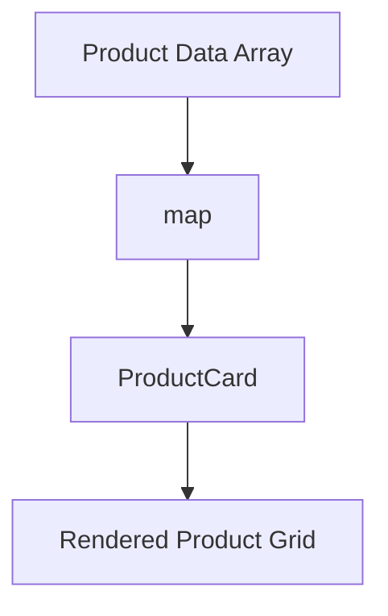

# Day 7 [Intermediate]: Mini Project - Product Listing UI

## Index

- [Goal](#goal)
- [Prerequisites](#prerequisites)
- [Explanation](#explanation)
- [Topic by Topic](#topic-by-topic)
- [Key Concepts](#key-concepts)
- [Visual Concept Map](#visual-concept-map)
- [End-to-End Practical](#end-to-end-practical)
- [Hands-on Coding](#hands-on-coding)
- [Mini Exercise](#mini-exercise)
- [Assessment Quiz](#assessment-quiz)
- [Task](#task)
- [Self Check](#self-check)
- [Interview Questions and Answers](#interview-questions-and-answers)
- [Day 7 Outcome](#day-7-outcome)

## Goal

Combine components, props, and list rendering to build a complete product listing page.

## Prerequisites

- Day 3 to Day 6 completed
- JSX, components, props, and map usage clear

## Explanation

This is the first integrated mini project where you apply multiple fundamentals in one screen.

## Topic by Topic

### Topic 1: Plan Screen Sections

Theory:
Planning avoids random coding and improves component boundaries.

Practical:
Define sections: title, filter area, product list.

Code Example:

Code Example:

```jsx
function AppLayout() {
  return (
    <main>
      <h1>Product Listing</h1>
      <section></section>
    </main>
  );
}
```

**Explanation:** Before building, plan the structure. Identify main sections (title, filters, product list). This helps you design components with clear boundaries.

**Key Points:**

- Plan UI structure before coding
- Identify main sections and their responsibilities
- Clear boundaries make components reusable
- Structure mirrors data flow

### Topic 2: Product Data Structure

Theory:
Array-based data enables scalable rendering.

Practical:
Create products array with id, name, price, category.

Code Example:

Code Example:

```jsx
const products = [
  { id: 1, name: "Phone", price: 22000, category: "Electronics" },
  { id: 2, name: "Headphones", price: 3500, category: "Audio" },
];
```

**Explanation:** Storing data in an array (not scattered across multiple variables) makes it easy to render lists. Each product is an object with properties. This structure scales well as you add more products.

**Key Points:**

- Use arrays for collections, not separate variables
- Each item is an object with related properties
- Easy to add, remove, or filter items
- Scales better as app grows

### Topic 3: Reusable ProductCard

Theory:
Card component should be presentation-focused.

Practical:
Build ProductCard using props.

Code Example:

Code Example:

```jsx
function ProductCard({ name, price, category }) {
  return (
    <div>
      <h3>{name}</h3>
      <p>{category}</p>
      <strong>${price}</strong>
    </div>
  );
}
```

**Explanation:** `ProductCard` is a presentation component - it only displays data passed as props. It doesn't manage data or fetch from APIs. This separation makes it reusable and testable.

**Key Points:**

- Presentation components only display props
- Don't fetch data or manage state
- Easier to test and reuse
- Single responsibility makes components predictable

### Topic 4: Render List with map

Theory:
Map converts each object into one ProductCard.

Practical:
Render all products using key.

Code Example:

Code Example:

```jsx
{
  products.map((p) => (
    <ProductCard
      key={p.id}
      name={p.name}
      price={p.price}
      category={p.category}
    />
  ));
}
```

**Explanation:** `.map()` loops through each product and creates a `ProductCard` for it. Each card receives different props from the array. The `key={p.id}` helps React track changes efficiently.

**Key Points:**

- `.map()` transforms array items into JSX elements
- Each instance gets unique props from the array
- `key` prop helps React track which items changed
- Efficient rendering of large lists

### Topic 5: UI Polish and Readability

Theory:
Spacing and grouping improve usability.

Practical:
Add basic card spacing and clean typography.

Code Example:

Code Example:

```jsx
<div style={{ maxWidth: "720px", margin: "0 auto", padding: "20px" }}></div>
```

**Explanation:** Basic styling (spacing, width limits, centering) makes the UI more usable. `maxWidth` limits how wide the content gets on large screens. `margin: "0 auto"` centers it. `padding` adds breathing room.

**Key Points:**

- `maxWidth` prevents content from becoming too wide
- `margin: "0 auto"` centers content horizontally
- `padding` adds internal spacing
- Simple styling dramatically improves UX

### Topic 6: Component Responsibilities in Small Projects

Theory:
Even a mini project becomes easier to extend if data, layout, and display responsibilities are separated early.

Practical:
Keep the array and list rendering in parent component, and keep `ProductCard` focused on display only.

Code Example:

Code Example:

```jsx
function ProductList({ products }) {
  return products.map((product) => (
    <ProductCard key={product.id} name={product.name} price={product.price} />
  ));
}

function ProductCard({ name, price }) {
  return (
    <div>
      {name} - ${price}
    </div>
  );
}
```

**Explanation:** This separation makes both components reusable: `ProductList` can work with any product data, and `ProductCard` doesn't care if data comes from an array or API. This is easier to test and maintain.

**Key Points:**

- Parent owns data, child owns display
- Components don't depend on data source
- Easier to test each piece independently
- Reuse in different contexts without changes

## Key Concepts

- Integrated mini project
- Data-driven rendering
- Reusable card composition
- map rendering with key
- Basic UI polish
- Parent owns data, child owns display
- Small-project structure thinking

## Visual Concept Map



## End-to-End Practical

1. Create product data array.
2. Build ProductCard component.
3. Render list with map.
4. Add title and layout styles.
5. Verify all cards show correct values.

## Hands-on Coding

### Example 1: Case - Electronics Showcase Data

Scenario:
An electronics catalog needs a small shared product dataset for phones, headphones, and accessories.

```jsx
const products = [
  { id: 1, name: "Phone", price: 22000 },
  { id: 2, name: "Headphones", price: 3500 },
  { id: 3, name: "Power Bank", price: 1800 },
];

function ProductCard({ name, price }) {
  return (
    <div
      style={{
        border: "1px solid #ddd",
        padding: "12px",
        marginBottom: "10px",
      }}
    >
      <h3>{name}</h3>
      <p>Price: ${price}</p>
    </div>
  );
}
```

### Example 2: Case - Catalog Page Layout

Scenario:
The product list page needs a centered layout, heading, and mapped product cards.

```jsx
function App() {
  return (
    <div style={{ maxWidth: "700px", margin: "0 auto", padding: "20px" }}>
      <h1>Product Listing</h1>
      {products.map((product) => (
        <ProductCard
          key={product.id}
          name={product.name}
          price={product.price}
        />
      ))}
    </div>
  );
}
```

### Example 3: Case - Add Stock Badge

Scenario:
A store manager wants the card to show whether each product is in stock or out of stock.

```jsx
function ProductCard({ name, price, stock }) {
  return (
    <div
      style={{
        border: "1px solid #ddd",
        padding: "12px",
        marginBottom: "10px",
      }}
    >
      <h3>{name}</h3>
      <p>Price: ${price}</p>
      <strong>{stock > 0 ? "In Stock" : "Out of Stock"}</strong>
    </div>
  );
}
```

## Mini Exercise

Scenario:
You are building a lightweight ecommerce catalog section.

Add rating and stock fields to each product and show In Stock or Out of Stock badge in ProductCard.

Expected output:

- Product card shows name, price, rating, and stock
- Badge color or text changes based on stock state
- List still renders from array using map

## Assessment Quiz

### Quiz Questions

1. Why is map used in product listing?
2. Why does each card need a key?
3. Which component should hold data array?
4. True or False: ProductCard should fetch API directly in this beginner mini project.
5. What is one benefit of reusable ProductCard?
6. Why keep `ProductCard` presentation-focused in this project?

### Quiz Answers

1. To render UI from each array item
2. For stable identity during updates
3. Parent/App component
4. False
5. Consistent UI and less duplication
6. It keeps the component simple and easier to reuse with different product data.

## Task

- Build product listing with at least 5 products
- Use reusable ProductCard
- Complete mini exercise

## Self Check

- You can combine components and props in one app
- You can render dynamic lists with map
- You can answer at least 4 out of 5 quiz questions correctly

## Interview Questions and Answers

### Beginner

**Question:** Why is this called a mini project?

**Answer:** It combines multiple basic concepts into one working UI.

**Question:** What does ProductCard do?

**Answer:** It displays one product using props.

### Middle

**Question:** Why keep data in parent component?

**Answer:** Parent controls state and passes data down predictably.

**Question:** Why use map over manual repeated JSX?

**Answer:** map is scalable and avoids duplication.

### Advanced

**Question:** How does component separation help future API integration?

**Answer:** Data and presentation stay decoupled, easing replacement of static array with API response.

**Question:** What risks exist with unstable keys?

**Answer:** UI glitches and incorrect re-render behavior.

## Day 7 Outcome

- You completed your first integrated React mini project
- You can confidently build data-driven card lists
- You are ready for state management in Day 8
