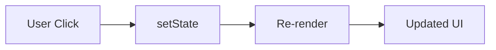

# Day 8 [Intermediate]: useState Introduction

## Index

- [Goal](#goal)
- [Prerequisites](#prerequisites)
- [Explanation](#explanation)
- [Topic by Topic](#topic-by-topic)
- [Key Concepts](#key-concepts)
- [Visual Concept Map](#visual-concept-map)
- [End-to-End Practical](#end-to-end-practical)
- [Hands-on Coding](#hands-on-coding)
- [Mini Exercise](#mini-exercise)
- [Assessment Quiz](#assessment-quiz)
- [Task](#task)
- [Self Check](#self-check)
- [Interview Questions and Answers](#interview-questions-and-answers)
- [Day 8 Outcome](#day-8-outcome)

## Goal

Learn and apply useState to manage changing UI data.

## Prerequisites

- Day 7 completed
- Event handling basics

## Explanation

useState is a Hook that stores component state and triggers re-render when updated.

## Topic by Topic

### Topic 1: State Concept

Theory:
State is internal data that can change.

Practical:
Create count state with initial value.

Code Example:

```jsx
const [count, setCount] = useState(0);
```

**Explanation:** `useState` creates a state variable `count` starting at 0, and a setter function `setCount` to update it. When `setCount` is called, React re-renders the component with the new value.

**Key Points:**

- `useState` returns [currentValue, setterFunction]
- Initial value (0) is the default
- Setter function updates state and triggers re-render
- Must import useState from React

### Topic 2: Updating State

Theory:
Use setter function, never direct mutation.

Practical:
Increase count on button click.

Code Example:

```jsx
function Counter() {
  const [count, setCount] = useState(0);

  return (
    <div>
      <p>Count: {count}</p>
      <button onClick={() => setCount(count + 1)}>Increase</button>
    </div>
  );
}
```

**Explanation:** When the button is clicked, the arrow function `() => setCount(count + 1)` runs, updating count to count + 1. React then re-renders, and the display shows the new value.

**Key Points:**

- onClick handler calls the update function
- Arrow functions `() => {}` are common for event handlers
- State updates trigger re-render automatically
- Component displays new state value after update

### Topic 3: Re-render Behavior

Theory:
State update causes component re-render.

Practical:
Display count value and observe updates.

Code Example:

```jsx
<p>Count: {count}</p>
```

**Explanation:** The current state value is always available in the component. Here `{count}` shows the current count. When state updates, this text automatically updates too.

**Key Points:**

- Display state using curly braces `{}`
- State updates automatically re-render
- No manual DOM manipulation needed
- Declarative: describe UI for each state

### Topic 4: Multiple Actions

Theory:
State can support increase, decrease, and reset actions.

Practical:
Add three buttons.

Code Example:

```jsx
<button onClick={() => setCount(0)}>Reset</button>
```

**Explanation:** Any value can be passed to `setCount`. Here we reset to 0. Resetting is useful for clearing forms or restarting interactions.

**Key Points:**

- Setter accepts any value
- Reset to initial value is common pattern
- Multiple buttons can update the same state
- Each action handler is independent

### Topic 5: State and User Interaction

Theory:
State links UI with user actions.

Practical:
Toggle a boolean status on click.

Code Example:

```jsx
const [open, setOpen] = useState(false);
```

**Explanation:** Boolean state is useful for showing/hiding UI elements. `!open` flips false to true or true to false.

**Key Points:**

- Boolean state for toggles (open/closed, on/off)
- `!value` flips boolean in event handler
- Common for modals, dropdowns, sidebars
- Cleaner than multiple string states

### Topic 6: Previous-state Updates and Safe Setter Patterns

Theory:
When the next state depends on the current state, using previous-state syntax is safer and more reliable.

Practical:
Use functional setter form for repeated clicks or batched updates.

Code Example:

```jsx
setCount((prevCount) => prevCount + 1);
```

**Explanation:** This **functional setter form** is safer when the next state depends on the current state. Instead of `setCount(count + 1)`, use `setCount((prev) => prev + 1)`. This ensures React uses the latest state value, even if updates are batched.

**Key Points:**

- Use functional form when new state depends on old state
- Safer for rapid updates or batched changes
- Best practice for state that builds on previous value
- Guarantees using most recent state value

### Topic 7: Why state logs can look old right after update

Theory:
React schedules state updates and may batch multiple updates together. Because of that, logging state immediately after calling the setter can still show the previous value in the current render.

Practical:
Call the setter, then log the value in the same function and observe the old value.

Code Example:

```jsx
function handleClick() {
  setCount(count + 1);
  console.log(count);
}
```

**Explanation:** `setCount(count + 1)` requests a future re-render. It does not instantly replace the `count` variable inside the current function call. After React re-renders, the new value appears in the UI. This is why functional updates are safer when the next value depends on the previous one.

**Key Points:**

- State setters schedule an update for the next render
- Immediate logs can still show the previous value
- React may batch multiple updates for efficiency

## Key Concepts

- useState hook
- Setter function
- Re-render cycle
- Immutable update pattern
- Interaction-driven UI
- Functional state update
- Batched state update mental model
- Previous-state dependent logic

## Visual Concept Map



## End-to-End Practical

1. Add count state.
2. Display count in UI.
3. Add increase, decrease, and reset buttons.
4. Add one boolean toggle state.

## Hands-on Coding

### Example 1: Case - Classroom Attendance Counter

Scenario:
A teacher uses a simple counter to increase or decrease the number of present students.

```jsx
import { useState } from "react";

function Counter() {
  const [count, setCount] = useState(0);
  return (
    <div>
      <p>Count: {count}</p>
      <button onClick={() => setCount(count + 1)}>+</button>
      <button onClick={() => setCount(count - 1)}>-</button>
      <button onClick={() => setCount(0)}>Reset</button>
    </div>
  );
}
```

### Example 2: Case - Team Online Status Toggle

Scenario:
An operations screen needs to switch between online and offline availability.

```jsx
function StatusToggle() {
  const [online, setOnline] = useState(false);
  return (
    <div>
      <p>{online ? "Online" : "Offline"}</p>
      <button onClick={() => setOnline(!online)}>Toggle</button>
    </div>
  );
}
```

### Example 3: Case - Click Activity Tracker

Scenario:
A practice screen tracks how many times a trainee clicks an action button.

```jsx
function ClickTracker() {
  const [clicks, setClicks] = useState(0);

  return (
    <div>
      <p>Total Clicks: {clicks}</p>
      <button onClick={() => setClicks(clicks + 1)}>Add Click</button>
      <button onClick={() => setClicks(0)}>Reset</button>
    </div>
  );
}
```

## Mini Exercise

Scenario:
You are creating an interaction tracker for a practice lab screen.

Build a click tracker that shows total clicks, last action type, and a reset action.

Expected output:

- Counter updates on each click
- Last action shows Increase or Decrease
- Reset restores values to initial state

## Assessment Quiz

### Quiz Questions

1. What does useState return?
2. Why not mutate state directly?
3. True or False: setState triggers re-render.
4. What is initial state value?
5. Can one component have multiple useState hooks?
6. When should functional update syntax be preferred?

### Quiz Answers

1. Current state value and setter function
2. React may not track updates correctly
3. True
4. The value passed to useState first time
5. Yes
6. When the next value depends on the previous state value.

## Task

- Build counter and toggle components
- Use at least two state variables
- Complete mini exercise

## Self Check

- You can create and update state
- You can explain re-render behavior
- You can answer at least 4 out of 5 quiz questions correctly

## Interview Questions and Answers

### Beginner

**Question:** What is useState?

**Answer:** Hook for storing changing data in function components.

**Question:** What does setState do?

**Answer:** Updates state and triggers UI re-render.

### Middle

**Question:** Why is direct state mutation bad?

**Answer:** It breaks predictable update flow and may skip re-render.

**Question:** Can you call useState multiple times?

**Answer:** Yes, for different data pieces.

### Advanced

**Question:** How does React batch state updates?

**Answer:** React may batch multiple updates for performance in one render cycle.

**Question:** When should functional state update syntax be used?

**Answer:** When next state depends on previous state.

## Day 8 Outcome

- You can manage interactive UI with useState
- You can build counters and toggles confidently
- You are ready for multiple state management in Day 9
