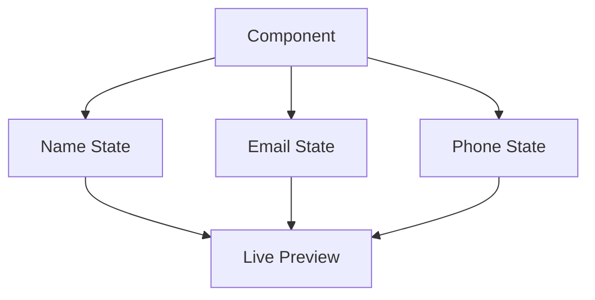

# Day 9 [Intermediate]: Managing Multiple States

## Index

- [Goal](#goal)
- [Prerequisites](#prerequisites)
- [Explanation](#explanation)
- [Topic by Topic](#topic-by-topic)
- [Key Concepts](#key-concepts)
- [Visual Concept Map](#visual-concept-map)
- [End-to-End Practical](#end-to-end-practical)
- [Hands-on Coding](#hands-on-coding)
- [Mini Exercise](#mini-exercise)
- [Assessment Quiz](#assessment-quiz)
- [Task](#task)
- [Self Check](#self-check)
- [Interview Questions and Answers](#interview-questions-and-answers)
- [Day 9 Outcome](#day-9-outcome)

## Goal

Manage multiple independent and related state values in the same component.

## Prerequisites

- Day 8 completed
- useState updates clear

## Explanation

Real forms and dashboards usually require several state variables. Good state design keeps logic clear.

## Topic by Topic

### Topic 1: Independent State Variables

Theory:
Use separate state variables for unrelated data.

Practical:
Create name and email states separately.

Code Example:

Code Example:

```jsx
const [name, setName] = useState("");
const [email, setEmail] = useState("");
```

**Explanation:** Use separate `useState` calls for unrelated data. Each state is independent - changing `name` doesn't affect `email`. This keeps each state focused.

**Key Points:**

- Multiple useState calls for unrelated data
- Each state is independent
- No connection between separate states
- Simpler to understand and manage

### Topic 2: Form Inputs and State

Theory:
Controlled inputs sync UI value with state.

Practical:
Bind input value and onChange handler.

Code Example:

Code Example:

```jsx
<input value={name} onChange={(e) => setName(e.target.value)} />
```

**Explanation:** This is a **controlled input** - React controls the input value via state. When the user types, `onChange` updates state, which updates the input. This makes React the "source of truth".

**Key Points:**

- Controlled inputs sync state with UI
- `value={state}` displays current state
- `onChange` handler updates state
- React is always the "source of truth"

### Topic 3: Derived Display

Theory:
Display values using current state snapshot.

Practical:
Show live preview under form fields.

Code Example:

Code Example:

```jsx
<p>Name: {name}</p>
<p>Email: {email}</p>
```

**Explanation:** Displaying state directly updates instantly. As the user types into inputs, the state updates, and the preview refreshes automatically. This gives immediate feedback.

**Key Points:**

- Display state anywhere in JSX
- Updates automatically on state changes
- No manual re-render needed
- Provides live feedback to users

### Topic 4: Reset Pattern

Theory:
Resetting multiple states is common in forms.

Practical:
Add clear button to reset all values.

Code Example:

```jsx
// Reset all states to initial values in one action
<button
  onClick={() => {
    setName("");
    {
      /* Clear name */
    }
    setEmail("");
    {
      /* Clear email */
    }
    setCity("");
    {
      /* Clear city */
    }
  }}
>
  Clear
</button>
```

**Explanation:** Resetting multiple states together is common in forms. A single function calls multiple setters. This clears the form completely.

**Key Points:**

- Reset related fields in one user action.
- Multiple setters can run in the same handler.
- Keep reset logic easy to find and reuse.

### Topic 5: Planning State Boundaries

Theory:
Keep state minimal and meaningful.

Practical:
Avoid storing values that can be derived.

Code Example:

Code Example:

```jsx
const [firstName, setFirstName] = useState("");
const [lastName, setLastName] = useState("");

const fullName = `${firstName} ${lastName}`;
```

**Explanation:** If a value can be calculated from other state, don't store it separately. Derived values reduce state complexity and eliminate sync issues (you never have stale data).

**Key Points:**

- Don't duplicate data in state
- Compute derived values on the fly
- Prevents inconsistency and bugs
- Keeps state minimal and focused

### Topic 6: Split State vs Group State

Theory:
Use separate state for unrelated values, but group values that are always updated together.

Practical:
Keep UI toggles separate, and keep profile fields in one object when they belong to one form.

Code Example:

```jsx
const [isOpen, setIsOpen] = useState(false); // unrelated UI state
const [profile, setProfile] = useState({ firstName: "", lastName: "" });
```

**Explanation:** Separate unrelated state values, but group values that naturally belong together. This balance keeps state design practical and readable.

**Key Points:**

- Split unrelated UI state.
- Group tightly related form or entity data.
- Let the update pattern guide the choice.

## Key Concepts

- Multiple useState hooks
- Controlled inputs
- Reset workflow
- Derived values
- State design decisions
- Split vs grouped state strategy

## Visual Concept Map



## End-to-End Practical

1. Create three state values.
2. Connect each to one input.
3. Display live preview.
4. Add reset action.

## Hands-on Coding

### Example 1: Case - Registration Form Inputs

Scenario:
An event signup screen collects name, email, and city in separate state values.

```jsx
import { useState } from "react";

function App() {
  const [name, setName] = useState("");
  const [email, setEmail] = useState("");
  const [city, setCity] = useState("");

  return (
    <div>
      <input
        placeholder="Name"
        value={name}
        onChange={(e) => setName(e.target.value)}
      />
      <input
        placeholder="Email"
        value={email}
        onChange={(e) => setEmail(e.target.value)}
      />
      <input
        placeholder="City"
        value={city}
        onChange={(e) => setCity(e.target.value)}
      />
      <p>
        {name} | {email} | {city}
      </p>
    </div>
  );
}
```

### Example 2: Case - Clear Form Button

Scenario:
The same registration screen needs a reset button that clears all fields at once.

```jsx
<button
  onClick={() => {
    setName("");
    setEmail("");
    setCity("");
  }}
>
  Reset Form
</button>
```

### Example 3: Case - Live Profile Preview

Scenario:
A profile setup page shows a preview card while the user types into multiple inputs.

```jsx
function ProfilePreview({ name, email, city }) {
  return (
    <div
      style={{ border: "1px solid #ddd", padding: "12px", marginTop: "12px" }}
    >
      <h3>{name || "Your Name"}</h3>
      <p>{email || "Your Email"}</p>
      <p>{city || "Your City"}</p>
    </div>
  );
}
```

## Mini Exercise

Scenario:
You are building a registration widget with live preview.

Build a registration form with states: firstName, lastName, email, phone, and show a profile preview card.

Expected output:

- Four controlled inputs connected to state
- Live preview updates instantly
- Reset button clears all fields

## Assessment Quiz

### Quiz Questions

1. Why use separate state variables?
2. What is a controlled input?
3. True or False: You should store derived fullName separately in state by default.
4. How do you reset multiple states?
5. Which is easier to maintain: meaningful state names or generic names?

### Quiz Answers

1. Clearer responsibility and easier updates
2. Input controlled by React state value
3. False
4. Call each setter with initial value
5. Meaningful names

## Task

- Build form with at least 3 state values
- Add live preview and reset button
- Complete mini exercise

## Self Check

- You can manage multiple state values correctly
- You can build controlled forms confidently
- You can answer at least 4 out of 5 quiz questions correctly

## Interview Questions and Answers

### Beginner

**Question:** Can one component use multiple states?

**Answer:** Yes.

**Question:** Why connect input value to state?

**Answer:** To keep React as source of truth.

### Middle

**Question:** What is a controlled component?

**Answer:** Form element whose value is driven by React state.

**Question:** How to reset complex forms?

**Answer:** Reset each state or reset one state object to initial values.

### Advanced

**Question:** How do you decide whether to split or combine states?

**Answer:** Split unrelated state; combine tightly related fields when updates are coordinated.

**Question:** What anti-pattern exists with redundant state?

**Answer:** Storing derivable values increases inconsistency risk.

## Day 9 Outcome

- You can build multi-state forms
- You can design cleaner state boundaries
- You are ready for object state handling in Day 10
