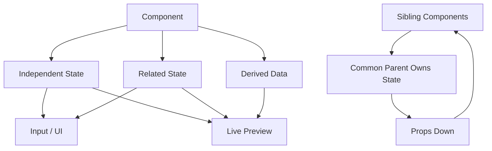

# Day 9 [Intermediate]: Managing Multiple States

## Index

- [Goal](#goal)
- [Prerequisites](#prerequisites)
- [Explanation](#explanation)
- [Topic by Topic](#topic-by-topic)
- [Key Concepts](#key-concepts)
- [Visual Concept Map](#visual-concept-map)
- [End-to-End Practical](#end-to-end-practical)
- [Hands-on Coding](#hands-on-coding)
- [Mini Exercise](#mini-exercise)
- [Assessment Quiz](#assessment-quiz)
- [Task](#task)
- [Self Check](#self-check)
- [Interview Questions and Answers](#interview-questions-and-answers)
- [Day 9 Outcome](#day-9-outcome)

## Goal

Learn how to manage multiple independent and related state values without redundant data, stale updates, contradictory UI states, or confusing state boundaries.

By the end of this lesson you should be able to decide:

- when to use multiple `useState` calls;
- when to group related values into one object;
- which values should be derived instead of stored;
- when to use functional state updates; and
- which component should own the source of truth.

## Prerequisites

- Day 8 completed
- `useState` and state snapshots understood
- Props and events
- Controlled inputs
- JavaScript objects and spread syntax

## Explanation

Real forms, dashboards, filters, dialogs, and interactive screens usually require more than one piece of state. The goal is **not** to minimize the number of `useState` calls. The goal is to model state according to meaning, ownership, and update relationships.

For example:

```jsx
const [name, setName] = useState("");
const [email, setEmail] = useState("");
const [isOpen, setIsOpen] = useState(false);
```

These values have different meanings and can change independently. Keeping them separate is often clearer.

At the same time, related data can be grouped:

```jsx
const [profile, setProfile] = useState({
  firstName: "",
  lastName: "",
});
```

There is no universal rule saying “always use separate state” or “always use one object.” **The relationship between the values and their update patterns should drive the decision.** Object-state updates are covered deeply on Day 10.

## Topic by Topic

### Topic 1: Independent State Variables

#### Theory
Use separate state variables when values have independent meaning or update independently.

#### Practical
Create name and email states separately.

#### Code Example

```jsx
import { useState } from "react";

function RegistrationFields() {
  const [name, setName] = useState("");
  const [email, setEmail] = useState("");

  return (
    <>
      <input value={name} onChange={(e) => setName(e.target.value)} />
      <input value={email} onChange={(e) => setEmail(e.target.value)} />
    </>
  );
}
```

**Explanation:** Each state value has its own setter and responsibility. Updating `name` does not require changing `email`.

**Key Points:**

- Multiple `useState` calls are completely valid.
- Separate unrelated values.
- Give state meaningful names.
- Don't combine values only to reduce the number of hooks.

### Topic 2: Form Inputs and State

#### Theory
A controlled input gets its displayed value from React state and reports changes through an event.

#### Practical
Bind `value` and `onChange` to state.

```jsx
<input
  value={name}
  onChange={(e) => setName(e.target.value)}
/>
```

**Explanation:** React becomes the source of truth. The flow is:

```text
User input → event → state setter → render → updated input
```

**Key Points:**

- `value={state}` displays the current state.
- `onChange` updates the state.
- Controlled inputs make validation and derived UI easier.
- Keep the value type consistent with the input.

### Topic 3: Derived Display

#### Theory
A value that can be calculated from existing state is normally derived during render instead of stored as another state variable.

#### Practical
Show a live preview.

```jsx
const [firstName, setFirstName] = useState("");
const [lastName, setLastName] = useState("");

const fullName = `${firstName} ${lastName}`.trim();

return <p>Name: {fullName || "Your name"}</p>;
```

**Explanation:** `fullName` is derived from `firstName` and `lastName`. Storing it separately would create two sources of truth that need synchronization.

**Key Points:**

- Derive values during render when practical.
- Avoid redundant state.
- Derived values update automatically when their source state changes.
- Do not reach for `useEffect` just to calculate synchronous derived data.

### Topic 4: Reset Pattern

#### Theory
Resetting several state values is common in forms and dialogs.

#### Practical
Use a reset function so the behavior is easy to reuse.

```jsx
const initialForm = {
  name: "",
  email: "",
  city: "",
};

const [form, setForm] = useState(initialForm);

function resetForm() {
  setForm(initialForm);
}
```

When state is intentionally split into independent values, multiple setters are also valid:

```jsx
function resetForm() {
  setName("");
  setEmail("");
  setCity("");
}
```

**Key Points:**

- Keep reset behavior explicit.
- A reset should restore the intended initial UI state.
- Prefer a reusable reset function when the same action is triggered from multiple places.

### Topic 5: Functional Updates

#### Theory
When the next state depends on the previous state, use the functional updater form.

```jsx
setCount((current) => current + 1);
setCount((current) => current + 1);
```

This is safer when multiple updates are queued in the same event because each updater receives the appropriate previous state in the update sequence.

Prefer:

```jsx
setCount((current) => current + 1);
```

over a value update when the calculation depends on the previous count.

### Topic 6: Split State vs Group State

#### Theory
Use separate state for unrelated values, but group values when they form a meaningful domain object or are naturally edited together.

```jsx
const [isOpen, setIsOpen] = useState(false);
const [profile, setProfile] = useState({
  firstName: "",
  lastName: "",
});
```

**Explanation:** `isOpen` represents UI state while `profile` represents related user data. Grouping does not make the object automatically better; update patterns still matter.

**Decision guide:**

| Situation | Good starting point |
|---|---|
| Unrelated values | Separate state |
| Related form/entity fields | Object state can be useful |
| Values that always change together | Grouping may improve clarity |
| Mutually exclusive UI states | One status value may be clearer |
| Very complex transitions | Consider `useReducer` later |

### Topic 7: Avoid Impossible State Combinations

Several booleans can represent states that should never occur together:

```jsx
const [isLoading, setIsLoading] = useState(false);
const [isSuccess, setIsSuccess] = useState(false);
const [isError, setIsError] = useState(false);
```

A single status can express the state machine more clearly:

```jsx
const [status, setStatus] = useState("idle");
// "idle" | "loading" | "success" | "error"
```

This makes impossible combinations such as `loading + success` harder to represent.

### Topic 8: State Ownership and Lifting State Up

Ask: **Which component should own the source of truth?**

Keep state close to the components that use it. If two sibling components need the same value, move the state to their nearest common parent and pass the value and callbacks down as props.

```text
Parent owns state
   ├── Child A reads data
   └── Child B updates data
```

This is called **lifting state up**. It prepares you for more advanced component communication patterns later in the curriculum.

## Key Concepts

- Multiple `useState` hooks
- Independent state
- Controlled inputs
- Source of truth
- Derived data
- Functional updates
- State snapshots
- Reset workflows
- Split vs grouped state
- Impossible state combinations
- State ownership
- Lifting state up
- Avoiding redundant state

## Visual Concept Map



## End-to-End Practical

Build a small registration screen that demonstrates the complete Day 9 model.

1. Create separate `name`, `email`, and `city` state values.
2. Connect each value to a controlled input.
3. Display a live preview.
4. Add a derived `displayName` or `profileSummary` value.
5. Add a reset action.
6. Add an independent `isPreviewOpen` UI state.
7. Add a `submitStatus` state using `idle`, `submitting`, `success`, and `error` rather than several contradictory booleans.
8. Identify which state belongs to the component and which data could be passed to children.

## Hands-on Coding

### Example 1: Registration Form Inputs

```jsx
import { useState } from "react";

export default function RegistrationForm() {
  const [name, setName] = useState("");
  const [email, setEmail] = useState("");
  const [city, setCity] = useState("");

  return (
    <div>
      <input
        placeholder="Name"
        value={name}
        onChange={(e) => setName(e.target.value)}
      />
      <input
        placeholder="Email"
        value={email}
        onChange={(e) => setEmail(e.target.value)}
      />
      <input
        placeholder="City"
        value={city}
        onChange={(e) => setCity(e.target.value)}
      />
      <p>{name} | {email} | {city}</p>
    </div>
  );
}
```

### Example 2: Live Profile Preview

```jsx
function ProfilePreview({ name, email, city }) {
  return (
    <div>
      <h3>{name || "Your Name"}</h3>
      <p>{email || "Your Email"}</p>
      <p>{city || "Your City"}</p>
    </div>
  );
}
```

The parent owns the source of truth and passes data to the preview. The preview does not need its own copy of `name`, `email`, or `city`.

### Example 3: Functional Update

```jsx
const [count, setCount] = useState(0);

function addTwo() {
  setCount((current) => current + 1);
  setCount((current) => current + 1);
}
```

### Example 4: State Machine Instead of Contradictory Booleans

```jsx
const [status, setStatus] = useState("idle");

function startSubmit() {
  setStatus("submitting");
}

function submitSucceeded() {
  setStatus("success");
}

function submitFailed() {
  setStatus("error");
}
```

## Mini Exercise

Build a registration widget with:

- `firstName`
- `lastName`
- `email`
- `phone`
- live profile preview
- reset button
- derived `fullName`

Expected output:

- Four controlled inputs.
- Live preview updates immediately.
- `fullName` is derived, not duplicated in state.
- Reset clears the form.
- No direct mutation.

## Assessment Quiz

### Quiz Questions

1. Why can separate `useState` values be preferable for unrelated data?
2. What makes an input controlled?
3. Should `fullName` normally be stored separately if it can be calculated from `firstName` and `lastName`?
4. When should a functional state update be used?
5. Why can one `status` value be better than several booleans?
6. When should state be moved to a parent?
7. Does having fewer `useState` calls automatically mean better state design?
8. Why is duplicated state risky?

### Quiz Answers

1. Each value has an independent responsibility and update path.
2. React state drives its displayed `value` and an event handler updates that state.
3. Usually no; derive it from the source state.
4. When the next state depends on the previous state.
5. It can make mutually exclusive states explicit and prevent contradictory combinations.
6. When multiple components need the same source of truth, typically in their nearest common parent.
7. No. Meaningful state boundaries matter more than hook count.
8. Two sources of truth can become inconsistent and require synchronization.

## Task

Build a **Student Registration Panel**.

Requirements:

- At least three controlled inputs.
- One independent UI state such as `isPreviewOpen`.
- One derived value.
- Functional update where previous state is required.
- A reset action.
- A single status value for submission state.
- No redundant state.
- Explain why each state variable exists and who owns it.

### Extension Challenge

Split the UI into `RegistrationForm` and `ProfilePreview`. Keep the source of truth in the correct parent and pass the minimum required props.

## Self Check

Before moving to Day 10, you should be able to answer:

- Can I explain why each state variable exists?
- Can I identify derived values that should not be state?
- Can I choose between separate and grouped state with a reason?
- Can I use a functional updater when previous state matters?
- Can I identify contradictory boolean state?
- Can I explain where shared state should live?
- Can I build and reset a multi-field controlled form?

If any answer is “no,” revisit the corresponding topic before continuing.

## Interview Questions and Answers

### Beginner

**Question:** Can one component use multiple `useState` hooks?

**Answer:** Yes. Multiple state variables are normal and useful when values have independent responsibilities.

**Question:** What is a controlled input?

**Answer:** A form element whose displayed value is driven by React state and updated through an event handler.

### Intermediate

**Question:** How do you decide whether to split or combine state?

**Answer:** Consider semantic relationships, whether values update together, and whether grouping makes updates clearer. Do not optimize for the smallest number of hooks.

**Question:** What is derived state?

**Answer:** Data calculated from existing props or state. If it can be calculated during render, it usually does not need its own state variable.

**Question:** Why use functional updates?

**Answer:** They express that the next value depends on the previous value and avoid relying on a stale render snapshot when updates are queued.

### Advanced

**Question:** Why can several boolean states be a design problem?

**Answer:** Independent booleans can represent combinations that are logically impossible. A single status or discriminated state can make valid states explicit.

**Question:** When should state be lifted up?

**Answer:** When multiple components need to read or update the same source of truth. Move it to their nearest common owner and pass data/actions through props.

**Question:** Is grouping related values into an object always better?

**Answer:** No. Object state is useful for related domain data, but separate state can be clearer when values have independent lifecycles or update patterns.

**Question:** Why is redundant state an architectural problem?

**Answer:** It creates multiple sources of truth and forces synchronization, which increases the chance of stale or inconsistent UI.

## Day 9 Outcome

You can now:

- manage multiple state values confidently;
- build controlled multi-field forms;
- distinguish state from derived data;
- use functional updates when previous state matters;
- choose between split and grouped state intentionally;
- model mutually exclusive UI states clearly;
- identify state ownership and lift shared state when necessary; and
- avoid redundant state and unnecessary synchronization.

You are ready for **Day 10: Object State Handling**, where grouped state, immutable object updates, nested objects, and generic form handlers are explored in depth.
