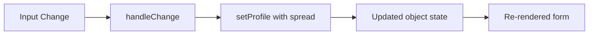

# Day 10 [Intermediate]: Object State Handling

## Index

- [Goal](#goal)
- [Prerequisites](#prerequisites)
- [Explanation](#explanation)
- [Topic by Topic](#topic-by-topic)
- [Key Concepts](#key-concepts)
- [Visual Concept Map](#visual-concept-map)
- [End-to-End Practical](#end-to-end-practical)
- [Hands-on Coding](#hands-on-coding)
- [Mini Exercise](#mini-exercise)
- [Assessment Quiz](#assessment-quiz)
- [Task](#task)
- [Self Check](#self-check)
- [Interview Questions and Answers](#interview-questions-and-answers)
- [Day 10 Outcome](#day-10-outcome)

## Goal

Manage related form data using one object state and update it safely.

## Prerequisites

- Day 9 completed
- Multiple state patterns understood

## Explanation

When values are strongly related, object state keeps them grouped. Updates must preserve existing fields.

## Topic by Topic

### Topic 1: Object State Basics

Theory:
Object state stores related values in one place.

Practical:
Initialize profile object.

Code Example:

Code Example:

```jsx
const [profile, setProfile] = useState({
  firstName: "",
  lastName: "",
  age: "",
});
```

**Explanation:** When values are strongly related (like profile fields), group them in one object. This keeps related data together and makes it easier to pass around.

**Key Points:**

- Group related fields in one object state
- Better than scattered individual states
- Easier to pass to child components
- Natural representation of forms or entities

### Topic 2: Safe Field Updates

Theory:
Use spread syntax to keep existing fields.

Practical:
Update only one property per input event.

Code Example:

Code Example:

```jsx
setProfile((prev) => ({ ...prev, firstName: "Karan" }));
```

**Explanation:** Never replace the entire object. Use spread (`...prev`) to copy all existing fields, then override only the one you're changing. This prevents accidentally losing other fields.

**Key Points:**

- Always use spread operator for object updates
- Spread copies existing fields
- Override only the field being changed
- Protects against data loss

### Topic 3: Generic Input Handler

Theory:
One handler can update multiple fields by input name.

Practical:
Use name and value from event target.

Code Example:

Code Example:

```jsx
const handleChange = (e) => {
  const { name, value } = e.target;
  setProfile((prev) => ({
    ...prev,
    [name]: value,
  }));
};
```

**Explanation:** One handler function works for all inputs. The `[name]` syntax (computed property) dynamically updates the field that changed. This reduces code duplication.

**Key Points:**

- One handler for multiple input fields
- `[name]` syntax updates field dynamically
- Reduces code duplication
- Input names must match state keys

### Topic 4: Object State in Forms

Theory:
Useful for profile and editor forms.

Practical:
Build 3-input profile form.

Code Example:

```jsx
<input name="firstName" value={profile.firstName} onChange={handleChange} />
```

**Explanation:** Object state works especially well for forms because all related fields can be updated through one shared shape and one shared handler.

**Key Points:**

- Forms often map naturally to object state.
- One object can hold many related fields.
- Shared handlers reduce duplication.

### Topic 5: Common Pitfalls

Theory:
Replacing object without spread removes other fields.

Practical:
Compare wrong update vs correct update.

Code Example:

```jsx
// WRONG - loses other fields:
setProfile({ firstName: value });
{
  /* Only firstName remains */
}

// CORRECT - keeps all fields:
setProfile((prev) => ({ ...prev, firstName: value }));
{
  /* All fields preserved */
}
```

**Explanation:** A common mistake is replacing the entire object instead of spreading. Without spread, all other fields are lost. Always use the spread operator when updating nested objects.

**Key Points:**

- Replacing the whole object can remove other fields.
- Spread preserves existing data safely.
- Check object updates carefully during debugging.

### Topic 6: Nested Object Update Pattern

Theory:
For nested objects, spread each nested level you update to avoid accidental data loss.

Practical:
Update only city inside profile.address while keeping other fields safe.

Code Example:

Code Example:

```jsx
setProfile((prev) => ({
  ...prev,
  address: {
    ...prev.address,
    city: "Pune",
  },
}));
```

**Explanation:** For nested objects, you must spread at **each** level you modify. First spread the outer object, then spread the nested one before changing a field. This ensures all data is preserved at each level.

**Key Points:**

- Spread at each nesting level being modified
- Outer spread preserves sibling fields
- Inner spread preserves sibling nested fields
- Critical for deeply nested data structures

## Key Concepts

- Object state grouping
- Spread operator updates
- Generic field handler
- Immutable state update
- Data integrity
- Nested update safety

## Visual Concept Map



## End-to-End Practical

1. Create profile object state.
2. Build generic input handler.
3. Wire 3 to 4 inputs.
4. Render live profile preview.
5. Add reset action.

## Hands-on Coding

### Example 1: Case - HR Employee Profile Editor

Scenario:
An HR team needs to update employee profile details in one form and preview the latest values live.

```jsx
import { useState } from "react";

function App() {
  const [profile, setProfile] = useState({
    firstName: "",
    lastName: "",
    age: "",
  });

  const handleChange = (e) => {
    const { name, value } = e.target;
    setProfile((prev) => ({ ...prev, [name]: value }));
  };

  return (
    <div>
      <input
        name="firstName"
        placeholder="First Name"
        value={profile.firstName}
        onChange={handleChange}
      />
      <input
        name="lastName"
        placeholder="Last Name"
        value={profile.lastName}
        onChange={handleChange}
      />
      <input
        name="age"
        placeholder="Age"
        value={profile.age}
        onChange={handleChange}
      />
      <p>
        {profile.firstName} {profile.lastName} ({profile.age})
      </p>
    </div>
  );
}
```

### Example 2: Case - Event Registration Form Reset

Scenario:
A conference registration page should allow users to fill related fields and reset everything with one click.

```jsx
import { useState } from "react";

function App() {
  const initialRegistration = { name: "", email: "", company: "" };
  const [registration, setRegistration] = useState(initialRegistration);

  return (
    <div>
      <input
        placeholder="Name"
        value={registration.name}
        onChange={(e) =>
          setRegistration((prev) => ({ ...prev, name: e.target.value }))
        }
      />
      <input
        placeholder="Email"
        value={registration.email}
        onChange={(e) =>
          setRegistration((prev) => ({ ...prev, email: e.target.value }))
        }
      />
      <input
        placeholder="Company"
        value={registration.company}
        onChange={(e) =>
          setRegistration((prev) => ({ ...prev, company: e.target.value }))
        }
      />

      <button onClick={() => setRegistration(initialRegistration)}>
        Reset
      </button>
    </div>
  );
}
```

### Example 3: Case - Bank KYC Update Screen

Scenario:
A banking portal needs a KYC update form where changing one field should not clear the other fields.

```jsx
import { useState } from "react";

function App() {
  const [kyc, setKyc] = useState({ pan: "", aadhaar: "", mobile: "" });

  const handleChange = (e) => {
    const { name, value } = e.target;
    setKyc((prev) => ({ ...prev, [name]: value }));
  };

  return (
    <div>
      <input
        name="pan"
        placeholder="PAN"
        value={kyc.pan}
        onChange={handleChange}
      />
      <input
        name="aadhaar"
        placeholder="Aadhaar"
        value={kyc.aadhaar}
        onChange={handleChange}
      />
      <input
        name="mobile"
        placeholder="Mobile"
        value={kyc.mobile}
        onChange={handleChange}
      />
      <p>
        {kyc.pan} | {kyc.aadhaar} | {kyc.mobile}
      </p>
    </div>
  );
}
```

## Mini Exercise

Scenario:
You are creating an HR profile editor where related fields must be updated safely.

Build an employee editor with fields: name, department, salary, location. Add Update Preview and Reset actions.

Expected output:

- One object state holds all fields
- Generic handler updates fields by name
- Reset returns object to initial values

## Assessment Quiz

### Quiz Questions

1. Why use spread in object state updates?
2. What does [name]: value do?
3. True or False: setProfile({ firstName: "A" }) keeps all other fields automatically.
4. When is object state better than separate state variables?
5. What is one advantage of generic handlers?

### Quiz Answers

1. To preserve existing properties
2. Dynamically updates the field whose name matches input name
3. False
4. When fields are strongly related
5. Less duplicate code

## Task

- Build one object-state form
- Use generic handleChange
- Add reset action
- Complete mini exercise

## Self Check

- You can update object fields safely
- You can explain immutable updates
- You can answer at least 4 out of 5 quiz questions correctly

## Interview Questions and Answers

### Beginner

**Question:** What is object state?

**Answer:** A state value stored as an object with multiple related properties.

**Question:** Why not update only one property without spread?

**Answer:** Other properties may be lost.

### Middle

**Question:** How does a generic form handler work?

**Answer:** It reads input name and value, then updates the matching state field.

**Question:** What are benefits of grouping related fields in object state?

**Answer:** Better organization and easier form-level operations.

### Advanced

**Question:** What are tradeoffs between object state and multiple useState hooks?

**Answer:** Object state centralizes related data but needs careful immutable updates; separate hooks are explicit but can be verbose.

**Question:** Why are immutable patterns essential in React state?

**Answer:** They keep update detection reliable and prevent unintended side effects.

## Day 10 Outcome

- You can manage complex related form fields using object state
- You can implement safe immutable update patterns
- You are ready to move to array state and advanced forms
