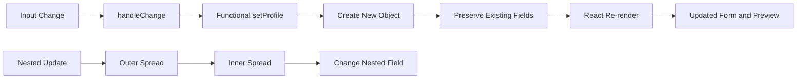

# Day 10 [Intermediate]: Object State Handling

## Index

- [Goal](#goal)
- [Prerequisites](#prerequisites)
- [Explanation](#explanation)
- [Topic by Topic](#topic-by-topic)
- [Key Concepts](#key-concepts)
- [Visual Concept Map](#visual-concept-map)
- [End-to-End Practical](#end-to-end-practical)
- [Hands-on Coding](#hands-on-coding)
- [Mini Exercise](#mini-exercise)
- [Assessment Quiz](#assessment-quiz)
- [Task](#task)
- [Self Check](#self-check)
- [Interview Questions and Answers](#interview-questions-and-answers)
- [Day 10 Outcome](#day-10-outcome)

## Goal

Learn when object state is useful and how to update objects immutably, including nested objects, arrays inside objects, generic form handlers, reset patterns, and state-design decisions.

## Prerequisites

- Day 9 completed
- `useState` and multiple-state patterns understood
- JavaScript objects and spread syntax
- Controlled inputs and event handlers

## Explanation

When several values belong to the same domain model, an object can provide a useful single state boundary. A profile, registration form, employee record, or checkout draft can naturally be represented as one object.

Object state is **not automatically better** than multiple `useState` calls. Choose the shape that makes the relationships and update rules easiest to understand. React state should be treated as read-only: create a new object when changing it instead of mutating the existing object.

```jsx
const [profile, setProfile] = useState({
  firstName: "",
  lastName: "",
  age: "",
});
```

A crucial rule is that `useState` does **not** shallow-merge object state. The value passed to the setter becomes the next state value.

```jsx
// Replaces the entire object.
setProfile({ firstName: "Asha" });

// Preserves the other fields.
setProfile((current) => ({
  ...current,
  firstName: "Asha",
}));
```

## Topic by Topic

### Topic 1: Object State Basics

**Theory:** Object state stores related values in one state value.

**Practical:** Initialize a profile object and render its fields.

```jsx
const [profile, setProfile] = useState({
  firstName: "",
  lastName: "",
  age: "",
});
```

**When it helps:** forms and domain data where fields are strongly related.

**Important:** Do not group unrelated UI state just because an object is convenient.

**Key Points:**

- Group related fields when they share a meaningful relationship.
- One object can represent a form or entity draft.
- Passing the object to a child can be convenient.
- Separate state variables can still be clearer for independent UI concerns.

### Topic 2: Safe Field Updates

**Theory:** Create a new object and preserve existing properties.

```jsx
setProfile((prev) => ({
  ...prev,
  firstName: "Karan",
}));
```

The spread copies the existing enumerable properties and the later property overrides `firstName`.

**Wrong:**

```jsx
profile.firstName = "Karan";
```

Direct mutation changes the existing object instead of describing a new state value. It can lead to stale references and unpredictable UI behavior.

**Key Points:**

- Treat state as immutable from the component's point of view.
- Preserve fields you are not changing.
- Prefer a functional updater when the next state depends on the previous state.

### Topic 3: Generic Input Handler

One handler can update multiple text-like inputs by using the input's `name` as a computed property key.

```jsx
function handleChange(event) {
  const { name, value } = event.target;

  setProfile((current) => ({
    ...current,
    [name]: value,
  }));
}
```

```jsx
<input
  name="firstName"
  value={profile.firstName}
  onChange={handleChange}
/>
```

`[name]` means the property key is evaluated dynamically. If `name` is `"firstName"`, the resulting object update is equivalent to setting `firstName`.

**Important:** A generic handler must match the state shape. For checkboxes, numbers, selects, and nested paths, the conversion rules may be different.

### Topic 4: Object State in Forms

Object state maps naturally to controlled forms.

```jsx
function ProfileForm() {
  const [profile, setProfile] = useState({
    firstName: "",
    lastName: "",
    city: "",
  });

  function handleChange(event) {
    const { name, value } = event.target;
    setProfile((current) => ({ ...current, [name]: value }));
  }

  return (
    <form>
      <input name="firstName" value={profile.firstName} onChange={handleChange} />
      <input name="lastName" value={profile.lastName} onChange={handleChange} />
      <input name="city" value={profile.city} onChange={handleChange} />
    </form>
  );
}
```

For a numeric field, remember that HTML input values are normally strings:

```jsx
<input
  name="age"
  type="number"
  value={profile.age}
  onChange={(event) =>
    setProfile((current) => ({ ...current, age: event.target.value }))
  }
/>
```

Whether to store `"25"` or `25` is a domain decision. Do not accidentally mix types throughout the application.

### Topic 5: Common Pitfalls

**Wrong — replaces the complete object:**

```jsx
setProfile({ firstName: value });
```

If the previous object also contained `lastName` and `city`, those properties are not automatically retained.

**Correct:**

```jsx
setProfile((prev) => ({
  ...prev,
  firstName: value,
}));
```

Other common mistakes include mutating state directly, storing derived values unnecessarily, and using one giant object for unrelated UI state.

### Topic 6: Nested Object Update Pattern

For nested data, create a new object at every level whose properties you change.

```jsx
setProfile((prev) => ({
  ...prev,
  address: {
    ...prev.address,
    city: "Pune",
  },
}));
```

The outer spread preserves sibling fields such as `firstName`. The inner spread preserves sibling address fields such as `country`.

**Do not do this:**

```jsx
setProfile((prev) => ({
  ...prev,
  address: {
    city: "Pune",
  },
}));
```

That intentionally replaces the `address` object and therefore loses other address properties.

### Topic 7: Objects Containing Arrays

Immutability also applies to arrays nested inside an object.

```jsx
setProfile((current) => ({
  ...current,
  skills: [...current.skills, "React"],
}));
```

Removing an item can be done with a new array:

```jsx
setProfile((current) => ({
  ...current,
  skills: current.skills.filter((skill) => skill !== "React"),
}));
```

Avoid mutating methods such as `push` or `splice` directly on the state array.

### Topic 8: Functional Updates and State Snapshots

Use the functional updater when the next object depends on the previous object.

```jsx
setProfile((current) => ({
  ...current,
  age: Number(current.age) + 1,
}));
```

React state behaves like a snapshot for a render. Calling a setter requests a future render; it does not change the state variable already captured by the current event handler.

When several updates depend on the previous value, functional updates make the sequence explicit:

```jsx
setProfile((current) => ({ ...current, age: Number(current.age) + 1 }));
setProfile((current) => ({ ...current, age: Number(current.age) + 1 }));
```

### Topic 9: Resetting Object State

Keep a reset shape that represents the desired initial state.

```jsx
const initialProfile = {
  firstName: "",
  lastName: "",
  city: "",
};

const [profile, setProfile] = useState(initialProfile);

function reset() {
  setProfile(initialProfile);
}
```

Do not mutate `initialProfile`. If the initial value contains mutable nested data that your code could accidentally mutate outside React's state update flow, create a fresh initial value when needed.

A factory is useful when you want a fresh object graph:

```jsx
function createInitialProfile() {
  return {
    firstName: "",
    lastName: "",
    address: { country: "India", city: "" },
    skills: [],
  };
}

const [profile, setProfile] = useState(createInitialProfile);

function reset() {
  setProfile(createInitialProfile());
}
```

### Topic 10: Choosing Object State vs Multiple State Variables

Ask whether the values have a meaningful relationship.

**Object state can be useful when:**

- fields form one domain object or form
- operations commonly update several related fields
- the values are passed around together

**Separate state can be clearer when:**

- values are independent UI concerns
- each value has different update rules
- grouping would create an unnecessarily large state object

There is no rule that every form must use one object or that every value must use its own `useState`.

### Topic 11: Derived State and Single Source of Truth

Do not store a value when it can be calculated from existing state during render.

```jsx
const [profile, setProfile] = useState({
  firstName: "Asha",
  lastName: "Sharma",
});

const fullName = `${profile.firstName} ${profile.lastName}`;
```

Avoid creating another `fullName` state unless there is a genuine independent reason. Duplicate state creates synchronization problems.

### Topic 12: When `useReducer` Becomes a Better Fit

Object state is not a replacement for every state-management pattern. If updates become numerous, conditional, or action-driven, `useReducer` may make transitions easier to reason about.

```jsx
function reducer(state, action) {
  switch (action.type) {
    case "profile/nameChanged":
      return { ...state, firstName: action.value };
    case "profile/reset":
      return createInitialProfile();
    default:
      return state;
  }
}
```

The important decision is not “object vs reducer” as a syntax preference. It is whether the state transitions are simple enough for direct setters or benefit from explicit actions and centralized transition logic.

## Key Concepts

- Object state grouping
- State replacement rather than automatic merging
- Spread operator updates
- Functional setters
- Generic field handlers
- Computed property names
- Controlled inputs
- Immutable nested updates
- Immutable arrays inside objects
- Reset patterns
- State snapshots
- Derived state
- Single source of truth
- State ownership
- Object state vs separate state
- When `useReducer` may be a better fit

## Visual Concept Map



## End-to-End Practical

Build an **Employee Profile Editor**.

1. Create object state containing `name`, `department`, `salary`, `location`.
2. Add a nested `address` object.
3. Add a `skills` array.
4. Build a generic handler for simple inputs.
5. Update the nested city immutably.
6. Add and remove skills without mutation.
7. Render a live preview from state.
8. Add Reset using a reusable initial-state factory.
9. Add a derived display value such as a formatted employee summary rather than storing it separately.
10. Explain which values belong together and which UI state should remain separate.

## Hands-on Coding

### Example 1: Case - HR Employee Profile Editor

Scenario: An HR team needs to update employee profile details in one form and preview the latest values live.

```jsx
import { useState } from "react";

const initialProfile = {
  firstName: "",
  lastName: "",
  age: "",
};

export default function App() {
  const [profile, setProfile] = useState(initialProfile);

  const handleChange = (event) => {
    const { name, value } = event.target;
    setProfile((prev) => ({ ...prev, [name]: value }));
  };

  return (
    <div>
      <input
        name="firstName"
        placeholder="First Name"
        value={profile.firstName}
        onChange={handleChange}
      />
      <input
        name="lastName"
        placeholder="Last Name"
        value={profile.lastName}
        onChange={handleChange}
      />
      <input
        name="age"
        placeholder="Age"
        value={profile.age}
        onChange={handleChange}
      />
      <p>
        {profile.firstName} {profile.lastName} ({profile.age})
      </p>
    </div>
  );
}
```

### Example 2: Case - Event Registration Form Reset

Scenario: A conference registration page should allow users to fill related fields and reset everything with one click.

```jsx
import { useState } from "react";

const initialRegistration = {
  name: "",
  email: "",
  company: "",
};

export default function App() {
  const [registration, setRegistration] = useState(initialRegistration);

  const handleChange = (event) => {
    const { name, value } = event.target;
    setRegistration((prev) => ({ ...prev, [name]: value }));
  };

  return (
    <form>
      <input name="name" value={registration.name} onChange={handleChange} />
      <input name="email" value={registration.email} onChange={handleChange} />
      <input name="company" value={registration.company} onChange={handleChange} />
      <button type="button" onClick={() => setRegistration(initialRegistration)}>
        Reset
      </button>
    </form>
  );
}
```

### Example 3: Case - Bank KYC Update Screen

Scenario: A banking portal needs a KYC update form where changing one field should not clear the other fields.

```jsx
import { useState } from "react";

export default function App() {
  const [kyc, setKyc] = useState({
    pan: "",
    aadhaar: "",
    mobile: "",
  });

  const handleChange = (event) => {
    const { name, value } = event.target;
    setKyc((prev) => ({ ...prev, [name]: value }));
  };

  return (
    <div>
      <input name="pan" value={kyc.pan} onChange={handleChange} />
      <input name="aadhaar" value={kyc.aadhaar} onChange={handleChange} />
      <input name="mobile" value={kyc.mobile} onChange={handleChange} />
      <p>
        {kyc.pan} | {kyc.aadhaar} | {kyc.mobile}
      </p>
    </div>
  );
}
```

### Example 4: Nested Profile Update

```jsx
const [profile, setProfile] = useState({
  name: "Asha",
  address: {
    city: "Delhi",
    country: "India",
  },
});

function changeCity(city) {
  setProfile((prev) => ({
    ...prev,
    address: {
      ...prev.address,
      city,
    },
  }));
}
```

The country is preserved because the existing nested object is spread before changing `city`.

### Example 5: Object Containing an Array

```jsx
function addSkill(skill) {
  setProfile((prev) => ({
    ...prev,
    skills: [...prev.skills, skill],
  }));
}

function removeSkill(skillToRemove) {
  setProfile((prev) => ({
    ...prev,
    skills: prev.skills.filter((skill) => skill !== skillToRemove),
  }));
}
```

## Mini Exercise

Scenario: You are creating an HR profile editor where related fields must be updated safely.

Build an employee editor with:

- `name`
- `department`
- `salary`
- `location`
- nested `address`
- `skills` array

Requirements:

- One object state holds related employee data.
- A generic handler updates simple fields by `name`.
- Reset returns to initial values.
- Address city can change without removing country.
- Skills can be added and removed immutably.
- A preview is derived from state.

**Extension:** Add a checkbox such as `isActive` and correctly handle `checked` instead of `value`.

## Assessment Quiz

### Quiz Questions

1. Why use spread in object state updates?
2. What does `[name]: value` do?
3. True or False: `setProfile({ firstName: "A" })` keeps all other fields automatically.
4. When is object state better than separate state variables?
5. What is one advantage of generic handlers?
6. How do you update a nested `address.city` without losing `address.country`?
7. Why is `profile.firstName = "A"` an unsafe React state update?
8. When might `useReducer` be a better fit than several object-state setters?

### Quiz Answers

1. To preserve existing properties while replacing only the intended field.
2. It uses the value of `name` as the property key dynamically.
3. False. The new object replaces the previous object.
4. When the values are strongly related and commonly treated as one domain object or form.
5. It reduces repeated change-handler code.
6. Spread both the outer object and the existing nested address object before changing `city`.
7. It mutates the existing state object instead of creating a new state value.
8. When transitions are numerous, action-driven, or complex enough that centralized transition logic improves clarity.

## Task

- Build one object-state form.
- Use a generic `handleChange` for text-like fields.
- Add a reset action.
- Add one nested object and update it immutably.
- Add an array field and update it without mutation.
- Add a live preview using derived values rather than duplicate state.
- Complete the mini exercise.

## Self Check

You should be able to answer **yes** to all of these:

- I can explain why React object state is replaced rather than automatically merged.
- I can update one field without losing sibling fields.
- I can use `[name]: value` safely for a matching form shape.
- I can explain why direct mutation is a problem.
- I can update a nested object without losing nested siblings.
- I can update an array inside an object immutably.
- I know when functional setters are useful.
- I know when separate state variables may be clearer.
- I can identify redundant derived state.
- I can explain when `useReducer` may become a better fit.

## Interview Questions and Answers

### Beginner

**Question:** What is object state?

**Answer:** A state value stored as an object containing multiple related properties.

**Question:** Why not update only one property without spread?

**Answer:** The setter replaces the object value, so an update containing only one property removes the other properties from the new object.

### Middle

**Question:** How does a generic form handler work?

**Answer:** It reads the input's `name` and `value`, then uses a computed property key to update the matching field in a new object.

**Question:** How do you update nested object state safely?

**Answer:** Create a new object for the outer level and for every nested level whose properties are being changed, preserving the other fields with spread.

**Question:** Why use a functional setter?

**Answer:** It makes the dependency on the previous state explicit and is the safer pattern when calculating the next value from the current state.

### Advanced

**Question:** Does `useState` shallow-merge objects?

**Answer:** No. The setter replaces the previous state value. If you want to preserve existing fields, construct a new object containing them.

**Question:** What are tradeoffs between object state and multiple `useState` hooks?

**Answer:** Object state centralizes related data but requires careful immutable updates. Separate hooks can make independent state transitions explicit but may become verbose when values form one cohesive domain model.

**Question:** Why are immutable patterns important in React state?

**Answer:** They make state transitions explicit, preserve reference-based change detection assumptions, and prevent unintended mutation of values used by the current or previous render.

**Question:** Should every derived value be stored in object state?

**Answer:** No. If a value can be calculated reliably from existing state during render, storing another copy creates synchronization risk.

**Question:** When might `useReducer` be preferable?

**Answer:** When state transitions are complex, numerous, or action-driven, a reducer can centralize transition rules and make them easier to test and reason about.

## Day 10 Outcome

By the end of Day 10, you can:

- model related state as an object
- update object fields immutably
- explain that object state is replaced rather than automatically merged
- build generic controlled-form handlers
- update nested objects safely
- update arrays contained in objects without mutation
- use functional setters when next state depends on previous state
- reset object state cleanly
- avoid redundant derived state
- choose between object state and separate state variables based on relationships
- recognize when state transitions are becoming complex enough to consider `useReducer`

You are now ready to move from object state into the next state-data pattern in the curriculum.
