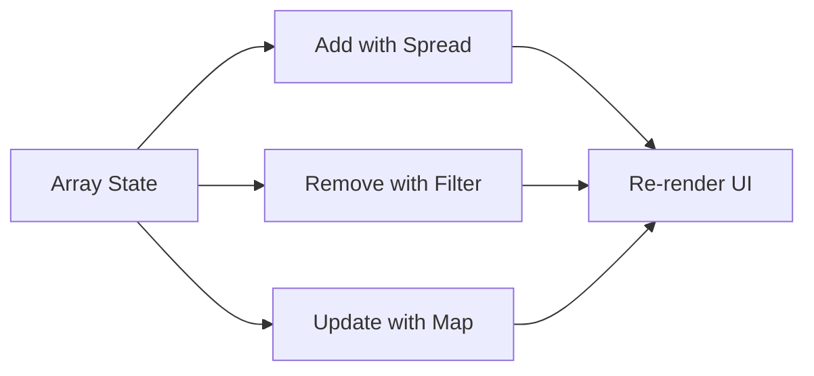

# Day 11 [Beginner to Intermediate]: Array State Handling

## Index

- [Goal](#goal)
- [Prerequisites](#prerequisites)
- [Explanation](#explanation)
- [Topic by Topic](#topic-by-topic)
- [Key Concepts](#key-concepts)
- [Visual Concept Map](#visual-concept-map)
- [End-to-End Practical](#end-to-end-practical)
- [Hands-on Coding](#hands-on-coding)
- [Mini Exercise](#mini-exercise)
- [Assessment Quiz](#assessment-quiz)
- [Task](#task)
- [Self Check](#self-check)
- [Interview Questions and Answers](#interview-questions-and-answers)
- [Day 11 Outcome](#day-11-outcome)

## Goal

Learn how to store, add, remove, and update list data in React state without mutating arrays.

## Prerequisites

- Day 10 completed
- Basic understanding of useState

## Explanation

Array state is common for todo lists, carts, skills, and notifications. In React, you should create new arrays during updates so re-rendering stays predictable.

## Topic by Topic

### Topic 1: Array State Basics

Theory:
Arrays in state represent collections of related items.

Practical:
Store a list of skills in state.

Code Example:

```jsx
const [skills, setSkills] = useState(["HTML", "CSS"]);
```

**Explanation:** This creates array state with two starting skills. `skills` stores the list, and `setSkills` updates it.

**Key Points:**

- Array state is used for list data.
- `useState` gives current value and update function.
- Start with simple sample data for practice.

### Topic 2: Add Items Immutably

Theory:
Use spread to create a new array while appending a new item.

Practical:
Add one skill on button click.

Code Example:

```jsx
setSkills((prev) => [...prev, "React"]);
```

**Explanation:** This adds a new item by creating a new array. We do not change the old array directly.

**Key Points:**

- Use spread `...prev` to keep old items.
- Add new item at the end.
- Immutable updates help React detect changes.

### Topic 3: Remove Items Safely

Theory:
Use filter to remove items without mutating the original array.

Practical:
Remove a skill by value.

Code Example:

```jsx
setSkills((prev) => prev.filter((skill) => skill !== "CSS"));
```

**Explanation:** `filter` keeps only the items that match the condition. Here, it removes `"CSS"` from the list.

**Key Points:**

- `filter` returns a new array.
- Removed item is excluded by condition.
- Original state stays unchanged.

### Topic 4: Update Specific Item

Theory:
Use map to transform only the item you want.

Practical:
Mark one task as completed.

Code Example:

```jsx
setTasks((prev) =>
  prev.map((task) => (task.id === id ? { ...task, done: true } : task)),
);
```

**Explanation:** `map` checks every task. If id matches, it returns an updated task object. Other tasks stay the same.

**Key Points:**

- Use `map` to update one item in a list.
- Match item by unique id.
- Copy object with spread before changing one field.

### Topic 5: Render Lists with Keys

Theory:
Each rendered item needs a stable key for React reconciliation.

Practical:
Use id as key when mapping.

Code Example:

```jsx
{
  tasks.map((task) => <li key={task.id}>{task.title}</li>);
}
```

**Explanation:** React needs a stable `key` for each item so it can track which row changed.

**Key Points:**

- Use unique id as key when possible.
- Keys help React update UI correctly.
- Avoid random or changing keys.

### Topic 6: Protecting Array State from Duplicates

Theory:
Before adding, validate data to avoid duplicate or empty entries in list state.

Practical:
Only add a skill if it is non-empty and not already present.

Code Example:

```jsx
setSkills((prev) =>
  prev.includes(newSkill.trim()) || !newSkill.trim()
    ? prev
    : [...prev, newSkill.trim()],
);
```

**Explanation:** This checks two things before adding: text is not empty and the skill is not already present.

**Key Points:**

- `trim()` removes extra spaces.
- `includes` helps prevent duplicate entries.
- Return old array when validation fails.

## Key Concepts

- Immutable updates
- Array spread
- filter and map patterns
- Stable keys
- Predictable re-renders
- Duplicate-safe list updates

## Visual Concept Map



## End-to-End Practical

1. Create array state for list items.
2. Add input + Add button.
3. Render list with map.
4. Add delete action per item.
5. Add update action for one item.

## Hands-on Coding

### Example 1: Case - HR Skill Tracker

Scenario:
An HR dashboard lets recruiters add candidate skills quickly.

```jsx
import { useState } from "react";

function App() {
  const [skills, setSkills] = useState(["Communication", "Excel"]);
  const [newSkill, setNewSkill] = useState("");

  const addSkill = () => {
    if (!newSkill.trim()) return;
    setSkills((prev) => [...prev, newSkill.trim()]);
    setNewSkill("");
  };

  return (
    <div>
      <input
        value={newSkill}
        placeholder="Add skill"
        onChange={(e) => setNewSkill(e.target.value)}
      />
      <button onClick={addSkill}>Add</button>

      <ul>
        {skills.map((skill, index) => (
          <li key={index}>{skill}</li>
        ))}
      </ul>
    </div>
  );
}
```

### Example 2: Case - Shopping Cart Remove Item

Scenario:
An ecommerce cart screen removes a product when the user clicks Remove.

```jsx
import { useState } from "react";

function App() {
  const [cart, setCart] = useState([
    { id: 1, name: "Phone" },
    { id: 2, name: "Headphones" },
    { id: 3, name: "Mouse" },
  ]);

  const removeItem = (id) => {
    setCart((prev) => prev.filter((item) => item.id !== id));
  };

  return (
    <div>
      {cart.map((item) => (
        <div key={item.id}>
          {item.name}
          <button onClick={() => removeItem(item.id)}>Remove</button>
        </div>
      ))}
    </div>
  );
}
```

### Example 3: Case - Task Completion Update

Scenario:
A project board marks selected tasks as done without changing other tasks.

```jsx
import { useState } from "react";

function App() {
  const [tasks, setTasks] = useState([
    { id: 1, title: "Design UI", done: false },
    { id: 2, title: "Build API", done: false },
  ]);

  const markDone = (id) => {
    setTasks((prev) =>
      prev.map((task) => (task.id === id ? { ...task, done: true } : task)),
    );
  };

  return (
    <ul>
      {tasks.map((task) => (
        <li key={task.id}>
          {task.title} - {task.done ? "Done" : "Pending"}
          {!task.done && (
            <button onClick={() => markDone(task.id)}>Mark Done</button>
          )}
        </li>
      ))}
    </ul>
  );
}
```

## Mini Exercise

Scenario:
You are building a classroom attendance tracker.

Build a student list where you can add student names, delete one student, and mark one as present.

Expected output:

- New student appears instantly
- Delete removes only selected student
- Present status updates for one student

## Assessment Quiz

### Quiz Questions

1. Why avoid push/pop directly on state array?
2. Which method is better to remove array items: map or filter?
3. True or False: index is always the best key.
4. Which method helps update one item in an array?
5. Why does immutability help React?

### Quiz Answers

1. It mutates the original state
2. filter
3. False
4. map
5. React can detect changes and re-render reliably

## Task

- Create one list feature using array state
- Add, remove, and update list items
- Complete mini exercise

## Self Check

- You can manage list state safely
- You can choose map/filter correctly
- You can answer at least 4 out of 5 quiz questions correctly

## Interview Questions and Answers

### Beginner

**Question:** How do you render array data in React?

**Answer:** By using map and returning JSX for each item.

**Question:** Why does each list item need key?

**Answer:** To help React track item identity efficiently.

### Middle

**Question:** How do you remove item by id from state array?

**Answer:** Use filter and keep all items except that id.

**Question:** How do you update one object inside array state?

**Answer:** Use map and return updated object only for matching item.

### Advanced

**Question:** Why can index keys cause UI bugs?

**Answer:** Reordering or deletion can make keys unstable and mismatch component state.

**Question:** When would you normalize large list state?

**Answer:** For complex updates, store ids and lookup objects for efficient access.

## Day 11 Outcome

- You can perform array add/remove/update safely
- You can build dynamic list-based UI
- You are ready for event-driven list interactions in Day 12
