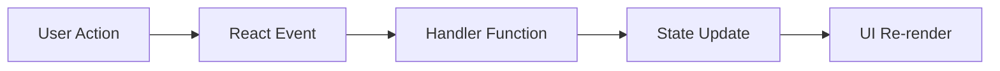

# Day 12 [Beginner to Intermediate]: Event Handling

## Index

- [Goal](#goal)
- [Prerequisites](#prerequisites)
- [Explanation](#explanation)
- [Topic by Topic](#topic-by-topic)
- [Key Concepts](#key-concepts)
- [Visual Concept Map](#visual-concept-map)
- [End-to-End Practical](#end-to-end-practical)
- [Hands-on Coding](#hands-on-coding)
- [Mini Exercise](#mini-exercise)
- [Assessment Quiz](#assessment-quiz)
- [Task](#task)
- [Self Check](#self-check)
- [Interview Questions and Answers](#interview-questions-and-answers)
- [Day 12 Outcome](#day-12-outcome)

## Goal

Understand how to handle user actions like clicks, form submit, and input changes in React.

## Prerequisites

- Day 11 completed
- Basic useState knowledge

## Explanation

Event handling connects UI actions to logic. React uses camelCase event names and function references. React also gives you a normalized event wrapper so event behavior feels more consistent across browsers.

## Topic by Topic

### Topic 1: Click Events

Theory:
Use onClick to run logic when a button is pressed.

Practical:
Increase a counter on click.

Code Example:

```jsx
<button onClick={() => setCount(count + 1)}>Increase</button>
```

**Explanation:** When the button is clicked, React runs the function and updates `count` by 1.

**Key Points:**

- `onClick` listens for button clicks.
- Handler function runs on user action.
- State update triggers UI refresh.

### Topic 2: Input Change Events

Theory:
onChange updates state while typing.

Practical:
Store live text input value.

Code Example:

```jsx
<input value={name} onChange={(e) => setName(e.target.value)} />
```

**Explanation:** The input value is controlled by state. Every key press updates state using `e.target.value`.

**Key Points:**

- `onChange` handles typing updates.
- `value` keeps input linked to state.
- `e.target.value` gives current text.

### Topic 3: Form Submit Event

Theory:
Use onSubmit on form and prevent page reload.

Practical:
Save input when form is submitted.

Code Example:

```jsx
const handleSubmit = (e) => {
  e.preventDefault();
  console.log("Submitted");
};
```

**Explanation:** `e.preventDefault()` stops the browser page reload. Then your submit logic runs safely in React.

**Key Points:**

- Use `onSubmit` on form.
- Prevent default browser submit behavior.
- Keep submit logic inside one handler.

### Topic 4: Passing Parameters to Handlers

Theory:
Wrap handler inside arrow function to pass custom values.

Practical:
Delete by id from a list.

Code Example:

```jsx
<button onClick={() => removeItem(item.id)}>Delete</button>
```

**Explanation:** The arrow function delays execution until click time and sends the item id to the handler.

**Key Points:**

- Wrap handler to pass custom values.
- Avoid calling handler directly in JSX.
- Useful for item-specific actions.

### Topic 5: Event Object Basics

Theory:
React event object gives details like target, value, checked.

Practical:
Read checkbox checked value.

Code Example:

```jsx
<input type="checkbox" onChange={(e) => setAgree(e.target.checked)} />
```

**Explanation:** For checkboxes, use `checked` instead of `value`. It returns true or false.

**Key Points:**

- Event object gives element details.
- `e.target.checked` reads checkbox state.
- Different inputs may use different event fields.

### Topic 6: Event Propagation Control

Theory:
Some UI blocks have nested click handlers, so bubbling can trigger unwanted parent actions.

Practical:
Use stopPropagation in child button when parent card also has onClick.

Code Example:

```jsx
<button
  onClick={(e) => {
    e.stopPropagation();
    onDelete();
  }}
>
  Delete
</button>
```

**Explanation:** `stopPropagation()` prevents the click from also triggering parent click handlers.

**Key Points:**

- Child and parent can both have click handlers.
- Bubbling can trigger both by default.
- Stop bubbling when child action should stay isolated.

### Topic 7: React Synthetic Event system

Theory:
React wraps browser events inside a React event object called a Synthetic Event. This gives a more consistent API across browsers.

Practical:
Read `target.value` or call `preventDefault()` the same way across React handlers.

Code Example:

```jsx
function handleChange(e) {
  console.log(e.target.value);
}
```

**Explanation:** In React, the event object you receive is not just the raw browser event. It is React's normalized wrapper. For most everyday work, you use it the same way, but the important idea is that React standardizes event handling behavior.

**Key Points:**

- React event objects are normalized wrappers around browser events
- Common methods like `preventDefault()` and `stopPropagation()` still work
- This helps React event handling stay consistent

## Key Concepts

- onClick, onChange, onSubmit
- preventDefault
- Function reference vs function call
- Parameterized handlers
- Event target usage
- Event propagation control
- Synthetic event system

## Visual Concept Map



## End-to-End Practical

1. Build one click counter.
2. Add one controlled input.
3. Handle form submit.
4. Add one action button per list item.
5. Verify UI updates from events.

## Hands-on Coding

### Example 1: Case - Social App Like Button

Scenario:
A social feed needs a Like button that toggles label and style.

```jsx
import { useState } from "react";

function LikeButton() {
  const [liked, setLiked] = useState(false);

  return (
    <button
      onClick={() => setLiked(!liked)}
      style={{ background: liked ? "#c8f7d1" : "#eee" }}
    >
      {liked ? "Liked" : "Like"}
    </button>
  );
}
```

### Example 2: Case - HR Approval Actions

Scenario:
An HR review panel has Approve and Reject actions for candidates.

```jsx
import { useState } from "react";

function CandidateAction() {
  const [status, setStatus] = useState("Pending");

  return (
    <div>
      <p>Status: {status}</p>
      <button onClick={() => setStatus("Approved")}>Approve</button>
      <button onClick={() => setStatus("Rejected")}>Reject</button>
    </div>
  );
}
```

### Example 3: Case - Newsletter Form Submit

Scenario:
A marketing page captures email and confirms submit action.

```jsx
import { useState } from "react";

function NewsletterForm() {
  const [email, setEmail] = useState("");
  const [message, setMessage] = useState("");

  const handleSubmit = (e) => {
    e.preventDefault();
    setMessage(`Subscribed: ${email}`);
    setEmail("");
  };

  return (
    <form onSubmit={handleSubmit}>
      <input
        value={email}
        placeholder="Enter email"
        onChange={(e) => setEmail(e.target.value)}
      />
      <button type="submit">Subscribe</button>
      <p>{message}</p>
    </form>
  );
}
```

## Mini Exercise

Scenario:
You are building a video player control panel.

Add Play/Pause toggle button, Volume input slider, and Save Settings submit button.

Expected output:

- Button toggles between Play and Pause
- Slider updates volume value live
- Submit shows confirmation message

## Assessment Quiz

### Quiz Questions

1. Why use e.preventDefault in form submit?
2. Which event is used for text inputs?
3. True or False: onClick={handle()} is the usual pattern.
4. How do you pass id to event handler?
5. What does e.target.value represent?

### Quiz Answers

1. To stop page reload
2. onChange
3. False
4. Use arrow function wrapper
5. Current value of input element

## Task

- Build one click interaction and one form interaction
- Use event object in at least one handler
- Complete mini exercise

## Self Check

- You can attach events correctly
- You can control form submit behavior
- You can answer at least 4 out of 5 quiz questions correctly

## Interview Questions and Answers

### Beginner

**Question:** How are events written in React?

**Answer:** Using camelCase props like onClick, onChange, onSubmit.

**Question:** What is event handler?

**Answer:** A function that runs when an event occurs.

### Middle

**Question:** Why use arrow function in onClick sometimes?

**Answer:** To pass custom parameters to the handler.

**Question:** What is the difference between onInput and onChange in React?

**Answer:** React commonly uses onChange for controlled inputs to capture value updates.

### Advanced

**Question:** Why should handlers avoid heavy logic inline in JSX?

**Answer:** It hurts readability and can create avoidable re-renders.

**Question:** How can you optimize many event handlers in large lists?

**Answer:** Extract components, memoize when needed, and keep state updates minimal.

## Day 12 Outcome

- You can connect user actions with state updates
- You can handle button, input, and submit events
- You are ready for controlled forms in Day 13
