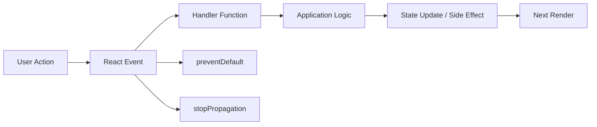

# Day 12 [Beginner to Intermediate]: Event Handling

## Goal

Understand how React connects user actions to application logic and state updates. By the end of this lesson, you should be able to handle clicks, inputs, forms, keyboard interactions, checkboxes, list actions, and event propagation reliably and accessibly.

## Prerequisites

- Day 11 completed
- Basic `useState` knowledge
- JSX and component fundamentals
- JavaScript functions and arrow functions

## Explanation

Event handling connects UI actions to application logic:

```text
User interaction
      ↓
React event handler
      ↓
Application logic
      ↓
State update / side effect
      ↓
Next render
```

React event props use camelCase such as `onClick`, `onChange`, and `onSubmit`. Pass a function for React to call later.

```jsx
// Correct
<button type="button" onClick={handleClick}>Save</button>

// ❌ Calls the function during render
<button type="button" onClick={handleClick()}>Save</button>
```

Modern React provides a consistent event API around browser events. The old SyntheticEvent pooling behavior was removed in React 17, so `event.persist()` is not a normal requirement in modern React.

## Topic by Topic

### Topic 1: Click Events

Use `onClick` for actions performed by a button or another appropriate interactive element.

```jsx
function Counter() {
  const [count, setCount] = useState(0);

  return (
    <button
      type="button"
      onClick={() => setCount((current) => current + 1)}
    >
      Increase: {count}
    </button>
  );
}
```

Key points:

- The handler runs because of user interaction.
- A state update requests a new render.
- Prefer semantic controls such as `<button>` for actions.

### Topic 2: Input Change Events

React commonly uses `onChange` for controlled form fields.

```jsx
const [name, setName] = useState("");

<input
  id="name"
  name="name"
  value={name}
  onChange={(event) => setName(event.target.value)}
/>
```

For production forms, pair inputs with labels:

```jsx
<label htmlFor="name">Name</label>
<input id="name" name="name" value={name} onChange={handleChange} />
```

### Topic 3: Form Submit

Handle submission at the `<form>` level.

```jsx
function handleSubmit(event) {
  event.preventDefault();
  console.log("Submitted");
}

<form onSubmit={handleSubmit}>
  <button type="submit">Submit</button>
</form>
```

`preventDefault()` stops the browser's default form action. It does **not** stop event propagation.

Use `type="button"` for buttons inside forms that are not meant to submit.

### Topic 4: Passing Parameters

Wrap parameterized calls so they execute when the event occurs:

```jsx
<button type="button" onClick={() => removeItem(item.id)}>
  Delete
</button>
```

This pattern is useful for delete, select, edit, approve, and similar item-specific actions.

### Topic 5: Event Object

Handlers receive an event object.

```jsx
function handleChange(event) {
  console.log(event.target.value);
}
```

For checkboxes, use `checked`:

```jsx
<input
  type="checkbox"
  checked={agree}
  onChange={(event) => setAgree(event.target.checked)}
/>
```

For a number input, remember that `event.target.value` is normally a string. Convert it explicitly if your state/domain model requires a number.

### Topic 6: Semantic HTML and Accessibility

Choose elements according to their meaning:

```jsx
<button type="button">Cancel</button>
<button type="submit">Save</button>
<a href="/profile">Profile</a>
```

Avoid making a plain `<div>` act like a button. Semantic controls provide keyboard interaction and accessibility behavior by default.

If an element is intentionally clickable, ensure its semantics, focus behavior, and keyboard interaction are appropriate rather than relying on mouse clicks alone.

### Topic 7: Keyboard Events

```jsx
function handleKeyDown(event) {
  if (event.key === "Escape") {
    closeDialog();
  }
}
```

Prefer semantic key names such as `Enter`, `Escape`, `ArrowDown`, and `Tab` instead of obsolete numeric key-code checks.

Do not add an Enter shortcut where native form submission already provides the correct behavior. Keyboard handlers should supplement accessible controls, not replace them.

### Topic 8: Event Propagation

Events can bubble from a child to ancestors.

```jsx
<div onClick={() => console.log("Card clicked")}>
  <button
    type="button"
    onClick={(event) => {
      event.stopPropagation();
      console.log("Delete clicked");
    }}
  >
    Delete
  </button>
</div>
```

Use `stopPropagation()` only when the child interaction should not also activate the parent interaction.

### Topic 9: `preventDefault()` vs `stopPropagation()`

| API | Purpose |
|---|---|
| `preventDefault()` | Prevents the browser's default action |
| `stopPropagation()` | Stops the event from propagating to other ancestors |

Example: a form may need `preventDefault()`, while a child button inside an intentionally clickable card may need `stopPropagation()`.

These APIs solve different problems and are not interchangeable.

### Topic 10: Event System

React exposes familiar event objects and handler props while integrating them with React rendering. Modern React internally delegates many events, but application code normally does not need to manage that implementation detail.

Do not teach students that modern React requires `event.persist()` for asynchronous event handling; event pooling was removed in React 17.

### Topic 11: State Snapshots in Event Handlers

Handlers see the state snapshot from the render in which they were created.

```jsx
function handleClick() {
  console.log(count);
  setCount((current) => current + 1);
  console.log(count); // current render's value
}
```

The setter does not mutate the `count` variable captured by the current render.

When the next state depends on previous state, use a functional updater:

```jsx
setCount((current) => current + 1);
```

### Topic 12: Organizing Event Handlers

Inline handlers are fine for small, obvious behavior:

```jsx
<button type="button" onClick={() => setOpen(true)}>
  Open
</button>
```

Use named handlers when logic becomes substantial:

```jsx
function handleSubmit(event) {
  event.preventDefault();
  // validation and submit workflow
}
```

Do not claim that every inline arrow function automatically causes a performance problem. Optimize handler identity only when profiling and component architecture show a real need.

## Key Concepts

- `onClick`, `onChange`, `onSubmit`
- function reference vs function call
- parameterized handlers
- event object and `target`
- `value` vs `checked`
- `preventDefault()`
- `stopPropagation()`
- event bubbling
- keyboard events
- semantic HTML
- controlled inputs
- state snapshots
- functional state updates
- modern React event system

## Visual Concept Map



## End-to-End Practical

Build an interaction lab in this order:

1. Build a click counter.
2. Add a controlled text input with a label.
3. Add a controlled checkbox.
4. Add form submission.
5. Add a parameterized list-item action.
6. Add an Escape keyboard interaction where appropriate.
7. Add a parent card interaction and a child action.
8. Decide whether `preventDefault()` or `stopPropagation()` is actually required.
9. Test mouse, keyboard, submit, and reset behavior.

## Hands-on Coding

### Example 1: Like Button

```jsx
import { useState } from "react";

function LikeButton() {
  const [liked, setLiked] = useState(false);

  return (
    <button
      type="button"
      aria-pressed={liked}
      onClick={() => setLiked((current) => !current)}
    >
      {liked ? "Liked" : "Like"}
    </button>
  );
}
```

### Example 2: Approval Actions

```jsx
import { useState } from "react";

function CandidateAction() {
  const [status, setStatus] = useState("Pending");

  return (
    <div>
      <p>Status: {status}</p>
      <button type="button" onClick={() => setStatus("Approved")}>
        Approve
      </button>
      <button type="button" onClick={() => setStatus("Rejected")}>
        Reject
      </button>
    </div>
  );
}
```

### Example 3: Newsletter Form

```jsx
import { useState } from "react";

function NewsletterForm() {
  const [email, setEmail] = useState("");
  const [message, setMessage] = useState("");

  function handleSubmit(event) {
    event.preventDefault();
    setMessage(`Subscribed: ${email}`);
    setEmail("");
  }

  return (
    <form onSubmit={handleSubmit}>
      <label htmlFor="newsletter-email">Email</label>
      <input
        id="newsletter-email"
        name="email"
        type="email"
        value={email}
        onChange={(event) => setEmail(event.target.value)}
        required
      />
      <button type="submit">Subscribe</button>
      <p role="status">{message}</p>
    </form>
  );
}
```

### Example 4: Card With Child Actions

Prefer a semantic structure when the whole card is not actually a button. If the card itself is an action, a button can be the correct semantic choice.

```jsx
function CandidateCard({ candidate, onOpen, onDelete }) {
  return (
    <article>
      <h3>{candidate.name}</h3>
      <button type="button" onClick={() => onOpen(candidate.id)}>
        Open
      </button>
      <button type="button" onClick={() => onDelete(candidate.id)}>
        Delete
      </button>
    </article>
  );
}
```

If the product specifically requires a clickable card with nested controls, stop propagation only on the nested controls and separately provide keyboard-accessible card behavior. Do not use a clickable `<article>` as a substitute for a button.

## Mini Exercise

Build a video-player control panel.

Requirements:

- Play/Pause toggle button
- Volume range input
- Save Settings submit button
- Escape resets the draft controls
- Labels for form controls

Expected output:

- Play/Pause toggles correctly.
- Volume updates live.
- Submit shows a confirmation message without page navigation.
- Escape resets the draft values.
- All interactive controls are keyboard accessible.

## Assessment Quiz

### Questions

1. Why use `event.preventDefault()` in a form submit handler?
2. Which React event is commonly used for controlled text inputs?
3. Why is `onClick={handle()}` usually incorrect?
4. How do you pass an ID to an event handler?
5. What does `event.target.value` represent for a text input?
6. Which property is normally used for a controlled checkbox?
7. What is the difference between `preventDefault()` and `stopPropagation()`?
8. Why can a state log look unchanged immediately after calling its setter?
9. Why should semantic controls be preferred over clickable `div`s?
10. When should `stopPropagation()` be used?

### Answers

1. It prevents the browser's default form action.
2. `onChange`.
3. It calls the function during render instead of passing a function for the event.
4. Wrap the call: `onClick={() => removeItem(id)}`.
5. The current text value of that control.
6. `checked`.
7. One prevents default browser behavior; the other stops propagation through the event path.
8. The handler sees the current render's state snapshot; the setter schedules the next state.
9. Semantic controls provide appropriate browser semantics, keyboard behavior, and accessibility support.
10. Only when a child interaction should intentionally prevent an ancestor handler from responding.

## Task

Build a **Candidate Review Panel** with:

- Approve and Reject actions
- Search input
- Checkbox for shortlist
- Form submission
- Item-specific handlers using candidate IDs
- Appropriate keyboard behavior
- A parent/child interaction where propagation behavior is intentionally designed

### Acceptance Criteria

- Uses `onClick`, `onChange`, and `onSubmit` correctly.
- Uses `event.target.value` and `event.target.checked` appropriately.
- Uses parameterized handlers safely.
- Uses `preventDefault()` only when the browser default should be prevented.
- Uses `stopPropagation()` only when parent/child behavior requires it.
- Uses semantic controls with labels where appropriate.
- Does not rely on array index for candidate identity.
- Works with keyboard interaction, not only mouse clicks.

## Self Check

- [ ] I can attach React event handlers correctly.
- [ ] I can explain function reference vs function call.
- [ ] I can pass parameters to handlers.
- [ ] I can read `target.value` and `target.checked` correctly.
- [ ] I can control form submission.
- [ ] I can explain bubbling.
- [ ] I know when `preventDefault()` is appropriate.
- [ ] I know when `stopPropagation()` is appropriate.
- [ ] I can handle relevant keyboard interactions.
- [ ] I understand state snapshots in event handlers.
- [ ] I can use functional state updates when the next state depends on previous state.
- [ ] I can build event-driven UI without replacing semantic controls with generic clickable elements.

## Common Mistakes

### Mistake 1: Calling the handler during render

```jsx
// ❌
<button type="button" onClick={handleClick()}>Save</button>
```

```jsx
// ✅
<button type="button" onClick={handleClick}>Save</button>
```

### Mistake 2: Wrong checkbox property

For controlled checkbox state, use:

```jsx
checked={isSelected}
onChange={(event) => setIsSelected(event.target.checked)}
```

Do not use `event.target.value` as the boolean state source.

### Mistake 3: Duplicate form submission paths

Avoid:

```jsx
<form onSubmit={handleSubmit}>
  <button type="button" onClick={handleSubmit}>Save</button>
</form>
```

Prefer:

```jsx
<form onSubmit={handleSubmit}>
  <button type="submit">Save</button>
</form>
```

### Mistake 4: Using `stopPropagation()` everywhere

Propagation is often useful. Stop it only when the interaction model requires isolation.

### Mistake 5: Assuming setters mutate local variables immediately

Use a functional updater when the next state depends on the previous value.

### Mistake 6: Using non-semantic clickable elements

Prefer `<button>`, `<a>`, `<input>`, and other semantic controls over a clickable `<div>`.

### Mistake 7: Adding keyboard handlers where native behavior already exists

A submit button inside a form already participates in keyboard submission. Do not add unnecessary Enter listeners that duplicate native behavior.

## Debugging Challenge

Find the issue:

```jsx
<form onSubmit={handleSubmit}>
  <button type="button" onClick={handleSubmit}>Save</button>
</form>
```

This creates two concepts for one submission action. The button is not a submit control, yet its click manually invokes the submit workflow.

Prefer:

```jsx
<form onSubmit={handleSubmit}>
  <button type="submit">Save</button>
</form>
```

Now the form owns the submission workflow and keyboard submission behaves naturally.

## Interview Questions and Answers

### Beginner

**Question: How are events written in React?**

**Answer:** Using camelCase props such as `onClick`, `onChange`, and `onSubmit`.

**Question: What is an event handler?**

**Answer:** A function React invokes in response to an event.

**Question: Why use `onClick={handleClick}` instead of `onClick={handleClick()}`?**

**Answer:** The first passes a function for React to call later. The second executes the function while rendering.

### Intermediate

**Question: Why use an arrow function in `onClick` sometimes?**

**Answer:** It is useful when passing custom arguments or composing small event-time logic.

**Question: What is the difference between `preventDefault()` and `stopPropagation()`?**

**Answer:** `preventDefault()` stops the browser's default action; `stopPropagation()` stops the event from propagating through ancestors.

**Question: How do you handle a controlled checkbox?**

**Answer:** Use `checked={state}` and update it from `event.target.checked`.

**Question: What is event bubbling?**

**Answer:** An event can propagate from the target through ancestor elements, allowing parent handlers to run unless propagation is stopped.

### Advanced

**Question: Why can a state log look stale immediately after `setState`?**

**Answer:** Event handlers execute with the state snapshot from their render. The setter schedules a later render; it does not mutate the local variable from the current render.

**Question: When should functional state updates be used?**

**Answer:** When the next state is calculated from the previous state, especially when multiple updates may be queued.

**Question: Does every inline event handler cause a performance problem?**

**Answer:** No. Inline functions are normal React code. Optimize handler identity only when there is a measured need, such as a memoized child receiving a changing function prop.

**Question: Should every event be handled with a `div`?**

**Answer:** No. Prefer semantic interactive elements because they provide better accessibility, keyboard behavior, and browser semantics.

**Question: What happened to React's old SyntheticEvent pooling?**

**Answer:** Event pooling was removed in React 17. Modern React does not require `event.persist()` for ordinary asynchronous event use.

**Question: When should `stopPropagation()` be used?**

**Answer:** Only when the interaction design intentionally requires a child event not to activate an ancestor handler.

## Day 12 Outcome

You can now:

- connect user actions to React handlers;
- handle click, input, checkbox, keyboard, and submit events;
- pass parameters safely to handlers;
- distinguish `preventDefault()` from `stopPropagation()`;
- reason about event bubbling;
- use semantic and keyboard-accessible controls;
- understand state snapshots in event handlers;
- use functional updates when state transitions depend on previous state; and
- debug common event-handling mistakes.

You are ready to move into **controlled forms and validation in Day 13**.
