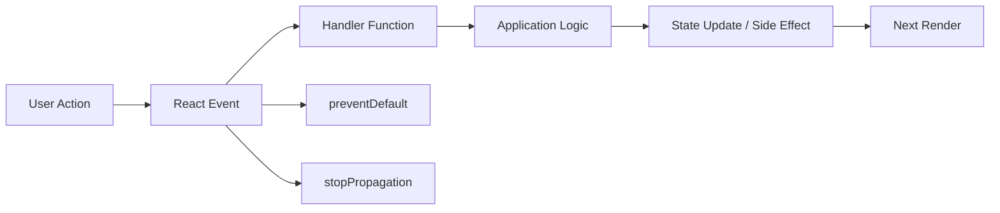

# Day 12 [Beginner to Intermediate]: Event Handling

## Index

- [Goal](#goal)
- [Prerequisites](#prerequisites)
- [Explanation](#explanation)
- [Topic by Topic](#topic-by-topic)
- [Key Concepts](#key-concepts)
- [Visual Concept Map](#visual-concept-map)
- [End-to-End Practical](#end-to-end-practical)
- [Hands-on Coding](#hands-on-coding)
- [Mini Exercise](#mini-exercise)
- [Assessment Quiz](#assessment-quiz)
- [Task](#task)
- [Self Check](#self-check)
- [Interview Questions and Answers](#interview-questions-and-answers)
- [Day 12 Outcome](#day-12-outcome)

## Goal

Understand how React connects user actions to application logic and state updates. By the end of this lesson, you should be able to handle clicks, inputs, forms, keyboard interactions, checkboxes, list actions, and event propagation reliably.

## Prerequisites

- Day 11 completed
- Basic `useState` knowledge
- Basic JSX and component knowledge
- Basic JavaScript functions and arrow functions

## Explanation

Event handling connects UI actions to application logic.

```text
Browser interaction
      ↓
React event handler
      ↓
Application logic
      ↓
State update / side effect
      ↓
React render
```

React event props use camelCase such as `onClick`, `onChange`, and `onSubmit`. Pass a function reference when React should call the handler later.

```jsx
// Correct
<button onClick={handleClick}>Save</button>

// ❌ Executes while rendering
<button onClick={handleClick()}>Save</button>
```

React's event APIs provide a consistent developer-facing interface around browser events. Modern React no longer uses the old pooled-event behavior, so you should not teach students that events must be manually persisted for asynchronous use.

## Topic by Topic

### Topic 1: Click Events

Use `onClick` to run logic when a button or other appropriate interactive element is activated.

```jsx
function Counter() {
  const [count, setCount] = useState(0);

  return (
    <button onClick={() => setCount((current) => current + 1)}>
      Increase: {count}
    </button>
  );
}
```

**Key points:**

- `onClick` listens for click/activation behavior.
- The handler runs because of user interaction, not during render.
- A state update schedules a new render.
- Prefer semantic controls such as `<button>` for actions.

### Topic 2: Input Change Events

React commonly uses `onChange` for controlled form fields.

```jsx
<input
  value={name}
  onChange={(event) => setName(event.target.value)}
/>
```

`event.target.value` provides the current text value of the input.

### Topic 3: Form Submit Event

Use `onSubmit` on the `<form>` rather than putting the main submission workflow only on a button.

```jsx
function handleSubmit(event) {
  event.preventDefault();
  console.log("Submitted");
}

<form onSubmit={handleSubmit}>
  <button type="submit">Submit</button>
</form>
```

`preventDefault()` prevents the browser's default navigation/submission behavior. It does not stop event propagation.

### Topic 4: Passing Parameters to Handlers

Wrap a parameterized call in a function so it executes at event time.

```jsx
<button onClick={() => removeItem(item.id)}>Delete</button>
```

This is useful for item-specific actions such as delete, select, edit, or approve.

### Topic 5: Event Object Basics

Handlers receive an event object.

```jsx
function handleChange(event) {
  console.log(event.target.value);
}
```

For checkboxes, use `checked`:

```jsx
<input
  type="checkbox"
  checked={agree}
  onChange={(event) => setAgree(event.target.checked)}
/>
```

Different controls expose different useful properties. Do not assume `value` is the right property for every input type.

### Topic 6: Form Controls and Semantic HTML

Use the control that matches the interaction:

```jsx
<button type="button">Cancel</button>
<button type="submit">Save</button>
<a href="/profile">Profile</a>
```

Avoid replacing buttons and links with clickable `div`s unless there is a very specific reason. Semantic elements provide keyboard behavior and accessibility expectations by default.

### Topic 7: Keyboard Events

```jsx
function handleKeyDown(event) {
  if (event.key === "Enter") {
    submitSearch();
  }

  if (event.key === "Escape") {
    closeDialog();
  }
}
```

Prefer semantic key names such as `Enter`, `Escape`, and `ArrowDown` rather than obsolete numeric key-code checks.

Keyboard shortcuts should supplement, not replace, accessible controls.

### Topic 8: Event Propagation

Events can bubble from a child to ancestors.

```jsx
<div onClick={() => console.log("Card clicked")}>
  <button
    type="button"
    onClick={(event) => {
      event.stopPropagation();
      console.log("Delete clicked");
    }}
  >
    Delete
  </button>
</div>
```

Use `stopPropagation()` only when the child interaction genuinely should not trigger the parent interaction.

### Topic 9: `preventDefault()` vs `stopPropagation()`

They solve different problems:

| API | Purpose |
|---|---|
| `preventDefault()` | Stops the browser's default action |
| `stopPropagation()` | Stops the event from continuing through propagation |

For example, form submission often needs `preventDefault()`. A nested button inside a clickable card may need `stopPropagation()`.

### Topic 10: React Event System

React exposes familiar event objects and event handler props while integrating events with React's rendering model. Modern React uses delegated event handling internally, but application code normally does not need to manage that implementation detail.

Important historical note: React's old event pooling behavior was removed in React 17. Do not teach `event.persist()` as a normal requirement in modern React applications.

### Topic 11: Event Handlers and State Snapshots

Handlers see state from the render in which they were created.

```jsx
function handleClick() {
  console.log(count);
  setCount((current) => current + 1);
  console.log(count); // still this render's value
}
```

The setter schedules the next state. It does not mutate the current render's `count` variable.

When the next state depends on previous state, use a functional updater:

```jsx
setCount((current) => current + 1);
```

### Topic 12: Event Handler Organization

Inline handlers are fine for small, obvious behavior:

```jsx
<button onClick={() => setOpen(true)}>Open</button>
```

Use named handlers when logic becomes substantial or needs independent testing/readability:

```jsx
function handleSubmit(event) {
  event.preventDefault();
  // validation and submit workflow
}
```

Do not claim that every inline arrow function automatically causes a problematic re-render. Optimize handler identity only when profiling and component architecture show a real need.

## Key Concepts

- `onClick`, `onChange`, `onSubmit`
- function reference vs function call
- parameterized handlers
- event object and `target`
- `value` vs `checked`
- `preventDefault()`
- `stopPropagation()`
- bubbling
- keyboard events
- semantic controls
- state snapshots
- functional state updates
- modern React event system

## Visual Concept Map



## End-to-End Practical

Build the interaction flow in this order:

1. Build a click counter.
2. Add a controlled text input.
3. Add a controlled checkbox.
4. Add form submission.
5. Add a parameterized action for a list item.
6. Add an Enter keyboard shortcut.
7. Add a parent card click and child action.
8. Decide whether `preventDefault()` or `stopPropagation()` is appropriate.
9. Verify the UI and state after each interaction.

## Hands-on Coding

### Example 1: Social App Like Button

```jsx
import { useState } from "react";

function LikeButton() {
  const [liked, setLiked] = useState(false);

  return (
    <button
      type="button"
      onClick={() => setLiked((current) => !current)}
    >
      {liked ? "Liked" : "Like"}
    </button>
  );
}
```

### Example 2: HR Approval Actions

```jsx
import { useState } from "react";

function CandidateAction() {
  const [status, setStatus] = useState("Pending");

  return (
    <div>
      <p>Status: {status}</p>
      <button type="button" onClick={() => setStatus("Approved")}>
        Approve
      </button>
      <button type="button" onClick={() => setStatus("Rejected")}>
        Reject
      </button>
    </div>
  );
}
```

### Example 3: Newsletter Form Submit

```jsx
import { useState } from "react";

function NewsletterForm() {
  const [email, setEmail] = useState("");
  const [message, setMessage] = useState("");

  function handleSubmit(event) {
    event.preventDefault();
    setMessage(`Subscribed: ${email}`);
    setEmail("");
  }

  return (
    <form onSubmit={handleSubmit}>
      <input
        value={email}
        placeholder="Enter email"
        onChange={(event) => setEmail(event.target.value)}
      />
      <button type="submit">Subscribe</button>
      <p>{message}</p>
    </form>
  );
}
```

### Example 4: Candidate Card With Propagation

```jsx
function CandidateCard({ candidate, onOpen, onDelete }) {
  return (
    <article onClick={() => onOpen(candidate.id)}>
      <h3>{candidate.name}</h3>
      <button
        type="button"
        onClick={(event) => {
          event.stopPropagation();
          onDelete(candidate.id);
        }}
      >
        Delete
      </button>
    </article>
  );
}
```

## Mini Exercise

Build a video-player control panel.

Requirements:

- Play/Pause toggle button
- Volume input slider
- Save Settings submit button
- Escape resets the draft controls

Expected output:

- Button toggles between Play and Pause.
- Slider updates volume live.
- Submit shows a confirmation message.
- Escape performs the specified reset behavior.

## Assessment Quiz

### Questions

1. Why use `event.preventDefault()` in form submit?
2. Which React event is commonly used for controlled text inputs?
3. True or False: `onClick={handle()}` is the usual event-handler pattern.
4. How do you pass an ID to an event handler?
5. What does `event.target.value` represent for a text input?
6. Which property is normally used for a checkbox's controlled state?
7. What is the difference between `preventDefault()` and `stopPropagation()`?
8. Why can a state log look unchanged immediately after calling its setter?

### Answers

1. It prevents the browser's default form action, such as navigation.
2. `onChange`.
3. False. Pass a function; call it from the handler when appropriate.
4. Wrap the call: `onClick={() => removeItem(id)}`.
5. The current text value of that input.
6. `checked`.
7. One controls default browser behavior; the other controls event propagation.
8. The handler sees the current render's state snapshot; the setter schedules the next state.

## Task

Build a **Candidate Review Panel** with:

- Approve and Reject actions
- Search input
- Keyboard Enter shortcut
- Checkbox for shortlist
- Submit form
- Parent card click plus child action demonstrating propagation correctly

### Acceptance Criteria

- Uses `onClick`, `onChange`, and `onSubmit`.
- Uses event values correctly.
- Uses a parameterized handler for candidate ID.
- Uses `preventDefault()` only where the browser default should be prevented.
- Uses `stopPropagation()` only where parent/child behavior requires it.
- Uses semantic controls.
- Does not rely on array index for candidate identity.

## Self Check

- [ ] I can attach React event handlers correctly.
- [ ] I can explain function reference vs function call.
- [ ] I can pass parameters to handlers.
- [ ] I can read `target.value` and `target.checked` correctly.
- [ ] I can control form submission.
- [ ] I can explain bubbling.
- [ ] I know when `preventDefault()` is appropriate.
- [ ] I know when `stopPropagation()` is appropriate.
- [ ] I can handle Enter/Escape keyboard interactions.
- [ ] I understand state snapshots in event handlers.
- [ ] I can use functional state updates when the next state depends on previous state.

## Common Mistakes

### Mistake 1: Calling the handler during render

```jsx
// ❌
<button onClick={handleClick()}>Save</button>
```

```jsx
// ✅
<button onClick={handleClick}>Save</button>
```

### Mistake 2: Wrong checkbox property

```jsx
// ❌
event.target.value
```

For controlled checkbox state, use:

```jsx
// ✅
event.target.checked
```

### Mistake 3: Duplicate form submission paths

Avoid:

```jsx
<form onSubmit={handleSubmit}>
  <button onClick={handleSubmit}>Save</button>
</form>
```

Prefer:

```jsx
<form onSubmit={handleSubmit}>
  <button type="submit">Save</button>
</form>
```

### Mistake 4: Using `stopPropagation()` everywhere

Propagation is often useful. Stop it only when the interaction model requires isolation.

### Mistake 5: Assuming setters mutate local variables immediately

Use a functional updater when the next state depends on the previous value.

### Mistake 6: Using non-semantic clickable elements

Prefer `<button>`, `<a>`, `<input>`, and other semantic controls over a clickable `<div>`.

## Debugging Challenge

Find the bug:

```jsx
<form onSubmit={handleSubmit}>
  <button onClick={handleSubmit}>Save</button>
</form>
```

Explain why the button click can be followed by the form's submit behavior and can therefore make the submission workflow confusing or duplicate work.

Rewrite it:

```jsx
<form onSubmit={handleSubmit}>
  <button type="submit">Save</button>
</form>
```

Now there is one clear submission path.

## Interview Questions and Answers

### Beginner

**Question: How are events written in React?**

**Answer:** Using camelCase props such as `onClick`, `onChange`, and `onSubmit`.

**Question: What is an event handler?**

**Answer:** A function React invokes in response to an event.

**Question: Why use `onClick={handleClick}` instead of `onClick={handleClick()}`?**

**Answer:** The first passes a function for React to call later. The second executes the function while rendering.

### Intermediate

**Question: Why use an arrow function in `onClick` sometimes?**

**Answer:** It is useful when you need to pass custom arguments or compose small event-time logic.

**Question: What is the difference between `preventDefault()` and `stopPropagation()`?**

**Answer:** `preventDefault()` stops the browser's default action; `stopPropagation()` stops the event from propagating to ancestors.

**Question: How do you handle a controlled checkbox?**

**Answer:** Use `checked={state}` and update it from `event.target.checked`.

**Question: What is event bubbling?**

**Answer:** An event can propagate from the target element through ancestor elements, allowing parent handlers to run unless propagation is stopped.

### Advanced

**Question: Why can a state log look stale immediately after `setState`?**

**Answer:** Event handlers execute with the state snapshot from their render. The setter schedules a later render; it does not mutate the local variable from the current render.

**Question: When should functional state updates be used?**

**Answer:** When the next state is calculated from the previous state, especially when multiple updates may be queued.

**Question: Does every inline event handler cause a performance problem?**

**Answer:** No. Inline functions are normal React code. Optimize handler identity only when there is a measured need, such as a memoized child receiving a changing function prop.

**Question: Should every event be handled with a `div`?**

**Answer:** No. Prefer semantic interactive elements because they provide better accessibility, keyboard behavior, and browser semantics.

**Question: What happened to React's old SyntheticEvent pooling?**

**Answer:** Event pooling was removed in React 17. Modern React does not require `event.persist()` for ordinary asynchronous event use.

## Day 12 Outcome

You can now:

- connect user actions to React handlers
- handle click, input, checkbox, keyboard, and submit events
- pass parameters safely to handlers
- distinguish `preventDefault()` from `stopPropagation()`
- reason about event bubbling
- use semantic interactive controls
- understand state snapshots in event handlers
- use functional updates when state transitions depend on previous state
- debug common event-handling mistakes

You are ready to move into **controlled forms and validation in Day 13**.
