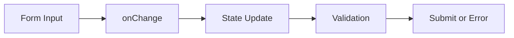

# Day 13 [Beginner to Intermediate]: Forms and Controlled Components

## Index

- [Goal](#goal)
- [Prerequisites](#prerequisites)
- [Explanation](#explanation)
- [Topic by Topic](#topic-by-topic)
- [Key Concepts](#key-concepts)
- [Visual Concept Map](#visual-concept-map)
- [End-to-End Practical](#end-to-end-practical)
- [Hands-on Coding](#hands-on-coding)
- [Mini Exercise](#mini-exercise)
- [Assessment Quiz](#assessment-quiz)
- [Task](#task)
- [Self Check](#self-check)
- [Interview Questions and Answers](#interview-questions-and-answers)
- [Day 13 Outcome](#day-13-outcome)

## Goal

Build reliable React forms using controlled components, validation logic, and clean submit/reset flow.

## Prerequisites

- Day 12 completed
- Event handling basics

## Explanation

In controlled components, form fields are tied to state, making behavior predictable and easy to validate.

## Topic by Topic

### Topic 1: Controlled Input

Theory:
Input value comes from state and updates via onChange.

Practical:
Create controlled name input.

Code Example:

```jsx
const [name, setName] = useState("");
<input value={name} onChange={(e) => setName(e.target.value)} />;
```

**Explanation:** This input is controlled because its value comes from React state. Typing updates state, and state updates input.

**Key Points:**

- Controlled input uses `value` + `onChange`.
- State is the single source of truth.
- Easy to validate and reset controlled fields.

### Topic 2: Multi-field Form State

Theory:
Use one state object for related fields.

Practical:
Track name, email, and phone in one object.

Code Example:

```jsx
setForm((prev) => ({ ...prev, [e.target.name]: e.target.value }));
```

**Explanation:** This updates only one field in the form object while keeping all other fields unchanged.

**Key Points:**

- One object can hold many related fields.
- Spread keeps old values.
- Computed key updates the correct field.

### Topic 3: Basic Validation

Theory:
Validate before submit to prevent bad data.

Practical:
Check empty fields and email format.

Code Example:

```jsx
if (!form.email.includes("@")) setError("Enter valid email");
```

**Explanation:** Before submitting, this checks if email looks valid. If not, it sets an error message.

**Key Points:**

- Validate user input before save/submit.
- Show clear error messages.
- Start with simple rules, then add more.

### Topic 4: Controlled Select and Textarea

Theory:
Select and textarea can also be controlled.

Practical:
Track department and message.

Code Example:

```jsx
<select name="dept" value={form.dept} onChange={handleChange}></select>
```

**Explanation:** Select fields are controlled the same way as text inputs, using state for current value.

**Key Points:**

- `select` supports controlled pattern.
- Use `name` to map field updates.
- One handler can manage many form fields.

### Topic 5: Controlled vs Uncontrolled

Theory:
Controlled uses state, uncontrolled reads value from refs.

Practical:
Capture one field with useRef.

Code Example:

```jsx
const noteRef = useRef(null);
const note = noteRef.current.value;
```

**Explanation:** Uncontrolled input reads value directly from DOM using `ref`, not from React state.

**Key Points:**

- Controlled: value in state.
- Uncontrolled: value read from ref.
- Controlled is preferred for most forms.

### Topic 6: Touched and Error State Pattern

Theory:
Track field-level touched and error states to show validation messages at the right time.

Practical:
Show error only after a field is visited, not on first render.

Code Example:

```jsx
const [touched, setTouched] = useState({ email: false });
const [errors, setErrors] = useState({ email: "" });
```

**Explanation:** `touched` tracks whether a user has visited a field. `errors` stores messages, so you can show them at the right time.

**Key Points:**

- Avoid showing errors too early.
- Track interaction separately from field values.
- Improves form user experience.

## Key Concepts

- Controlled inputs
- Form state object
- Generic handlers
- Validation flow
- Controlled vs uncontrolled
- Touched and error state model

## Visual Concept Map



## End-to-End Practical

1. Create form object state.
2. Build generic handleChange.
3. Add validation rules.
4. Handle submit with preventDefault.
5. Show success or error messages.

## Hands-on Coding

### Example 1: Case - Student Registration Form

Scenario:
An institute registration form collects student details and validates required fields.

```jsx
import { useState } from "react";

function App() {
  const [form, setForm] = useState({ name: "", email: "", course: "" });
  const [error, setError] = useState("");

  const handleChange = (e) => {
    const { name, value } = e.target;
    setForm((prev) => ({ ...prev, [name]: value }));
  };

  const handleSubmit = (e) => {
    e.preventDefault();
    if (!form.name || !form.email || !form.course) {
      setError("All fields are required");
      return;
    }
    setError("");
    alert("Registration submitted");
  };

  return (
    <form onSubmit={handleSubmit}>
      <input
        name="name"
        value={form.name}
        onChange={handleChange}
        placeholder="Name"
      />
      <input
        name="email"
        value={form.email}
        onChange={handleChange}
        placeholder="Email"
      />
      <input
        name="course"
        value={form.course}
        onChange={handleChange}
        placeholder="Course"
      />
      <button type="submit">Submit</button>
      <p>{error}</p>
    </form>
  );
}
```

### Example 2: Case - Employee Feedback Form

Scenario:
A company feedback form needs controlled select and textarea fields.

```jsx
import { useState } from "react";

function FeedbackForm() {
  const [form, setForm] = useState({ dept: "HR", feedback: "" });

  const handleChange = (e) => {
    const { name, value } = e.target;
    setForm((prev) => ({ ...prev, [name]: value }));
  };

  return (
    <div>
      <select name="dept" value={form.dept} onChange={handleChange}>
        <option>HR</option>
        <option>Engineering</option>
        <option>Sales</option>
      </select>
      <textarea
        name="feedback"
        value={form.feedback}
        onChange={handleChange}
        placeholder="Write feedback"
      />
      <p>
        {form.dept}: {form.feedback}
      </p>
    </div>
  );
}
```

### Example 3: Case - Uncontrolled Emergency Note

Scenario:
A quick emergency note input is captured using ref without state binding.

```jsx
import { useRef } from "react";

function QuickNote() {
  const noteRef = useRef(null);

  const saveNote = () => {
    alert(`Saved note: ${noteRef.current.value}`);
  };

  return (
    <div>
      <input ref={noteRef} placeholder="Quick note" />
      <button onClick={saveNote}>Save Note</button>
    </div>
  );
}
```

## Mini Exercise

Scenario:
You are building a job application form.

Create controlled fields for fullName, email, role, and portfolioLink. Validate required fields and valid email format. Add reset button.

Expected output:

- Every input is controlled
- Error shown for invalid submit
- Reset restores initial values

## Assessment Quiz

### Quiz Questions

1. What is a controlled component?
2. Why use one object for related form fields?
3. True or False: uncontrolled inputs are always better.
4. Where should validation run typically?
5. Which hook is commonly used for uncontrolled input?

### Quiz Answers

1. Input controlled by React state
2. Cleaner updates and grouped data
3. False
4. During change or submit handlers
5. useRef

## Task

- Build one controlled form with at least 4 fields
- Add validation and reset
- Complete mini exercise

## Self Check

- You can build controlled forms confidently
- You can apply validation and submit flow
- You can answer at least 4 out of 5 quiz questions correctly

## Interview Questions and Answers

### Beginner

**Question:** What makes an input controlled?

**Answer:** Its value is linked to state and updated with onChange.

**Question:** Why use preventDefault on form submit?

**Answer:** To prevent browser page reload.

### Middle

**Question:** How do you update one field in a form object?

**Answer:** Use spread with computed key: [name]: value.

**Question:** When would you choose uncontrolled inputs?

**Answer:** For simple or performance-sensitive one-off fields.

### Advanced

**Question:** How do you scale validation for complex forms?

**Answer:** Use schema-based validation and structured error states.

**Question:** Why should form and view state be separated sometimes?

**Answer:** It keeps business logic cleaner and easier to maintain.

## Day 13 Outcome

- You can build structured controlled forms
- You can validate and submit form data safely
- You are ready for mini project integration in Day 14
