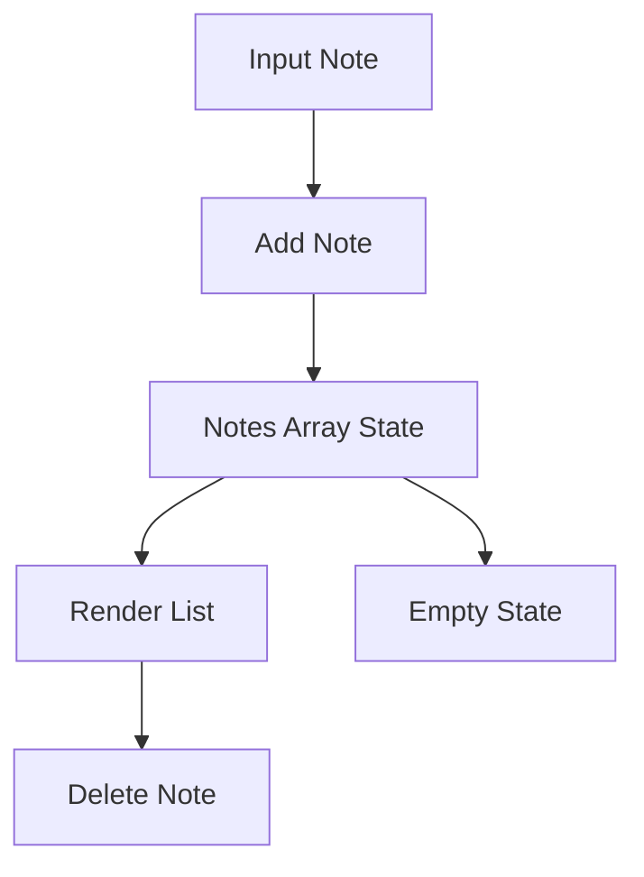

# Day 14 [Beginner to Intermediate]: Mini Project - Notes App

## Index

- [Goal](#goal)
- [Prerequisites](#prerequisites)
- [Explanation](#explanation)
- [Topic by Topic](#topic-by-topic)
- [Key Concepts](#key-concepts)
- [Visual Concept Map](#visual-concept-map)
- [End-to-End Practical](#end-to-end-practical)
- [Hands-on Coding](#hands-on-coding)
- [Mini Exercise](#mini-exercise)
- [Assessment Quiz](#assessment-quiz)
- [Task](#task)
- [Self Check](#self-check)
- [Interview Questions and Answers](#interview-questions-and-answers)
- [Day 14 Outcome](#day-14-outcome)

## Goal

Build a practical notes app using array state, events, forms, and conditional rendering basics.

## Prerequisites

- Day 13 completed
- Comfortable with array and object state

## Explanation

This mini project combines core React fundamentals into one real feature: add notes, list notes, and delete notes.

## Topic by Topic

### Topic 1: Notes Data Model

Theory:
Each note should have stable id, text, and created time.

Practical:
Design notes as object array.

Code Example:

```jsx
{ id: Date.now(), text: "Revise hooks", createdAt: new Date().toLocaleTimeString() }
```

**Explanation:** Each note is an object with a unique id, text content, and creation time.

**Key Points:**

- Object structure keeps note data organized.
- `Date.now()` can be used as a quick unique id.
- Timestamp helps users understand when note was added.

### Topic 2: Add Note Flow

Theory:
Input value enters state and pushes a new note immutably.

Practical:
Submit one note from form.

Code Example:

```jsx
setNotes((prev) => [...prev, newNote]);
```

**Explanation:** This adds a new note to the existing notes list by creating a new array.

**Key Points:**

- Keep old notes with `...prev`.
- Append the new note at the end.
- Immutable updates keep UI predictable.

### Topic 3: Delete Note Flow

Theory:
Filter by id to remove selected note only.

Practical:
Attach delete button per note.

Code Example:

```jsx
setNotes((prev) => prev.filter((note) => note.id !== id));
```

**Explanation:** This removes only the selected note by id and keeps all other notes.

**Key Points:**

- `filter` is great for remove operations.
- Use stable id for exact targeting.
- No direct mutation is needed.

### Topic 4: Empty State Message

Theory:
Show meaningful UI when no notes exist.

Practical:
Render "No notes yet" conditionally.

Code Example:

```jsx
{
  notes.length === 0 && <p>No notes yet</p>;
}
```

**Explanation:** When notes list is empty, this shows a friendly message instead of a blank area.

**Key Points:**

- Empty states improve user guidance.
- Use condition checks before list rendering.
- Keep message short and clear.

### Topic 5: Reusable Note Item

Theory:
Keep NoteItem component separate for cleaner code.

Practical:
Pass note data and delete handler as props.

Code Example:

```jsx
<NoteItem key={note.id} note={note} onDelete={removeNote} />
```

**Explanation:** A reusable `NoteItem` component keeps list code cleaner and easier to maintain.

**Key Points:**

- Pass data and actions through props.
- Keep parent focused on list/state logic.
- Reusable items reduce repeated JSX.

### Topic 6: Persist Notes in Local Storage

Theory:
Persisting notes keeps user data after refresh and improves real-world usability.

Practical:
Load notes from localStorage on mount and save when notes change.

Code Example:

```jsx
useEffect(() => {
  localStorage.setItem("notes", JSON.stringify(notes));
}, [notes]);
```

**Explanation:** Whenever notes change, this saves them in browser storage so they remain after refresh.

**Key Points:**

- `useEffect` runs when dependency changes.
- `JSON.stringify` stores arrays as strings.
- Persistence makes mini project more practical.

## Key Concepts

- Mini-project composition
- Notes CRUD basics
- Immutable array updates
- Empty state rendering
- Component decomposition
- Local persistence mindset

## Visual Concept Map



## End-to-End Practical

1. Build controlled note input.
2. Add note on submit.
3. Render notes list using map.
4. Add delete action.
5. Show empty state when list is empty.

## Hands-on Coding

### Example 1: Case - Daily Study Notes

Scenario:
A student stores short study notes through a simple app.

```jsx
import { useState } from "react";

function App() {
  const [text, setText] = useState("");
  const [notes, setNotes] = useState([]);

  const addNote = (e) => {
    e.preventDefault();
    if (!text.trim()) return;

    const newNote = {
      id: Date.now(),
      text: text.trim(),
      createdAt: new Date().toLocaleTimeString(),
    };

    setNotes((prev) => [...prev, newNote]);
    setText("");
  };

  return (
    <div>
      <form onSubmit={addNote}>
        <input
          value={text}
          placeholder="Write note"
          onChange={(e) => setText(e.target.value)}
        />
        <button type="submit">Add</button>
      </form>

      {notes.map((note) => (
        <p key={note.id}>{note.text}</p>
      ))}
    </div>
  );
}
```

### Example 2: Case - Team Meeting Notes With Delete

Scenario:
A team lead removes obsolete meeting notes from the list.

```jsx
function NoteItem({ note, onDelete }) {
  return (
    <div
      style={{ border: "1px solid #ddd", marginTop: "10px", padding: "10px" }}
    >
      <p>{note.text}</p>
      <small>{note.createdAt}</small>
      <br />
      <button onClick={() => onDelete(note.id)}>Delete</button>
    </div>
  );
}
```

### Example 3: Case - Empty Notebook State

Scenario:
A new user should see friendly empty-state guidance before creating first note.

```jsx
{
  notes.length === 0 ? (
    <p>No notes yet. Add your first note.</p>
  ) : (
    notes.map((note) => (
      <NoteItem key={note.id} note={note} onDelete={removeNote} />
    ))
  );
}
```

## Mini Exercise

Scenario:
You are building a personal idea board.

Add note priority (High/Medium/Low) and a filter button to show only High notes.

Expected output:

- Notes store text and priority
- Filter toggles high-priority view
- Existing add/delete flows still work

## Assessment Quiz

### Quiz Questions

1. Why use unique id in notes list?
2. What method removes one note from array state?
3. True or False: Empty state is unnecessary in mini projects.
4. Which event is used when adding note from form?
5. Why separate NoteItem component?

### Quiz Answers

1. Stable rendering and action targeting
2. filter
3. False
4. onSubmit
5. Better readability and reuse

## Task

- Build notes app with add and delete
- Display note timestamp
- Complete mini exercise

## Self Check

- You can build a complete mini feature
- You can connect input, state, and list actions
- You can answer at least 4 out of 5 quiz questions correctly

## Interview Questions and Answers

### Beginner

**Question:** Which concepts are used in Notes App?

**Answer:** useState, event handling, list rendering, and conditional rendering.

**Question:** Why call it a mini project?

**Answer:** It combines multiple fundamentals in one working feature.

### Middle

**Question:** How do you avoid adding empty notes?

**Answer:** Validate input with trim before adding note.

**Question:** How do you keep list actions maintainable?

**Answer:** Keep handlers clear and split UI into reusable components.

### Advanced

**Question:** How would you extend this app for edit functionality?

**Answer:** Track editing id, prefill input, and update target note with map.

**Question:** How can performance be improved for very large note lists?

**Answer:** Use memoization, pagination, or list virtualization.

## Day 14 Outcome

- You can build and explain a full notes mini project
- You can manage notes lifecycle with immutable updates
- You are ready for smarter UI branches in Day 15
