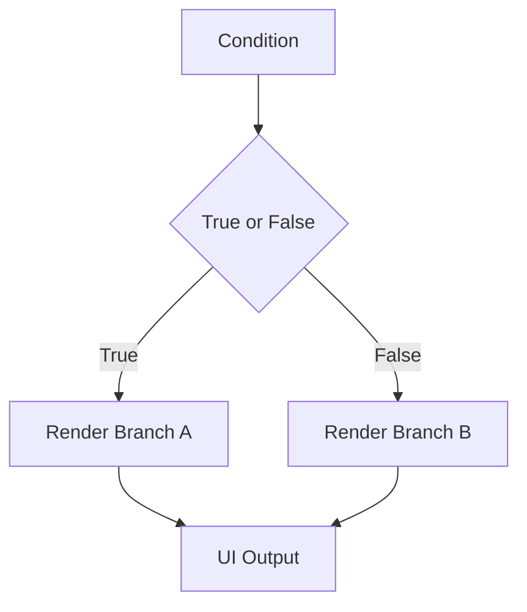

# Day 15 [Beginner to Intermediate]: Conditional Rendering

## Index

- [Goal](#goal)
- [Prerequisites](#prerequisites)
- [Explanation](#explanation)
- [Topic by Topic](#topic-by-topic)
- [Key Concepts](#key-concepts)
- [Visual Concept Map](#visual-concept-map)
- [End-to-End Practical](#end-to-end-practical)
- [Hands-on Coding](#hands-on-coding)
- [Mini Exercise](#mini-exercise)
- [Assessment Quiz](#assessment-quiz)
- [Task](#task)
- [Self Check](#self-check)
- [Interview Questions and Answers](#interview-questions-and-answers)
- [Day 15 Outcome](#day-15-outcome)

## Goal

Render different UI states based on conditions like login status, loading, role, and data availability.

## Prerequisites

- Day 14 completed
- Comfortable with state and JSX

## Explanation

Conditional rendering allows React components to show or hide elements based on logic.

## Topic by Topic

### Topic 1: if-else Rendering

Theory:
Use if-else when two branches are clearly separate.

Practical:
Show logged-in or guest message.

Code Example:

```jsx
if (isLoggedIn) return <h2>Welcome back</h2>;
return <h2>Please login</h2>;
```

**Explanation:** This returns one message when logged in and another message when not logged in.

**Key Points:**

- `if-else` is clear for separate branches.
- `return` can exit early with JSX.
- Useful when branch logic is larger.

### Topic 2: Ternary Operator

Theory:
Ternary works well for inline branch rendering.

Practical:
Toggle button label with condition.

Code Example:

```jsx
<button>{isSaved ? "Saved" : "Save"}</button>
```

**Explanation:** Ternary is a short way to show one of two values directly inside JSX.

**Key Points:**

- Best for small inline conditions.
- Format: `condition ? A : B`.
- Keep it simple for readability.

### Topic 3: Logical AND Rendering

Theory:
Use && for rendering block only when condition is true.

Practical:
Show badge only when notifications exist.

Code Example:

```jsx
{
  count > 0 && <span>{count} new</span>;
}
```

**Explanation:** The right side renders only when the left condition is true.

**Key Points:**

- Great for optional UI blocks.
- No `else` branch is needed.
- Common for badges and alerts.

### Topic 4: Loading, Error, Empty States

Theory:
Real apps need multiple conditional branches.

Practical:
Show loading first, then error or data.

Code Example:

```jsx
if (loading) return <p>Loading...</p>;
if (error) return <p>Error occurred</p>;
```

**Explanation:** This checks high-priority UI states first so users always see the correct message.

**Key Points:**

- Handle loading before data UI.
- Show clear error message when needed.
- Use early returns for cleaner logic.

### Topic 5: Role-based UI

Theory:
Render actions based on user role permission.

Practical:
Show admin controls only to admin.

Code Example:

```jsx
{
  role === "admin" && <button>Delete User</button>;
}
```

**Explanation:** Only users with `admin` role will see this button in the interface.

**Key Points:**

- Role checks control visible actions.
- Keep permission logic explicit.
- UI checks should also be backed by backend checks.

### Topic 6: Render Priority with Guard Clauses

Theory:
When multiple conditions exist, use a fixed priority order (loading -> error -> empty -> success) to avoid conflicting UI.

Practical:
Return early for high-priority states before rendering the final list view.

Code Example:

```jsx
if (loading) return <p>Loading...</p>;
if (error) return <p>Something went wrong</p>;
if (items.length === 0) return <p>No items found</p>;
```

**Explanation:** Guard clauses define a fixed order, so only the most relevant state is shown.

**Key Points:**

- Decide one state priority order.
- Return early to avoid conflicting UI.
- Improves clarity for users and developers.

## Key Concepts

- if-else branching
- Ternary rendering
- Logical AND blocks
- Multi-state UI flow
- Permission-based rendering
- Guard-clause rendering order

## Visual Concept Map



## End-to-End Practical

1. Add one boolean login state.
2. Render two branches for logged in/logged out.
3. Add loading state branch.
4. Add empty data condition.
5. Add role-based action button.

## Hands-on Coding

### Example 1: Case - Portal Login Status

Scenario:
An employee portal should show different content for logged-in and logged-out users.

```jsx
import { useState } from "react";

function App() {
  const [isLoggedIn, setIsLoggedIn] = useState(false);

  return (
    <div>
      <h2>{isLoggedIn ? "Welcome Employee" : "Please Login"}</h2>
      <button onClick={() => setIsLoggedIn(!isLoggedIn)}>
        {isLoggedIn ? "Logout" : "Login"}
      </button>
    </div>
  );
}
```

### Example 2: Case - API State Screen

Scenario:
A product dashboard needs loading, error, and empty-state handling.

```jsx
function ProductState({ loading, error, products }) {
  if (loading) return <p>Loading products...</p>;
  if (error) return <p>Unable to load products.</p>;
  if (products.length === 0) return <p>No products available.</p>;

  return (
    <ul>
      {products.map((product) => (
        <li key={product.id}>{product.name}</li>
      ))}
    </ul>
  );
}
```

### Example 3: Case - Role-based Admin Panel

Scenario:
Only admins should see high-risk actions in management UI.

```jsx
function AdminActions({ role }) {
  return (
    <div>
      <button>View Users</button>
      {role === "admin" && <button>Delete User</button>}
    </div>
  );
}
```

## Mini Exercise

Scenario:
You are building an online course dashboard.

Show:

- Login prompt if user is not logged in
- Loading message while lessons are fetching
- Empty message if no lessons
- Lessons list when data exists

Expected output:

- Correct branch appears for each state
- No conflicting UI blocks
- User experience is clear and consistent

## Assessment Quiz

### Quiz Questions

1. When is ternary better than if-else?
2. How does && rendering work?
3. True or False: Conditional rendering only works with booleans.
4. Why are loading and empty states both needed?
5. How do you hide admin actions from normal users?

### Quiz Answers

1. For concise inline two-branch UI
2. It renders right side only when left condition is truthy
3. False
4. They represent different user situations
5. Check role condition before rendering

## Task

- Build one component with at least 3 rendering branches
- Add role-based conditional action
- Complete mini exercise

## Self Check

- You can choose the right conditional pattern
- You can model realistic UI states
- You can answer at least 4 out of 5 quiz questions correctly

## Interview Questions and Answers

### Beginner

**Question:** What is conditional rendering?

**Answer:** Rendering different UI based on conditions.

**Question:** Name two common ways to do conditional rendering in React.

**Answer:** Ternary and logical AND.

### Middle

**Question:** Why is handling empty state important?

**Answer:** It prevents blank UI and guides users.

**Question:** How do you avoid nested complex ternaries?

**Answer:** Move logic into variables or helper render functions.

### Advanced

**Question:** How would you structure multiple state branches cleanly?

**Answer:** Early returns for loading/error and focused final render for success.

**Question:** What risks come with permission-based conditional rendering?

**Answer:** UI checks alone are not security; backend authorization is still required.

## Day 15 Outcome

- You can build logic-driven UI branches confidently
- You can handle auth, loading, empty, and role states
- You are ready for list + condition integration in upcoming lessons
