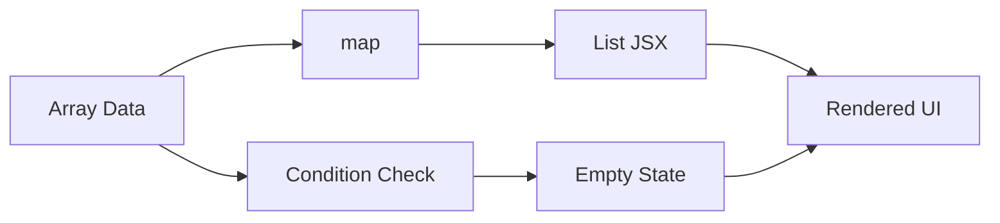

# Day 16 [Beginner to Intermediate]: List Rendering

## Index

- [Goal](#goal)
- [Prerequisites](#prerequisites)
- [Explanation](#explanation)
- [Topic by Topic](#topic-by-topic)
- [Key Concepts](#key-concepts)
- [Visual Concept Map](#visual-concept-map)
- [End-to-End Practical](#end-to-end-practical)
- [Hands-on Coding](#hands-on-coding)
- [Mini Exercise](#mini-exercise)
- [Assessment Quiz](#assessment-quiz)
- [Task](#task)
- [Self Check](#self-check)
- [Interview Questions and Answers](#interview-questions-and-answers)
- [Day 16 Outcome](#day-16-outcome)

## Goal

Render dynamic UI lists from array data using map and handle empty states cleanly.

## Prerequisites

- Day 15 completed
- Basic array and JSX understanding

## Explanation

List rendering helps you avoid repeated markup and generate UI from data models.

## Topic by Topic

### Topic 1: Why List Rendering

Theory:
Manual duplicate JSX is hard to maintain and update.

Practical:
Generate cards from one data array.

Code Example:

```jsx
{
  users.map((user) => <p key={user.id}>{user.name}</p>);
}
```

**Explanation:** Instead of repeating many `<p>` tags manually, `map` creates one row per user from data.

**Key Points:**

- Data array drives the UI.
- Less repeated code.
- Easier to update when data changes.

### Topic 2: map for Rendering

Theory:
map transforms each array item into JSX.

Practical:
Render product names from products array.

Code Example:

```jsx
{
  products.map((item) => <li key={item.id}>{item.name}</li>);
}
```

**Explanation:** `map` loops through each product and returns list item JSX for it.

**Key Points:**

- `map` transforms items into elements.
- Each item should have a stable key.
- Works for cards, rows, menus, and more.

### Topic 3: Empty State UI

Theory:
When list is empty, show helpful guidance instead of blank space.

Practical:
Render "No users found" if array length is zero.

Code Example:

```jsx
{users.length === 0 ? <p>No users found</p> : users.map(...) }
```

**Explanation:** This shows a helpful message when there is no data, otherwise it renders the list.

**Key Points:**

- Empty state prevents blank UI.
- Ternary handles two clear branches.
- Improves user understanding.

### Topic 4: Derived Rendering

Theory:
Render filtered and sorted views from original data.

Practical:
Show only active users.

Code Example:

```jsx
{
  users.filter((u) => u.active).map((u) => <p key={u.id}>{u.name}</p>);
}
```

**Explanation:** This first keeps only active users, then renders only those users.

**Key Points:**

- Combine `filter` and `map` for smart views.
- Keep original array unchanged.
- Useful for search and status views.

### Topic 5: Reusable List Item Component

Theory:
Separate item component for cleaner and maintainable list UIs.

Practical:
Render UserCard per user.

Code Example:

```jsx
{
  users.map((user) => <UserCard key={user.id} user={user} />);
}
```

**Explanation:** `UserCard` handles item UI, while parent handles list loop. This keeps code clean.

**Key Points:**

- Reusable components reduce duplication.
- Parent passes item data using props.
- Better maintainability for large lists.

### Topic 6: Stable Sorting Before Render

Theory:
Sort data intentionally before rendering so list order is consistent and user-friendly.

Practical:
Sort users by name before map.

Code Example:

```jsx
const sortedUsers = [...users].sort((a, b) => a.name.localeCompare(b.name));
```

**Explanation:** This copies the array and sorts names alphabetically before rendering.

**Key Points:**

- Copy first to avoid mutating state.
- `localeCompare` is good for text sorting.
- Consistent order improves user experience.

## Key Concepts

- map-driven UI
- Empty state rendering
- Filtered list views
- Reusable list items
- Data-first component design
- Stable sort-before-render pattern

## Visual Concept Map



## End-to-End Practical

1. Create users array.
2. Render list using map.
3. Add empty-state conditional.
4. Add active filter.
5. Extract list item component.

## Hands-on Coding

### Example 1: Case - Employee Directory List

Scenario:
An HR team wants a quick employee directory rendered from backend-style array data.

```jsx
const employees = [
  { id: 1, name: "Asha", role: "Recruiter" },
  { id: 2, name: "Ravi", role: "Designer" },
  { id: 3, name: "Nina", role: "Developer" },
];

function App() {
  return (
    <div>
      {employees.map((emp) => (
        <p key={emp.id}>
          {emp.name} - {emp.role}
        </p>
      ))}
    </div>
  );
}
```

### Example 2: Case - E-commerce Empty Catalog Message

Scenario:
A new category page should show a clear message when no products exist.

```jsx
function ProductList({ products }) {
  return (
    <div>
      {products.length === 0 ? (
        <p>No products available in this category.</p>
      ) : (
        products.map((product) => <p key={product.id}>{product.name}</p>)
      )}
    </div>
  );
}
```

### Example 3: Case - Active Users Filter View

Scenario:
An admin panel should display only active users from the full list.

```jsx
function ActiveUsers({ users }) {
  const activeUsers = users.filter((user) => user.active);

  return (
    <ul>
      {activeUsers.map((user) => (
        <li key={user.id}>{user.name}</li>
      ))}
    </ul>
  );
}
```

## Mini Exercise

Scenario:
You are creating a course enrollment list.

Render student cards from array data and add a fallback message when list is empty.

Expected output:

- Student cards render from map
- Empty message appears when no students
- UI remains clean for both states

## Assessment Quiz

### Quiz Questions

1. Why is map used in list rendering?
2. What happens if a list has no conditional empty state?
3. True or False: List rendering should prefer data arrays over duplicate JSX.
4. Which method helps render only matching items?
5. Why create reusable list item components?

### Quiz Answers

1. To transform each data item into JSX
2. UI may look blank and confusing
3. True
4. filter
5. Better maintainability and readability

## Task

- Render at least 5 items from array
- Add empty-state branch
- Complete mini exercise

## Self Check

- You can render dynamic lists from data
- You can handle empty arrays properly
- You can answer at least 4 out of 5 quiz questions correctly

## Interview Questions and Answers

### Beginner

**Question:** What does map do in React list rendering?

**Answer:** It converts array items into JSX elements.

**Question:** Why not copy-paste repeated JSX blocks?

**Answer:** It is hard to maintain and update.

### Middle

**Question:** How do you render filtered lists in React?

**Answer:** Filter the data first, then map the filtered array.

**Question:** How do you show empty-state message?

**Answer:** Use conditional rendering based on array length.

### Advanced

**Question:** How can large list rendering be optimized?

**Answer:** Use memoization and virtualization when needed.

**Question:** What design pattern helps list reusability at scale?

**Answer:** Component composition with reusable item and container components.

## Day 16 Outcome

- You can render lists from data arrays confidently
- You can design empty-state and filtered list UI
- You are ready for key identity and reconciliation in Day 17
