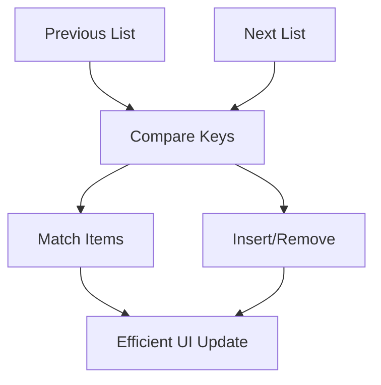

# Day 17 [Beginner to Intermediate]: Keys and Reconciliation

## Index

- [Goal](#goal)
- [Prerequisites](#prerequisites)
- [Explanation](#explanation)
- [Topic by Topic](#topic-by-topic)
- [Key Concepts](#key-concepts)
- [Visual Concept Map](#visual-concept-map)
- [End-to-End Practical](#end-to-end-practical)
- [Hands-on Coding](#hands-on-coding)
- [Mini Exercise](#mini-exercise)
- [Assessment Quiz](#assessment-quiz)
- [Task](#task)
- [Self Check](#self-check)
- [Interview Questions and Answers](#interview-questions-and-answers)
- [Day 17 Outcome](#day-17-outcome)

## Goal

Understand how stable keys help React reconcile list updates safely and efficiently.

## Prerequisites

- Day 16 completed
- Comfortable with map rendering

## Explanation

React compares previous and next list items during reconciliation. Keys provide identity so React updates only what changed.

## Topic by Topic

### Topic 1: What is a Key

Theory:
Key is a unique identifier for each list element.

Practical:
Use id from data as key.

Code Example:

```jsx
{
  items.map((item) => <li key={item.id}>{item.name}</li>);
}
```

**Explanation:** A key gives each item a clear identity so React can track it across renders.

**Key Points:**

- Keys should be unique among siblings.
- Prefer stable ids from data.
- Keys improve update correctness.

### Topic 2: Why Not Index Keys by Default

Theory:
Index keys can break item identity when list order changes.

Practical:
Compare reorder behavior with id keys.

Code Example:

```jsx
{
  items.map((item, index) => <li key={index}>{item.name}</li>);
}
```

**Explanation:** Index keys can break identity when order changes, causing confusing UI behavior.

**Key Points:**

- Index key changes when list order changes.
- Component state can attach to wrong row.
- Use id keys for dynamic lists.

### Topic 3: Add and Remove with Stable Keys

Theory:
Insert/delete actions stay predictable with stable ids.

Practical:
Add and delete todo items.

Code Example:

```jsx
setTodos((prev) => prev.filter((todo) => todo.id !== id));
```

**Explanation:** This removes one todo by id, and stable keys help React update only the right row.

**Key Points:**

- Remove by id for precision.
- Keep key and action based on same identity.
- Prevents accidental row mismatches.

### Topic 4: Reordering Lists

Theory:
Reordering requires correct keys to avoid state mismatch.

Practical:
Move item to top of list.

Code Example:

```jsx
const moved = [items[2], items[0], items[1]];
```

**Explanation:** Reordering changes item positions. Stable keys make sure each item keeps its identity.

**Key Points:**

- Position can change, identity should not.
- Stable keys protect local row state.
- Reorder is common in drag-and-drop UIs.

### Topic 5: Reconciliation Basics

Theory:
React diffing checks keys and element types to decide updates.

Practical:
Observe how only changed nodes re-render.

Code Example:

```jsx
const taskRows = tasks.map((task) => <TaskRow key={task.id} task={task} />);
```

**Explanation:** During reconciliation, React compares previous and next rows by key, then updates only changed rows.

**Key Points:**

- Reconciliation is React's update comparison step.
- Key and element type guide matching.
- Fewer unnecessary DOM updates.

### Topic 6: Using key to Reset Component State

Theory:
Changing a component key forces remount, which is useful when you intentionally want a fresh local state.

Practical:
Reset a form by changing its key value.

Code Example:

```jsx
<ProfileForm key={formVersion} />
```

**Explanation:** Changing `formVersion` changes the key, so React remounts the form with fresh internal state.

**Key Points:**

- New key means new component instance.
- Useful for intentional reset flows.
- Use this pattern only when reset is desired.

## Key Concepts

- Key identity
- Reconciliation process
- Stable vs unstable keys
- Add/remove/reorder behavior
- Predictable list updates
- Intentional remount with key

## Visual Concept Map



## End-to-End Practical

1. Build list with unique ids.
2. Render with id as key.
3. Add new item.
4. Remove existing item.
5. Reorder items and verify stable rendering.

## Hands-on Coding

### Example 1: Case - Task List with Stable Keys

Scenario:
A task management app needs safe list updates while users add and remove tasks.

```jsx
import { useState } from "react";

function App() {
  const [tasks, setTasks] = useState([
    { id: 101, title: "Design" },
    { id: 102, title: "Develop" },
  ]);

  const addTask = () => {
    setTasks((prev) => [...prev, { id: Date.now(), title: "Test" }]);
  };

  const removeTask = (id) => {
    setTasks((prev) => prev.filter((task) => task.id !== id));
  };

  return (
    <div>
      <button onClick={addTask}>Add Task</button>
      {tasks.map((task) => (
        <p key={task.id}>
          {task.title}
          <button onClick={() => removeTask(task.id)}>Delete</button>
        </p>
      ))}
    </div>
  );
}
```

### Example 2: Case - Reorder Product Queue

Scenario:
A warehouse panel moves urgent product to top while preserving item identity.

```jsx
import { useState } from "react";

function Queue() {
  const [items, setItems] = useState([
    { id: 1, name: "Order A" },
    { id: 2, name: "Order B" },
    { id: 3, name: "Order C" },
  ]);

  const moveLastToTop = () => {
    setItems((prev) => {
      if (prev.length < 2) return prev;
      const last = prev[prev.length - 1];
      const rest = prev.slice(0, -1);
      return [last, ...rest];
    });
  };

  return (
    <div>
      <button onClick={moveLastToTop}>Prioritize Last</button>
      {items.map((item) => (
        <p key={item.id}>{item.name}</p>
      ))}
    </div>
  );
}
```

### Example 3: Case - Bad Index Key Demo

Scenario:
A demo shows why index keys can behave unexpectedly after reordering.

```jsx
{
  items.map((item, index) => <p key={index}>{item.name}</p>);
}
```

## Mini Exercise

Scenario:
You are building a playlist editor.

Create add, remove, and reorder features using id keys only.

Expected output:

- Playlist renders without key warnings
- Reordered items preserve expected behavior
- Remove action deletes correct song

## Assessment Quiz

### Quiz Questions

1. What is the main purpose of keys in React?
2. Why can index keys be risky?
3. True or False: keys need to be unique only within a list level.
4. What should be used as key when available?
5. What part of React uses keys during updates?

### Quiz Answers

1. Track element identity during updates
2. Reordering can mismatch identity
3. True
4. Stable unique id from data
5. Reconciliation

## Task

- Build a list with add/remove/reorder
- Use stable id-based keys
- Complete mini exercise

## Self Check

- You can explain keys and reconciliation
- You can avoid index key pitfalls
- You can answer at least 4 out of 5 quiz questions correctly

## Interview Questions and Answers

### Beginner

**Question:** Why does React ask for keys in lists?

**Answer:** To identify list items between renders.

**Question:** Can two sibling items share same key?

**Answer:** No, keys should be unique among siblings.

### Middle

**Question:** When is index key acceptable?

**Answer:** Only when list is static and never reorders or changes.

**Question:** How do stable keys improve UX?

**Answer:** They prevent unexpected UI/state jumps during updates.

### Advanced

**Question:** How does reconciliation benefit performance?

**Answer:** It updates only changed nodes rather than re-rendering everything.

**Question:** Why might unstable keys break input focus?

**Answer:** React may recreate components and lose local state/focus identity.

## Day 17 Outcome

- You can choose proper keys for dynamic lists
- You can reason about reconciliation behavior
- You are ready for dynamic component switching in Day 18
