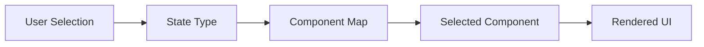

# Day 18 [Beginner to Intermediate]: Dynamic Components

## Index

- [Goal](#goal)
- [Prerequisites](#prerequisites)
- [Explanation](#explanation)
- [Topic by Topic](#topic-by-topic)
- [Key Concepts](#key-concepts)
- [Visual Concept Map](#visual-concept-map)
- [End-to-End Practical](#end-to-end-practical)
- [Hands-on Coding](#hands-on-coding)
- [Mini Exercise](#mini-exercise)
- [Assessment Quiz](#assessment-quiz)
- [Task](#task)
- [Self Check](#self-check)
- [Interview Questions and Answers](#interview-questions-and-answers)
- [Day 18 Outcome](#day-18-outcome)

## Goal

Learn to render different components dynamically based on state, config, or user choice.

## Prerequisites

- Day 17 completed
- Comfortable with conditional rendering

## Explanation

Dynamic components make UIs flexible by choosing what to render at runtime.

## Topic by Topic

### Topic 1: Conditional Component Rendering

Theory:
Render one component or another based on a condition.

Practical:
Switch between LoginPanel and Dashboard.

Code Example:

```jsx
{
  isLoggedIn ? <Dashboard /> : <LoginPanel />;
}
```

**Explanation:** This renders one component when logged in, and a different component when logged out.

**Key Points:**

- Condition decides which component appears.
- Good for simple two-way component switch.
- Keeps one screen dynamic without navigation.

### Topic 2: Component Mapping by Key

Theory:
Map a key to component for scalable switching.

Practical:
Render widget by selected tab key.

Code Example:

```jsx
const widgetMap = { sales: SalesWidget, users: UsersWidget };
```

**Explanation:** A component map connects a string key to a component, which makes switching cleaner than many `if` checks.

**Key Points:**

- Easy to scale as options grow.
- Central place for type-to-component mapping.
- Reduces long conditional blocks.

### Topic 3: Dynamic Props

Theory:
Pass different props depending on selection.

Practical:
Use same component for multiple cards.

Code Example:

```jsx
<Widget title={activeTitle} count={activeCount} />
```

**Explanation:** Same component can show different data based on props passed at runtime.

**Key Points:**

- Reuse one component for many cases.
- Props carry dynamic values.
- Keeps UI flexible and consistent.

### Topic 4: Config-driven UI

Theory:
Render UI from a configuration array/object.

Practical:
Render dashboard blocks from config.

Code Example:

```jsx
config.map((item) => <Widget key={item.id} {...item} />);
```

**Explanation:** UI is generated from config data, so layout can change by editing data instead of JSX structure.

**Key Points:**

- Data controls what gets rendered.
- Spread props quickly pass config fields.
- Useful for dashboards and CMS-like pages.

### Topic 5: Fallback Rendering

Theory:
Provide fallback when unknown component key appears.

Practical:
Show default widget for invalid type.

Code Example:

```jsx
const Selected = widgetMap[type] || DefaultWidget;
```

**Explanation:** If the selected type is unknown, app uses a safe default component instead of failing.

**Key Points:**

- Fallback prevents blank or broken UI.
- Handles invalid or missing types safely.
- Improves robustness in real apps.

### Topic 6: Component Contract Consistency

Theory:
Dynamic components are safer when every component follows a shared prop contract.

Practical:
Pass a common data object and onAction callback to each dynamic widget.

Code Example:

```jsx
const SelectedWidget = widgets[type] || DefaultWidget;
return <SelectedWidget data={widgetData} onAction={handleAction} />;
```

**Explanation:** A shared prop contract means each dynamic component accepts the same prop shape, making switching reliable.

**Key Points:**

- Keep props consistent across dynamic components.
- Simplifies parent render logic.
- Improves reuse and testability.

## Key Concepts

- Runtime component selection
- Component maps
- Config-driven rendering
- Dynamic props
- Safe fallback UI
- Shared prop contracts

## Visual Concept Map



## End-to-End Practical

1. Create three widget components.
2. Add selectedWidget state.
3. Render widget based on state.
4. Add component map approach.
5. Add fallback widget.

## Hands-on Coding

### Example 1: Case - Dashboard Widget Switcher

Scenario:
A dashboard lets users switch between Sales, Users, and Revenue widgets.

```jsx
import { useState } from "react";

function SalesWidget() {
  return <p>Sales: 120</p>;
}

function UsersWidget() {
  return <p>Users: 320</p>;
}

function RevenueWidget() {
  return <p>Revenue: $5400</p>;
}

function App() {
  const [type, setType] = useState("sales");

  return (
    <div>
      <button onClick={() => setType("sales")}>Sales</button>
      <button onClick={() => setType("users")}>Users</button>
      <button onClick={() => setType("revenue")}>Revenue</button>

      {type === "sales" && <SalesWidget />}
      {type === "users" && <UsersWidget />}
      {type === "revenue" && <RevenueWidget />}
    </div>
  );
}
```

### Example 2: Case - Config-driven Course Cards

Scenario:
An LMS homepage renders different course cards from server configuration.

```jsx
const courseConfig = [
  { id: 1, title: "React Basics", level: "Beginner" },
  { id: 2, title: "State Patterns", level: "Intermediate" },
];

function CourseCard({ title, level }) {
  return (
    <div>
      <h3>{title}</h3>
      <p>{level}</p>
    </div>
  );
}

function CourseList() {
  return courseConfig.map((course) => (
    <CourseCard key={course.id} {...course} />
  ));
}
```

### Example 3: Case - Safe Widget Fallback

Scenario:
An analytics page receives unknown widget type and must show fallback content.

```jsx
function DefaultWidget() {
  return <p>Widget type not supported.</p>;
}

const widgets = {
  sales: SalesWidget,
  users: UsersWidget,
};

function WidgetHost({ type }) {
  const SelectedWidget = widgets[type] || DefaultWidget;
  return <SelectedWidget />;
}
```

## Mini Exercise

Scenario:
You are building a profile dashboard with dynamic sections.

Create tabs for Overview, Activity, and Settings that render different components.

Expected output:

- Active tab decides rendered component
- Section switches without page reload
- Unknown section shows fallback message

## Assessment Quiz

### Quiz Questions

1. What is dynamic component rendering?
2. Why use component map for switch logic?
3. True or False: Dynamic rendering always requires React Router.
4. How do you handle unknown component type?
5. Why is config-driven UI useful?

### Quiz Answers

1. Choosing components at runtime based on state/data
2. Cleaner and scalable branching
3. False
4. Use fallback component
5. Backend/data can control UI blocks with less hardcoding

## Task

- Build component switcher with at least 3 views
- Use map/config approach once
- Complete mini exercise

## Self Check

- You can render components dynamically
- You can implement fallback-safe UI
- You can answer at least 4 out of 5 quiz questions correctly

## Interview Questions and Answers

### Beginner

**Question:** What is a dynamic component in React?

**Answer:** A component selected/rendered based on condition or state.

**Question:** Can one page render multiple component types from same placeholder?

**Answer:** Yes, using conditional or map-based selection.

### Middle

**Question:** How does component map improve code quality?

**Answer:** It reduces long if-else/switch blocks and scales better.

**Question:** Why add fallback component?

**Answer:** To avoid crashes or blank UI for unknown types.

### Advanced

**Question:** How would you lazy-load dynamic components?

**Answer:** Use React.lazy with Suspense and type-based imports.

**Question:** What architecture fits dynamic dashboard systems?

**Answer:** Config-driven rendering with typed schemas and reusable widget contracts.

## Day 18 Outcome

- You can build state-driven component switchers
- You can use config and fallback patterns effectively
- You are ready to manage shared state between components in Day 19
