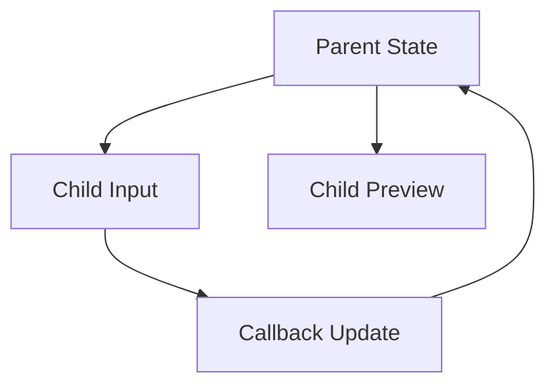

# Day 19 [Beginner to Intermediate]: Lifting State Up

## Index

- [Goal](#goal)
- [Prerequisites](#prerequisites)
- [Explanation](#explanation)
- [Topic by Topic](#topic-by-topic)
- [Key Concepts](#key-concepts)
- [Visual Concept Map](#visual-concept-map)
- [End-to-End Practical](#end-to-end-practical)
- [Hands-on Coding](#hands-on-coding)
- [Mini Exercise](#mini-exercise)
- [Assessment Quiz](#assessment-quiz)
- [Task](#task)
- [Self Check](#self-check)
- [Interview Questions and Answers](#interview-questions-and-answers)
- [Day 19 Outcome](#day-19-outcome)

## Goal

Move shared state to the nearest common parent so sibling components stay synchronized.

## Prerequisites

- Day 18 completed
- Comfortable with props and useState

## Explanation

When two or more children need the same data, keep that state in their parent and pass values/actions via props.

## Topic by Topic

### Topic 1: Why Lift State Up

Theory:
Sibling components with duplicate local state become inconsistent.

Practical:
Move shared value to parent.

Code Example:

```jsx
const [value, setValue] = useState("");
```

**Explanation:** Shared value is stored once in parent state so multiple children can use the same latest data.

**Key Points:**

- Lift state when siblings need same data.
- One state source avoids mismatch.
- Parent becomes central owner of shared value.

### Topic 2: Parent as Source of Truth

Theory:
Single source of truth avoids mismatch across children.

Practical:
Pass value down to both children.

Code Example:

```jsx
<ChildA value={value} />
<ChildB value={value} />
```

**Explanation:** Both children read the same parent value, so they always stay in sync.

**Key Points:**

- Parent sends data through props.
- Siblings do not keep duplicate shared state.
- Any parent update reflects everywhere.

### Topic 3: Child Updates Parent State

Theory:
Parent passes setter or callback to children.

Practical:
Child input updates parent.

Code Example:

```jsx
<ChildA onChange={setValue} />
```

**Explanation:** Parent gives child a callback. Child calls it to request a state update in parent.

**Key Points:**

- Data goes down, actions go up.
- Callbacks enable child-to-parent communication.
- Parent still controls final state.

### Topic 4: Sibling Synchronization

Theory:
One child updates and all sibling views reflect latest data.

Practical:
Text input + preview panel sync.

Code Example:

```jsx
<Preview text={value} />
```

**Explanation:** When input child changes `value`, preview child receives the new prop and updates immediately.

**Key Points:**

- Shared parent state synchronizes siblings.
- No direct child-to-child dependency needed.
- Real-time preview becomes easy.

### Topic 5: Minimal Lift Strategy

Theory:
Lift only shared state, keep local-only state near component.

Practical:
Keep button hover local, form data in parent.

Code Example:

```jsx
const [profile, setProfile] = useState({ name: "", role: "" });
const [isHovered, setIsHovered] = useState(false);
```

**Explanation:** Keep shared business data lifted, but keep UI-only details local when they are not needed elsewhere.

**Key Points:**

- Do not lift every state blindly.
- Shared state in parent, local UI state near child.
- This keeps components simpler.

### Topic 6: State Shape Before Lifting

Theory:
Design state structure first (single object vs split fields) so lifted state stays easy to update.

Practical:
Use one profile object when fields are saved together, or separate states when they change independently.

Code Example:

```jsx
const [profile, setProfile] = useState({ name: "", role: "" });
```

**Explanation:** Plan state shape before lifting so updates stay clear and predictable.

**Key Points:**

- Group fields when they belong together.
- Choose shape based on update patterns.
- Good structure reduces future refactoring.

## Key Concepts

- Single source of truth
- Parent-managed shared state
- Callback props for updates
- Sibling synchronization
- Scoped state placement
- State shape design

## Visual Concept Map



## End-to-End Practical

1. Create shared state in parent.
2. Pass value to two child components.
3. Pass callback to child input.
4. Update state from child action.
5. Verify sibling components stay synced.

## Hands-on Coding

### Example 1: Case - Temperature Converter Sync

Scenario:
Two input fields (Celsius and Fahrenheit) should stay synchronized via parent state.

```jsx
import { useState } from "react";

function App() {
  const [celsius, setCelsius] = useState("");

  const handleCelsius = (value) => setCelsius(value);
  const fahrenheit = celsius === "" ? "" : (Number(celsius) * 9) / 5 + 32;

  return (
    <div>
      <input
        value={celsius}
        onChange={(e) => handleCelsius(e.target.value)}
        placeholder="Celsius"
      />
      <input value={fahrenheit} readOnly placeholder="Fahrenheit" />
    </div>
  );
}
```

### Example 2: Case - Shared Search Across Components

Scenario:
A search box in one component should instantly filter list in another component.

```jsx
function SearchBox({ query, setQuery }) {
  return (
    <input
      value={query}
      onChange={(e) => setQuery(e.target.value)}
      placeholder="Search"
    />
  );
}

function Results({ query, items }) {
  const filtered = items.filter((item) =>
    item.toLowerCase().includes(query.toLowerCase()),
  );
  return filtered.map((item, index) => <p key={index}>{item}</p>);
}
```

### Example 3: Case - Billing Summary Sync

Scenario:
An invoice form and summary card should always show same latest amount and tax values.

```jsx
function BillingForm({ amount, tax, setAmount, setTax }) {
  return (
    <div>
      <input
        value={amount}
        onChange={(e) => setAmount(e.target.value)}
        placeholder="Amount"
      />
      <input
        value={tax}
        onChange={(e) => setTax(e.target.value)}
        placeholder="Tax %"
      />
    </div>
  );
}

function BillingSummary({ amount, tax }) {
  const total =
    Number(amount || 0) + (Number(amount || 0) * Number(tax || 0)) / 100;
  return <p>Total: {total}</p>;
}
```

## Mini Exercise

Scenario:
You are building a profile editor with live preview.

Create parent state for name, role, and location. Update values from one child form and display in another child preview panel.

Expected output:

- Parent holds shared profile state
- Form child updates via callback props
- Preview child updates instantly

## Assessment Quiz

### Quiz Questions

1. When should state be lifted?
2. What does single source of truth mean?
3. True or False: Every state should always be moved to top-level parent.
4. How does child update lifted state?
5. What problem does lifting state solve between siblings?

### Quiz Answers

1. When multiple components need same state
2. One authoritative state location
3. False
4. Via callback props from parent
5. Prevents inconsistent UI values

## Task

- Build one shared-state parent with 2 children
- Pass value and callbacks via props
- Complete mini exercise

## Self Check

- You can identify when state should be lifted
- You can implement sibling synchronization
- You can answer at least 4 out of 5 quiz questions correctly

## Interview Questions and Answers

### Beginner

**Question:** What is lifting state up?

**Answer:** Moving shared state to the nearest common parent.

**Question:** Why pass callbacks to children?

**Answer:** So children can request parent state updates.

### Middle

**Question:** How do you avoid over-lifting state?

**Answer:** Lift only state that is shared; keep local UI state local.

**Question:** What is a common symptom of missing state lifting?

**Answer:** Sibling components show out-of-sync values.

### Advanced

**Question:** When does context become better than prop-drilling?

**Answer:** When many nested components need same shared state.

**Question:** How does lifting state affect testability?

**Answer:** Centralized logic becomes easier to test and reason about.

## Day 19 Outcome

- You can design parent-managed shared state
- You can keep sibling components synchronized
- You are ready for robust parent-child communication patterns in Day 20
