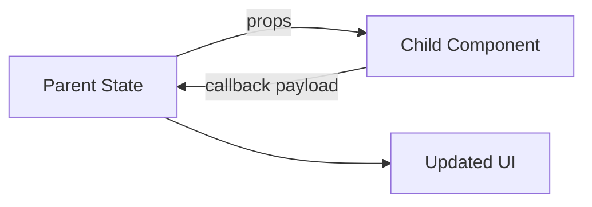

# Day 20 [Beginner to Intermediate]: Parent-Child Communication

## Index

- [Goal](#goal)
- [Prerequisites](#prerequisites)
- [Explanation](#explanation)
- [Topic by Topic](#topic-by-topic)
- [Key Concepts](#key-concepts)
- [Visual Concept Map](#visual-concept-map)
- [End-to-End Practical](#end-to-end-practical)
- [Hands-on Coding](#hands-on-coding)
- [Mini Exercise](#mini-exercise)
- [Assessment Quiz](#assessment-quiz)
- [Task](#task)
- [Self Check](#self-check)
- [Interview Questions and Answers](#interview-questions-and-answers)
- [Day 20 Outcome](#day-20-outcome)

## Goal

Master parent-child communication where parents send data via props and children send actions upward via callbacks.

## Prerequisites

- Day 19 completed
- Good understanding of props and state

## Explanation

React data flow is primarily top-down. Children communicate upward by calling functions provided by parent components.

## Topic by Topic

### Topic 1: Parent to Child via Props

Theory:
Parent passes values to child for display or behavior.

Practical:
Send task title to TaskItem.

Code Example:

```jsx
<TaskItem title={task.title} />
```

**Explanation:** Parent sends data to child using props, and child uses that data for display.

**Key Points:**

- Props are the main parent-to-child channel.
- Parent controls what data is passed.
- Child stays reusable with clear inputs.

### Topic 2: Child to Parent via Callback

Theory:
Parent passes function, child calls it on action.

Practical:
TaskItem calls onDelete(id).

Code Example:

```jsx
<TaskItem onDelete={handleDelete} />
```

**Explanation:** Parent passes a function prop. Child calls that function to notify parent about an action.

**Key Points:**

- Callback enables upward communication.
- Parent owns state update logic.
- Child only triggers intent.

### Topic 3: Parameterized Child Actions

Theory:
Children can pass payload like id, status, or value.

Practical:
Send task id from child button click.

Code Example:

```jsx
<button onClick={() => onDelete(task.id)}>Delete</button>
```

**Explanation:** Child sends item-specific data (`task.id`) when the user clicks delete.

**Key Points:**

- Arrow function passes custom payload.
- Parent can target exact item.
- Useful for list actions.

### Topic 4: Event + Data Payload Pattern

Theory:
You may pass both event context and business payload.

Practical:
Send selected role from child selector.

Code Example:

```jsx
onRoleChange(user.id, e.target.value);
```

**Explanation:** Callback sends both business id and selected value, so parent has complete context.

**Key Points:**

- Payload can include multiple values.
- Parent logic becomes more precise.
- Keep payload structure predictable.

### Topic 5: Avoiding Prop Drilling Pitfalls

Theory:
Deep callback chains can become hard to maintain.

Practical:
Refactor shared handlers in nearest common parent.

Code Example:

```jsx
<TaskSection tasks={tasks} onDeleteTask={handleDeleteTask} />
```

**Explanation:** Keep handlers near the shared state owner and pass only what lower components need.

**Key Points:**

- Avoid passing unrelated props deeply.
- Group related communication in nearby parent.
- Refactor when prop chains become too long.

### Topic 6: Callback Contract Design

Theory:
Stable callback names and payload shapes make child components easier to reuse and test.

Practical:
Use clear APIs like `onStatusChange(taskId, nextStatus)` instead of ambiguous handlers.

Code Example:

```jsx
<TaskItem onStatusChange={(id, status) => updateTask(id, status)} />
```

**Explanation:** Clear callback names and parameter order make component APIs easy to understand and reuse.

**Key Points:**

- Use meaningful callback names.
- Keep payload shape consistent.
- Better contracts reduce integration bugs.

## Key Concepts

- Top-down props flow
- Upward callbacks
- Payload-based actions
- Parent-owned state updates
- Scalable communication patterns
- Clear callback contracts

## Visual Concept Map



## End-to-End Practical

1. Store tasks in parent state.
2. Render TaskItem child for each task.
3. Pass onComplete and onDelete callbacks.
4. Trigger callbacks from child buttons.
5. Update parent list and re-render.

## Hands-on Coding

### Example 1: Case - Task Complete/Delete Actions

Scenario:
A todo app needs each task row to notify parent when complete or delete is clicked.

```jsx
import { useState } from "react";

function TaskItem({ task, onComplete, onDelete }) {
  return (
    <div>
      <span>
        {task.title} - {task.done ? "Done" : "Pending"}
      </span>
      <button onClick={() => onComplete(task.id)}>Complete</button>
      <button onClick={() => onDelete(task.id)}>Delete</button>
    </div>
  );
}

function App() {
  const [tasks, setTasks] = useState([
    { id: 1, title: "Read docs", done: false },
    { id: 2, title: "Build app", done: false },
  ]);

  const completeTask = (id) => {
    setTasks((prev) =>
      prev.map((t) => (t.id === id ? { ...t, done: true } : t)),
    );
  };

  const deleteTask = (id) => {
    setTasks((prev) => prev.filter((t) => t.id !== id));
  };

  return tasks.map((task) => (
    <TaskItem
      key={task.id}
      task={task}
      onComplete={completeTask}
      onDelete={deleteTask}
    />
  ));
}
```

### Example 2: Case - Product Card Add-to-Cart Callback

Scenario:
An ecommerce product card sends selected product id back to parent cart manager.

```jsx
function ProductCard({ product, onAddToCart }) {
  return (
    <div>
      <p>{product.name}</p>
      <button onClick={() => onAddToCart(product.id)}>Add to Cart</button>
    </div>
  );
}
```

### Example 3: Case - Child Filter Controls Parent Table

Scenario:
A filter panel child sends selected department to parent table view.

```jsx
function FilterPanel({ onFilterChange }) {
  return (
    <select onChange={(e) => onFilterChange(e.target.value)}>
      <option value="all">All</option>
      <option value="HR">HR</option>
      <option value="Engineering">Engineering</option>
    </select>
  );
}
```

## Mini Exercise

Scenario:
You are building a classroom assignment board.

Create AssignmentItem child components where each child can mark assignment complete and request removal through parent callbacks.

Expected output:

- Parent owns assignment list state
- Child triggers complete/delete actions upward
- Parent updates list correctly

## Assessment Quiz

### Quiz Questions

1. How does a child send data to parent in React?
2. Why should parent own shared list state?
3. True or False: child can directly edit parent state variable.
4. What is callback payload?
5. When does prop drilling become a concern?

### Quiz Answers

1. By calling callback prop passed from parent
2. Centralized updates and predictable flow
3. False
4. Data sent by child when invoking parent callback
5. When callbacks/props pass through many nested layers

## Task

- Build parent list + child item communication
- Implement at least two child-to-parent actions
- Complete mini exercise

## Self Check

- You can implement upward communication confidently
- You can design clear callback APIs between components
- You can answer at least 4 out of 5 quiz questions correctly

## Interview Questions and Answers

### Beginner

**Question:** How does parent pass data to child?

**Answer:** Through props.

**Question:** How does child trigger parent logic?

**Answer:** By invoking callback prop.

### Middle

**Question:** Why is callback naming important?

**Answer:** Clear names like onDelete or onComplete improve readability.

**Question:** What common bug happens in child callbacks?

**Answer:** Calling callback immediately instead of passing function reference.

### Advanced

**Question:** How do you reduce callback prop complexity in deep trees?

**Answer:** Use context, custom hooks, or state management patterns.

**Question:** What are signs of over-coupled parent-child communication?

**Answer:** Too many tightly coupled props and hard-to-reuse child components.

## Day 20 Outcome

- You can implement bidirectional interaction patterns correctly
- You can manage parent-owned state with child callbacks
- You are ready for integrated mini project communication in Day 21
