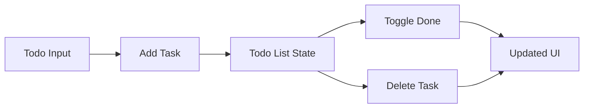

# Day 21 [Beginner to Intermediate]: Mini Project Todo App

## Index

- [Goal](#goal)
- [Prerequisites](#prerequisites)
- [Explanation](#explanation)
- [Topic by Topic](#topic-by-topic)
- [Key Concepts](#key-concepts)
- [Visual Concept Map](#visual-concept-map)
- [End-to-End Practical](#end-to-end-practical)
- [Hands-on Coding](#hands-on-coding)
- [Mini Exercise](#mini-exercise)
- [Assessment Quiz](#assessment-quiz)
- [Task](#task)
- [Self Check](#self-check)
- [Interview Questions and Answers](#interview-questions-and-answers)
- [Day 21 Outcome](#day-21-outcome)

## Goal

Build a complete Todo app using React state and event handling.

## Prerequisites

- Day 20 completed
- Comfortable with `useState`, list rendering, and event handling

## Explanation

This project connects many concepts you already learned: controlled input, array state updates, conditional rendering, and component structure. You will build a simple but realistic app where users can add tasks, mark them done, and delete tasks.

## Topic by Topic

### Topic 1: Plan Todo Data Shape

Theory:
Each todo should have a predictable structure so updates stay easy.

Practical:
Use objects like `{ id, title, done }`.

Code Example:

```jsx
const [todos, setTodos] = useState([
  { id: 1, title: "Read React docs", done: false },
]);
```

**Explanation:** This structure supports add, update, and remove actions cleanly.

**Key Points:**

- Use id for stable keys.
- Keep shape consistent for every item.
- Boolean `done` makes UI logic simple.

### Topic 2: Add New Todo

Theory:
Input should be controlled by state and validated before adding.

Practical:
Add task only if text is not empty.

Code Example:

```jsx
const [text, setText] = useState("");

const addTodo = () => {
  const value = text.trim();
  if (!value) return;

  setTodos((prev) => [...prev, { id: Date.now(), title: value, done: false }]);
  setText("");
};
```

**Explanation:** This avoids blank tasks and creates a fresh array for React updates.

**Key Points:**

- Keep input controlled with state.
- Validate with `trim()` before saving.
- Reset input after successful add.

### Topic 3: Toggle Done State

Theory:
Use `map` to update one task without mutating others.

Practical:
Click checkbox to mark done/undone.

Code Example:

```jsx
const toggleTodo = (id) => {
  setTodos((prev) =>
    prev.map((todo) => (todo.id === id ? { ...todo, done: !todo.done } : todo)),
  );
};
```

**Explanation:** `map` checks every todo and changes only the matching one. This keeps all other items unchanged.

**Key Points:**

- Use id match for exact item update.
- Return a new object for the changed todo.
- Keep old todos untouched for predictable rendering.

### Topic 4: Delete Todo

Theory:
Use `filter` to remove one matching item.

Practical:
Delete selected task on button click.

Code Example:

```jsx
const deleteTodo = (id) => {
  setTodos((prev) => prev.filter((todo) => todo.id !== id));
};
```

**Explanation:** `filter` builds a new array without the selected todo id.

**Key Points:**

- Deleting with `filter` is immutable.
- Matching logic should be simple and clear.
- Only one item is removed, others stay same.

### Topic 5: Build the Full UI

Theory:
Compose input area and list area in one clean component.

Practical:
Render tasks with visual feedback for completed items.

Code Example:

```jsx
{
  todos.map((todo) => (
    <li key={todo.id}>
      <input
        type="checkbox"
        checked={todo.done}
        onChange={() => toggleTodo(todo.id)}
      />
      <span style={{ textDecoration: todo.done ? "line-through" : "none" }}>
        {todo.title}
      </span>
      <button onClick={() => deleteTodo(todo.id)}>Delete</button>
    </li>
  ));
}
```

**Explanation:** The UI clearly connects each action with state changes: check for done, delete for remove, and style for visual feedback.

**Key Points:**

- Keep list rendering close to list state.
- Use conditional style for done status.
- Add empty state to improve UX.

## Key Concepts

- Controlled inputs
- Immutable array updates
- Update with `map`
- Remove with `filter`
- Stable key usage

## Visual Concept Map



## End-to-End Practical

1. Create todo state and input state.
2. Build add function with trim validation.
3. Render todo list with keys.
4. Add toggle and delete actions.
5. Show empty-state text when no todos.

## Hands-on Coding

### Example 1: Full Todo App Component

```jsx
import { useState } from "react";

export default function App() {
  const [text, setText] = useState("");
  const [todos, setTodos] = useState([]);

  const addTodo = () => {
    const value = text.trim();
    if (!value) return;
    setTodos((prev) => [
      ...prev,
      { id: Date.now(), title: value, done: false },
    ]);
    setText("");
  };

  const toggleTodo = (id) => {
    setTodos((prev) =>
      prev.map((todo) =>
        todo.id === id ? { ...todo, done: !todo.done } : todo,
      ),
    );
  };

  const deleteTodo = (id) => {
    setTodos((prev) => prev.filter((todo) => todo.id !== id));
  };

  return (
    <div>
      <h2>Todo App</h2>
      <input
        value={text}
        placeholder="Enter task"
        onChange={(e) => setText(e.target.value)}
      />
      <button onClick={addTodo}>Add</button>

      {todos.length === 0 ? (
        <p>No tasks yet</p>
      ) : (
        <ul>
          {todos.map((todo) => (
            <li key={todo.id}>
              <input
                type="checkbox"
                checked={todo.done}
                onChange={() => toggleTodo(todo.id)}
              />
              <span
                style={{ textDecoration: todo.done ? "line-through" : "none" }}
              >
                {todo.title}
              </span>
              <button onClick={() => deleteTodo(todo.id)}>Delete</button>
            </li>
          ))}
        </ul>
      )}
    </div>
  );
}
```

## Mini Exercise

Scenario:
Add three extra features: task count, clear completed, and Enter key to add task.

Expected output:

- Displays total and completed counts
- Removes all completed tasks with one button
- Pressing Enter adds task

## Assessment Quiz

### Quiz Questions

1. Why should todo items use unique ids?
2. Which method updates one todo in array state?
3. Which method removes one todo from array state?
4. Why call `trim()` before adding?
5. What happens if you mutate array state directly?

### Quiz Answers

1. For stable keys and correct item tracking
2. `map`
3. `filter`
4. To avoid blank/space-only entries
5. React updates become unpredictable

## Task

- Build a todo app with add, toggle, and delete
- Show empty state when list is empty
- Complete mini exercise

## Self Check

- You can design list item shape clearly
- You can update todos immutably
- You can finish complete CRUD-like UI interactions

## Interview Questions and Answers

### Beginner

**Question:** How do you render todos in React?

**Answer:** Use `map` and return JSX for each todo.

**Question:** Why is index key not ideal in todos?

**Answer:** Reordering or deleting can break item identity.

### Middle

**Question:** How do you toggle one todo state?

**Answer:** Use `map` and update the matching id.

**Question:** How do you remove a todo by id?

**Answer:** Use `filter` to keep all items except that id.

### Advanced

**Question:** Why keep UI logic small in event handlers?

**Answer:** Small handlers are easier to test, debug, and reuse.

**Question:** How can you persist todos across page refreshes?

**Answer:** Sync state with localStorage using `useEffect`.

## Day 21 Outcome

- You built a full Todo mini project
- You combined core React skills in one practical app
- You are ready to learn side effects with `useEffect`
