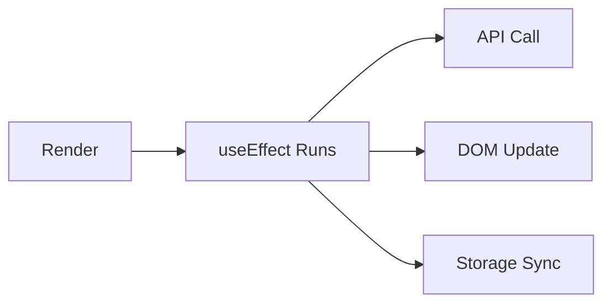

# Day 22 [Beginner to Intermediate]: useEffect Basics

## Index

- [Goal](#goal)
- [Prerequisites](#prerequisites)
- [Explanation](#explanation)
- [Topic by Topic](#topic-by-topic)
- [Key Concepts](#key-concepts)
- [Visual Concept Map](#visual-concept-map)
- [End-to-End Practical](#end-to-end-practical)
- [Hands-on Coding](#hands-on-coding)
- [Mini Exercise](#mini-exercise)
- [Assessment Quiz](#assessment-quiz)
- [Task](#task)
- [Self Check](#self-check)
- [Interview Questions and Answers](#interview-questions-and-answers)
- [Day 22 Outcome](#day-22-outcome)

## Goal

Understand what side effects are and how to use `useEffect` for lifecycle-like behavior.

## Prerequisites

- Day 21 completed
- Basic understanding of React state and rendering

## Explanation

React components should be pure during rendering. Work like API calls, timers, subscriptions, and localStorage updates are side effects. `useEffect` lets you run such logic after the UI renders.

## Topic by Topic

### Topic 1: What is a Side Effect?

Theory:
Any work outside returning JSX is considered a side effect.

Practical:
Log a message after first render.

Code Example:

```jsx
useEffect(() => {
  console.log("Component rendered");
}, []);
```

**Explanation:** This runs after the first render. Logging, requests, timers, and subscriptions are all common side effects.

**Key Points:**

- Side effects run after UI paint.
- Do not run side effects in render body.
- `useEffect` is the standard place for this work.

### Topic 2: Basic Syntax of useEffect

Theory:
`useEffect` takes a callback and dependency array.

Practical:
Run effect on every render.

Code Example:

```jsx
useEffect(() => {
  document.title = "My App";
});
```

**Explanation:** No dependency array means the effect runs after every render.

**Key Points:**

- `useEffect(callback, deps)` is core format.
- Missing deps means every render run.
- Use carefully to avoid unnecessary repeats.

### Topic 3: Run Once on Mount

Theory:
An empty dependency array runs effect once after initial render.

Practical:
Read data from localStorage once.

Code Example:

```jsx
useEffect(() => {
  const saved = localStorage.getItem("theme");
  console.log(saved);
}, []);
```

**Explanation:** Empty dependency array means this effect runs only once after initial mount.

**Key Points:**

- Good for one-time startup logic.
- Useful for initial data read from storage.
- Avoid frequent operations in mount effect.

### Topic 4: Effect with State Updates

Theory:
Effect can respond to state changes and trigger work.

Practical:
Update page title when count changes.

Code Example:

```jsx
useEffect(() => {
  document.title = `Count: ${count}`;
}, [count]);
```

**Explanation:** Whenever `count` changes, effect runs and updates the browser tab title.

**Key Points:**

- Add state values you use inside effect.
- Keep dependency list accurate.
- This pattern connects state to outside systems.

### Topic 5: Keep Effects Focused

Theory:
One effect should do one clear job.

Practical:
Use one effect for title, another for localStorage.

**Explanation:** Small effects are easier to debug than one large mixed effect doing many tasks.

**Key Points:**

- Separate unrelated side effects.
- Keep dependencies minimal per effect.
- Better readability and maintainability.

## Key Concepts

- Side effects run after render
- Dependency array controls re-run behavior
- Empty array means run once on mount
- Effect logic should be focused and readable

## Visual Concept Map



## End-to-End Practical

1. Create a counter component.
2. Add button to update state.
3. Use effect to update document title from state.
4. Add second effect for localStorage sync.

## Hands-on Coding

### Example 1: Counter with Title Update

```jsx
import { useEffect, useState } from "react";

export default function App() {
  const [count, setCount] = useState(0);

  useEffect(() => {
    document.title = `Count: ${count}`;
  }, [count]);

  return (
    <div>
      <h2>Count: {count}</h2>
      <button onClick={() => setCount((c) => c + 1)}>Increment</button>
    </div>
  );
}
```

### Example 2: Persist Value to localStorage

```jsx
useEffect(() => {
  localStorage.setItem("count", String(count));
}, [count]);
```

## Mini Exercise

Scenario:
Build a text input that saves typed name in localStorage and restores it when page loads.

Expected output:

- Name value stays after refresh
- Storage updates on each change

## Assessment Quiz

### Quiz Questions

1. When does `useEffect` run?
2. What does empty dependency array mean?
3. What happens if dependency array is omitted?
4. Give two examples of side effects.
5. Why keep effect logic focused?

### Quiz Answers

1. After render
2. Run once after initial mount
3. Runs after every render
4. API call, timer, localStorage, DOM updates
5. Better readability and easier debugging

## Task

- Create one component using `useEffect`
- Demonstrate run-once and dependency-based effect
- Complete mini exercise

## Self Check

- You know what a side effect is
- You can control when effect runs
- You can connect state changes with outside actions

## Interview Questions and Answers

### Beginner

**Question:** Why do we need `useEffect`?

**Answer:** To run side effects after rendering.

**Question:** Does `useEffect` run before JSX render?

**Answer:** No, it runs after render.

### Middle

**Question:** What is difference between no dependencies and empty dependencies?

**Answer:** No dependencies runs after every render; empty dependencies runs once on mount.

**Question:** Can we use multiple effects in one component?

**Answer:** Yes, and it is often cleaner to separate responsibilities.

### Advanced

**Question:** Why can an effect cause loops?

**Answer:** If effect updates state that triggers itself repeatedly without proper dependency control.

**Question:** What is the safe pattern for state-dependent side effects?

**Answer:** Keep only required dependencies and avoid unnecessary state updates in the effect.

## Day 22 Outcome

- You understand the purpose of `useEffect`
- You can use mount-only and dependency-based effects
- You are ready to learn dependency arrays in depth
