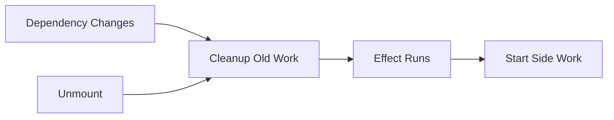

# Day 24 [Beginner to Intermediate]: Cleanup Functions

## Index

- [Goal](#goal)
- [Prerequisites](#prerequisites)
- [Explanation](#explanation)
- [Topic by Topic](#topic-by-topic)
- [Key Concepts](#key-concepts)
- [Visual Concept Map](#visual-concept-map)
- [End-to-End Practical](#end-to-end-practical)
- [Hands-on Coding](#hands-on-coding)
- [Mini Exercise](#mini-exercise)
- [Assessment Quiz](#assessment-quiz)
- [Task](#task)
- [Self Check](#self-check)
- [Interview Questions and Answers](#interview-questions-and-answers)
- [Day 24 Outcome](#day-24-outcome)

## Goal

Learn how and why to clean up effects to prevent memory leaks and side-effect bugs.

## Prerequisites

- Day 23 completed
- Comfortable with `useEffect` dependencies

## Explanation

Some effects start ongoing work, such as timers, event listeners, or subscriptions. If you do not stop that work during unmount or re-run, bugs can appear. Cleanup functions solve this by returning a function from `useEffect`.

## Topic by Topic

### Topic 1: What is Cleanup?

Theory:
Cleanup is a function React calls before running effect again and when component unmounts.

Code Example:

```jsx
useEffect(() => {
  return () => {
    console.log("Cleanup runs");
  };
}, []);
```

**Explanation:** Cleanup is a teardown step. React calls it before the next effect run and when component leaves the screen.

**Key Points:**

- Cleanup is returned from the effect callback.
- It prevents leftover side work.
- Important for stable app behavior.

### Topic 2: Cleanup for Timers

Theory:
Always clear interval or timeout created in effect.

Code Example:

```jsx
useEffect(() => {
  const id = setInterval(() => {
    console.log("tick");
  }, 1000);

  return () => clearInterval(id);
}, []);
```

**Explanation:** Without `clearInterval`, timer keeps running even after component unmounts.

**Key Points:**

- Save interval id in local variable.
- Clear interval in cleanup.
- Prevent hidden background work.

### Topic 3: Cleanup for Event Listeners

Theory:
Remove listeners to avoid duplicate handlers.

Code Example:

```jsx
useEffect(() => {
  const onResize = () => console.log(window.innerWidth);
  window.addEventListener("resize", onResize);
  return () => window.removeEventListener("resize", onResize);
}, []);
```

**Explanation:** Removing listeners avoids duplicated callbacks and memory growth over time.

**Key Points:**

- Add and remove the same handler reference.
- Listener cleanup avoids repeated events.
- Always cleanup global subscriptions.

### Topic 4: Cleanup for API Race Safety

Theory:
Ignore outdated async responses when component unmounts or query changes quickly.

Practical:
Use a cancellation flag.

**Explanation:** If old request finishes after new request, old data can overwrite new data. Cleanup helps ignore old responses.

**Key Points:**

- Handle stale async responses.
- Guard state updates after unmount.
- Keep request logic race-safe.

### Topic 5: Re-run + Cleanup Order

Theory:
When dependency changes: old cleanup runs first, then new effect runs.

**Explanation:** This order guarantees only one active version of your side effect at a time.

**Key Points:**

- Old effect cleans first.
- New effect starts after cleanup.
- Predictable lifecycle sequence.

## Key Concepts

- Return function from `useEffect` for cleanup
- Cleanup runs on unmount and before next effect run
- Essential for timers, listeners, and subscriptions
- Prevents memory leaks and stale updates

## Visual Concept Map



## End-to-End Practical

1. Create live clock with interval.
2. Add cleanup with `clearInterval`.
3. Add window resize listener.
4. Remove listener in cleanup.

## Hands-on Coding

### Example 1: Timer with Cleanup

```jsx
import { useEffect, useState } from "react";

export default function App() {
  const [seconds, setSeconds] = useState(0);

  useEffect(() => {
    const id = setInterval(() => setSeconds((s) => s + 1), 1000);
    return () => clearInterval(id);
  }, []);

  return <h2>Seconds: {seconds}</h2>;
}
```

### Example 2: Resize Listener with Cleanup

```jsx
useEffect(() => {
  const handleResize = () => setWidth(window.innerWidth);
  window.addEventListener("resize", handleResize);
  return () => window.removeEventListener("resize", handleResize);
}, []);
```

## Mini Exercise

Scenario:
Build a component that starts interval on mount and stops when component unmounts.

Expected output:

- Counter increments each second
- No background interval after component is removed

## Assessment Quiz

### Quiz Questions

1. Where is cleanup function written?
2. When does cleanup run?
3. Why clear intervals?
4. Why remove event listeners?
5. Is cleanup needed for every effect?

### Quiz Answers

1. Returned from `useEffect`
2. Before next run and on unmount
3. To avoid leaks and duplicate timers
4. To avoid duplicate handlers and memory issues
5. No, only for effects that start ongoing work

## Task

- Implement one timer effect with cleanup
- Implement one event listener effect with cleanup
- Explain cleanup timing in your own words

## Self Check

- You know when cleanup is required
- You can safely manage timers/listeners
- You can explain effect lifecycle order

## Interview Questions and Answers

### Beginner

**Question:** What is cleanup in React effect?

**Answer:** A return function from effect used to stop previous side work.

**Question:** Why use `clearInterval` in cleanup?

**Answer:** To stop timer when component unmounts or effect re-runs.

### Middle

**Question:** Can cleanup run even if component does not unmount?

**Answer:** Yes, it runs before effect re-runs due to dependency change.

**Question:** What bug appears without listener cleanup?

**Answer:** Multiple listeners stack up and fire multiple times.

### Advanced

**Question:** How does cleanup reduce race conditions in async effects?

**Answer:** It allows ignoring stale responses after dependencies change.

**Question:** Why keep cleanup idempotent?

**Answer:** Cleanup may run multiple times across re-renders; safe repetition avoids errors.

## Day 24 Outcome

- You can write safe cleanup logic in effects
- You can avoid memory leaks and duplicate side effects
- You are ready to fetch external data in React
