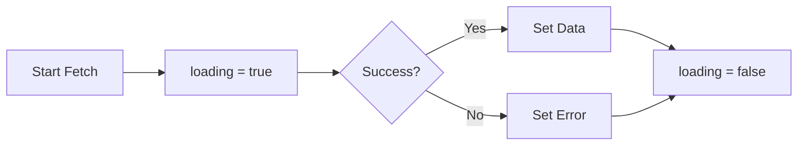

# Day 25 [Beginner to Intermediate]: API Calls with Fetch

## Index

- [Goal](#goal)
- [Prerequisites](#prerequisites)
- [Explanation](#explanation)
- [Topic by Topic](#topic-by-topic)
- [Key Concepts](#key-concepts)
- [Visual Concept Map](#visual-concept-map)
- [End-to-End Practical](#end-to-end-practical)
- [Hands-on Coding](#hands-on-coding)
- [Mini Exercise](#mini-exercise)
- [Assessment Quiz](#assessment-quiz)
- [Task](#task)
- [Self Check](#self-check)
- [Interview Questions and Answers](#interview-questions-and-answers)
- [Day 25 Outcome](#day-25-outcome)

## Goal

Fetch data from APIs in React using `fetch`, `useEffect`, and loading/error states.

## Prerequisites

- Day 24 completed
- Basic JavaScript promises and async/await

## Explanation

Many React apps rely on backend data. You will learn a practical and safe fetch pattern: start loading, request data, handle success, handle errors, and stop loading.

## Topic by Topic

### Topic 1: Basic Fetch Call

Theory:
Use `fetch(url)` to get data and parse JSON.

Code Example:

```jsx
const response = await fetch("https://jsonplaceholder.typicode.com/users");
const data = await response.json();
```

**Explanation:** `fetch` gets the raw response first, then you parse JSON body in a second step.

**Key Points:**

- Network call and body parse are separate.
- Parsing is asynchronous.
- Always handle potential request failure.

### Topic 2: Fetch Inside useEffect

Theory:
API request should run as side effect after render.

Practical:
Call once on mount.

Code Example:

```jsx
useEffect(() => {
  loadUsers();
}, []);
```

**Explanation:** Calling request in `useEffect` prevents repeated requests on each render.

**Key Points:**

- Keep fetch logic out of render body.
- Use mount effect for initial data load.
- Extract async logic into helper function.

### Topic 3: Loading and Error State

Theory:
UI should clearly show request status.

Practical:
Track `loading`, `error`, and `data` separately.

**Explanation:** Separate states make UI clear and remove ambiguity for users.

**Key Points:**

- `loading` for progress.
- `error` for failure details.
- Data state for successful response.

### Topic 4: Handle Non-OK Responses

Theory:
`fetch` resolves even on status 404/500, so check `response.ok`.

Code Example:

```jsx
if (!response.ok) {
  throw new Error("Failed to fetch users");
}
```

**Explanation:** `fetch` does not throw automatically for HTTP 404/500, so explicit checks are required.

**Key Points:**

- Validate status with `response.ok`.
- Throw meaningful error message.
- Keep error handling centralized in `catch`.

### Topic 5: Final Pattern

Theory:
Use `try/catch/finally` for consistent state handling.

**Explanation:** This pattern guarantees loading reset and gives a single place to handle errors.

**Key Points:**

- `try`: success path.
- `catch`: failure path.
- `finally`: always cleanup loading.

## Key Concepts

- Request lifecycle states
- `response.ok` validation
- Async logic in effect via separate function
- Clear and predictable UI feedback

## Visual Concept Map



## End-to-End Practical

1. Create states: data, loading, error.
2. Build async fetch function.
3. Call it in mount effect.
4. Render UI for loading, error, and list.

## Hands-on Coding

### Example 1: Fetch Users List

```jsx
import { useEffect, useState } from "react";

export default function App() {
  const [users, setUsers] = useState([]);
  const [loading, setLoading] = useState(false);
  const [error, setError] = useState("");

  const loadUsers = async () => {
    try {
      setLoading(true);
      setError("");

      const response = await fetch(
        "https://jsonplaceholder.typicode.com/users",
      );
      if (!response.ok) throw new Error("Request failed");

      const data = await response.json();
      setUsers(data);
    } catch (err) {
      setError(err.message || "Something went wrong");
    } finally {
      setLoading(false);
    }
  };

  useEffect(() => {
    loadUsers();
  }, []);

  if (loading) return <p>Loading users...</p>;
  if (error) return <p>Error: {error}</p>;

  return (
    <ul>
      {users.map((user) => (
        <li key={user.id}>{user.name}</li>
      ))}
    </ul>
  );
}
```

## Mini Exercise

Scenario:
Fetch posts from JSONPlaceholder and render title list. Add reload button.

Expected output:

- Initial load on page open
- Loading text while fetching
- Error text when request fails
- Reload button fetches again

## Assessment Quiz

### Quiz Questions

1. Why do we check `response.ok`?
2. Where should API call run in React component?
3. Why use `finally` in fetch logic?
4. Which states are most common in API UI?
5. What should user see while request is pending?

### Quiz Answers

1. To catch non-2xx HTTP responses
2. In `useEffect` or event handler
3. To always reset loading state
4. Loading, error, and data
5. A loading indicator

## Task

- Build one API screen with fetch
- Include loading, error, and success UI
- Add one retry or reload action

## Self Check

- You can fetch and parse JSON in React
- You can handle API errors safely
- You can design user-friendly request status UI

## Interview Questions and Answers

### Beginner

**Question:** How do you make API call in React?

**Answer:** Use `fetch` inside `useEffect` for mount-time loading.

**Question:** Why show loading state?

**Answer:** So users know request is in progress.

### Middle

**Question:** Why not call `fetch` directly in component body?

**Answer:** It would run on every render and cause repeated requests.

**Question:** How do you handle 404 with fetch?

**Answer:** Check `response.ok`; throw error if false.

### Advanced

**Question:** How can you prevent stale response overwrite?

**Answer:** Use cleanup/cancellation logic when multiple requests can overlap.

**Question:** Why separate loading/error/data state?

**Answer:** It creates explicit UI states and easier debugging.

## Day 25 Outcome

- You can fetch API data with robust state handling
- You can build loading and error-safe interfaces
- You are ready to compare fetch with Axios and query tools
