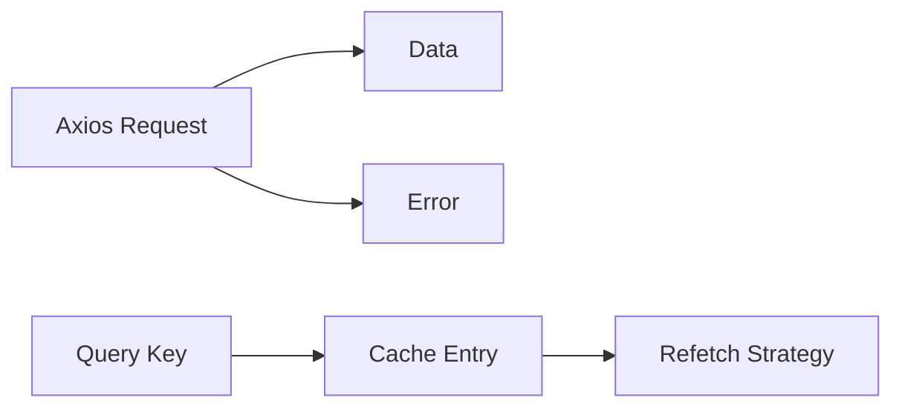

# Day 26 [Beginner to Intermediate]: API Calls with Axios and Query Basics

## Index

- [Goal](#goal)
- [Prerequisites](#prerequisites)
- [Explanation](#explanation)
- [Topic by Topic](#topic-by-topic)
- [Key Concepts](#key-concepts)
- [Visual Concept Map](#visual-concept-map)
- [End-to-End Practical](#end-to-end-practical)
- [Hands-on Coding](#hands-on-coding)
- [Mini Exercise](#mini-exercise)
- [Assessment Quiz](#assessment-quiz)
- [Task](#task)
- [Self Check](#self-check)
- [Interview Questions and Answers](#interview-questions-and-answers)
- [Day 26 Outcome](#day-26-outcome)

## Goal

Use Axios for cleaner API calls and understand query key basics with TanStack Query concepts.

## Prerequisites

- Day 25 completed
- Comfortable with async/await and fetch pattern

## Explanation

Axios provides a cleaner API than raw fetch and automatic JSON parsing. Query tools (like TanStack Query) help manage caching, refetching, and request state. Today you will learn the basics of both concepts.

## Topic by Topic

### Topic 1: Why Axios?

Theory:
Axios reduces boilerplate and gives better default behavior.

Practical:
Install and call GET endpoint.

Code Example:

```bash
npm install axios
```

```jsx
import axios from "axios";

const response = await axios.get("https://jsonplaceholder.typicode.com/posts");
const posts = response.data;
```

**Explanation:** Axios returns parsed JSON in `response.data`, reducing manual response handling.

**Key Points:**

- Cleaner syntax than raw fetch in many cases.
- Better defaults for JSON requests.
- Good for scalable API layer setup.

### Topic 2: Axios with useEffect

Theory:
Same state pattern: loading, error, data.

Practical:
Load data once on mount.

**Explanation:** The lifecycle pattern is same as fetch; only request API syntax changes.

**Key Points:**

- Keep request status states explicit.
- Call loader in mount effect.
- Reuse same resilient UI pattern.

### Topic 3: Query Basics

Theory:
A query is a request linked to a key, like `['posts']`.

Practical:
Think of key as cache identifier.

Code Example:

```jsx
const queryKey = ["posts"];
```

**Explanation:** Query key acts like an ID for cached API data in query libraries.

**Key Points:**

- Same key -> same cached data.
- Different key -> separate cache entry.
- Use predictable, stable key shapes.

### Topic 4: Why Query Libraries Help

Theory:
They handle retry, caching, refetching, and stale data timing.

Practical:
Less manual state handling in larger apps.

**Explanation:** Query libraries remove repeated boilerplate and improve consistency across API screens.

**Key Points:**

- Built-in caching and retry rules.
- Background refetch support.
- Better developer productivity.

### Topic 5: Axios Error Handling

Theory:
Catch errors and show friendly UI.

Code Example:

```jsx
try {
  const res = await axios.get(url);
  setData(res.data);
} catch (err) {
  setError(err.message || "Request failed");
}
```

**Explanation:** Centralized try/catch gives a consistent failure path and easier debugging.

**Key Points:**

- Always show user-friendly errors.
- Keep low-level details in logs if needed.
- Reuse shared error handling style.

## Key Concepts

- Axios simplifies HTTP calls
- Query key identifies cached request
- Same UI states still matter
- Better scalability with query libraries

## Visual Concept Map



## End-to-End Practical

1. Install Axios.
2. Create states for data/loading/error.
3. Fetch posts with Axios in effect.
4. Render results and fallback UI.
5. Define simple query key naming style.

## Hands-on Coding

### Example 1: Axios Posts List

```jsx
import { useEffect, useState } from "react";
import axios from "axios";

export default function App() {
  const [posts, setPosts] = useState([]);
  const [loading, setLoading] = useState(false);
  const [error, setError] = useState("");

  useEffect(() => {
    const loadPosts = async () => {
      try {
        setLoading(true);
        setError("");
        const res = await axios.get(
          "https://jsonplaceholder.typicode.com/posts?_limit=5",
        );
        setPosts(res.data);
      } catch (err) {
        setError(err.message || "Unable to load posts");
      } finally {
        setLoading(false);
      }
    };

    loadPosts();
  }, []);

  if (loading) return <p>Loading posts...</p>;
  if (error) return <p>Error: {error}</p>;

  return (
    <ul>
      {posts.map((post) => (
        <li key={post.id}>{post.title}</li>
      ))}
    </ul>
  );
}
```

### Example 2: Query Key Naming Idea

```jsx
const POSTS_QUERY_KEY = ["posts"];
const POST_BY_ID_KEY = (id) => ["post", id];
```

## Mini Exercise

Scenario:
Fetch users using Axios and add a category dropdown that later can be part of query key design.

Expected output:

- Axios request loads users
- Loading and error states are visible
- You define two query keys for list and detail

## Assessment Quiz

### Quiz Questions

1. One benefit of Axios over fetch?
2. Where is API response data in Axios result?
3. What is a query key?
4. Why are query keys important?
5. Do we still need loading/error UI with Axios?

### Quiz Answers

1. Cleaner syntax and auto JSON parsing
2. `response.data`
3. Unique identifier for a request cache entry
4. Controls cache separation and refetch logic
5. Yes

## Task

- Build one Axios-based screen
- Add proper loading/error/data UI
- Define clear query key naming examples

## Self Check

- You can use Axios with React safely
- You understand query key concept
- You can design scalable data fetch structure

## Interview Questions and Answers

### Beginner

**Question:** How do you make GET request with Axios?

**Answer:** Use `axios.get(url)` and read `response.data`.

**Question:** Why use loading state in API pages?

**Answer:** To communicate progress to users.

### Middle

**Question:** What is the role of query keys in query libraries?

**Answer:** They identify and cache data for specific requests.

**Question:** How do you avoid duplicated request logic across components?

**Answer:** Move API calls into reusable service functions or query hooks.

### Advanced

**Question:** How should query keys be structured for filters?

**Answer:** Include stable parts like `['products', { category, sort }]`.

**Question:** Why keep query key values serializable?

**Answer:** Stable serialization helps cache matching and debugging.

## Day 26 Outcome

- You can fetch data with Axios
- You understand query key fundamentals
- You are ready to design complete request-state UI patterns
