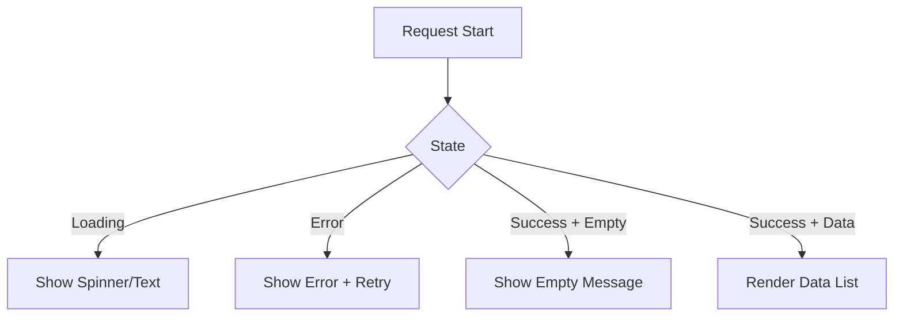

# Day 27 [Beginner to Intermediate]: Loading Error and Empty States

## Index

- [Goal](#goal)
- [Prerequisites](#prerequisites)
- [Explanation](#explanation)
- [Topic by Topic](#topic-by-topic)
- [Key Concepts](#key-concepts)
- [Visual Concept Map](#visual-concept-map)
- [End-to-End Practical](#end-to-end-practical)
- [Hands-on Coding](#hands-on-coding)
- [Mini Exercise](#mini-exercise)
- [Assessment Quiz](#assessment-quiz)
- [Task](#task)
- [Self Check](#self-check)
- [Interview Questions and Answers](#interview-questions-and-answers)
- [Day 27 Outcome](#day-27-outcome)

## Goal

Design user-friendly request states: loading, error, empty, and success.

## Prerequisites

- Day 26 completed
- Basic API handling in React

## Explanation

Good products are not only about successful data. They also handle waiting, failures, and no-result cases gracefully. This lesson focuses on clean UI branches so users always know what is happening.

## Topic by Topic

### Topic 1: Why State-based UI Matters

Theory:
Users need clear feedback for every stage of request lifecycle.

Practical:
Create separate UI for each state.

**Explanation:** Users should never guess what the app is doing. Clear state screens improve trust and usability.

**Key Points:**

- Every request has multiple UI phases.
- State-specific messages reduce confusion.
- Better UX comes from predictable feedback.

### Topic 2: Loading State

Theory:
Show progress while waiting.

Code Example:

```jsx
if (loading) return <p>Loading...</p>;
```

**Explanation:** Loading UI confirms that work is in progress and app is responsive.

**Key Points:**

- Show loading immediately when request starts.
- Keep message simple and visible.
- Disable repeated actions if needed.

### Topic 3: Error State

Theory:
Show meaningful message and retry action.

Code Example:

```jsx
if (error) return <button onClick={refetch}>Retry</button>;
```

**Explanation:** Error UI should explain the problem and provide a direct recovery path.

**Key Points:**

- Show readable error text.
- Offer retry action.
- Avoid silent failure screens.

### Topic 4: Empty State

Theory:
When request succeeds but data list is empty, guide users.

Code Example:

```jsx
if (!loading && !error && items.length === 0) {
  return <p>No results found</p>;
}
```

**Explanation:** Empty state means request succeeded but data list has no items.

**Key Points:**

- Different from request error.
- Add guidance like "change filter".
- Keep tone helpful, not alarming.

### Topic 5: Success State

Theory:
Render list/data only when available.

**Explanation:** Success state is shown only after loading and error branches are handled safely.

**Key Points:**

- Render final data content here.
- Keep rendering logic focused.
- Pair with strong key usage in lists.

## Key Concepts

- Status-specific UI branches
- Retry for recoverable failures
- Empty state is different from error state
- Better UX through clear communication

## Visual Concept Map



## End-to-End Practical

1. Build API component with request states.
2. Add conditional returns for loading and error.
3. Add explicit empty state branch.
4. Render data list for success state.

## Hands-on Coding

### Example 1: Complete Status Handling

```jsx
if (loading) return <p>Loading products...</p>;
if (error) return <button onClick={loadProducts}>Retry</button>;
if (products.length === 0) return <p>No products available</p>;

return (
  <ul>
    {products.map((p) => (
      <li key={p.id}>{p.title}</li>
    ))}
  </ul>
);
```

### Example 2: Better Empty State Text

```jsx
<p>No matching items. Try changing your filter.</p>
```

## Mini Exercise

Scenario:
Create a user list page with all four states and a retry button.

Expected output:

- Loading message appears first
- Error message with retry appears on failure
- Empty message appears for zero data
- List appears for successful data

## Assessment Quiz

### Quiz Questions

1. Is empty state same as error state?
2. Why provide retry in error UI?
3. What should loading UI tell user?
4. When should success list render?
5. Why are explicit state branches useful?

### Quiz Answers

1. No
2. To recover quickly without refresh
3. Request is in progress
4. When data exists and no error/loading
5. Predictable behavior and better user experience

## Task

- Refactor one API page to support all four states
- Add retry behavior
- Improve empty-state message

## Self Check

- You can separate all request states clearly
- You can avoid blank screen confusion
- You can design resilient data-loading UI

## Interview Questions and Answers

### Beginner

**Question:** What is empty state in UI?

**Answer:** A screen shown when request succeeds but has no data.

**Question:** Why show loading state?

**Answer:** To indicate work is happening.

### Middle

**Question:** How do you structure conditional rendering for API UI?

**Answer:** Check loading, then error, then empty, then success.

**Question:** Why add retry button?

**Answer:** It gives users a direct recovery action.

### Advanced

**Question:** How can state handling improve perceived performance?

**Answer:** Immediate feedback reduces uncertainty and improves trust.

**Question:** Why should error text be actionable?

**Answer:** Actionable guidance helps users resolve issues faster.

## Day 27 Outcome

- You can design robust API state UIs
- You can separate loading, error, empty, and success clearly
- You are ready for a full weather app mini project
