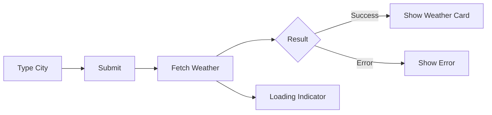

# Day 28 [Beginner to Intermediate]: Mini Project Weather App

## Index

- [Goal](#goal)
- [Prerequisites](#prerequisites)
- [Explanation](#explanation)
- [Topic by Topic](#topic-by-topic)
- [Key Concepts](#key-concepts)
- [Visual Concept Map](#visual-concept-map)
- [End-to-End Practical](#end-to-end-practical)
- [Hands-on Coding](#hands-on-coding)
- [Mini Exercise](#mini-exercise)
- [Assessment Quiz](#assessment-quiz)
- [Task](#task)
- [Self Check](#self-check)
- [Interview Questions and Answers](#interview-questions-and-answers)
- [Day 28 Outcome](#day-28-outcome)

## Goal

Build a weather search app with API integration and proper request states.

## Prerequisites

- Day 27 completed
- Comfortable with form input and API calls

## Explanation

This mini project combines multiple React skills: controlled input, event handling, async API requests, and state-based rendering. You will create a weather app where user enters a city and sees temperature and weather details.

## Topic by Topic

### Topic 1: Project State Design

Theory:
Define separate state for query, weather data, loading, and error.

Code Example:

```jsx
const [city, setCity] = useState("");
const [weather, setWeather] = useState(null);
const [loading, setLoading] = useState(false);
const [error, setError] = useState("");
```

**Explanation:** Keeping request and result values separate makes app flow easy to debug and maintain.

**Key Points:**

- One state for each responsibility.
- Do not mix unrelated values.
- Clear state design reduces bugs.

### Topic 2: Build Search Form

Theory:
Use controlled input and submit handler.

Practical:
Search on button click or Enter key.

**Explanation:** Controlled input ensures current text is always in React state, ready for validation and request.

**Key Points:**

- Bind input `value` and `onChange`.
- Validate input before API call.
- Support keyboard-friendly submit.

### Topic 3: API Request Flow

Theory:
Validate input, call API, parse result, handle failures.

**Explanation:** The safest flow is validate -> set loading -> fetch -> parse -> success/error -> stop loading.

**Key Points:**

- Use `try/catch/finally` pattern.
- Clear old error before new request.
- Show friendly failure messages.

### Topic 4: Render State-based UI

Theory:
Show loading/error/success placeholders.

**Explanation:** Conditional rendering avoids showing stale weather data during new requests.

**Key Points:**

- Handle loading first.
- Handle error next.
- Render card only when data is valid.

### Topic 5: Simple Result Card

Theory:
Display city, temperature, and condition clearly.

**Explanation:** A compact weather card gives the most important information at a glance.

**Key Points:**

- Prioritize key fields first.
- Keep labels user-friendly.
- Add extra metrics as optional details.

## Key Concepts

- Mini-project composition
- Controlled form + async request
- Defensive error handling
- Clear user feedback states

## Visual Concept Map



## End-to-End Practical

1. Build input and search button.
2. Validate city name.
3. Fetch weather data.
4. Handle loading/error states.
5. Render weather card with key details.

## Hands-on Coding

### Example 1: Weather App Core

```jsx
import { useState } from "react";

export default function App() {
  const [city, setCity] = useState("");
  const [weather, setWeather] = useState(null);
  const [loading, setLoading] = useState(false);
  const [error, setError] = useState("");

  const searchWeather = async () => {
    const value = city.trim();
    if (!value) return;

    try {
      setLoading(true);
      setError("");
      setWeather(null);

      const url = `https://api.openweathermap.org/data/2.5/weather?q=${encodeURIComponent(value)}&units=metric&appid=YOUR_API_KEY`;
      const response = await fetch(url);
      const data = await response.json();

      if (!response.ok) {
        throw new Error(data.message || "Unable to fetch weather");
      }

      setWeather(data);
    } catch (err) {
      setError(err.message || "Something went wrong");
    } finally {
      setLoading(false);
    }
  };

  return (
    <div>
      <h2>Weather App</h2>
      <input
        value={city}
        onChange={(e) => setCity(e.target.value)}
        placeholder="Enter city"
      />
      <button onClick={searchWeather}>Search</button>

      {loading && <p>Loading weather...</p>}
      {error && <p>Error: {error}</p>}

      {weather && (
        <div>
          <h3>{weather.name}</h3>
          <p>Temp: {Math.round(weather.main.temp)} C</p>
          <p>Condition: {weather.weather[0].description}</p>
        </div>
      )}
    </div>
  );
}
```

## Mini Exercise

Scenario:
Enhance weather app with humidity and wind speed display and Add Recent Searches list.

Expected output:

- Result card includes humidity and wind
- Last 5 searched city names are displayed
- Clicking a recent city triggers search again

## Assessment Quiz

### Quiz Questions

1. Why do we encode city name in URL?
2. Why clear previous error before new request?
3. Which state holds fetched result object?
4. What should happen when city input is empty?
5. Why is loading state important here?

### Quiz Answers

1. To safely include spaces/special characters
2. To avoid showing old error during new request
3. Weather state (for example `weather`)
4. Prevent request and ask user for valid input
5. To show request progress and avoid confusion

## Task

- Build full weather search app
- Handle invalid city errors gracefully
- Add one UI enhancement from mini exercise

## Self Check

- You can build API-based mini project end to end
- You can manage request states confidently
- You can design practical user flows in React

## Interview Questions and Answers

### Beginner

**Question:** How do users trigger weather fetch?

**Answer:** By entering city and clicking Search (or submit).

**Question:** What state stores API response?

**Answer:** A dedicated object state like `weather`.

### Middle

**Question:** Why reset previous result before new request?

**Answer:** To avoid showing stale data while new request is loading.

**Question:** How do you handle not-found city errors?

**Answer:** Check response status and show readable error message.

### Advanced

**Question:** How can you optimize repeated city searches?

**Answer:** Add caching strategy (manual or query library cache).

**Question:** Why should API key be in environment variables?

**Answer:** To avoid hardcoding secrets in source files.

## Day 28 Outcome

- You built a practical weather mini project
- You combined form handling and API state management
- You are ready to use refs for direct DOM cases
