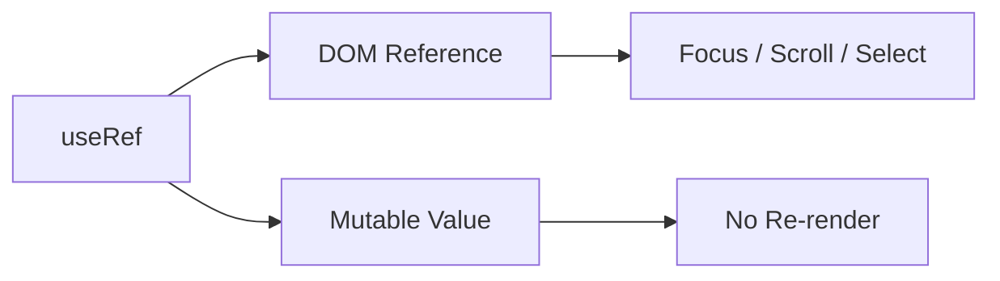

# Day 29 [Beginner to Intermediate]: useRef

## Index

- [Goal](#goal)
- [Prerequisites](#prerequisites)
- [Explanation](#explanation)
- [Topic by Topic](#topic-by-topic)
- [Key Concepts](#key-concepts)
- [Visual Concept Map](#visual-concept-map)
- [End-to-End Practical](#end-to-end-practical)
- [Hands-on Coding](#hands-on-coding)
- [Mini Exercise](#mini-exercise)
- [Assessment Quiz](#assessment-quiz)
- [Task](#task)
- [Self Check](#self-check)
- [Interview Questions and Answers](#interview-questions-and-answers)
- [Day 29 Outcome](#day-29-outcome)

## Goal

Understand `useRef` for mutable values and safe DOM access without triggering re-render.

## Prerequisites

- Day 28 completed
- Basic hooks knowledge (`useState`, `useEffect`)

## Explanation

`useRef` stores a value in `.current` that survives re-renders. Updating ref value does not re-render component. This makes it useful for direct DOM access and tracking mutable data like previous values or timers.

## Topic by Topic

### Topic 1: Basic Ref Creation

Theory:
Create ref using `useRef(initialValue)`.

Code Example:

```jsx
const inputRef = useRef(null);
```

**Explanation:** Ref object stays stable across re-renders, so you can keep mutable references safely.

**Key Points:**

- Ref has shape `{ current: value }`.
- Initial value set in `useRef(...)`.
- Same ref object is reused across renders.

### Topic 2: Access DOM Element

Theory:
Attach ref to JSX element using `ref` prop.

Code Example:

```jsx
<input ref={inputRef} />
```

**Explanation:** React assigns the input element to `inputRef.current` after render.

**Key Points:**

- Use `ref` prop on target element.
- Access actual DOM node with `.current`.
- Avoid global DOM selectors.

### Topic 3: Focus Input Programmatically

Theory:
Use `.current.focus()` for focus behavior.

Code Example:

```jsx
inputRef.current?.focus();
```

**Explanation:** Optional chaining avoids runtime errors if element is not ready yet.

**Key Points:**

- Useful for search, chat, and forms.
- Can be used in click handlers or effects.
- Keep imperative usage minimal.

### Topic 4: Ref vs State

Theory:
State changes trigger re-render, ref changes do not.

Practical:
Use ref for values that do not need UI refresh.

**Explanation:** Choose state when UI must update, and choose ref when value is internal and render-independent.

**Key Points:**

- State update triggers re-render.
- Ref update does not re-render.
- Wrong choice can hurt readability.

### Topic 5: Store Previous Value

Theory:
Ref can keep previous render information.

**Explanation:** You can assign current value to ref in an effect, then read it on next render as previous value.

**Key Points:**

- Great for previous count/form value.
- Avoid extra state for non-UI data.
- Keeps comparison logic simple.

## Key Concepts

- Persistent mutable container
- DOM access without query selectors
- No re-render on ref update
- Best use cases: focus, timers, previous values

## Visual Concept Map



## End-to-End Practical

1. Create input ref.
2. Attach ref to input.
3. Add button to focus input.
4. Track previous count in ref.

## Hands-on Coding

### Example 1: Focus Input Button

```jsx
import { useRef } from "react";

export default function App() {
  const inputRef = useRef(null);

  return (
    <div>
      <input ref={inputRef} placeholder="Type here" />
      <button onClick={() => inputRef.current?.focus()}>Focus Input</button>
    </div>
  );
}
```

### Example 2: Previous Count Tracker

```jsx
import { useEffect, useRef, useState } from "react";

function Counter() {
  const [count, setCount] = useState(0);
  const prevCountRef = useRef(0);

  useEffect(() => {
    prevCountRef.current = count;
  }, [count]);

  return (
    <div>
      <p>Current: {count}</p>
      <p>Previous: {prevCountRef.current}</p>
      <button onClick={() => setCount((c) => c + 1)}>Increment</button>
    </div>
  );
}
```

## Mini Exercise

Scenario:
Build a chat input where clicking "Reply" auto-focuses message box, and track previous typed length using ref.

Expected output:

- Input focuses on button click
- Previous length displays correctly

## Assessment Quiz

### Quiz Questions

1. Does updating ref trigger re-render?
2. What property stores ref value?
3. Why use ref for input focus?
4. When choose state over ref?
5. Can refs store non-DOM values?

### Quiz Answers

1. No
2. `.current`
3. For direct safe DOM access
4. When UI should re-render on value change
5. Yes

## Task

- Implement input focus feature using `useRef`
- Add one example storing mutable value in ref
- Explain why state is not needed there

## Self Check

- You can access DOM using refs
- You can differentiate ref and state usage
- You can use refs for previous value tracking

## Interview Questions and Answers

### Beginner

**Question:** What is `useRef` in React?

**Answer:** A hook that stores mutable value across renders without re-rendering.

**Question:** How do you focus input using ref?

**Answer:** Attach ref to input and call `ref.current.focus()`.

### Middle

**Question:** Why not use document query methods in React components?

**Answer:** Refs are safer and component-scoped.

**Question:** Can refs help with timer IDs?

**Answer:** Yes, refs can store interval/timeout IDs between renders.

### Advanced

**Question:** How does ref avoid stale closures for mutable values?

**Answer:** `.current` can be read/written without causing re-render cycles.

**Question:** Why should ref writes be controlled carefully?

**Answer:** Untracked mutable writes can make logic harder to reason about.

## Day 29 Outcome

- You can use `useRef` for DOM and mutable storage
- You can pick ref vs state correctly
- You are ready for controlled DOM manipulation patterns
