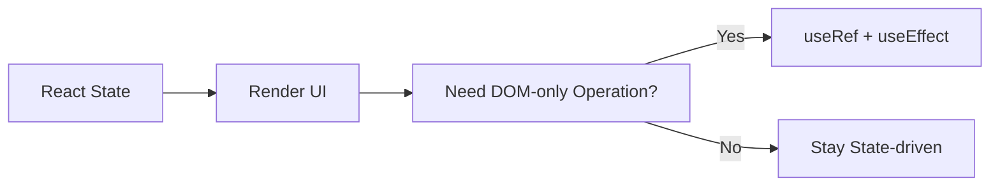

# Day 30 [Beginner to Intermediate]: DOM Manipulation in React

## Index

- [Goal](#goal)
- [Prerequisites](#prerequisites)
- [Explanation](#explanation)
- [Topic by Topic](#topic-by-topic)
- [Key Concepts](#key-concepts)
- [Visual Concept Map](#visual-concept-map)
- [End-to-End Practical](#end-to-end-practical)
- [Hands-on Coding](#hands-on-coding)
- [Mini Exercise](#mini-exercise)
- [Assessment Quiz](#assessment-quiz)
- [Task](#task)
- [Self Check](#self-check)
- [Interview Questions and Answers](#interview-questions-and-answers)
- [Day 30 Outcome](#day-30-outcome)

## Goal

Perform DOM interactions the React way using refs and effects while avoiding unsafe direct manipulation.

## Prerequisites

- Day 29 completed
- Comfortable with `useRef` and `useEffect`

## Explanation

React controls UI through state and props. Most DOM updates should come from state, not manual manipulation. But some tasks like focus, scroll, text selection, or measuring element size need direct DOM access. For these, use refs in a controlled way.

## Topic by Topic

### Topic 1: React-first Principle

Theory:
Prefer state-driven rendering before direct DOM writes.

Practical:
Toggle classes via state instead of `classList` edits.

**Explanation:** Let React own visual state so UI stays predictable and easier to maintain.

**Key Points:**

- Prefer declarative rendering first.
- Keep manual DOM work minimal.
- Avoid state and manual style conflicts.

### Topic 2: Safe DOM Access with Ref

Theory:
Use ref to read or call methods on a specific element.

Code Example:

```jsx
const boxRef = useRef(null);
```

**Explanation:** Refs provide controlled access to specific elements without searching the whole document.

**Key Points:**

- Element is available via `.current`.
- Works well for one-off DOM actions.
- Keep scope local to component.

### Topic 3: Scroll into View

Theory:
Useful for chat, forms, and validation flows.

Code Example:

```jsx
boxRef.current?.scrollIntoView({ behavior: "smooth" });
```

**Explanation:** Smooth scrolling improves navigation experience in long pages and forms.

**Key Points:**

- Useful for jump links and validation.
- Trigger from user actions.
- Keep behavior intentional.

### Topic 4: Measure Element Size

Theory:
Read layout values in effect after render.

Code Example:

```jsx
useEffect(() => {
  const width = boxRef.current?.offsetWidth;
  console.log(width);
}, []);
```

**Explanation:** DOM size is available only after render, so read measurements in an effect.

**Key Points:**

- Measure after mount.
- Save result in state if UI must show it.
- Re-measure when layout dependencies change.

### Topic 5: Avoid Anti-patterns

Theory:
Avoid frequent manual style changes that conflict with React rendering.

Practical:
Use state for visual changes whenever possible.

**Explanation:** Directly mutating DOM styles repeatedly can drift from React state and cause hard-to-track bugs.

**Key Points:**

- Keep source of truth in state.
- Use refs for imperative exceptions only.
- Keep DOM actions isolated and documented.

## Key Concepts

- State-driven UI first
- Refs for targeted DOM operations
- Effects for post-render DOM reads/writes
- Avoid conflicting manual DOM changes

## Visual Concept Map



## End-to-End Practical

1. Build section list with "Jump to details" button.
2. Use ref to scroll target block into view.
3. Auto-focus search field on page load.
4. Measure a card width and display it.

## Hands-on Coding

### Example 1: Focus and Scroll

```jsx
import { useEffect, useRef } from "react";

export default function App() {
  const inputRef = useRef(null);
  const detailsRef = useRef(null);

  useEffect(() => {
    inputRef.current?.focus();
  }, []);

  return (
    <div>
      <input ref={inputRef} placeholder="Search here" />
      <button
        onClick={() =>
          detailsRef.current?.scrollIntoView({ behavior: "smooth" })
        }
      >
        Jump to Details
      </button>

      <div style={{ height: 300 }} />

      <section ref={detailsRef}>
        <h3>Details</h3>
        <p>This section is reached with smooth scroll.</p>
      </section>
    </div>
  );
}
```

### Example 2: Size Measurement

```jsx
import { useEffect, useRef, useState } from "react";

function CardSize() {
  const cardRef = useRef(null);
  const [width, setWidth] = useState(0);

  useEffect(() => {
    setWidth(cardRef.current?.offsetWidth || 0);
  }, []);

  return (
    <div>
      <div ref={cardRef} style={{ padding: 16, border: "1px solid #ddd" }}>
        Measure me
      </div>
      <p>Card width: {width}px</p>
    </div>
  );
}
```

## Mini Exercise

Scenario:
Build FAQ page where clicking question scrolls to answer block and focuses search input.

Expected output:

- Input auto-focuses on mount
- Button smooth-scrolls to answer section
- No manual query selectors used

## Assessment Quiz

### Quiz Questions

1. What is preferred for UI changes: state or manual DOM edits?
2. Which hook gives direct element reference?
3. When is direct DOM access reasonable in React?
4. Why run DOM measurements in effect?
5. What risk comes from heavy manual DOM manipulation?

### Quiz Answers

1. State-driven rendering
2. `useRef`
3. Focus, scroll, measure, selection
4. Element exists after render
5. Conflicts with React's virtual DOM updates

## Task

- Implement one focus feature and one scroll feature
- Add one measurement example using `offsetWidth`
- Keep styling/state changes React-driven

## Self Check

- You can decide when direct DOM access is needed
- You can use refs/effects safely
- You can avoid common DOM manipulation anti-patterns

## Interview Questions and Answers

### Beginner

**Question:** How do you get input DOM element in React?

**Answer:** Create ref with `useRef` and attach to input via `ref` prop.

**Question:** Can we manipulate DOM directly in React?

**Answer:** Yes, but only for specific cases like focus/scroll/measurement.

### Middle

**Question:** Why avoid direct `document.getElementById` in components?

**Answer:** It bypasses React component boundaries and is harder to maintain.

**Question:** How do you trigger smooth scroll to a section?

**Answer:** Use `ref.current.scrollIntoView({ behavior: 'smooth' })`.

### Advanced

**Question:** What problems happen when style is changed manually and via state together?

**Answer:** UI inconsistencies and hard-to-debug rendering conflicts.

**Question:** How do refs support performance-sensitive DOM reads?

**Answer:** They give direct access without extra state updates for transient reads.

## Day 30 Outcome

- You can perform practical DOM interactions in React safely
- You understand when to use refs versus state updates
- You are ready for memoization and performance-focused topics
