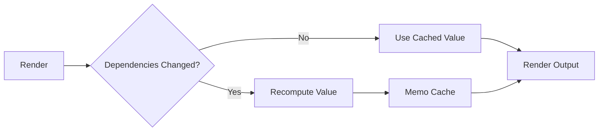

---
title: useMemo
slug: day-031-usememo
dayLabel: Day 31
level: Intermediate
estimatedMinutes: 30
order: 31
track: react
---
# Day 31 [Intermediate]: useMemo

## Index

- [Goal](#goal)
- [Prerequisites](#prerequisites)
- [Explanation](#explanation)
- [Topic by Topic](#topic-by-topic)
- [Key Concepts](#key-concepts)
- [Visual Concept Map](#visual-concept-map)
- [End-to-End Practical](#end-to-end-practical)
- [Hands-on Coding](#hands-on-coding)
- [Mini Exercise](#mini-exercise)
- [Assessment Quiz](#assessment-quiz)
- [Task](#task)
- [Self Check](#self-check)
- [Interview Questions and Answers](#interview-questions-and-answers)
- [Day 31 Outcome](#day-31-outcome)

## Goal

Understand when and how to use useMemo to avoid unnecessary expensive recalculations.

## Prerequisites

- Day 30 completed
- Basic knowledge of re-render behavior

## Explanation

useMemo caches computed values between renders. It is useful when calculations are expensive and dependencies do not change often.

## Topic by Topic

### Topic 1: What useMemo Does

Theory:
useMemo returns a memoized computed value.

Practical:
Cache filtered list result.

Code Example:

```jsx
const result = useMemo(() => items.filter(fn), [items, fn]);
```

**Explanation:** This topic explains What useMemo Does in a practical way so you can apply it confidently in real React projects.

**Key Points:**

- Understand the core idea of What useMemo Does.
- Apply the pattern using clean, readable code.
- Avoid common mistakes through predictable React flow.

### Topic 2: Expensive Computation Use Case

Theory:
useMemo helps when calculation cost is high.

Practical:
Memoize sorted analytics list.

Code Example:

```jsx
const sorted = useMemo(() => heavySort(data), [data]);
```

**Explanation:** This topic explains Expensive Computation Use Case in a practical way so you can apply it confidently in real React projects.

**Key Points:**

- Understand the core idea of Expensive Computation Use Case.
- Apply the pattern using clean, readable code.
- Avoid common mistakes through predictable React flow.

### Topic 3: Dependency Array in useMemo

Theory:
Memo value recomputes only when dependencies change.

Practical:
Add search dependency for filtered results.

Code Example:

```jsx
const filtered = useMemo(() => filter(products, query), [products, query]);
```

**Explanation:** This topic explains Dependency Array in useMemo in a practical way so you can apply it confidently in real React projects.

**Key Points:**

- Understand the core idea of Dependency Array in useMemo.
- Apply the pattern using clean, readable code.
- Avoid common mistakes through predictable React flow.

### Topic 4: Avoid Overuse

Theory:
useMemo itself has overhead; use only where needed.

Practical:
Do not memoize trivial constant concatenation.

Code Example:

```jsx
const label = firstName + " " + lastName;
```

**Explanation:** This topic explains Avoid Overuse in a practical way so you can apply it confidently in real React projects.

**Key Points:**

- Understand the core idea of Avoid Overuse.
- Apply the pattern using clean, readable code.
- Avoid common mistakes through predictable React flow.

### Topic 5: Measuring Benefit

Theory:
Performance optimization should be measured, not guessed.

Practical:
Track render time before and after memoization.

Code Example:

```jsx
console.time("calc");
```

**Explanation:** This topic explains Measuring Benefit in a practical way so you can apply it confidently in real React projects.

**Key Points:**

- Understand the core idea of Measuring Benefit.
- Apply the pattern using clean, readable code.
- Avoid common mistakes through predictable React flow.

### Topic 6: Referential Stability for Derived Props

Theory:
Memoized values help child components skip re-renders when derived arrays/objects are passed as props.

Practical:
Memoize filtered table rows before passing to memoized data table.

Code Example:

```jsx
const rows = useMemo(() => buildRows(data, filters), [data, filters]);
```

**Explanation:** This topic explains Referential Stability for Derived Props in a practical way so you can apply it confidently in real React projects.

**Key Points:**

- Understand the core idea of Referential Stability for Derived Props.
- Apply the pattern using clean, readable code.
- Avoid common mistakes through predictable React flow.

## Key Concepts

- Memoized derived values
- Dependency-driven recomputation
- Expensive computation optimization
- Trade-offs of memoization
- Measured performance tuning
- Stable derived props

## Visual Concept Map



## End-to-End Practical

1. Build product list and search state.
2. Add expensive filter/sort logic.
3. Observe re-computation on every render.
4. Apply useMemo with correct dependencies.
5. Compare performance behavior.

## Hands-on Coding

### Example 1: Case - Product Search Optimization

Scenario:
An e-commerce page filters a large product list and should avoid recalculating on unrelated state changes.

```jsx
import { useMemo, useState } from "react";

function App({ products }) {
  const [query, setQuery] = useState("");
  const [theme, setTheme] = useState("light");

  const filteredProducts = useMemo(() => {
    return products.filter((p) =>
      p.name.toLowerCase().includes(query.toLowerCase()),
    );
  }, [products, query]);

  return (
    <div>
      <input
        value={query}
        onChange={(e) => setQuery(e.target.value)}
        placeholder="Search"
      />
      <button
        onClick={() => setTheme((t) => (t === "light" ? "dark" : "light"))}
      >
        Toggle Theme
      </button>
      <p>Theme: {theme}</p>
      {filteredProducts.map((p) => (
        <p key={p.id}>{p.name}</p>
      ))}
    </div>
  );
}
```

### Example 2: Case - Payroll Total Calculation

Scenario:
An HR payroll dashboard computes total salary from a large employee array.

```jsx
import { useMemo } from "react";

function PayrollSummary({ employees }) {
  const totalSalary = useMemo(() => {
    return employees.reduce((sum, emp) => sum + emp.salary, 0);
  }, [employees]);

  return <p>Total Salary: {totalSalary}</p>;
}
```

### Example 3: Case - Heavy Sort on Reports

Scenario:
A reporting page sorts thousands of records and should only re-sort when records change.

```jsx
import { useMemo } from "react";

function Reports({ reports }) {
  const sortedReports = useMemo(() => {
    return [...reports].sort((a, b) => b.score - a.score);
  }, [reports]);

  return sortedReports.map((r) => <p key={r.id}>{r.title}</p>);
}
```

## Mini Exercise

Scenario:
You are building a student marks dashboard.

Memoize these derived values:

- Top 5 scorers
- Average score
- Filtered list by class

Expected output:

- Values recompute only when relevant dependencies change
- Unrelated UI changes do not trigger expensive calculations
- Dashboard stays responsive

## Assessment Quiz

### Quiz Questions

1. What does useMemo return?
2. When should useMemo be used?
3. True or False: useMemo always improves performance.
4. What controls re-computation in useMemo?
5. Why avoid memoizing trivial values?

### Quiz Answers

1. Cached computed value
2. For expensive calculations with stable dependencies
3. False
4. Dependency array
5. Overhead may outweigh benefit

## Task

- Add one expensive derived computation
- Optimize with useMemo
- Complete mini exercise

## Self Check

- You can identify practical memoization opportunities
- You can write dependency-safe useMemo logic
- You can answer at least 4 out of 5 quiz questions correctly

## Interview Questions and Answers

### Beginner

**Question:** What is useMemo in React?

**Answer:** A hook that memoizes computed values between renders.

**Question:** Does useMemo memoize functions?

**Answer:** It memoizes values; useCallback memoizes function references.

### Middle

**Question:** How do you choose dependencies for useMemo?

**Answer:** Include all values used inside memo callback.

**Question:** What issue happens with wrong dependencies?

**Answer:** Stale values or unnecessary recomputations.

### Advanced

**Question:** Why can over-memoization hurt performance?

**Answer:** Caching and dependency checks add overhead.

**Question:** How do you validate useMemo optimization impact?

**Answer:** Use profiling tools and compare render timings.

## Day 31 Outcome

- You can use useMemo to optimize expensive derived values
- You can avoid common memoization pitfalls
- You are ready for callback memoization with useCallback in Day 32

