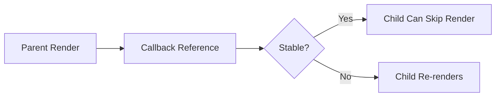

---
title: useCallback
slug: day-032-usecallback
dayLabel: Day 32
level: Intermediate
estimatedMinutes: 30
order: 32
track: react
---
# Day 32 [Intermediate]: useCallback

## Index

- [Goal](#goal)
- [Prerequisites](#prerequisites)
- [Explanation](#explanation)
- [Topic by Topic](#topic-by-topic)
- [Key Concepts](#key-concepts)
- [Visual Concept Map](#visual-concept-map)
- [End-to-End Practical](#end-to-end-practical)
- [Hands-on Coding](#hands-on-coding)
- [Mini Exercise](#mini-exercise)
- [Assessment Quiz](#assessment-quiz)
- [Task](#task)
- [Self Check](#self-check)
- [Interview Questions and Answers](#interview-questions-and-answers)
- [Day 32 Outcome](#day-32-outcome)

## Goal

Use useCallback to keep function references stable and reduce unnecessary child re-renders.

## Prerequisites

- Day 31 completed
- Basic understanding of React.memo and props

## Explanation

When parent renders, inline functions get recreated. useCallback memoizes function references so memoized children can skip unnecessary re-renders.

## Topic by Topic

### Topic 1: Function Identity

Theory:
Functions are objects; new render usually creates new function references.

Practical:
Compare callback reference changes across renders.

Code Example:

```jsx
const onClick = () => setCount((c) => c + 1);
```

**Explanation:** This topic explains Function Identity in a practical way so you can apply it confidently in real React projects.

**Key Points:**

- Understand the core idea of Function Identity.
- Apply the pattern using clean, readable code.
- Avoid common mistakes through predictable React flow.

### Topic 2: useCallback Basics

Theory:
useCallback memoizes function reference based on dependencies.

Practical:
Wrap event callback with dependency array.

Code Example:

```jsx
const onIncrement = useCallback(() => setCount((c) => c + 1), []);
```

**Explanation:** This topic explains useCallback Basics in a practical way so you can apply it confidently in real React projects.

**Key Points:**

- Understand the core idea of useCallback Basics.
- Apply the pattern using clean, readable code.
- Avoid common mistakes through predictable React flow.

### Topic 3: React.memo + useCallback

Theory:
Stable callbacks matter most when passed to memoized children.

Practical:
Prevent child re-render when unrelated parent state changes.

Code Example:

```jsx
const Child = React.memo(({ onAction }) => (
  <button onClick={onAction}>Run</button>
));
```

**Explanation:** This topic explains React.memo + useCallback in a practical way so you can apply it confidently in real React projects.

**Key Points:**

- Understand the core idea of React.memo + useCallback.
- Apply the pattern using clean, readable code.
- Avoid common mistakes through predictable React flow.

### Topic 4: Dependency Safety

Theory:
Incorrect dependencies can cause stale closures.

Practical:
Include state references or use functional updates.

Code Example:

```jsx
const add = useCallback(() => setItems((prev) => [...prev, "new"]), []);
```

**Explanation:** This topic explains Dependency Safety in a practical way so you can apply it confidently in real React projects.

**Key Points:**

- Understand the core idea of Dependency Safety.
- Apply the pattern using clean, readable code.
- Avoid common mistakes through predictable React flow.

### Topic 5: Avoid Overusing useCallback

Theory:
Not every function needs memoization.

Practical:
Skip useCallback for local handlers not passed to memoized children.

Code Example:

```jsx
const handleOpen = () => setOpen(true);
```

**Explanation:** This topic explains Avoid Overusing useCallback in a practical way so you can apply it confidently in real React projects.

**Key Points:**

- Understand the core idea of Avoid Overusing useCallback.
- Apply the pattern using clean, readable code.
- Avoid common mistakes through predictable React flow.

### Topic 6: Callback API Design for Teams

Theory:
Clear callback names and payload contracts reduce misuse when many developers consume shared components.

Practical:
Prefer descriptive signatures like `onPageChange(nextPage)` over generic handlers.

Code Example:

```jsx
const onPageChange = useCallback((nextPage) => setPage(nextPage), []);
```

**Explanation:** This topic explains Callback API Design for Teams in a practical way so you can apply it confidently in real React projects.

**Key Points:**

- Understand the core idea of Callback API Design for Teams.
- Apply the pattern using clean, readable code.
- Avoid common mistakes through predictable React flow.

## Key Concepts

- Stable function references
- Parent-child render optimization
- React.memo interaction
- Dependency-safe callbacks
- Practical memoization boundaries
- Stable callback contracts

## Visual Concept Map



## End-to-End Practical

1. Build parent with counter and theme states.
2. Pass callback to memoized child.
3. Observe re-render count without useCallback.
4. Apply useCallback.
5. Verify child re-render reduction.

## Hands-on Coding

### Example 1: Case - Memoized Action Button

Scenario:
An analytics dashboard has a heavy child card that should not re-render on theme toggles.

```jsx
import React, { useCallback, useState } from "react";

const HeavyCard = React.memo(function HeavyCard({ onRefresh }) {
  console.log("HeavyCard rendered");
  return <button onClick={onRefresh}>Refresh Data</button>;
});

function App() {
  const [theme, setTheme] = useState("light");
  const [count, setCount] = useState(0);

  const onRefresh = useCallback(() => {
    setCount((c) => c + 1);
  }, []);

  return (
    <div>
      <button
        onClick={() => setTheme((t) => (t === "light" ? "dark" : "light"))}
      >
        Toggle Theme
      </button>
      <p>Theme: {theme}</p>
      <p>Refresh Count: {count}</p>
      <HeavyCard onRefresh={onRefresh} />
    </div>
  );
}
```

### Example 2: Case - Task List Add Callback

Scenario:
A task composer passes addTask callback into memoized input toolbar.

```jsx
import { useCallback, useState } from "react";

function App() {
  const [tasks, setTasks] = useState([]);

  const addTask = useCallback((text) => {
    setTasks((prev) => [...prev, { id: Date.now(), text }]);
  }, []);

  return <TaskToolbar onAdd={addTask} taskCount={tasks.length} />;
}
```

### Example 3: Case - Filter Toggle Callback

Scenario:
A report view passes toggle callback to filter panel component.

```jsx
import { useCallback, useState } from "react";

function ReportPage() {
  const [onlyOpen, setOnlyOpen] = useState(false);

  const onToggleOpen = useCallback(() => {
    setOnlyOpen((v) => !v);
  }, []);

  return <FilterPanel onlyOpen={onlyOpen} onToggleOpen={onToggleOpen} />;
}
```

## Mini Exercise

Scenario:
You are building a product admin screen with memoized ProductTable child.

Pass callbacks for refresh, sort, and clear filters using useCallback so ProductTable re-renders only when required.

Expected output:

- Child render count decreases
- Callback references stay stable
- No stale values inside callbacks

## Assessment Quiz

### Quiz Questions

1. What does useCallback memoize?
2. When does useCallback give most benefit?
3. True or False: useCallback replaces useEffect.
4. Why combine useCallback with React.memo?
5. What risk comes from missing callback dependencies?

### Quiz Answers

1. Function reference
2. When passing callbacks to memoized children
3. False
4. Prevent unnecessary child renders from new function refs
5. Stale closure bugs

## Task

- Build parent-child callback flow
- Use React.memo child + useCallback parent handler
- Complete mini exercise

## Self Check

- You can stabilize callback references correctly
- You can optimize re-render behavior thoughtfully
- You can answer at least 4 out of 5 quiz questions correctly

## Interview Questions and Answers

### Beginner

**Question:** What is useCallback used for?

**Answer:** Memoizing function references between renders.

**Question:** Does useCallback execute function immediately?

**Answer:** No, it returns a memoized function.

### Middle

**Question:** Why can inline callbacks cause extra child renders?

**Answer:** New function references are created every render.

**Question:** What is a safe pattern to avoid stale state in callbacks?

**Answer:** Use functional state updates or correct dependencies.

### Advanced

**Question:** How do you decide between useMemo and useCallback?

**Answer:** useMemo memoizes values, useCallback memoizes function references.

**Question:** Why should optimization be evidence-driven?

**Answer:** Premature memoization adds complexity without guaranteed gain.

## Day 32 Outcome

- You can apply useCallback in real parent-child optimization scenarios
- You can avoid stale callbacks while improving performance
- You are ready to extract reusable logic with custom hooks in Day 33

