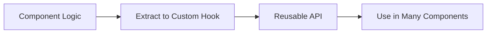

---
title: Custom Hooks Basics
slug: day-033-custom-hooks-basics
dayLabel: Day 33
level: Intermediate
estimatedMinutes: 30
order: 33
track: react
---
# Day 33 [Intermediate]: Custom Hooks Basics

## Index

- [Goal](#goal)
- [Prerequisites](#prerequisites)
- [Explanation](#explanation)
- [Topic by Topic](#topic-by-topic)
- [Key Concepts](#key-concepts)
- [Visual Concept Map](#visual-concept-map)
- [End-to-End Practical](#end-to-end-practical)
- [Hands-on Coding](#hands-on-coding)
- [Mini Exercise](#mini-exercise)
- [Assessment Quiz](#assessment-quiz)
- [Task](#task)
- [Self Check](#self-check)
- [Interview Questions and Answers](#interview-questions-and-answers)
- [Day 33 Outcome](#day-33-outcome)

## Goal

Create and use custom hooks to reuse stateful logic across multiple components.

## Prerequisites

- Day 32 completed
- Comfort with core hooks

## Explanation

Custom hooks are JavaScript functions that start with `use` and can call other hooks. They help extract reusable behavior from components.

## Topic by Topic

### Topic 1: Why Custom Hooks

Theory:
They prevent duplicated hook logic across components.

Practical:
Extract toggle logic from multiple panels.

Code Example:

```jsx
function useToggle(initial = false) {
  const [value, setValue] = useState(initial);
  const toggle = () => setValue((v) => !v);
  return [value, toggle];
}
```

**Explanation:** This topic explains Why Custom Hooks in a practical way so you can apply it confidently in real React projects.

**Key Points:**

- Understand the core idea of Why Custom Hooks.
- Apply the pattern using clean, readable code.
- Avoid common mistakes through predictable React flow.

### Topic 2: Hook Naming Rules

Theory:
Custom hooks must start with `use` and follow hook rules.

Practical:
Create `useCounter` and call at top-level.

Code Example:

```jsx
function useCounter() {}
```

**Explanation:** This topic explains Hook Naming Rules in a practical way so you can apply it confidently in real React projects.

**Key Points:**

- Understand the core idea of Hook Naming Rules.
- Apply the pattern using clean, readable code.
- Avoid common mistakes through predictable React flow.

### Topic 3: Parameterized Hooks

Theory:
Hooks can accept arguments for flexible behavior.

Practical:
Pass storage key into useLocalStorage.

Code Example:

```jsx
const [theme, setTheme] = useLocalStorage("theme", "light");
```

**Explanation:** This topic explains Parameterized Hooks in a practical way so you can apply it confidently in real React projects.

**Key Points:**

- Understand the core idea of Parameterized Hooks.
- Apply the pattern using clean, readable code.
- Avoid common mistakes through predictable React flow.

### Topic 4: Returning State + Actions

Theory:
Custom hooks usually return data and helper functions.

Practical:
Return value, setValue, and reset.

Code Example:

```jsx
return { value, setValue, reset };
```

**Explanation:** This topic explains Returning State + Actions in a practical way so you can apply it confidently in real React projects.

**Key Points:**

- Understand the core idea of Returning State + Actions.
- Apply the pattern using clean, readable code.
- Avoid common mistakes through predictable React flow.

### Topic 5: Testing and Reuse

Theory:
Hooks can be unit-tested separately for predictable behavior.

Practical:
Use same hook in two components.

Code Example:

```jsx
const [open, toggle] = useToggle(false);
```

**Explanation:** This topic explains Testing and Reuse in a practical way so you can apply it confidently in real React projects.

**Key Points:**

- Understand the core idea of Testing and Reuse.
- Apply the pattern using clean, readable code.
- Avoid common mistakes through predictable React flow.

### Topic 6: Hook API Consistency

Theory:
Consistent return patterns (object or tuple) improve readability and lower onboarding time.

Practical:
Use object return for multi-action hooks and tuple return for simple value/action pairs.

Code Example:

```jsx
return { value, setValue, reset };
```

**Explanation:** This topic explains Hook API Consistency in a practical way so you can apply it confidently in real React projects.

**Key Points:**

- Understand the core idea of Hook API Consistency.
- Apply the pattern using clean, readable code.
- Avoid common mistakes through predictable React flow.

## Key Concepts

- Logic extraction
- Hook naming and rules
- Reusable state patterns
- Parameterized behavior
- Clean component composition
- Consistent hook APIs

## Visual Concept Map



## End-to-End Practical

1. Build duplicated toggle logic in 2 components.
2. Extract to `useToggle` hook.
3. Build `useLocalStorage` hook.
4. Reuse hook in different screens.
5. Verify cleaner component code.

## Hands-on Coding

### Example 1: Case - Dashboard Panel Toggle Hook

Scenario:
An admin dashboard has multiple collapsible panels sharing same open/close logic.

```jsx
import { useState } from "react";

function useToggle(initial = false) {
  const [isOn, setIsOn] = useState(initial);
  const toggle = () => setIsOn((v) => !v);
  return [isOn, toggle];
}

function ReportsPanel() {
  const [open, toggle] = useToggle(true);
  return (
    <div>
      <button onClick={toggle}>{open ? "Hide" : "Show"} Reports</button>
      {open && <p>Reports Content</p>}
    </div>
  );
}
```

### Example 2: Case - Persistent Theme Hook

Scenario:
A learning portal should remember selected theme after refresh.

```jsx
import { useEffect, useState } from "react";

function useLocalStorage(key, initialValue) {
  const [value, setValue] = useState(() => {
    const saved = localStorage.getItem(key);
    return saved ? JSON.parse(saved) : initialValue;
  });

  useEffect(() => {
    localStorage.setItem(key, JSON.stringify(value));
  }, [key, value]);

  return [value, setValue];
}
```

### Example 3: Case - Reusable Counter Hook

Scenario:
Different widgets need the same counter increment/decrement behavior.

```jsx
import { useState } from "react";

function useCounter(initial = 0) {
  const [count, setCount] = useState(initial);
  const increment = () => setCount((c) => c + 1);
  const decrement = () => setCount((c) => c - 1);
  const reset = () => setCount(initial);
  return { count, increment, decrement, reset };
}
```

## Mini Exercise

Scenario:
You are building a recruitment dashboard.

Create:

- `useToggle` for side panel
- `useSearch` for keyword state and clear action
- `useLocalStorage` to persist selected department

Expected output:

- Components become shorter and cleaner
- Reusable hooks power multiple widgets
- Stored values persist across refresh

## Assessment Quiz

### Quiz Questions

1. Why create custom hooks?
2. What naming convention is required?
3. True or False: custom hooks can call other hooks.
4. What should custom hooks typically return?
5. How do custom hooks improve maintainability?

### Quiz Answers

1. Reuse stateful logic and reduce duplication
2. Must start with `use`
3. True
4. State values and action helpers
5. Centralized logic is easier to evolve and test

## Task

- Build at least 2 custom hooks
- Reuse each in more than one component
- Complete mini exercise

## Self Check

- You can extract and design custom hook APIs
- You can apply hook rules while reusing logic
- You can answer at least 4 out of 5 quiz questions correctly

## Interview Questions and Answers

### Beginner

**Question:** What is a custom hook?

**Answer:** A reusable function that uses React hooks and starts with `use`.

**Question:** Can custom hook render JSX?

**Answer:** No, hooks return data/logic; components render JSX.

### Middle

**Question:** What should stay in component vs custom hook?

**Answer:** UI rendering in component, reusable stateful logic in hook.

**Question:** How can you make custom hooks configurable?

**Answer:** Accept parameters and return flexible API.

### Advanced

**Question:** How would you avoid tight coupling in custom hooks?

**Answer:** Keep APIs generic and avoid direct app-specific assumptions.

**Question:** Why are custom hooks useful in large teams?

**Answer:** Shared patterns become standardized and easier to maintain.

## Day 33 Outcome

- You can create practical reusable custom hooks
- You can keep components focused on presentation
- You are ready for advanced reusable logic patterns in Day 34

